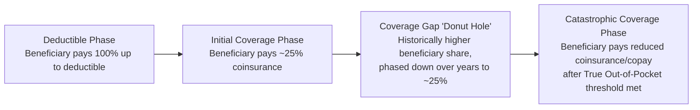

## Medicare Part D and Prescription Drug Coverage

### Overview

Medicare Part D is the outpatient prescription drug benefit created by the Medicare Modernization Act (MMA) of 2003 and implemented in 2006, delivered exclusively through private insurers rather than directly administered by CMS. Part D fills a coverage gap that existed in Original Medicare since 1965 (which historically covered drugs administered in institutional/clinical settings under Parts A/B but not most self-administered outpatient prescriptions). The program's economics have been substantially reshaped by the Inflation Reduction Act (IRA) of 2022, which restructured cost-sharing and, for the first time, authorized limited government price negotiation — a major structural departure from the program's original design philosophy.

### Program Structure

#### Delivery Mechanism

**Key Points**

- Unlike Parts A and B, Part D benefits are delivered entirely through private **Prescription Drug Plans (PDPs)** (standalone plans for those in Original Medicare) or bundled into **Medicare Advantage Prescription Drug (MA-PD)** plans
- CMS does not directly set drug formularies or negotiate prices in the program's original design (the MMA's **"non-interference clause"** explicitly prohibited HHS from negotiating drug prices directly with manufacturers, leaving negotiation to private plan sponsors and their contracted Pharmacy Benefit Managers, or PBMs) — a foundational and historically controversial design choice contrasted with government negotiation approaches used in many other countries
- Plans must offer either the **defined standard benefit** or an **actuarially equivalent alternative**, and must include at least two drugs in each therapeutic category/class on their formulary (with protected classes requiring broader coverage, discussed below)
- Beneficiaries can choose among multiple competing PDPs/MA-PDs in their region, differentiated by premium, formulary composition, pharmacy network, and specific cost-sharing tiers — itself a managed-competition design element similar in spirit to Medicare Advantage

#### Late Enrollment Penalty

Beneficiaries who do not enroll in Part D (or other creditable prescription drug coverage) when first eligible and later enroll face a **permanent premium penalty**, calculated based on the number of full months without creditable coverage, applied as a percentage addition to the national base beneficiary premium — designed, similar to Part B's late enrollment penalty, to discourage adverse selection (waiting until drug needs arise to enroll).

### Benefit Design: Pre-IRA vs. Post-IRA (2025+)

#### Historical Structure (Pre-2025)

The original Part D benefit was structured around four phases within a coverage year:

The infamous **"donut hole"** (coverage gap) originally required beneficiaries to pay a much larger share of drug costs after exceeding an initial coverage limit and before reaching catastrophic coverage — a design driven by the MMA's original budget-neutrality constraints. The ACA (2010) began phasing down the donut hole's beneficiary cost share over a multi-year period (the "donut hole closure"), eventually reaching approximate parity (~25% coinsurance) with the initial coverage phase by the mid-2020s, though the gap phase remained structurally distinct until the IRA's more fundamental redesign.

#### Post-IRA Structure (2025 onward)

**Key Points**

- The Inflation Reduction Act **eliminated the distinct coverage gap phase**, restructuring the benefit into three simplified phases: deductible, initial coverage (25% coinsurance), and catastrophic coverage
- Introduced a hard **annual out-of-pocket spending cap** ($2,000 in 2025, indexed for inflation in subsequent years), after which the beneficiary owes $0 for covered Part D drugs for the remainder of the plan year — a fundamentally new form of financial protection that did not previously exist in the program
- Shifted a larger share of catastrophic-phase liability from Medicare (previously the dominant payer in that phase via reinsurance) onto **manufacturers** (a new manufacturer discount obligation in the catastrophic phase) and **plans**, reducing direct federal reinsurance exposure relative to the pre-IRA design — a structural change with significant implications for plan bidding behavior and formulary incentives
- Created the **Medicare Prescription Payment Plan (M3P)**, allowing beneficiaries to opt into spreading their annual out-of-pocket costs into smoothed monthly payments across the plan year rather than facing potentially large costs concentrated early in the year (e.g., after filling an expensive specialty drug in January)

$$\text{Post-2025 Benefit Phases}: \quad \text{Deductible} \rightarrow \text{25\% Coinsurance} \rightarrow \text{\$0 Beneficiary Cost (after \$2,000 OOP cap)}$$

### Coverage Requirements: Protected Classes and Formularies

**Key Points**

- CMS designates **six protected classes** of drugs (antidepressants, antipsychotics, anticonvulsants, immunosuppressants for transplant rejection, antiretrovirals, and antineoplastics/cancer drugs) for which Part D plans must cover "all or substantially all" drugs within the class, reflecting clinical judgment that formulary restriction in these categories poses particular risk to vulnerable populations (e.g., abrupt antipsychotic or antiretroviral therapy changes)
- Outside protected classes, plans use **tiered formularies** (typically preferred generic, generic, preferred brand, non-preferred drug, and specialty tiers) with differentiated cost-sharing, and may apply **utilization management** tools including prior authorization, step therapy, and quantity limits
- **Formulary exception and appeals processes** allow beneficiaries/prescribers to request coverage of non-formulary drugs or lower cost-sharing tiers when medically necessary

### Drug Price Negotiation Program (IRA)

#### Mechanism

**Key Points**

- For the first time in the program's history, the IRA authorized CMS to directly negotiate **maximum fair prices (MFPs)** for a limited, expanding list of high-expenditure drugs without generic/biosimilar competition, selected annually from among Medicare's highest total-spend drugs
- Negotiation applies only to drugs that have been on the market for a specified minimum number of years without generic/biosimilar competition (longer periods for small-molecule drugs vs. biologics), and negotiated prices take effect a set number of years after selection
- Manufacturers who decline to negotiate or fail to comply face a substantial excise tax on the drug's U.S. sales, creating strong practical pressure to participate despite negotiation being nominally framed around manufacturer agreement
- This program directly repeals the practical effect (though not the formal statutory language) of the MMA's original non-interference clause for the selected drug subset, representing one of the most significant structural changes to Medicare's relationship with drug manufacturers since the program's creation

#### Economic Rationale and Critique

The negotiation program's core economic rationale rests on addressing the **monopoly/market power** manufacturers hold during patent exclusivity periods, particularly for drugs lacking therapeutic substitutes, where standard competitive pricing dynamics are absent. Critics (predominantly pharmaceutical industry stakeholders and some health economists) have raised concerns about potential effects on pharmaceutical innovation incentives — since expected future revenue (including from Medicare, a large purchaser) factors into R&D investment decisions — while proponents argue the program targets already-mature, high-revenue drugs in ways calibrated to minimize innovation impact. Empirical assessment of actual innovation effects remains inherently forward-looking and contested [Inference — this is a genuinely disputed area combining economic theory, pharmaceutical industry-specific R&D dynamics, and limited post-implementation empirical data given the program's recency].

### Low-Income Subsidy (LIS) / "Extra Help"

**Key Points**

- The **Low-Income Subsidy program** (also called "Extra Help") provides additional federal assistance with Part D premiums, deductibles, and cost-sharing for beneficiaries with limited income and resources, with subsidy generosity scaled to income/asset levels (full subsidy vs. partial subsidy tiers)
- Beneficiaries who are also Medicaid-eligible (dual eligibles) are automatically deemed eligible for full LIS
- The IRA expanded full LIS eligibility to a broader income band (up to 150% FPL, aligning benefits previously available only at lower thresholds), simplifying the prior multi-tiered partial-subsidy structure for a portion of the affected population [Unverified — precise current-year income/asset thresholds should be verified against current CMS/SSA guidance, as these are indexed annually]

### Plan Financing and Risk-Sharing

#### Federal Reinsurance and Risk Corridors

Part D's financing has historically involved substantial federal reinsurance in the catastrophic phase (CMS covering a large share of costs above the out-of-pocket threshold) alongside a **risk corridor** mechanism limiting plan sponsor gains/losses relative to their bid projections — designed to encourage plan participation despite the inherent unpredictability of prescription drug spending, particularly for specialty/high-cost drugs. The IRA's restructuring shifted more catastrophic-phase liability onto manufacturers and plans, reducing (though not eliminating) direct CMS reinsurance exposure, which has altered plan bidding incentives and, per some analyses, contributed to increased Part D plan premiums and reduced plan participation/competition in certain markets in the initial post-IRA implementation period [Unverified — specific market participation and premium effects should be verified against the most recent CMS Part D landscape/plan availability data, given the recency and evolving nature of post-IRA implementation].

### Economic Analysis

#### Adverse Selection and the Standalone PDP Market

Because Part D enrollment (like Part B) is voluntary with a late-enrollment penalty mechanism, the program faces classic adverse-selection dynamics that the penalty structure is designed to mitigate, similar in economic logic to Part B, though empirically drug spending needs are more heterogeneous and less universally anticipated across the beneficiary population than physician-service needs, making risk pooling design particularly important for standalone PDP sustainability.

#### Manufacturer Rebates and the PBM Role

A substantial portion of Part D's list-price-versus-net-price dynamics are mediated by **Pharmacy Benefit Managers (PBMs)**, which negotiate manufacturer rebates in exchange for favorable formulary placement. This has generated extensive health economics and policy scrutiny regarding whether rebate-driven formulary incentives align with lowest net cost to the program and beneficiaries, versus incentivizing formulary placement based on rebate size independent of net price — a dynamic sometimes termed the **"rebate trap"** or "gross-to-net bubble," where list prices rise partly to fund larger rebates, with complex pass-through effects on beneficiary cost-sharing (which under pre-IRA design was often based on list price rather than post-rebate net price at the pharmacy counter) [Inference — the precise magnitude of rebate-driven distortion and pass-through is an actively studied and somewhat contested area in health economics and PBM industry analysis].

#### Innovation vs. Access Trade-off

Part D's overall design — private plan competition, formulary-based cost management, and now selective government negotiation — reflects an ongoing policy balancing act between two competing economic goals: preserving pharmaceutical innovation incentives (which depend substantially on expected future revenue, including from the U.S. market broadly) and ensuring near-term beneficiary affordability and program fiscal sustainability. The IRA's negotiation and OOP cap provisions represent a policy judgment shifting the balance further toward affordability relative to the program's original 2003 design [Inference — characterizing this as a "shift in balance" reflects standard health policy analytical framing rather than a single definitive metric].

### Practical Example

**Example**

A beneficiary taking a specialty oncology drug with a $150,000 annual list price, enrolled in a standard Part D plan post-2025:

- They pay their plan's annual deductible (if not already met), then 25% coinsurance during the initial coverage phase
- Once their **True Out-of-Pocket (TrOOP)** spending reaches the $2,000 annual cap, they owe $0 for the remainder of the year for covered Part D drugs — a dramatic change from the pre-IRA structure, where a beneficiary on a similarly expensive drug could have faced thousands of dollars in ongoing catastrophic-phase coinsurance
- If this drug becomes selected for the IRA's negotiation program in a future cycle, the plan's net acquisition cost (and correspondingly the beneficiary's coinsurance base during the initial coverage phase, which is calculated on the negotiated price once in effect) would reflect the negotiated Maximum Fair Price rather than the manufacturer's original list price
- The beneficiary could also opt into the Medicare Prescription Payment Plan to spread their $2,000 maximum out-of-pocket cost into roughly equal monthly installments rather than paying it concentrated in early months when the drug is first filled

**Behavioral disclaimer**: Specific dollar thresholds (deductible, OOP cap), negotiated price effective dates, and LIS income thresholds are set annually by CMS/statute and indexed for inflation; current-year figures should be verified against current CMS Part D guidance rather than assumed static across years.

### Related Topics

- Medicare program structure and economics (Parts A/B/C comparative financing)
- Pharmacy Benefit Manager (PBM) economics and rebate/formulary dynamics
- Pharmaceutical patent exclusivity, generic/biosimilar competition, and innovation economics
- Medicare Advantage and managed competition (MA-PD bundling)
- Low-Income Subsidy (Extra Help) and dual-eligible drug coverage coordination
- Comparative international drug pricing and reference pricing models
- 340B Drug Pricing Program and its interaction with Part D economics
- Specialty drug cost trends and biologic/biosimilar market dynamics
- Value-based and outcomes-based pharmaceutical contracting models