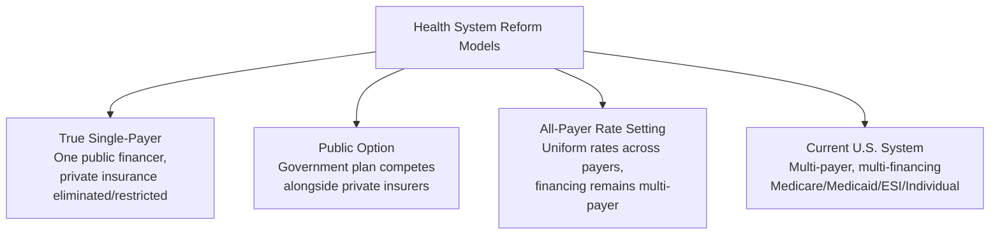
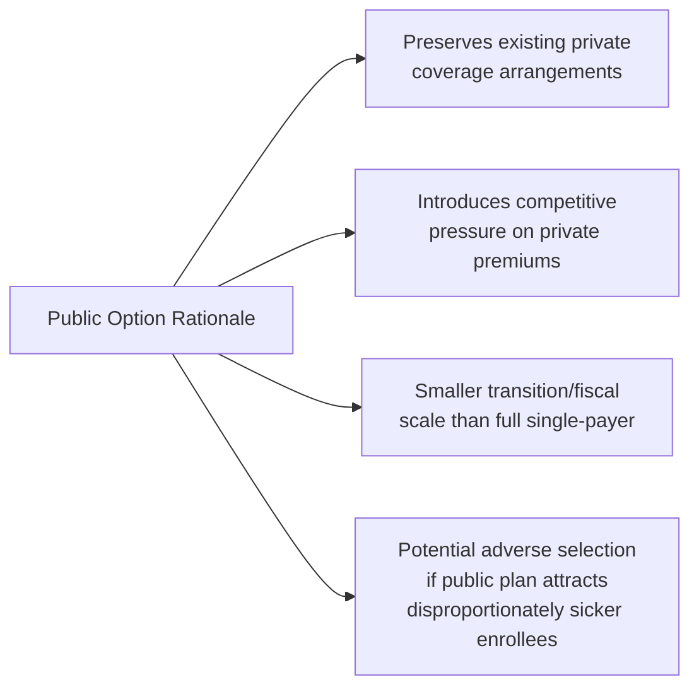

## Policy Debates Over Single-Payer Reform

### Overview

Single-payer health reform refers to proposals restructuring U.S. health care financing so that a single public entity — typically the federal government — serves as the primary or exclusive payer for health services, replacing or substantially displacing the current multi-payer system of employer-sponsored insurance, individual market plans, Medicare, and Medicaid. Single-payer proposals in U.S. policy debate range from comprehensive replacement models (e.g., "Medicare for All") to more incremental public-option approaches. This entry covers the major proposal designs, the core economic arguments on both sides, and the empirical evidence base informing the debate, presented in balanced form given the topic's contested political nature.

### Defining Single-Payer and Related Models

#### Terminology Distinctions

**Key Points**

- **True single-payer**: one public entity finances substantially all health care for the population, typically eliminating or severely restricting private insurance for covered services (e.g., the Canadian model, and most "Medicare for All" congressional proposals)
- **Public option**: a government-run plan competes alongside private insurers within existing market structures (e.g., ACA exchanges), without eliminating private coverage — beneficiaries choose to enroll or not
- **All-payer rate setting**: a distinct, less commonly discussed reform model where the government sets uniform provider payment rates across all payers (public and private) without consolidating financing into a single entity (used in Maryland's hospital rate-setting system and internationally in countries like Germany and Japan)
- These models are frequently conflated in public discourse but represent economically distinct mechanisms with different implications for market structure, financing, and transition complexity

### Major Legislative Proposals

**Key Points**

- **Medicare for All Act** (various congressional versions, e.g., Sen. Sanders' Senate bill and Rep. Jayapal's House bill) generally propose a comprehensive federal single-payer system covering all U.S. residents, with broad benefits (often including dental, vision, hearing, long-term care), elimination of premiums/deductibles/most cost-sharing, and substantial restriction or elimination of private insurance for covered benefits
- These proposals typically envision a multi-year transition period, expanded/modified provider payment rates (often referenced against Medicare rates, which are generally lower than commercial insurance rates), and centralized federal financing replacing current employer, individual, Medicare, and Medicaid premium/tax structures
- Public option proposals (introduced in various forms at federal and state levels) generally involve creating a government-administered plan available on ACA exchanges or as an employer option, financed through premiums and possibly provider rates pegged closer to Medicare levels, without eliminating existing private coverage
- [Unverified — specific current bill provisions, cosponsors, and legislative status change frequently with each congressional session; current bill text and status should be verified via Congress.gov for any specific proposal under discussion]

### Core Economic Arguments For Single-Payer

#### Administrative Cost Reduction

**Key Points**

- Proponents argue that consolidating financing into a single payer would substantially reduce administrative costs currently arising from multi-payer complexity — including insurer marketing/underwriting costs, provider billing complexity across many different payer rules and forms, and duplicative claims-processing infrastructure
- Comparative international research has generally found the U.S. has notably higher administrative costs as a share of health spending relative to single-payer systems like Canada's, though the precise magnitude of potential U.S. savings under a hypothetical transition is subject to substantial estimation uncertainty and depends heavily on specific implementation design [Inference — the direction of the administrative cost differential is relatively well-documented in comparative health systems research; the specific dollar magnitude of achievable U.S. savings under any particular proposal is a matter of ongoing analytical debate across studies with varying methodologies and assumptions]

#### Universal Coverage and Risk Pooling

Single-payer models would, by design, achieve universal coverage by construction (eliminating eligibility gaps like the Medicaid coverage gap or ACA subsidy cliffs discussed elsewhere in this material) and create the largest possible risk pool, which insurance economics suggests minimizes adverse selection concerns entirely since participation is universal/mandatory rather than voluntary.

#### Purchasing Power and Price Negotiation

Proponents argue a single national payer would have substantially greater bargaining leverage over provider payment rates and pharmaceutical prices than the current fragmented system, potentially achieving lower per-unit prices — an argument analogous to, but more sweeping than, the IRA's limited Medicare drug negotiation program discussed elsewhere in this material.

### Core Economic Arguments Against Single-Payer

#### Financing and Fiscal Scale

**Key Points**

- Critics emphasize the substantial new federal tax revenue that would be required to replace current private premium payments, employer contributions, and existing public program financing, given the scale of total U.S. health expenditure (which represents a large share of GDP)
- Various independent and partisan analyses of specific Medicare for All proposals have produced a wide range of cost estimates, reflecting differing assumptions about provider payment rates, administrative savings, utilization changes (both increases from expanded access and reduced cost-sharing, and potential decreases from negotiated lower prices), and behavioral responses — this range itself is a documented and notable feature of the debate rather than a data limitation to be resolved [Inference — the wide estimate range reflects genuine methodological and assumption-driven uncertainty across studies from CBO, RAND, Urban Institute, and various advocacy-aligned analyses, rather than any single estimate being clearly authoritative]

#### Provider Payment Rate Concerns

A central point of contention is what payment rates a single-payer system would use. Because Medicare rates are generally lower than commercial insurance rates for equivalent services, proposals using Medicare-level rates system-wide raise concerns among critics (particularly hospital and physician stakeholders) about provider financial sustainability, especially for hospitals currently relying on higher commercial rates to cross-subsidize below-cost Medicare/Medicaid patients (a practice sometimes termed **cost-shifting**, though the empirical extent of true cost-shifting versus other explanations for rate differentials is itself debated in health economics literature) [Inference — the existence and magnitude of cost-shifting is a longstanding, unresolved empirical question in health economics with studies reaching varying conclusions].

#### Transition Disruption and Private Sector Displacement

Critics highlight the scale of economic disruption from displacing existing employer-sponsored insurance (covering the largest share of the non-elderly population) and the private insurance industry, including labor market effects on insurance-sector employment and the political/practical complexity of transitioning hundreds of millions of people's coverage arrangements within a defined timeframe.

#### Wait Times and Rationing Concerns

Critics point to wait-time experiences in some other single-payer systems (e.g., certain elective procedures in Canada and the UK) as a potential risk of increased demand without proportionate capacity expansion, though proponents counter that wait-time experiences vary substantially across international single-payer systems and are not an inherent feature of single-payer financing per se, depending heavily on capacity investment and system design choices independent of the financing mechanism itself [Inference — this is a genuinely contested comparative-health-systems question where cross-national evidence is mixed and system-specific factors matter substantially].

### Empirical Evidence Base

#### Comparative International Systems

Countries with single-payer or single-payer-adjacent systems (Canada, UK's NHS as a more fully socialized variant, Taiwan) generally spend a lower share of GDP on health care than the U.S. while achieving comparable or, on many standard population health metrics, better outcomes — though cross-national comparisons involve substantial methodological complexity (differing population health baselines, lifestyle/social determinant factors, measurement definitions) that complicate direct causal attribution to the financing model alone [Inference — the spending/outcome comparison direction is well-documented in comparative health systems research; attributing outcome differences specifically and exclusively to financing model choice versus other systemic and societal factors is a more contested causal claim].

#### Domestic Natural Experiments

Some U.S. state-level and program-level evidence offers partial, indirect insight, including research on Medicare's original 1965 implementation effects on elderly access/utilization, and more recent state-level public option implementations (e.g., Washington State's Cascade Care) — though no U.S. jurisdiction has implemented a true comprehensive single-payer system, limiting the availability of direct domestic empirical evidence at the scale proposed federally [Unverified — specific state public option program outcomes and any newer state-level single-payer pilot developments should be verified against current state health policy tracking sources, as this remains an evolving area with periodic new state legislative activity].

### State-Level Efforts

Several states have periodically pursued state-level single-payer legislation (e.g., Vermont's Green Mountain Care effort, ultimately abandoned in 2014 over financing concerns; California and other states have seen recurring single-payer legislative proposals) — these efforts illustrate a recurring practical challenge: state-level single-payer faces financing constraints (states generally cannot deficit-spend like the federal government) and requires federal waivers (e.g., ACA Section 1332 waivers) to redirect existing federal health spending streams (Medicare, Medicaid, ACA subsidies) into a state single-payer structure, adding substantial legal/administrative complexity beyond the financing question alone [Unverified — current status of any specific state-level effort should be verified against current state legislative tracking, as this area sees frequent proposal introduction and periodic abandonment].

### Public Option as an Incremental Alternative

Public option proposals are frequently framed as a more politically and fiscally incremental alternative to full single-payer, preserving current employer-sponsored insurance while introducing a government-run competitive option intended to exert downward pressure on private premiums through competition and potentially lower administrative/negotiated provider costs. Economic analysis of public option proposals often centers on similar adverse-selection and premium-competition dynamics as broader managed-competition theory (discussed in the Medicare Advantage entry), applied in reverse — concern that a lower-cost public option could attract disproportionately higher-risk enrollees fleeing private plans, requiring careful risk-adjustment design analogous to existing ACA exchange mechanisms.

### Economic Analysis Summary

The single-payer debate fundamentally involves several distinct, somewhat separable economic questions that are often bundled together in political discourse but merit separate analytical treatment:

1. **Financing mechanism** (broad-based taxation vs. current fragmented premium/tax-exclusion system) — a question of who pays and through what mechanism, largely distributionally neutral in aggregate but with significant distributional effects across income levels and current insurance status
2. **Payment rate levels** (Medicare rates vs. current blended commercial/public rates) — a question with direct provider revenue and potential access/capacity implications
3. **Administrative efficiency** — an empirically supported but magnitude-uncertain claim about consolidation savings
4. **Coverage universality** — a comparatively less contested benefit of single-payer design by construction, though achievable to varying degrees through non-single-payer reforms as well (e.g., robust individual mandate enforcement plus subsidies)
5. **Transition costs and political economy** — a distinct implementation question from the steady-state economic merits of any given end-state design

[Inference — this decomposition reflects standard health economics analytical framing for disaggregating an otherwise politically bundled debate into more tractable component questions]

### Related Topics

- Medicare program structure and economics (payment rate baseline for reform proposals)
- Medicaid program structure and state variation (coverage gap as status quo comparison point)
- The Affordable Care Act and health insurance exchanges (public option implementation precedent)
- Comparative international health system financing models (Canada, UK NHS, Germany, Taiwan)
- Administrative cost comparison methodology in health systems research
- Provider payment rate-setting and all-payer rate systems (Maryland model)
- Employer-sponsored insurance tax exclusion and its role in reform financing debates
- Cost-shifting theory in hospital economics
- Section 1332 State Innovation Waivers and state-level reform feasibility