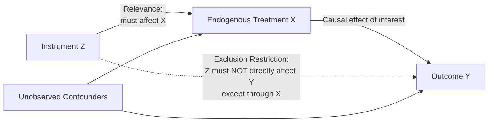

## Instrumental Variables in Health Economics Research

### Overview

Instrumental variables (IV) estimation is a quasi-experimental econometric technique used to identify causal effects when the explanatory variable of interest is endogenous — correlated with the error term due to omitted variable bias, reverse causality, or measurement error. Health economics research relies heavily on IV methods because randomized controlled trials are frequently infeasible or unethical for many health-policy-relevant questions (e.g., the causal effect of insurance coverage, hospital utilization, or physician supply on health outcomes), while observational data are pervasively confounded by factors like health-seeking behavior, unobserved health status, and selection into treatment.

### The Endogeneity Problem in Health Economics

#### Why Standard Regression Fails

**Key Points**

- Ordinary Least Squares (OLS) regression of a health outcome on a treatment/exposure variable produces biased and inconsistent estimates when the treatment is endogenous — i.e., correlated with unobserved determinants of the outcome
- Classic health economics examples: estimating the effect of health insurance on health outcomes is confounded because individuals who select into insurance (or into more generous coverage) often differ systematically in unobserved health status, risk aversion, or health-seeking behavior; estimating the effect of hospital spending on mortality is confounded because sicker patients (higher unobserved severity) both receive more intensive treatment and have worse outcomes, potentially masking or reversing the true treatment effect (a pattern sometimes discussed under the broader heading of "confounding by indication")
- Reverse causality is also pervasive: poor health may cause lower income/employment (affecting insurance access) just as much as insurance access affects health, making the direction of causation ambiguous in simple correlational analysis

$$Y_i = \beta_0 + \beta_1 X_i + \varepsilon_i, \quad \text{where } \text{Cov}(X_i, \varepsilon_i) \neq 0$$

Here, $\beta_1$ (the OLS coefficient on the endogenous treatment $X_i$) is a biased estimate of the true causal effect whenever $X_i$ is correlated with the error term $\varepsilon_i$, which captures unobserved factors also affecting $Y_i$.

### IV Estimation Mechanics

#### Core Requirements for a Valid Instrument

An instrument $Z_i$ must satisfy two core conditions to produce a valid causal estimate:

1. **Relevance (first-stage strength)**: $Z_i$ must be correlated with the endogenous regressor $X_i$, i.e., $\text{Cov}(Z_i, X_i) \neq 0$ — testable directly from the data via the first-stage regression
2. **Exclusion restriction (exogeneity)**: $Z_i$ must affect the outcome $Y_i$ **only through** its effect on $X_i$, with no direct pathway to $Y_i$ and no correlation with the error term $\varepsilon_i$ — this condition is **not directly testable** and must be justified through institutional knowledge, theory, and argumentation, making it the central point of scrutiny and debate in any IV application

#### Two-Stage Least Squares (2SLS)

The standard IV estimation procedure, **Two-Stage Least Squares**, proceeds as:

**First stage**: regress the endogenous variable on the instrument (and any exogenous controls):

$$X_i = \pi_0 + \pi_1 Z_i + \gamma' W_i + \nu_i$$

Obtain predicted values $\hat{X}_i$, representing the portion of variation in $X$ that is driven by the instrument (and therefore, by construction, exogenous with respect to the outcome equation's error term, assuming the exclusion restriction holds).

**Second stage**: regress the outcome on the predicted values from the first stage:

$$Y_i = \beta_0 + \beta_1 \hat{X}_i + \gamma' W_i + \varepsilon_i$$

The resulting $\hat{\beta}_1$ is the **Local Average Treatment Effect (LATE)** under heterogeneous treatment effects — a critical interpretive nuance discussed below.

### Weak Instrument Problems

**Key Points**

- When the first-stage relationship between $Z_i$ and $X_i$ is weak (low correlation), 2SLS estimates become biased toward the OLS estimate and standard errors become inflated, undermining inference — this is known as the **weak instrument problem**
- The conventional diagnostic is the first-stage **F-statistic**, with a widely cited (though somewhat contested and rule-of-thumb rather than formally derived for all contexts) threshold of F > 10 as a rough indicator of adequate instrument strength [Inference — the F > 10 rule of thumb, originating from Staiger and Stock's work, is a commonly applied heuristic in empirical practice rather than a universally validated formal test threshold across all estimator variants and sample sizes]
- Weak instruments are a persistent practical challenge in health economics applications, since many plausible instruments (discussed below) have only modest explanatory power over the endogenous health-related regressor

### Local Average Treatment Effect (LATE) Interpretation

**Key Points**

- Under treatment effect heterogeneity (different individuals experience different causal effects from the same treatment), IV estimates identify the **LATE** — the average treatment effect specifically among **"compliers"**: individuals whose treatment status is affected by the instrument
- This is a critical and frequently underemphasized interpretive point: the IV estimate does not generally represent the Average Treatment Effect (ATE) for the full population, but rather a treatment effect local to the subpopulation whose behavior the instrument actually shifts
- In health economics applications, this means, for example, that an IV estimate of insurance's effect on health using distance-to-hospital as an instrument identifies the effect specifically among people whose insurance-seeking behavior is influenced by geographic proximity — not necessarily generalizable to individuals whose coverage decisions are driven by entirely different factors
- This LATE interpretation requires an additional assumption beyond relevance and exclusion — the **monotonicity assumption** (no "defiers": the instrument does not induce anyone to move in the opposite direction of the average effect) — to yield a well-defined, interpretable causal parameter

### Common Instruments in Health Economics Research

#### Geographic and Distance-Based Instruments

**Key Points**

- **Distance to nearest hospital/provider** has been widely used as an instrument for health care utilization intensity, based on the argument that travel distance affects access/utilization but (conditional on controls) has no direct effect on health outcomes except through utilization — a plausible but contestable exclusion restriction, since distance may correlate with unobserved rurality-related health determinants (income, environmental exposures, provider quality) that also independently affect outcomes [Inference — the validity of this exclusion restriction is a recurring point of methodological debate specific to each study's context and control strategy]
- **Differential distance** (relative distance to a high-intensity vs. low-intensity treatment facility) is a refinement used in several influential studies to isolate treatment-intensity effects specifically

#### Policy and Regulatory Discontinuity Instruments

- **Medicaid eligibility threshold variation** across states or over time (exploiting the state-variation and FMAP-driven eligibility differences discussed in the Medicaid entry) has been used extensively to instrument for insurance coverage in studies of the Medicaid expansion's health effects
- **Regulatory/certificate-of-need variation** across states affecting hospital or facility supply has been used to instrument for health care capacity/access
- **Medicare eligibility at age 65** functions as a well-known regression discontinuity-adjacent instrument/design for studying the causal effect of gaining insurance coverage, since eligibility is driven by a sharp, arguably exogenous age threshold rather than health status directly (though this specific application is more commonly analyzed as a **regression discontinuity design**, a closely related but formally distinct quasi-experimental method from IV)

#### Physician/Provider Practice-Style Instruments

**Key Points**

- **Physician practice style or preference measures** (e.g., a physician's historical tendency to prescribe a particular treatment, or distance-weighted average practice patterns of nearby physicians) have been used to instrument for treatment intensity in studies of treatment effectiveness, based on the argument that idiosyncratic physician preferences affect a given patient's treatment probability but not their underlying health status
- This approach has been particularly influential in cardiac care research (e.g., studies instrumenting for cardiac catheterization/revascularization intensity using physician or hospital practice-style variation) and requires careful justification that practice-style variation is not itself correlated with unobserved patient sorting to particular physicians (a genuine and actively scrutinized concern, since patients may non-randomly select providers based on unobserved severity or preferences)

#### Natural/Policy-Driven Instruments

- **Draft lottery-based instruments** (most famously Angrist's use of the Vietnam draft lottery, extended in health economics contexts to study military service or related exposure effects) exploit genuinely random assignment as an instrument
- **Weather-based instruments**, **birth timing relative to policy cutoffs**, and other "natural experiment" sources of plausibly exogenous variation are used across various health economics applications where they can be argued to affect the endogenous regressor without a direct outcome pathway

### Testing and Diagnostics

#### Overidentification Tests

When more instruments are available than strictly necessary to identify the model (the **overidentified** case), researchers can apply tests such as the **Sargan** or **Hansen J-test** to assess whether the additional instruments produce consistent estimates — though these tests have an important limitation: they test the *joint* validity of all instruments and cannot identify which specific instrument (if any) violates the exclusion restriction, nor can they validate exclusion restrictions when the model is exactly identified (only one instrument for one endogenous regressor), which is a common health economics application scenario.

#### Falsification and Placebo Tests

**Key Points**

- Common practice involves testing whether the instrument predicts outcomes that it should have no plausible causal pathway to affect (placebo/falsification tests), and testing whether the instrument is balanced across observable pre-treatment covariates (an analog to covariate balance checks in experimental design)
- These tests can provide supportive (not conclusive) evidence for the exclusion restriction's plausibility but cannot definitively prove its validity, since the restriction fundamentally concerns unobservable confounders by definition

### Comparison to Alternative Identification Strategies

| Method | Core Identifying Assumption | Common Health Economics Application |
| --- | --- | --- |
| Instrumental Variables | Valid instrument satisfying relevance + exclusion | Insurance coverage effects, treatment intensity effects |
| Regression Discontinuity | Sharp/fuzzy threshold creates local randomization | Age-65 Medicare eligibility, income-based program eligibility cutoffs |
| Difference-in-Differences | Parallel trends absent treatment | State Medicaid expansion adoption timing, policy rollout studies |
| Propensity Score Matching | Selection on observables (no unobserved confounding) | Comparative effectiveness research with rich covariate data |
| Randomized Controlled Trial | Random assignment | RAND Health Insurance Experiment, Oregon Health Insurance Experiment |

IV is often specifically favored in health economics precisely because the alternative methods' core assumptions (parallel trends, selection on observables only) are frequently implausible given pervasive unobserved health-status confounding — but IV's own exclusion restriction assumption is neither more nor less inherently "safe," simply differently structured and requiring different domain-specific justification.

### Practical Example

**Example**

A researcher wants to estimate the causal effect of hospital readmission on subsequent mortality, but readmitted patients likely differ systematically in unobserved severity from non-readmitted patients (confounding by indication), biasing naive OLS comparison.

Using **hospital-specific historical readmission rate** (excluding the index patient) as an instrument:

- **First stage**: Verify that patients treated at hospitals with historically higher readmission-rate tendencies do have higher individual readmission probability (testable directly, checking the first-stage F-statistic for adequate strength)
- **Exclusion restriction argument**: The researcher must argue that hospital-level readmission tendency (perhaps reflecting discharge protocol differences) affects an individual patient's mortality *only* through whether that patient is readmitted — not through some other unobserved hospital quality dimension that independently affects mortality (a genuinely debatable assumption requiring careful institutional argument and robustness checks, e.g., controlling for other observable hospital quality measures)
- **LATE interpretation**: The resulting estimate reflects the mortality effect of readmission specifically among patients whose readmission status is influenced by which hospital they happened to be treated at — not necessarily generalizable to patients whose readmission is driven by clinical factors unrelated to hospital-level discharge tendencies

**Behavioral disclaimer**: The validity of any specific instrument's exclusion restriction is context-dependent and subject to ongoing methodological debate within the literature; the specific instrument-outcome pairing above illustrates general IV logic rather than endorsing any particular published study's specific identification strategy.

### Related Topics

- Regression discontinuity design in health policy evaluation (Medicare age-65 eligibility)
- Difference-in-differences methodology (Medicaid expansion state-adoption studies)
- Randomized controlled trials in health economics (RAND and Oregon Health Insurance Experiments)
- Selection bias and confounding by indication in observational health research
- Propensity score matching and selection-on-observables methods
- Panel data methods and fixed-effects estimation in health economics
- Structural econometric models in health care demand estimation
- Mendelian randomization (genetic instruments in health/epidemiological research)
- Weak instrument robust inference methods (Anderson-Rubin test, conditional likelihood ratio tests)