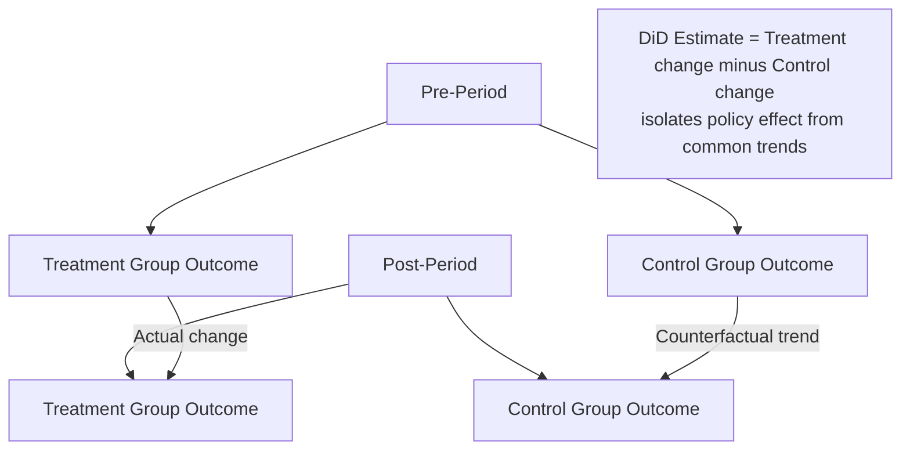
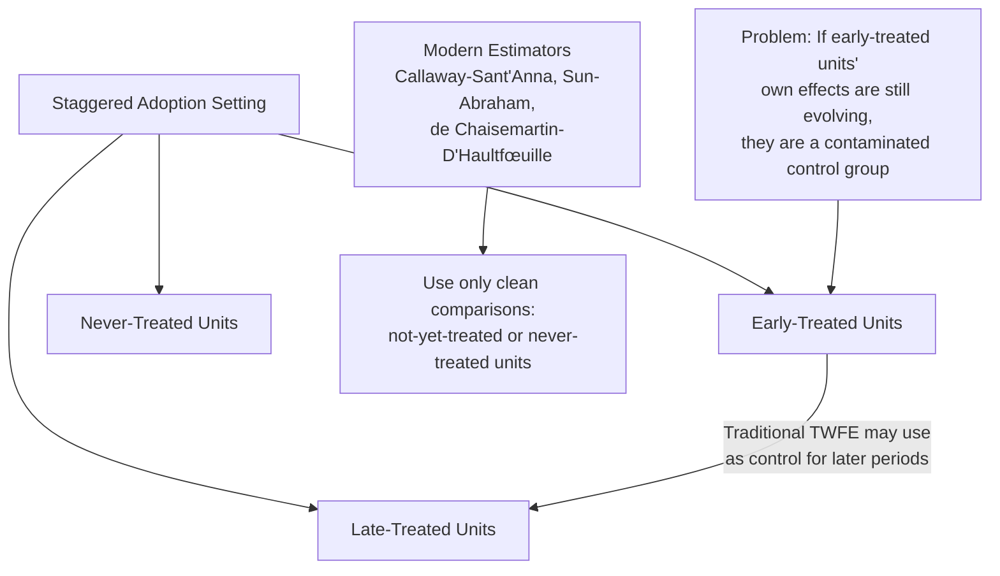

## Difference-in-Differences Designs for Policy Evaluation

### Overview

Difference-in-differences (DiD) is a quasi-experimental identification strategy widely used in health economics to estimate causal policy effects by comparing outcome changes over time between a group exposed to a policy (treatment group) and a group not exposed (control group). DiD has become one of the most heavily used empirical methods in health policy evaluation — particularly for state-level policy variation like Medicaid expansion adoption timing — because it leverages naturally occurring policy rollout variation without requiring an instrument or a sharp eligibility threshold.

### Core Identification Logic

#### The Basic 2x2 Design

**Key Points**

- The canonical DiD design compares four cell means: treatment group pre-period, treatment group post-period, control group pre-period, control group post-period
- The DiD estimator is the difference between the treatment group's before-after change and the control group's before-after change — the "difference of differences" — which nets out both time-invariant group differences and common time trends affecting both groups equally

$$\hat{\beta}_{DiD} = \left(\bar{Y}_{Treat, Post} - \bar{Y}_{Treat, Pre}\right) - \left(\bar{Y}_{Control, Post} - \bar{Y}_{Control, Pre}\right)$$

- Equivalently estimated via regression:

$$Y_{it} = \beta_0 + \beta_1 Treat_i + \beta_2 Post_t + \beta_3 (Treat_i \times Post_t) + \varepsilon_{it}$$

where $\beta_3$, the coefficient on the interaction term, is the DiD estimate of the policy's causal effect.

### The Parallel Trends Assumption

#### Core Requirement

**Key Points**

- The central identifying assumption is **parallel trends**: absent the policy intervention, the treatment and control groups would have followed the same underlying trend in the outcome over time
- This assumption is fundamentally **untestable** in the post-treatment period (since the counterfactual is unobserved by definition) but is commonly assessed indirectly through **pre-trend testing** — examining whether treatment and control groups exhibited similar outcome trends in the periods *before* policy adoption
- Parallel pre-trends provide supportive, not conclusive, evidence: groups can share similar pre-trends while diverging post-treatment for reasons unrelated to the policy (a documented limitation frequently raised in DiD methodology critique), and conversely, non-parallel pre-trends do not automatically invalidate a design if adequately modeled with group-specific trends or other adjustments [Inference — the epistemic status of pre-trend testing as supportive-but-not-dispositive evidence is a widely accepted position in the applied econometrics literature]

#### Threats to Parallel Trends in Health Policy Applications

Common threats specific to health economics applications include:

- **Differential secular trends**: states adopting Medicaid expansion may differ systematically in underlying health trends (e.g., different pre-existing trajectories in uninsurance rates, economic conditions, or health system capacity) independent of the policy itself
- **Anticipation effects**: if providers, patients, or state administrators adjust behavior in anticipation of a policy change before formal implementation, this can contaminate the "pre-period" baseline
- **Concurrent policy changes**: states adopting one health policy (e.g., Medicaid expansion) may simultaneously implement other relevant policies (e.g., delivery system reforms, provider rate changes), confounding attribution of the estimated effect to the specific policy of interest

### Two-Way Fixed Effects (TWFE) Estimation

#### Standard Panel Implementation

**Key Points**

- Most modern DiD applications use panel data across many units (states, hospitals, counties) and multiple time periods, estimated via **Two-Way Fixed Effects** regression:

$$Y_{it} = \alpha_i + \lambda_t + \beta \cdot Treat_{it} + \varepsilon_{it}$$

where $\alpha_i$ are unit fixed effects (absorbing all time-invariant unit characteristics) and $\lambda_t$ are time fixed effects (absorbing all common shocks affecting all units in a given period), and $Treat_{it}$ is an indicator for treatment status having taken effect in unit $i$ at time $t$.

- Standard errors are typically **clustered at the unit level** (e.g., the state) to account for serial correlation in outcomes within units over time — a well-established practice given that failing to cluster appropriately can severely understate standard errors and overstate statistical significance in panel DiD applications

### The Staggered Adoption Problem

#### Recent Methodological Developments

**Key Points**

- A major methodological development in DiD econometrics (roughly the late 2010s-early 2020s) demonstrated that the traditional TWFE estimator can produce **severely biased estimates** in the common health policy scenario of **staggered treatment timing** — where different units (e.g., states) adopt a policy (e.g., Medicaid expansion) at different calendar dates rather than all simultaneously
- The core problem: TWFE implicitly uses **already-treated units as comparison groups** for later-treated units in certain periods, and if treatment effects are heterogeneous over time (e.g., dynamic/evolving effects) or across units, these "forbidden comparisons" can generate severely biased, even sign-reversed, aggregate estimates — a finding formalized in influential work by Goodman-Bacon, Callaway and Sant'Anna, Sun and Abraham, de Chaisemartin and D'Haultfœuille, and related researchers
- This finding has substantially reshaped applied practice in health policy evaluation specifically because Medicaid expansion — the single most heavily studied DiD application in health economics — is a canonical staggered-adoption setting (different states expanded in different years across 2014 and subsequent years), making essentially the entire pre-existing Medicaid expansion DiD literature subject to potential reexamination under these newer methods [Inference — the practical magnitude of bias in any specific published study depends on the actual treatment effect heterogeneity pattern in that setting, which varies by application]

#### Modern Heterogeneity-Robust Estimators

Several newer estimators have been developed specifically to address the staggered-adoption TWFE bias problem, now increasingly standard in applied health policy DiD work:

- **Callaway and Sant'Anna (2021)** estimator — computes group-time average treatment effects (ATT for each adoption cohort at each time period) using only "not-yet-treated" or "never-treated" units as valid comparisons, then aggregates to an overall or dynamic effect estimate
- **Sun and Abraham (2021)** — an "interaction-weighted" estimator addressing similar contamination issues specifically in event-study specifications
- **de Chaisemartin and D'Haultfœuille** — proposes an alternative estimator robust to heterogeneous and dynamic treatment effects, with accompanying diagnostic statistics for detecting the extent of TWFE bias in a given application
- **Borusyak, Jaravel, and Spiess** — an "imputation" approach estimating the counterfactual untreated outcome directly using only untreated observations, then computing implied treatment effects
- Applied health economics researchers are now generally expected to either use one of these estimators directly or explicitly justify why traditional TWFE remains appropriate (e.g., in simple two-period or non-staggered designs, where the bias concern does not apply) [Inference — this represents the current methodological consensus/best-practice expectation in applied econometrics as of the mid-2020s, an area that continues to see active methodological refinement]

### Event-Study Specifications

**Key Points**

- A common extension replaces the single treatment indicator with a set of **lead and lag indicators** relative to treatment timing, allowing estimation of dynamic treatment effects over time and providing a direct visual/statistical test of pre-trends:

$$Y_{it} = \alpha_i + \lambda_t + \sum_{k \neq -1} \beta_k \cdot \mathbb{1}[t - T_i^* = k] + \varepsilon_{it}$$

where $T_i^*$ is unit $i$'s treatment date and $k$ indexes event time relative to treatment (with $k = -1$, the period immediately before treatment, conventionally omitted as the reference category)

- Event-study plots (coefficients $\beta_k$ plotted against event time $k$) are now a near-universal accompanying diagnostic in published DiD health policy papers, allowing visual assessment of both pre-trend flatness and the dynamic evolution of treatment effects post-adoption
- Under staggered adoption, traditional event-study specifications are subject to the same TWFE contamination concerns described above, motivating heterogeneity-robust event-study estimators (e.g., Callaway-Sant'Anna's dynamic aggregation, Sun-Abraham's interaction-weighted approach)

### Applications in Health Policy Evaluation

#### Medicaid Expansion Studies

The single most prominent DiD application area in health economics, using state-level staggered ACA Medicaid expansion adoption (beginning 2014, with continued state adoption in subsequent years) to estimate causal effects on outcomes including insurance coverage rates, health care utilization, self-reported health status, mortality, hospital uncompensated care costs, and state budget effects — comparing expansion states against non-expansion states (or later-expanding states as a comparison for earlier-expanding states, subject to the staggered-adoption caveats above).

#### Other Common Applications

- State-level minimum wage changes and their effects on health outcomes/insurance take-up
- Hospital closure or merger effects on regional health outcomes, comparing affected vs. unaffected market areas
- State-level scope-of-practice law changes for nurse practitioners/physician assistants and their effects on access/utilization
- Smoking ban or tobacco tax implementation timing across states/localities and effects on health outcomes
- CON (Certificate of Need) law repeals across states and effects on hospital capacity/competition

### Robustness Checks and Extensions

**Key Points**

- **Placebo/falsification tests**: applying the DiD estimator to outcomes that should theoretically be unaffected by the policy, or to a "placebo" treatment date before actual implementation, to check for spurious pre-existing differences
- **Synthetic control methods**: a related but distinct approach (particularly useful with a single or small number of treated units, e.g., one state's policy change) constructing a weighted combination of control units designed to closely match the treated unit's pre-treatment outcome trajectory, providing a more data-driven counterfactual construction than a simple average-control-group DiD comparison
- **Triple-differences (DDD)**: extends DiD by adding a third comparison dimension (e.g., comparing a policy's effect on a specifically targeted subpopulation within treatment/control states, versus a non-targeted subpopulation), which can help net out state-specific trends that might otherwise threaten the standard two-way DiD's parallel trends assumption

### Comparison to Related Quasi-Experimental Methods

| Method | Key Requirement | Typical Health Policy Setting |
| --- | --- | --- |
| Difference-in-Differences | Parallel trends (treatment/control would move together absent policy) | State policy rollout with variation in timing/adoption |
| Regression Discontinuity | Sharp threshold determines treatment | Age or income-based eligibility cutoffs |
| Instrumental Variables | Valid instrument (relevance + exclusion restriction) | Endogenous individual-level treatment/exposure |
| Synthetic Control | Good pre-period fit constructable from donor pool | Single-unit policy change (one state, one large intervention) |

### Practical Example

**Example**

A researcher evaluates the effect of Medicaid expansion on preventable hospitalizations using state-level panel data from 2010-2020, with different states expanding in 2014, 2015, 2016, and several states never expanding.

- **Naive TWFE approach**: regress preventable hospitalization rates on state and year fixed effects plus a post-expansion indicator — but given staggered timing, this risks contamination from using already-expanded states (whose own treatment effects may still be evolving) as implicit controls for later-expanding states
- **Modern approach**: apply the Callaway-Sant'Anna estimator, computing group-time average treatment effects separately for the 2014, 2015, and 2016 adoption cohorts (each compared only against not-yet-expanded or never-expanded states in the relevant period), then aggregating into an overall average treatment effect on the treated (ATT) and/or a dynamic event-study-style profile showing how the effect evolves over years since expansion
- **Pre-trend check**: the researcher would examine whether preventable hospitalization trends were statistically indistinguishable across eventual-treatment and control states in the years prior to each cohort's expansion date, as supportive (though not conclusive) evidence for the parallel trends assumption

**Behavioral disclaimer**: Any specific empirical finding regarding Medicaid expansion's effects on particular health outcomes depends on the study period, states included, outcome measure, and estimator choice; this entry describes methodological structure rather than asserting specific empirical results from any particular published study.

### Related Topics

- Instrumental variables in health economics research (comparative identification strategy)
- Regression discontinuity design in health policy evaluation
- Synthetic control methods for single-unit policy evaluation
- Medicaid program structure and state variation (primary DiD application domain)
- Two-way fixed effects estimator limitations under treatment effect heterogeneity
- Event-study methodology and dynamic treatment effect estimation
- Panel data econometrics and clustered standard error methodology
- Triple-differences (DDD) design extensions
- Causal inference frameworks in observational health services research