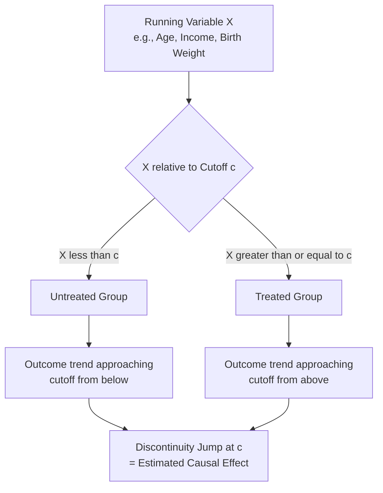

## Regression Discontinuity in Health Policy Contexts

### Overview

Regression discontinuity design (RDD) is a quasi-experimental identification strategy that exploits a sharp, known threshold in an assignment variable to estimate local causal treatment effects. Health policy applications are unusually rich in naturally occurring discontinuities — Medicare eligibility at age 65, income-based program eligibility cutoffs, birth-weight-based clinical protocols, test-score-based screening thresholds — making RDD one of the most credible and widely applied quasi-experimental methods in health economics, often considered to approximate the internal validity of a randomized experiment near the threshold.

### Core Identification Logic

#### The Discontinuity Principle

**Key Points**

- RDD exploits situations where treatment assignment is a **deterministic or near-deterministic function** of an observed "running variable" (also called the "forcing variable") crossing a known threshold — e.g., Medicare eligibility triggered at exactly age 65, or Medicaid eligibility triggered at a specific income percentage of the Federal Poverty Level
- The core identifying assumption is that units just above and just below the threshold are **otherwise similar in all respects** except treatment status — because the precise location relative to the cutoff is, in a narrow enough window, effectively "as good as random," units are not expected to be able to systematically manipulate their exact position relative to the threshold, nor should other relevant factors change discontinuously at the exact same point
- The causal effect is estimated as the **discontinuous jump** in the outcome variable at the threshold, comparing the limit of the outcome function approaching from below the cutoff to the limit approaching from above

$$\tau_{RDD} = \lim_{x \to c^+} E[Y_i | X_i = x] - \lim_{x \to c^-} E[Y_i | X_i = x]$$

where $X_i$ is the running variable, $c$ is the threshold, and $\tau_{RDD}$ is the estimated local treatment effect at the cutoff.

### Sharp vs. Fuzzy RDD

#### Sharp RDD

**Key Points**

- Treatment status is a **deterministic** function of the running variable — everyone above the threshold is treated, everyone below is untreated, with perfect compliance
- Example: Medicare Part A eligibility technically activates precisely at age 65 for those with sufficient work history, functioning close to a sharp design for insurance coverage eligibility (though actual enrollment/take-up may not be perfectly sharp, discussed below)

#### Fuzzy RDD

**Key Points**

- Treatment probability **jumps discontinuously** at the threshold but does not go from 0% to 100% — some units above the threshold remain untreated (non-compliers) and/or some below the threshold receive treatment anyway
- Estimated via a **two-stage least squares** approach analogous to instrumental variables, where crossing the threshold serves as an instrument for actual treatment receipt — conceptually, fuzzy RDD can be understood as a special case of IV estimation, where the "instrument" is the threshold-crossing indicator itself
- Example: Medicare eligibility at 65 is fuzzy in practice for *insurance coverage* outcomes specifically, because some individuals already have coverage before 65 (through employer plans, Medicaid, or other sources) and thus experience no actual coverage change at the threshold, while some eligible individuals delay enrollment — making the *actual change in insurance status* a fuzzy rather than sharp jump even though *eligibility* itself is sharp

$$\tau_{Fuzzy} = \frac{\lim_{x \to c^+} E[Y_i | X_i = x] - \lim_{x \to c^-} E[Y_i | X_i = x]}{\lim_{x \to c^+} E[D_i | X_i = x] - \lim_{x \to c^-} E[D_i | X_i = x]}$$

where $D_i$ is the actual treatment receipt indicator (which may differ from eligibility), making the fuzzy RDD estimate a ratio of the outcome discontinuity to the treatment-probability discontinuity — directly analogous to the IV/Wald estimator structure.

### Estimation Methods

#### Local Polynomial Regression

**Key Points**

- Modern RDD practice, following methodological work by Imbens, Lee, Calonico, Cattaneo, and Titiunik among others, favors **local linear (or low-order local polynomial) regression** within a **bandwidth** around the cutoff, rather than fitting high-order global polynomials across the entire range of the running variable
- High-order global polynomial fits have been shown in methodological research to produce poor finite-sample properties and can generate spurious discontinuities driven by polynomial curve-fitting artifacts rather than genuine treatment effects — a finding that shifted applied practice strongly toward local linear/polynomial specifications with a well-justified bandwidth [Inference — this represents a well-established methodological consensus shift, primarily associated with Gelman and Imbens' influential critique of high-order polynomial RDD specifications]
- **Optimal bandwidth selection** (e.g., using the Calonico-Cattaneo-Titiunik, "CCT," or Imbens-Kalyanaraman procedures) balances the bias-variance tradeoff: wider bandwidths include more data (lower variance) but risk incorporating observations further from the threshold where the "as good as random" local comparability assumption becomes less credible (higher bias)
- **Robust bias-corrected confidence intervals** (Calonico-Cattaneo-Titiunik, 2014) are now standard practice, correcting for the bias introduced by local polynomial smoothing when constructing inferential statistics

### Validity Checks

#### McCrary Density Test (Manipulation Test)

**Key Points**

- Tests whether there is a discontinuity in the **density of the running variable itself** at the threshold — if units can precisely manipulate their position relative to the cutoff (e.g., strategically timing an action to fall just above/below an eligibility threshold), this would generate "bunching" and violate the core RDD identifying assumption
- A statistically significant density discontinuity is a serious red flag suggesting non-random sorting around the threshold, undermining the design's credibility
- Health policy application example: if a means-tested program's income eligibility threshold could be manipulated (e.g., through unreported income, timing of income realization, or administrative discretion), a density test would detect unusual bunching just below the eligibility cutoff

#### Covariate Balance / Placebo Tests

**Key Points**

- Researchers test whether **pre-determined covariates** (characteristics that should not be affected by treatment, such as birth year, baseline demographics, or pre-period health measures) exhibit their own discontinuity at the threshold — a discontinuity in a covariate that should be smooth is evidence against the local randomization assumption
- **Placebo cutoff tests**: applying the RDD estimator at threshold values away from the true cutoff (where no discontinuity should exist) to check for spurious "false positive" jumps, providing a falsification check on the specification and bandwidth choices

### Key Health Policy Applications

#### Medicare Eligibility at Age 65

**Key Points**

- One of the most heavily studied RDD applications in health economics, exploiting the sharp age-65 Medicare eligibility threshold to estimate the causal effect of gaining public insurance coverage on health care utilization, out-of-pocket spending, and health outcomes
- This design has been particularly influential because it applies to a broad, relatively representative population (nearly all U.S. residents approaching 65) rather than a narrow means-tested subgroup, offering unusually strong external validity relative to many other RDD applications limited to populations near a specific income or test-score threshold
- Findings from this literature have informed debates about insurance coverage's causal effect on utilization and health, complementing (and in some cases contrasting with) findings from Medicaid expansion DiD studies and RCT evidence like the Oregon Health Insurance Experiment [Inference — cross-study comparison of findings across these different quasi-experimental and experimental sources is an active area of synthesis in the health economics literature]

#### Income/Poverty-Based Eligibility Thresholds

Medicaid and other means-tested program eligibility (e.g., specific FPL percentage cutoffs discussed in the Medicaid entry) create RDD opportunities to study program effects at the margin of eligibility, though these designs require careful manipulation testing given plausible incentives for income underreporting or strategic income timing near thresholds.

#### Clinical and Birth-Weight Thresholds

**Key Points**

- Very low birth weight (VLBW) clinical classification thresholds (e.g., the 1,500-gram threshold triggering different neonatal intensive care protocols) have been used in influential health economics research to study the causal effect of intensive medical treatment on infant health outcomes, exploiting the fact that infants born with birth weights just above vs. just below such thresholds are clinically similar but may receive different treatment intensity
- These designs require particular caution regarding potential **measurement error or rounding in the running variable** (e.g., birth weight measurement/recording practices) which can generate artificial bunching or blur the effective threshold, a documented methodological concern specific to this application area [Inference — measurement-related threats are a recognized concern in this specific literature and have prompted methodological refinements in subsequent studies]

#### Test-Score and Screening-Based Thresholds

Health screening programs using clinical scoring thresholds (e.g., risk scores triggering additional intervention, screening test cutoffs triggering diagnostic follow-up) provide RDD opportunities analogous to educational test-score cutoff applications, allowing evaluation of screening/intervention program effectiveness at the margin.

### Comparison to Related Methods

| Method | Core Requirement | Distinguishing Feature vs. RDD |
| --- | --- | --- |
| Instrumental Variables | Valid instrument (relevance + exclusion) | RDD is arguably a special case of IV where the instrument is the threshold-crossing indicator; RDD requires a known, sharp assignment rule rather than a general instrument |
| Difference-in-Differences | Parallel trends over time | RDD identifies effects locally at a threshold in a cross-sectional running variable, not necessarily requiring a panel/time dimension |
| Randomized Controlled Trial | Random assignment | RDD approximates local randomization only near the threshold; internal validity is generally considered strong near the cutoff but the design cannot speak to effects away from it |

### External Validity Limitations

**Key Points**

- A well-recognized limitation of RDD is that the estimated effect is **local to the threshold** — it identifies the causal effect for units near the cutoff, which may not generalize to the full population or to units far from the threshold (e.g., a Medicare age-65 RDD estimate speaks most credibly to health effects for people near age 65, not necessarily to a hypothetical universal coverage expansion for much younger uninsured populations)
- This "local" property is conceptually similar to the LATE interpretation issue in IV estimation (discussed in the instrumental variables entry), and represents a genuine trade-off in RDD's use: strong internal validity near the threshold, at the cost of more limited external generalizability away from it [Inference — this trade-off characterization reflects standard methodological consensus regarding RDD's inferential scope]

### Practical Example

**Example**

A researcher studies the effect of Medicare eligibility on emergency department utilization using a sharp RDD design around age 65, with age (in months) as the running variable.

- **Specification**: local linear regression of ED utilization on age, separately estimated on either side of the age-65 threshold, within an optimally selected bandwidth (e.g., ages 63-67), with robust bias-corrected confidence intervals
- **Manipulation check**: since individuals cannot manipulate their own birth date to strategically cross the age-65 threshold, the McCrary density test is expected to show no discontinuity in the age distribution itself — a design strength relative to income-based RDD applications where manipulation is a more plausible concern
- **Covariate balance check**: the researcher would verify that other pre-determined characteristics (e.g., prior-year health care utilization, demographic composition) do not show a discontinuous jump exactly at age 65, supporting the local comparability assumption
- **Fuzzy adjustment**: because not everyone experiences an actual insurance status change precisely at 65 (some already had coverage; some delay Medicare enrollment), the researcher would likely implement a fuzzy RDD, using the age-65 threshold crossing as an instrument for actual insurance status change rather than assuming a sharp jump in insurance coverage itself

**Behavioral disclaimer**: Any specific empirical estimate of Medicare eligibility's effect on a given health outcome depends on the exact bandwidth, running variable specification, and dataset used; this entry describes RDD methodology generally rather than reporting specific point estimates from any particular published study.

### Related Topics

- Instrumental variables in health economics research (fuzzy RDD as an IV special case)
- Difference-in-differences designs for policy evaluation (comparative quasi-experimental method)
- Medicare program structure and economics (age-65 eligibility as the canonical RDD application)
- Medicaid program structure and state variation (income-threshold RDD applications)
- Local Average Treatment Effect (LATE) interpretation and external validity limits
- Bandwidth selection and local polynomial regression methodology (Calonico-Cattaneo-Titiunik)
- McCrary density test and manipulation testing in quasi-experimental design
- Randomized controlled trials in health economics (Oregon Health Insurance Experiment comparison)
- Bunching estimators and their relationship to RDD manipulation concerns