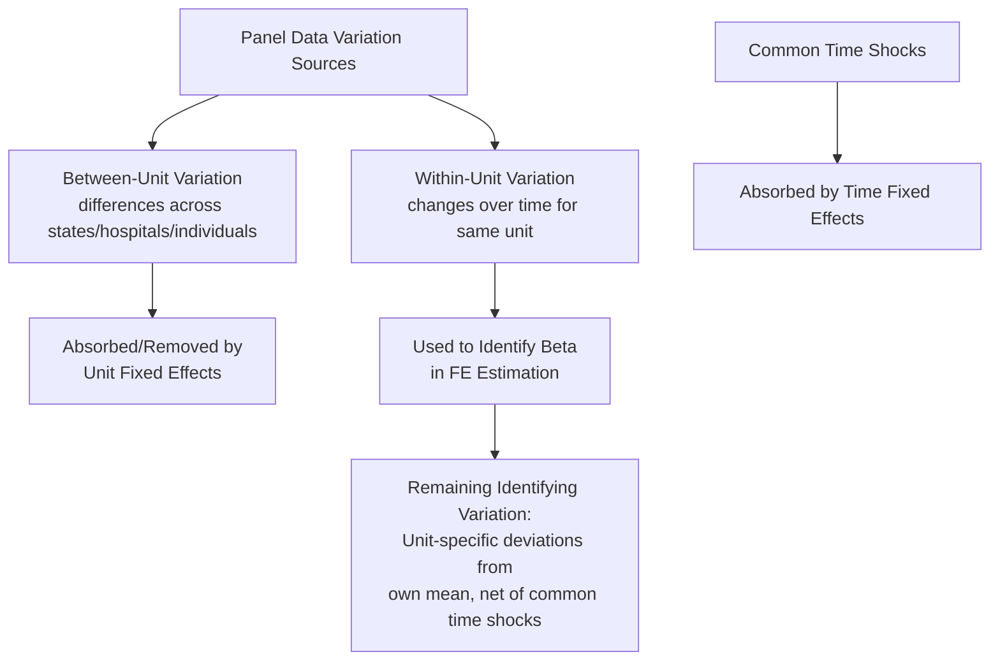

## Panel Data Methods and Fixed Effects Models

### Overview

Panel data methods analyze datasets that track the same units (individuals, hospitals, states, providers) over multiple time periods, combining cross-sectional and time-series variation. In health economics, panel data are foundational because they allow researchers to control for time-invariant unobserved heterogeneity — such as a state's baseline health culture, a hospital's fixed physical infrastructure, or an individual's stable genetic predisposition — that would otherwise confound cross-sectional comparisons. Fixed effects models are the workhorse technique for exploiting this structure, and they underpin the difference-in-differences and event-study designs discussed elsewhere in this material.

### Panel Data Structure

#### Balanced vs. Unbalanced Panels

**Key Points**

- A **balanced panel** observes every unit in every time period (e.g., all 50 states observed annually from 2010-2020 with no gaps)
- An **unbalanced panel** has missing observations for some unit-period combinations (e.g., hospitals entering/exiting the market, patients lost to follow-up, states joining a data-reporting system at different times)
- Unbalanced panels are pervasive in health economics applications (provider entry/exit, patient attrition in longitudinal cohort studies, hospital mergers/closures) and require attention to whether the missingness pattern is related to the outcome or treatment (informative/non-random attrition), which can introduce selection bias distinct from the standard identification concerns of the estimator itself

#### Notation and Data Organization

Panel data is indexed by unit $i$ and time $t$, typically organized in **long format** (one row per unit-time observation) for regression estimation:

$$Y_{it} = \alpha_i + \lambda_t + \beta X_{it} + \varepsilon_{it}, \quad i = 1, \dots, N; \; t = 1, \dots, T$$

where $\alpha_i$ represents unit-specific effects, $\lambda_t$ represents time-specific effects, $X_{it}$ is the time-varying regressor(s) of interest, and $\varepsilon_{it}$ is the idiosyncratic error term.

### Fixed Effects Estimation

#### The Within Transformation

**Key Points**

- The **fixed effects (FE)** or "within" estimator removes unit-specific unobserved heterogeneity by demeaning each variable relative to its unit-specific mean over time, effectively using only **within-unit variation over time** to identify $\beta$:

$$Y_{it} - \bar{Y}_i = \beta(X_{it} - \bar{X}_i) + (\varepsilon_{it} - \bar{\varepsilon}_i)$$

- This transformation eliminates $\alpha_i$ entirely (since it is constant within a unit and thus differenced away), meaning the FE estimator is **immune to bias from any time-invariant unit-specific confounder**, observed or unobserved — a substantial advantage over cross-sectional OLS in health economics settings where such confounders (e.g., a state's underlying health culture, a hospital's baseline patient population characteristics) are pervasive and rarely fully observable
- Equivalently implemented via **Least Squares Dummy Variables (LSDV)**, including a full set of unit indicator variables directly in the regression — computationally more expensive for large $N$ but numerically equivalent to the within transformation

#### What Fixed Effects Cannot Do

**Key Points**

- Fixed effects **cannot** control for **time-varying confounders** that differ across units — only time-invariant unit characteristics are absorbed; if an omitted variable changes over time in a way correlated with both the treatment and outcome (e.g., a state's economic conditions evolving differently from other states over the panel), FE alone does not resolve this endogeneity concern
- Fixed effects also **cannot estimate the effect of time-invariant regressors** (e.g., a person's sex, a hospital's founding year, a state's geographic region) — these are perfectly collinear with the unit fixed effect and are mechanically absorbed/dropped from FE estimation, which is a common practical constraint researchers must design around when a time-invariant characteristic is of direct interest

### Random Effects and the Hausman Test

#### Random Effects Model

**Key Points**

- The **random effects (RE)** estimator treats the unit-specific effect $\alpha_i$ as a **random variable drawn from a distribution**, uncorrelated with the regressors, rather than as a fixed unknown parameter to be estimated/differenced out
- RE is estimated via **Generalized Least Squares (GLS)**, exploiting both within-unit and between-unit variation, which makes it more efficient than FE **if** its core assumption holds — but that assumption (that $\alpha_i$ is uncorrelated with $X_{it}$) is frequently implausible in health economics applications, where unobserved unit characteristics (state health culture, hospital patient mix) are often plausibly correlated with the regressors of policy interest

#### Hausman Specification Test

**Key Points**

- The **Hausman test** formally compares FE and RE coefficient estimates: under the null hypothesis that RE's assumption holds (no correlation between $\alpha_i$ and $X_{it}$), both FE and RE are consistent, but RE is more efficient; under the alternative, FE remains consistent while RE is biased and inconsistent
- A statistically significant Hausman test (rejecting the null) is conventionally interpreted as favoring FE over RE — though modern econometric practice has increasingly emphasized that in most health economics and policy applications, the **theoretical/institutional case for FE's weaker required assumption** (needing only that time-invariant confounders exist, not that they're absent) is often sufficiently compelling on its own that FE is the default choice regardless of the Hausman test result, with RE reserved for settings with strong a priori justification for the stricter exogeneity assumption [Inference — this reflects a widely observed shift in applied practice norms rather than a universally codified rule]

### Two-Way Fixed Effects and Time Effects

**Key Points**

- Most modern health policy panel applications include **both unit and time fixed effects** (Two-Way Fixed Effects, TWFE), where time fixed effects $\lambda_t$ absorb any shock common to all units in a given period (e.g., a national recession, a federal policy change affecting all states simultaneously, secular health trend shifts)
- TWFE is the standard workhorse specification underlying most DiD and staggered-adoption policy evaluation designs (discussed extensively in the DiD entry), and inherits the same recently identified staggered-treatment-timing bias concerns under treatment effect heterogeneity — a critical connection between panel data fixed effects methodology and the modern DiD econometrics literature

### Standard Error Considerations

#### Clustering

**Key Points**

- Panel data outcomes are typically **serially correlated within units** over time (a state's health outcomes in consecutive years are not independent draws), which violates the standard OLS independence assumption and, if uncorrected, produces severely understated standard errors and overstated statistical significance
- The standard correction is **clustering standard errors at the unit level** (e.g., clustering by state when using a state-year panel), allowing arbitrary correlation patterns within a cluster over time while assuming independence across clusters
- With a **small number of clusters** (a common health policy scenario — e.g., 50 states, or even fewer when studying a specific policy subset), standard cluster-robust variance estimators can perform poorly in finite samples, motivating **wild cluster bootstrap** methods or other small-cluster-robust inference approaches as increasingly standard practice in applied work with limited cluster counts [Inference — the specific threshold below which small-cluster corrections become necessary is a matter of ongoing methodological guidance rather than a single bright-line rule, though rules of thumb around 30-50 clusters are commonly referenced in applied econometrics teaching]

### Dynamic Panel Models

#### The Lagged Dependent Variable Problem

**Key Points**

- When a model includes a **lagged dependent variable** as a regressor (e.g., modeling current health spending as a function of prior-period spending plus other covariates), the standard FE within-transformation introduces a mechanical correlation between the transformed lagged outcome and the transformed error term — known as **Nickell bias**, which is particularly severe in panels with a **short time dimension (small T)** relative to a large number of units (large N), a common health economics panel structure
- **Arellano-Bond** and related **Generalized Method of Moments (GMM)** dynamic panel estimators address this bias using lagged levels or differences of the dependent variable as instruments within a GMM framework, though these estimators carry their own well-documented practical challenges (instrument proliferation, sensitivity to instrument set specification) requiring careful diagnostic testing (e.g., Sargan/Hansen overidentification tests, and tests for serial correlation in the differenced residuals)

### Applications in Health Economics

#### State-Level Health Policy Panels

State-year panels are the dominant data structure for studying health policy variation — Medicaid expansion timing, scope-of-practice law changes, tobacco tax/smoking ban implementation, certificate-of-need regulation — using state and year fixed effects to control for persistent state characteristics (regional health culture, baseline demographic composition) and national secular trends simultaneously, forming the foundation for the DiD designs discussed in the corresponding entry.

#### Hospital and Provider Panels

Hospital-year or physician-year panels are used to study provider-level responses to payment policy changes, quality reporting programs, or market structure changes (mergers, entry/exit), with hospital/physician fixed effects controlling for persistent unobserved provider characteristics (baseline quality, patient case-mix tendencies, organizational culture) that would otherwise confound cross-sectional comparisons of provider behavior.

#### Individual-Level Longitudinal Panels

Datasets like the Medical Expenditure Panel Survey (MEPS) or the Health and Retirement Study (HRS) track individuals over multiple periods, allowing individual fixed effects to control for stable unobserved individual characteristics (baseline health endowment, risk preferences, health literacy) when studying the effects of time-varying exposures (insurance status changes, employment transitions, policy eligibility changes) on individual health and spending outcomes.

### Comparison of Estimator Properties

| Estimator | Handles Time-Invariant Confounders | Handles Time-Varying Confounders | Efficiency | Key Requirement |
| --- | --- | --- | --- | --- |
| Pooled OLS | No | No | High (if valid) | No unit-level confounding at all |
| Fixed Effects (Within) | Yes | No | Lower than RE (if RE valid) | Confounders correlated with $X$ must be time-invariant |
| Random Effects | Partially (if uncorrelated with $X$) | No | Higher than FE (if valid) | $\alpha_i$ uncorrelated with $X_{it}$ |
| First-Differencing | Yes | No | Similar to FE (differs under serial correlation structure) | Removes unit effects via differencing rather than demeaning |
| Dynamic Panel (GMM) | Yes | Partially (via instruments) | Depends on instrument validity | Valid internal instruments (lagged levels/differences) |

### Practical Example

**Example**

A researcher studies whether state-level nurse practitioner scope-of-practice expansion affects rural primary care access, using a state-year panel from 2005-2020.

- **Specification**: $Access_{st} = \alpha_s + \lambda_t + \beta \cdot ScopeExpansion_{st} + \gamma' X_{st} + \varepsilon_{st}$, with state fixed effects $\alpha_s$ absorbing persistent state characteristics (baseline rural population share, historical physician supply patterns) and year fixed effects $\lambda_t$ absorbing national trends (e.g., overall primary care workforce trends)
- **Identification**: $\beta$ is identified from **within-state changes** in access coinciding with **within-state timing** of scope-of-practice law changes, net of common national trends — states that never changed their scope-of-practice laws contribute to identifying the year fixed effects but not directly to $\beta$ under the within estimator
- **Standard errors**: clustered at the state level to account for serial correlation in access measures within a state over the 16-year panel; given the panel has only 50 state clusters, the researcher might additionally report wild cluster bootstrap p-values as a robustness check
- **Caveat**: if scope-of-practice expansion is itself part of a broader package of state health workforce reforms adopted simultaneously (a time-varying confounder), state and year fixed effects alone would not resolve this specific confounding concern — motivating either additional controls for concurrent policies or a research design more targeted at isolating the scope-of-practice change specifically (e.g., examining border-county comparisons or a synthetic control approach)

**Behavioral disclaimer**: The specific magnitude and statistical significance of any health policy effect estimated via fixed effects panel methods depends on the sample period, control variable set, and clustering approach used; this entry describes general methodological structure rather than reporting findings from any specific published study.

### Related Topics

- Difference-in-differences designs for policy evaluation (TWFE as the underlying DiD estimator)
- Instrumental variables in health economics research (dynamic panel GMM as an IV-adjacent method)
- Regression discontinuity in health policy contexts (complementary quasi-experimental approach)
- Clustered standard errors and small-cluster inference methods (wild cluster bootstrap)
- Staggered treatment timing bias in Two-Way Fixed Effects estimation
- Nickell bias and dynamic panel data (Arellano-Bond GMM estimators)
- Medical Expenditure Panel Survey (MEPS) and Health and Retirement Study (HRS) as applied data sources
- Attrition and missing data in longitudinal health services research