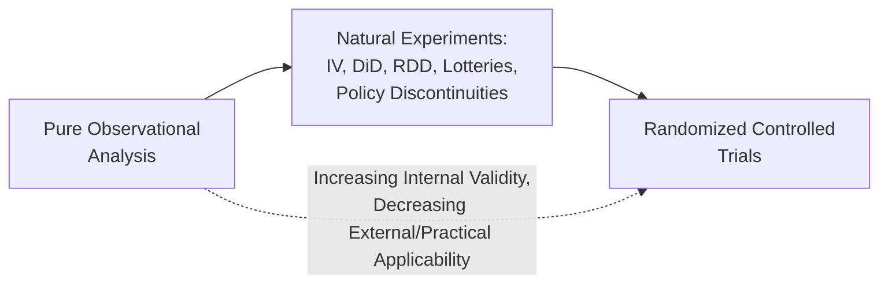
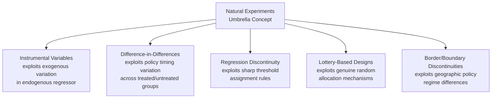

## Natural Experiments in Health Economics

### Overview

Natural experiments are research designs that exploit naturally occurring, "as-if random" variation in exposure or treatment — arising from policy changes, geographic/administrative boundaries, lottery-based allocation, or other events outside a researcher's control — to approximate the conditions of a randomized experiment without the researcher actually assigning treatment. In health economics, natural experiments serve as an overarching umbrella concept encompassing several specific identification strategies (instrumental variables, difference-in-differences, regression discontinuity, all discussed in dedicated entries in this material) unified by the common logic of finding exogenous variation that mimics random assignment. This entry focuses on the broader conceptual framework, distinct natural-experiment types not fully covered elsewhere, and the evaluative criteria for assessing natural experiment credibility.

### Conceptual Framework

#### Why Natural Experiments Matter in Health Economics

**Key Points**

- True randomized controlled trials (RCTs) are frequently infeasible, unethical, or prohibitively expensive for many health-policy-relevant questions — one cannot ethically randomize individuals to have or lack health insurance, randomize exposure to environmental health hazards, or randomize major life events like job loss or bereavement
- Natural experiments occupy a middle ground on the internal-validity spectrum between fully randomized experiments (highest internal validity, but limited applicability to many real-world policy questions) and purely observational cross-sectional analysis (broadest applicability, but most vulnerable to confounding)
- The defining feature distinguishing a natural experiment from ordinary observational analysis is the presence of some **plausibly exogenous source of variation** — a specific institutional, policy, or random event that assigns "treatment" in a way argued to be unrelated to the unobserved determinants of the outcome

### Taxonomy of Natural Experiment Types

#### Policy-Induced Natural Experiments

Sudden, discrete policy changes affecting a defined population create before/after and treated/untreated comparisons — this category overlaps substantially with difference-in-differences methodology (covered in its own entry) but is conceptually broader, including single-jurisdiction policy changes analyzed via synthetic control or interrupted time-series methods when a suitable comparison group panel is unavailable.

#### Administrative and Geographic Boundary Discontinuities

**Key Points**

- Exploits sharp administrative boundaries (state lines, school district borders, hospital referral region boundaries) where policy or institutional rules differ discontinuously but underlying population characteristics are argued to vary smoothly across the boundary
- **Border-discontinuity designs** compare outcomes for populations on either side of a state line (e.g., comparing health outcomes for residents of contiguous counties in a Medicaid-expansion state vs. a non-expansion state) under the assumption that unobserved confounders vary smoothly across the geographic boundary while the policy regime does not — conceptually related to but distinct from RDD, since the "running variable" (geographic location) is multi-dimensional and the underlying comparability assumption relies on spatial smoothness rather than a single-dimension threshold
- These designs require caution regarding **selective migration** (individuals or providers relocating specifically to access more favorable policy regimes) and **spillover effects** (cross-border health care utilization, e.g., residents crossing state lines for care, which can contaminate the comparison) [Inference — the severity of these threats is context- and policy-specific, and applied studies typically incorporate specific robustness checks such as excluding known border-crossing utilization or testing for differential migration patterns]

#### Lottery and Random Allocation Natural Experiments

**Key Points**

- Genuine random-allocation mechanisms used for non-research purposes (military draft lotteries, oversubscribed program admission lotteries, randomized audit selection) provide unusually credible natural experiments because the randomization is verifiably exogenous by institutional design rather than argued by the researcher
- The **Oregon Health Insurance Experiment** is a landmark health economics application: Oregon's 2008 Medicaid expansion used a **random lottery** to allocate a limited number of new Medicaid slots among a larger pool of eligible low-income adults, creating a rare instance of genuinely randomized insurance-coverage variation at reasonably large scale, extensively studied for effects on health care utilization, financial strain, and health outcomes/biomarkers
- Because the Oregon lottery was randomized specifically for program administration purposes (fairly allocating scarce slots) rather than designed as a research instrument, it exemplifies the natural experiment concept precisely: researchers exploited pre-existing random variation rather than creating it

#### Weather, Environmental, and Other "Truly Exogenous" Shocks

Weather events, natural disasters, and other environmentally-driven shocks (unrelated to human health-seeking behavior or policy choices) have been used to study various health economics questions — e.g., temperature/pollution exposure effects on health care utilization and mortality, or disaster-induced disruptions to health care access — under the argument that such events are genuinely exogenous to individual or provider behavior, though researchers must still consider whether the shock itself might correlate with other confounding regional characteristics.

#### Cohort and Timing-Based Natural Experiments

**Key Points**

- Exploits arbitrary timing rules that create comparable groups differing only in exposure due to birth-date cutoffs, program rollout timing, or similar administrative timing rules unrelated to individual characteristics
- Examples include studies exploiting **school-entry age cutoffs** (interacting with health-related outcomes), **draft-eligibility birth-cohort cutoffs**, and **historical program rollout timing** where administrative capacity constraints (rather than policy targeting) determined which cohorts/regions received a program first

### Evaluating Natural Experiment Credibility

#### Key Assessment Criteria

**Key Points**

- **Plausibility of exogeneity**: does the source of variation have a credible institutional/theoretical basis for being unrelated to unobserved confounders? This is the central, largely non-testable assumption requiring domain expertise and institutional knowledge to assess, similar to the IV exclusion restriction and DiD parallel trends assumption discussed in their respective entries
- **Absence of anticipation or manipulation**: can affected units anticipate and adjust behavior in response to the "natural" event in ways that undermine its exogeneity (e.g., strategic timing around a known future policy change)?
- **Sufficient statistical power**: does the natural experiment generate enough variation and sample size to detect economically meaningful effects with reasonable precision — a common practical limitation, since natural experiments are, by definition, constrained by whatever variation naturally occurred rather than researcher-designed sample sizes
- **Falsification/placebo testing**: can the researcher demonstrate that the natural experiment does not produce spurious "effects" on outcomes that should theoretically be unaffected, or at times/places where no actual exposure difference existed?

#### Common Threats to Validity

- **Confounding events**: multiple things often change simultaneously with the natural experiment's primary variation source (e.g., a policy change bundled with other concurrent reforms), threatening clean attribution
- **General equilibrium/spillover effects**: a natural experiment's "control" group may be indirectly affected by the treatment (e.g., a state's Medicaid expansion affecting neighboring non-expansion states' uncompensated care burden through cross-border utilization), violating the implicit stable-unit-treatment-value assumption (SUTVA) that treatment of one unit doesn't affect others' outcomes
- **External validity limits**: natural experiments, like RDD, often identify effects specific to the particular population, time period, and institutional context of the specific naturally occurring event, which may not generalize to different populations or a hypothetical researcher-designed intervention with different implementation details [Inference — this generalizability caveat is standard methodological practice in interpreting any single natural experiment's findings]

### Relationship to Other Quasi-Experimental Methods

Rather than a distinct statistical estimator, "natural experiment" functions as a broader research design category — the specific econometric method used to analyze the resulting data (2SLS for IV-type natural experiments, TWFE/modern DiD estimators for policy-rollout natural experiments, local polynomial regression for RDD-type natural experiments) depends on the specific structure of the naturally occurring variation identified.

### Landmark Health Economics Natural Experiment Studies

#### The Oregon Health Insurance Experiment

**Key Points**

- Widely regarded as one of the most influential health economics natural experiments of the past two decades precisely because its lottery-based design achieved genuine randomization at meaningful scale for the inherently hard-to-randomize question of health insurance coverage
- Findings from the study (covering utilization, financial protection, and various health/biomarker outcomes over approximately a two-year follow-up window) have been extensively cited, replicated in methodology by subsequent researchers, and also subject to ongoing debate regarding statistical power for detecting certain clinical outcome changes and the appropriate interpretation of specific null results [Unverified — specific point estimates and their statistical significance across different outcome domains should be verified against the original published studies (Finkelstein et al. and related follow-up papers) rather than assumed from general characterization]

#### Vietnam-Era Draft Lottery Studies

Angrist's foundational use of the Vietnam draft lottery (originally for labor economics applications, studying veteran status effects on earnings) has been extended and adapted in health economics research examining military service exposure effects on various health and mortality outcomes, exploiting the lottery's genuine randomization of draft eligibility by birth date.

### Practical Example

**Example**

A researcher wants to study whether Medicaid coverage causally reduces emergency department utilization for non-emergent conditions, but observational comparison of Medicaid enrollees vs. uninsured individuals is confounded by unobserved health-seeking behavior and socioeconomic differences.

- **Natural experiment approach**: the researcher identifies a state that expanded Medicaid eligibility using a **random lottery** among an oversubscribed eligible pool (directly analogous to the Oregon design), providing a natural experiment where lottery winners and non-winners are, by construction, statistically comparable in expectation on both observed and unobserved characteristics prior to the coverage difference
- **Analysis**: comparing ED utilization between lottery winners (who gained coverage) and lottery losers (who remained uninsured) using a simple mean-difference or regression-adjusted comparison, since the randomization itself (not a modeling assumption) provides the causal identification
- **Validity check**: the researcher would verify **covariate balance** between winners and losers on pre-lottery observable characteristics (age, prior utilization, self-reported health) as a check that the lottery was administered as genuinely random, and check for **differential attrition** between the two groups in follow-up data collection, which could otherwise reintroduce selection bias despite the initial random assignment

**Behavioral disclaimer**: The specific external validity and precise magnitude of any lottery-based natural experiment's findings are tied to the specific population and lottery mechanism studied; this entry describes general natural experiment logic rather than asserting specific findings from any single published study as universally generalizable.

### Related Topics

- Instrumental variables in health economics research (specific estimation method for many natural experiments)
- Difference-in-differences designs for policy evaluation (specific method for policy-rollout natural experiments)
- Regression discontinuity in health policy contexts (specific method for threshold-based natural experiments)
- Oregon Health Insurance Experiment detailed findings and methodology
- Randomized controlled trials in health economics (comparison point for internal validity)
- Border-discontinuity and geographic boundary research designs
- Stable Unit Treatment Value Assumption (SUTVA) and spillover effects in causal inference
- Selective migration and its threat to geographic natural experiment validity