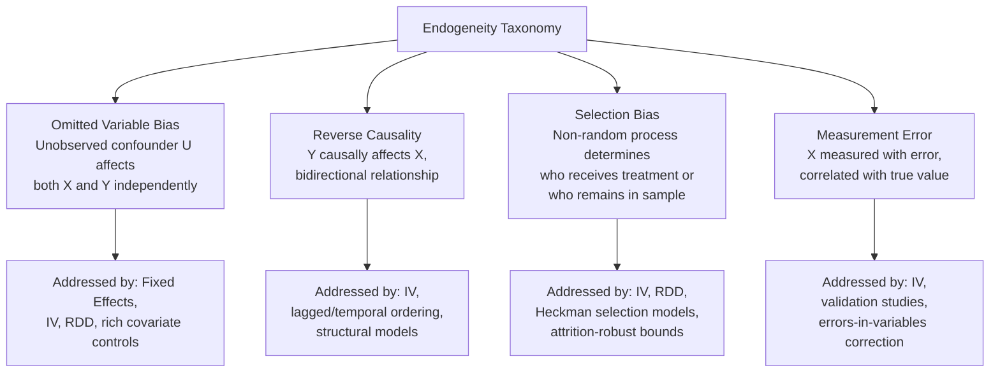

## Selection Bias and Endogeneity Concerns

### Overview

Selection bias and endogeneity represent the central methodological challenges that motivate nearly every quasi-experimental technique covered elsewhere in this material — instrumental variables, difference-in-differences, regression discontinuity, and panel fixed effects methods all exist specifically to address one or more forms of these problems. This entry provides the unifying conceptual and taxonomic framework: defining the distinct mechanisms by which selection bias and endogeneity arise in health economics research, and mapping each mechanism to the identification strategies designed to address it.

### Defining Endogeneity

#### The General Problem

**Key Points**

- A regressor $X_i$ is **endogenous** when it is correlated with the error term $\varepsilon_i$ in a regression model, violating the core OLS assumption $E[\varepsilon_i | X_i] = 0$ and rendering the OLS coefficient estimate biased and inconsistent for the true causal effect
- Endogeneity is not a single problem but an umbrella term covering **several distinct underlying mechanisms**, each requiring different identification strategies to address — conflating these mechanisms is a common source of methodological confusion in applied health economics work

$$Y_i = \beta_0 + \beta_1 X_i + \varepsilon_i, \quad \text{Endogeneity: } \text{Cov}(X_i, \varepsilon_i) \neq 0 \implies \hat{\beta}_1^{OLS} \text{ biased}$$

### Taxonomy of Endogeneity Sources

#### Omitted Variable Bias (Confounding)

**Key Points**

- Arises when an unobserved variable $U_i$ independently affects both the regressor $X_i$ and the outcome $Y_i$, creating a spurious correlation between $X_i$ and $Y_i$ that does not reflect a true causal relationship
- Classic health economics example: estimating the relationship between exercise frequency and health outcomes is confounded by unobserved factors like health consciousness or baseline fitness, which independently drive both exercise behavior and health outcomes
- The bias direction and magnitude depend on the sign and strength of $U_i$'s correlation with both $X_i$ and $Y_i$ — omitted variable bias can inflate, deflate, or even reverse the sign of the estimated coefficient relative to the true causal effect

$$\text{Bias}(\hat{\beta}_1^{OLS}) = \frac{\text{Cov}(X_i, U_i)}{\text{Var}(X_i)} \times \delta, \quad \text{where } Y_i = \beta_0 + \beta_1 X_i + \delta U_i + \eta_i$$

#### Reverse Causality (Simultaneity)

**Key Points**

- Arises when the outcome $Y_i$ itself causally affects the regressor $X_i$, creating a bidirectional causal relationship that standard single-equation OLS cannot disentangle
- Classic health economics example: does higher health care spending improve health, or does poor health cause higher spending (since sicker individuals both spend more and have worse outcomes)? The observed correlation reflects some blend of both causal directions, and OLS cannot separate them without additional identifying assumptions or a genuinely exogenous source of variation in spending
- This mechanism is particularly pervasive in health economics specifically because health status and health care utilization are inherently jointly determined over time — poor health drives utilization, and utilization (when effective) improves health, creating a feedback loop that any cross-sectional or naive panel analysis struggles to disentangle without a credible identification strategy

#### Selection Bias (Non-Random Sample/Treatment Assignment)

**Key Points**

- Arises when the process determining which units receive "treatment" (or which units are observed/included in the sample at all) is correlated with the potential outcomes themselves — distinct from omitted variable bias in that the mechanism specifically concerns the assignment/inclusion process rather than a separately-existing confounding third variable, though the two concepts are closely related and sometimes used interchangeably in applied discussion
- **Selection into treatment**: individuals who choose to receive a treatment/exposure (e.g., purchase more generous insurance, seek out a particular physician, enroll in a wellness program) often differ systematically from non-selectors in ways related to the outcome — e.g., individuals who voluntarily enroll in preventive health programs may be more health-conscious at baseline (positive selection), while individuals who seek out intensive treatment may be systematically sicker (adverse/negative selection from the researcher's perspective, though this is the "healthy volunteer" bias pattern reversed)
- **Selection into the sample (attrition/survivorship)**: when the analytic sample itself is non-randomly composed — e.g., longitudinal health studies losing sicker participants to death or dropout differentially from healthier participants, or studies of hospital outcomes only observing patients who survived to a particular measurement point (a specific form termed **survivorship bias**)

#### Measurement Error

**Key Points**

- Arises when the regressor $X_i$ is measured with error, and that measurement error is correlated with the true underlying value (**classical measurement error**, where the error is uncorrelated with the true value, causes a specific, predictable form of **attenuation bias** — biasing the coefficient toward zero — while **non-classical measurement error** can bias estimates in either direction)
- Health economics applications frequently involve self-reported measures (self-reported health status, self-reported utilization, recalled health behaviors) subject to substantial measurement error, including **recall bias** (differential accuracy of retrospective reporting, sometimes correlated with current health status) and **social desirability bias** (systematic misreporting of health behaviors like smoking, alcohol use, or exercise toward socially favorable answers)

### Selection Bias in Specific Health Economics Contexts

#### Adverse Selection in Insurance Markets

**Key Points**

- A specific, extensively studied form of selection bias in health economics: individuals with private information about their own (higher) expected health risk are more likely to purchase more generous insurance coverage, creating a correlation between insurance generosity and underlying risk that confounds naive comparisons of insurance's causal effect on utilization/spending
- This is the theoretical foundation for much of the ACA market design (discussed in the corresponding entry) and represents both a substantive economic phenomenon of policy interest in its own right, and a methodological confound that researchers studying insurance's causal effects must specifically address (typically via natural experiments, IV, or RDD approaches exploiting variation in coverage that is unrelated to individual risk-based selection)

#### Healthy Worker/Healthy Volunteer Effects

**Key Points**

- **Healthy worker effect**: employed individuals are systematically healthier than the general population (since employment itself requires a baseline health/functional capacity), which can bias studies comparing employed vs. unemployed populations' health outcomes if not addressed, and specifically complicates occupational health/exposure studies where comparison to general population health statistics may understate true exposure effects
- **Healthy volunteer effect**: participants who voluntarily enroll in health studies (particularly those requiring effort, such as clinical trials or wellness programs) tend to be healthier and more health-engaged than non-participants, threatening both internal validity (if differential enrollment relates to treatment response) and external validity (generalizability to the broader population, including non-volunteers)

#### Provider/Physician Selection Effects

Patients are not randomly assigned to physicians or hospitals — patients may select providers based on unobserved severity, health literacy, insurance network constraints, or geographic convenience, while providers may also selectively accept or refer patients based on unobserved case complexity, creating bidirectional selection concerns that complicate comparative-effectiveness and provider-quality research using observational data (a concern directly motivating the physician practice-style instrumental variable approaches discussed in the IV entry).

### Statistical Approaches to Selection Bias

#### Heckman Selection Model

**Key Points**

- The **Heckman two-step selection correction** (Heckman, 1979) addresses a specific selection bias structure: when the outcome $Y_i$ is only observed for a non-randomly selected subsample (e.g., wage/spending data only observed for individuals who choose to work/purchase), the model uses a first-stage selection equation (typically a probit model of the selection decision) to construct an **Inverse Mills Ratio**, which is then included as an additional regressor in the outcome equation to correct for the non-random selection into the observed sample
- This approach requires its own identifying assumption — ideally an **exclusion restriction** analogous to IV, where at least one variable affects selection into the sample but not the outcome directly — and has been critiqued in methodological literature for sensitivity to distributional assumptions (typically joint normality of the selection and outcome error terms) when a valid exclusion restriction is unavailable, motivating semi-parametric alternatives in some applications [Inference — the degree of practical sensitivity to distributional assumptions is context-dependent and has been a recurring point of methodological critique since the model's introduction]

#### Bounding Approaches

**Key Points**

- When a fully parametric selection correction is not credible, **partial identification/bounding methods** (e.g., Manski-style worst-case bounds, or Lee bounds specifically designed for sample selection/attrition problems) provide a range of plausible treatment effect estimates under weaker assumptions than point-identification approaches, trading precision (a range rather than a point estimate) for greater robustness to selection bias concerns — an approach that has gained increasing use in health economics applications with substantial differential attrition (e.g., longitudinal studies with attrition correlated with treatment status)

### Diagnosing Endogeneity Empirically

#### Durbin-Wu-Hausman Test

A formal test comparing OLS and IV estimates (analogous in spirit to the Hausman test comparing FE and RE discussed in the panel data entry): if OLS and IV estimates differ significantly, this provides statistical evidence consistent with endogeneity in the OLS specification, supporting the case for using the IV estimate — though this test requires already having a credible instrument available to implement, making it more a confirmatory diagnostic than a general-purpose endogeneity detector.

#### Falsification and Sensitivity Analysis

**Key Points**

- **Placebo outcome tests**: examining whether the treatment variable "predicts" outcomes it should have no plausible causal relationship with, providing indirect evidence about whether the estimated relationship reflects genuine causation or residual confounding
- **Sensitivity analysis / bounding the role of unobserved confounders** (e.g., Oster's coefficient-stability-based bounding approach, or Rosenbaum-style sensitivity analysis originally developed for matching designs) — formal methods for assessing how strong an unobserved confounder would need to be, relative to observed confounders already controlled for, to fully explain away an estimated effect, providing a quantitative sense of a finding's robustness to remaining unobserved confounding [Inference — these approaches have seen increasing adoption in applied health economics as a complement to (not substitute for) a credible core identification strategy]

### Connecting Selection/Endogeneity to Identification Strategies

| Endogeneity Mechanism | Primary Identification Strategies |
| --- | --- |
| Time-invariant omitted confounders | Panel fixed effects |
| Time-varying omitted confounders | Instrumental variables, natural experiments with plausible exogeneity |
| Reverse causality/simultaneity | Instrumental variables, lagged/temporal-ordering designs, structural simultaneous equation models |
| Selection into treatment | Instrumental variables, regression discontinuity, Heckman selection models |
| Selection into sample (attrition) | Heckman correction, Lee bounds, inverse probability weighting |
| Measurement error | Instrumental variables (using error-uncorrelated instrument), validation sub-studies |

### Practical Example

**Example**

A researcher observes that patients who see a specialist physician (vs. only a generalist) for a chronic condition have better health outcomes, and wants to interpret this as evidence that specialist care causally improves outcomes.

- **Selection bias concern**: patients who seek out or are referred to specialists may differ systematically from those who don't — they may have better health literacy, more resources to navigate referral processes, more engaged primary care physicians who refer proactively, or (in the opposite direction) may be selected specifically because they present with more complex/severe disease (which would bias the naive comparison in the opposite direction, understating specialist care's true benefit)
- **Diagnostic approach**: the researcher should first consider which selection mechanism is more plausible in this specific clinical context (severity-based referral vs. resource/literacy-based self-selection), since these have opposite bias directions and have different implications for interpreting a naive positive correlation
- **Identification strategy**: rather than relying on naive OLS comparison, the researcher might use a **physician practice-style instrument** (e.g., a primary care physician's historical referral rate to specialists, excluding the focal patient) to isolate variation in specialist-care receipt driven by physician referral tendency rather than patient-driven selection — directly applying the IV logic discussed in the corresponding entry to this specific selection bias problem
- **Robustness**: the researcher would additionally examine covariate balance across instrument values and consider sensitivity analysis to assess how large a remaining unobserved confounder would need to be to overturn the IV-based finding

**Behavioral disclaimer**: The appropriate identification strategy for any specific selection bias concern depends on the institutional context and data available; this entry describes general diagnostic and methodological frameworks rather than prescribing a single correct approach applicable to all health economics research questions.

### Related Topics

- Instrumental variables in health economics research (primary tool for many endogeneity forms)
- Regression discontinuity in health policy contexts (selection-into-treatment solution)
- Panel data methods and fixed effects models (time-invariant confounder solution)
- Natural experiments in health economics (broader exogenous-variation framework)
- Adverse selection theory in health insurance markets
- Heckman selection model and Inverse Mills Ratio correction
- Survivorship bias and attrition in longitudinal health studies
- Measurement error and errors-in-variables econometric correction methods
- Sensitivity analysis for unobserved confounding (Oster bounds, Rosenbaum bounds)