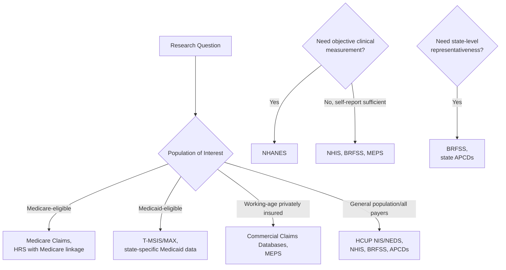

## Common Health Economics Data Sources

### Overview

Empirical health economics research draws on a diverse ecosystem of data sources spanning federal surveys, administrative claims data, provider-reported data, and specialized longitudinal cohorts. Each source has distinct strengths, limitations, unit of observation, and typical research applications, and the choice of data source is often as consequential for a study's validity and generalizability as the choice of identification strategy. This entry catalogs the major U.S. health economics data sources organized by type, with attention to their structure, access mechanisms, and common research uses.

### Federal Survey Data

#### Medical Expenditure Panel Survey (MEPS)

**Key Points**

- Administered by the Agency for Healthcare Research and Quality (AHRQ), MEPS is a nationally representative **longitudinal panel survey** following households across two years (overlapping panels), collecting detailed data on health care utilization, expenditures, insurance coverage, and health status at the individual and household level
- Distinctive because it links survey-reported utilization with a **Medical Provider Component**, verifying/supplementing household-reported expenditure data with data collected directly from providers and pharmacies, improving accuracy relative to survey-only expenditure data
- Widely used for studying insurance coverage transitions, out-of-pocket spending patterns, and the demand-side determinants of health care utilization; limited by relatively small sample size for rare conditions/events and a two-year panel length limiting long-run longitudinal analysis

#### National Health Interview Survey (NHIS)

Administered by the CDC's National Center for Health Statistics (NCHS), NHIS is a large annual **cross-sectional** household survey collecting broad health status, health behavior, insurance coverage, and health care access data — larger sample size than MEPS but lacking MEPS's detailed expenditure linkage and longitudinal panel structure, commonly used for tracking national health status/coverage trends and as a sampling frame for supplemental survey modules.

#### Behavioral Risk Factor Surveillance System (BRFSS)

A CDC-administered, state-based **telephone survey** (the largest continuously conducted health survey system in the world by sample size) collecting state-representative data on health behaviors, chronic disease prevalence, and health care access, valuable specifically for its **state-level representativeness**, making it a common data source for the state-policy-variation research designs (DiD, panel fixed effects) discussed elsewhere in this material, though limited by self-report-only data collection (no clinical verification) and coverage/methodology changes over time (e.g., historical landline-only sampling transitioning to include cell phones) that researchers must account for in long-panel analyses.

#### Health and Retirement Study (HRS)

**Key Points**

- A longitudinal panel study following a nationally representative sample of adults over age 50, conducted biennially, with **decades-long follow-up** for many original cohort members — among the richest longitudinal datasets for studying aging-related health, cognition, retirement, and end-of-life economic outcomes
- Includes **linked administrative data** (with respondent consent) to Social Security earnings records, Medicare claims, and other administrative sources, substantially enhancing its research value by combining rich self-reported detail with objective administrative verification
- Has inspired an international family of harmonized aging studies (e.g., the English Longitudinal Study of Ageing, Survey of Health, Ageing and Retirement in Europe), enabling cross-national comparative aging/health economics research using harmonized variable construction

### Administrative Claims Data

#### Medicare Claims Data

**Key Points**

- CMS makes available extensive **Medicare fee-for-service claims data** (covering Part A/B services) through research data use agreements, including the **Master Beneficiary Summary File**, **Medicare Provider Analysis and Review (MedPAR)** files for inpatient claims, and **Carrier/Outpatient files** for physician and outpatient claims — representing near-universal, high-volume administrative data for the Medicare-eligible population
- Distinctive strengths: near-complete capture of covered service utilization (unlike survey self-report, subject to recall bias), large sample size enabling precise estimation and subgroup analysis, and applicability to the RDD age-65 eligibility designs and other Medicare-focused research discussed in earlier entries
- Key limitations: covers only Medicare-eligible populations (limiting generalizability to younger/working-age populations), historically limited to fee-for-service claims (Medicare Advantage encounter data availability and completeness has improved over time but has historically lagged FFS claims in research accessibility and perceived completeness) [Unverified — current MA encounter data research accessibility and quality should be verified against current CMS research data documentation, as this has been an evolving area]
- Access typically requires a formal **Data Use Agreement (DUA)** with CMS, IRB approval, and (for many files) payment of extraction/access fees, representing a meaningfully higher access barrier than public-use survey microdata

#### Medicaid Claims Data (T-MSIS/MAX)

**Key Points**

- The **Transformed Medicaid Statistical Information System (T-MSIS)**, which succeeded the older **Medicaid Analytic eXtract (MAX)** files, provides state-level Medicaid claims and enrollment data, enabling research on Medicaid population utilization, spending, and the effects of state policy variation
- A persistent, well-documented challenge with Medicaid administrative data is substantial **cross-state data quality variation** — since each state administers its own program and reports data with varying completeness/timeliness/accuracy, multi-state Medicaid claims research requires careful attention to state-specific data quality assessments (CMS and researchers using T-MSIS commonly reference state-specific data quality flags/assessments before pooling multi-state analyses) [Inference — the specific current data quality status of any individual state's T-MSIS reporting changes over time and should be verified against current CMS data quality documentation for any specific research application]

#### Commercial Claims Databases

**Key Points**

- Proprietary databases aggregating **employer-sponsored insurance claims** from large insurers or claims clearinghouses (e.g., commercially available databases marketed by various health data vendors) provide large-sample administrative data for the working-age, privately insured population — a population not well captured by Medicare/Medicaid administrative data
- Typically accessed through paid licensing agreements with the data vendor rather than a government research data use process, and generally represent a **non-random, employer-sponsored-insurance-specific population** (skewing toward employed individuals and their dependents), requiring caution regarding generalizability to the full U.S. population, particularly the uninsured or Medicaid populations
- Commonly used for studying employer-sponsored insurance benefit design effects, provider price variation in commercial markets (since commercial claims capture the actual negotiated prices paid, information not present in public-payer claims where rates are administratively set), and comparative effectiveness research requiring large working-age population samples

### Provider and Facility-Level Data

#### Hospital Discharge/Inpatient Databases

**Key Points**

- The **Healthcare Cost and Utilization Project (HCUP)**, sponsored by AHRQ, aggregates hospital discharge data from participating states into several standardized databases, including the **National Inpatient Sample (NIS)** — a large all-payer inpatient discharge database enabling nationally representative estimates of hospitalization patterns, procedures, diagnoses, and costs
- HCUP also includes the **Nationwide Emergency Department Sample (NEDS)** and state-specific databases with varying levels of geographic/temporal coverage, widely used for studying inpatient utilization patterns, procedure volume trends, and hospital-level outcomes research
- A key strength is **all-payer coverage** (not limited to a single payer type), enabling research spanning the full range of payer types within a single hospitalization dataset, though the data structure (discharge-level rather than patient-level in some configurations) can complicate longitudinal patient-level analysis across multiple hospitalizations

#### CMS Hospital and Physician Compare / Public Reporting Data

CMS publishes hospital-level and physician-level quality, safety, and cost data through public reporting programs (historically branded as Hospital Compare, now integrated into Care Compare and related CMS public data platforms), providing publicly accessible provider-level quality metrics commonly used in research examining public reporting's effects on provider behavior, quality improvement, and consumer choice.

### Vital Statistics and Mortality Data

**Key Points**

- The **National Vital Statistics System (NVSS)**, administered by NCHS, aggregates state-reported birth and death certificate data into national vital statistics files, providing the standard source for U.S. mortality research, including cause-specific mortality, infant mortality, and life expectancy analysis
- **Restricted-use NVSS mortality microdata** (with geographic detail beyond state level) requires a separate, more restrictive data use agreement than the publicly available aggregate mortality statistics, a common pattern across many of these data sources where public-use files offer broader access with less geographic/identifying detail, while restricted-use versions offer finer geographic resolution at the cost of a more burdensome access process

### Specialized and Linked Data Resources

#### National Health and Nutrition Examination Survey (NHANES)

Distinctive among major health surveys for including **direct physical examination and laboratory testing** components (not just self-report), providing objectively measured health biomarkers (blood pressure, cholesterol, biomarker panels, etc.) alongside survey data — valuable for research requiring objective clinical measurement rather than relying solely on self-reported health status, though with a smaller sample size than purely survey-based instruments like NHIS or BRFSS given the greater logistical complexity of in-person clinical examination.

#### All-Payer Claims Databases (APCDs)

**Key Points**

- State-level **All-Payer Claims Databases**, established by a growing number of states, aggregate claims data across commercial insurers, Medicaid, and (where available) Medicare within a single state, providing comprehensive within-state, cross-payer utilization and pricing data
- Particularly valuable for studying **provider price variation** and **market concentration effects** on pricing across payer types within a single state market, though data availability, standardization, and researcher access provisions vary substantially by state, and not all states maintain an APCD [Unverified — the current list of states with active, research-accessible APCDs changes over time and should be verified against current APCD Council or state-specific documentation]

#### Linked Survey-Administrative Data

An increasingly common and methodologically valuable data resource type involves linking survey data (rich in self-reported detail, health behaviors, and attitudes) to administrative records (objective verification of claims, mortality, or earnings) — exemplified by HRS's Medicare/Social Security linkages described above, and increasingly available through restricted-access Federal Statistical Research Data Centers (FSRDCs) enabling linkage of various federal survey and administrative datasets under controlled access conditions.

### Data Source Selection Considerations

| Data Source | Type | Unit of Observation | Key Strength | Key Limitation |
| --- | --- | --- | --- | --- |
| MEPS | Survey (longitudinal) | Individual/household | Detailed expenditure + provider verification | Small sample, 2-year panel |
| NHIS | Survey (cross-sectional) | Individual/household | Large sample, broad health measures | No expenditure detail |
| BRFSS | Survey (cross-sectional) | Individual | State-representative | Self-report only |
| HRS | Survey (longitudinal) | Individual (50+) | Decades-long panel, admin linkage | Limited to older adult population |
| Medicare Claims | Administrative | Claim/beneficiary | Near-universal Medicare-eligible capture | Limited to 65+/disabled population |
| T-MSIS/MAX | Administrative | Claim/beneficiary | Medicaid population coverage | Cross-state quality variation |
| HCUP NIS/NEDS | Administrative (discharge) | Hospitalization/ED visit | All-payer, nationally representative | Discharge-level, not always patient-linkable |
| NHANES | Survey + clinical exam | Individual | Objective biomarker data | Smaller sample size |
| APCDs | Administrative (state) | Claim | Cross-payer, within-state pricing detail | Variable state availability/standardization |

### Practical Example

**Example**

A researcher studying whether Medicaid expansion affected preventive care utilization among low-income adults would need to select data balancing several considerations:

- **T-MSIS/Medicaid claims** would provide precise utilization measures for the Medicaid-enrolled population specifically, but cannot capture the comparison group of eligible-but-unenrolled or newly-uninsured individuals who might be relevant for certain research questions, and requires careful cross-state data quality vetting given the study's likely multi-state DiD design (discussed in the DiD entry) comparing expansion vs. non-expansion states
- **BRFSS** would offer state-representative self-reported preventive care utilization across the full low-income population (both enrolled and unenrolled), enabling the state-year panel structure needed for a DiD analysis, at the cost of relying on self-report rather than verified claims-based utilization
- A combined approach — using BRFSS for the main population-representative analysis and T-MSIS as a robustness check specifically among the Medicaid-enrolled subpopulation — would leverage each source's specific strengths while triangulating findings across data sources with different limitations

**Behavioral disclaimer**: Specific data access procedures, fees, and file structures for any of these sources change periodically; researchers should consult current documentation from AHRQ, CMS, NCHS, or the relevant data steward before designing a specific study around any particular data source.

### Related Topics

- Panel data methods and fixed effects models (data structure requirements for panel analysis)
- Difference-in-differences designs for policy evaluation (state-panel data source selection)
- Selection bias and endogeneity concerns (measurement error in self-reported survey data)
- Medicare program structure and economics (Medicare claims data context)
- Medicaid program structure and state variation (T-MSIS data quality and state variation)
- Federal Statistical Research Data Centers (FSRDC) and restricted-access data linkage
- Health services research methodology and comparative effectiveness research data needs
- Data privacy, HIPAA, and research data use agreement processes