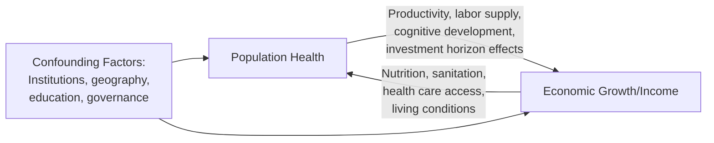
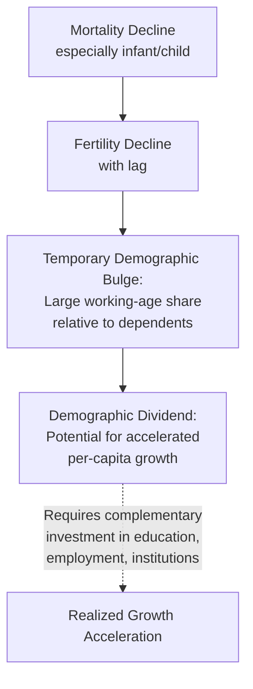

## Health and Economic Development Linkages

### Overview

The relationship between population health and economic development represents a foundational area of development economics, examining bidirectional causal pathways between health status and economic growth at both micro (individual/household) and macro (national) levels. Unlike much of health economics' focus on financing and delivery systems, this literature centers on health as both an input to and outcome of economic development, drawing on growth theory, human capital theory, and demographic economics to understand how disease burden, life expectancy, and health investment interact with income growth, productivity, and poverty dynamics.

### Theoretical Frameworks

#### Health as Human Capital

**Key Points**

- Building on Gary Becker and Michael Grossman's human capital framework, health is conceptualized as a form of **capital stock** that individuals invest in (through nutrition, health care, preventive behaviors) and that depreciates over time, directly analogous to education as human capital
- Health capital is theorized to affect economic outcomes through multiple channels: **direct productivity** (healthier workers produce more per hour worked), **labor supply** (better health enables greater labor force participation and fewer sick days), **cognitive development** (childhood health affects educational attainment and later-life cognitive/earning capacity), and **investment horizon effects** (longer expected lifespan increases returns to human capital investment, including education, potentially inducing higher savings and investment rates)
- The Grossman model formalizes health as demanded both for its direct utility value (consumption motive) and for its instrumental value in enabling market and non-market production (investment motive) — a framework extensively applied in both developed and developing country health economics research

#### Reverse Causality: Income as a Determinant of Health

**Key Points**

- Higher income enables greater investment in nutrition, sanitation, health care access, and living conditions, creating a well-documented positive income-health gradient observed both across countries and within countries across income levels
- This reverse pathway creates a fundamental **identification challenge** for empirically isolating health's causal effect on growth (distinct from growth's effect on health) — a challenge directly connecting this topic to the endogeneity and identification methods discussed in the Research Methods chapter of this material, since simple cross-country correlations between health indicators and GDP cannot distinguish the direction of causation or rule out confounding by other institutional/geographic factors affecting both

### Empirical Evidence on Health's Effect on Growth

#### Macro-Level Cross-Country Evidence

**Key Points**

- Early influential cross-country growth regressions (associated with work by researchers including Bloom, Canning, and Sevilla in the early 2000s) found positive associations between life expectancy/health indicators and subsequent economic growth, controlling for other standard growth determinants — interpreted as suggestive evidence that health improvements causally contribute to growth, though these cross-country regression approaches carry the standard endogeneity and omitted-variable concerns pervasive in cross-country growth empirics generally
- Subsequent methodological critique (notably work by Acemoglu and Johnson using life expectancy gains from the **international epidemiological transition** — global disease-control interventions like antibiotics and disease eradication campaigns beginning around the 1940s — as a plausibly exogenous source of health variation) produced more mixed findings regarding health's aggregate GDP-per-capita growth effect at the macro/national level, generating an active and somewhat unresolved debate in the literature [Inference — the Acemoglu-Johnson findings and subsequent debate represent a genuinely contested area in development economics, with some researchers emphasizing methodological concerns about the specific natural experiment used, and the overall macro-level causal magnitude remains actively debated rather than settled]
- A commonly proposed explanation for muted aggregate GDP-per-capita effects despite clear micro-level productivity benefits involves **population/demographic effects**: large mortality declines increase population size (and labor force size) substantially, which can offset per-capita income gains even when aggregate GDP and individual productivity both rise, complicating simple life-expectancy-to-GDP-per-capita inference [Inference — this demographic-offset explanation is one prominent interpretation among several offered in the literature to reconcile micro- and macro-level evidence]

#### Micro-Level Evidence

**Key Points**

- Micro-level and natural-experiment-based studies have generally found more consistent evidence for health's productivity effects, including studies of **deworming programs**, **malaria eradication campaigns**, and **early-life health interventions** showing measurable effects on later educational attainment, cognitive test scores, and labor market earnings
- The **fetal origins hypothesis** (associated with David Barker and subsequently extensively tested in economics, notably by Douglas Almond and others) posits that health conditions experienced in utero and in early childhood have long-lasting effects on adult health, cognitive development, and economic outcomes — supported by natural-experiment studies exploiting events like the 1918 influenza pandemic's effects on in-utero-exposed cohorts, famine exposure, and other early-life shocks
- This body of micro-evidence is generally considered more methodologically robust than early macro cross-country regressions, since it typically exploits more credible natural experiments or randomized interventions (directly connecting to the natural experiment and RCT methods discussed in the Research Methods chapter) [Inference — this relative methodological credibility assessment reflects a widely shared view among development economists regarding the strength of micro- vs. macro-level evidence in this specific literature]

### Key Empirical Channels and Mechanisms

#### Disease Burden and Labor Productivity

**Key Points**

- Major endemic diseases in developing-country contexts — malaria, HIV/AIDS, tuberculosis, neglected tropical diseases — impose substantial productivity costs through direct morbidity/mortality effects on the workforce, caregiver time diverted from productive activity, and reduced human capital investment (e.g., reduced school attendance during illness episodes)
- **Malaria eradication studies** represent one of the most extensively studied natural experiments in this literature, using the geographic and temporal variation in mid-20th-century malaria eradication campaigns (driven substantially by the availability of DDT and other interventions, providing plausibly exogenous variation unrelated to pre-existing regional economic trends) to estimate malaria's causal effect on subsequent economic outcomes, with studies generally finding positive effects on human capital and, in some studies, longer-run income effects [Unverified — specific quantitative effect sizes vary substantially across studies and geographic contexts and should be verified against the specific published literature for any precise figure]

#### Nutrition and Child Development

The **nutrition-productivity-poverty cycle** — where poor nutrition in childhood impairs cognitive and physical development, reducing future earning capacity and perpetuating poverty across generations — is extensively documented in the child development economics literature, with intervention studies (nutritional supplementation programs, deworming, conditional cash transfer programs with health/nutrition components) providing evidence on the returns to early-life health investment.

#### Health Shocks and Household Poverty Dynamics

**Key Points**

- At the household level, health shocks (illness, injury, death of a working-age household member) in developing-country contexts with limited insurance/social protection can trigger **poverty traps** through mechanisms including catastrophic out-of-pocket health spending, lost labor income during illness, and asset depletion/distress sale of productive assets (livestock, land) to cover health-related costs
- This connects to the broader development economics literature on household risk-coping mechanisms and the role of health insurance/microinsurance as a potential intervention to prevent health-shock-driven poverty transitions, an area of active field-experimental research (RCTs testing microinsurance uptake and its downstream welfare effects)

### Demographic Transition and the Health-Growth-Fertility Nexus

#### The Demographic Dividend

**Key Points**

- As mortality (particularly infant/child mortality) declines, fertility rates typically decline with a lag, producing a temporary demographic structure with a large working-age population relative to dependents — termed the **demographic dividend**, associated in growth-accounting studies with historical periods of accelerated economic growth in regions including East Asia during its rapid growth period
- This framework directly links population health improvements to economic growth through a demographic-structural channel distinct from the direct productivity channel discussed above, and has motivated substantial policy interest in family planning and health investment as complementary development strategies, particularly in current high-fertility, high-mortality regions (parts of Sub-Saharan Africa) where the demographic dividend has not yet been fully realized [Inference — the demographic dividend framework and its quantitative growth contribution estimates are an active area of demographic-economic research with some variation in estimated magnitudes across studies and regions]

### Policy Implications and Development Institution Frameworks

#### Health Investment as Development Strategy

**Key Points**

- International development institutions (World Bank, WHO, and various bilateral aid agencies) have historically framed health investment (immunization, maternal/child health, infectious disease control, health system strengthening) partly in economic-development terms, alongside the intrinsic human welfare rationale — reflected in frameworks like the WHO's Commission on Macroeconomics and Health (early 2000s) which explicitly argued for health investment as a growth-promoting strategy for low-income countries
- This economic framing has been influential in international health financing advocacy (e.g., justifying investment in disease-specific global health initiatives partly on economic productivity grounds alongside humanitarian rationale), though it has also drawn critique from some scholars concerned that instrumentalizing health primarily in economic-productivity terms can distort priority-setting away from health conditions with high welfare/mortality burden but comparatively less clear direct labor-productivity linkage (e.g., interventions for elderly, disabled, or non-working populations) [Inference — this critique represents a recognized position within development health policy discourse rather than a universally accepted conclusion]

#### Sustainable Development Goals Framing

Current global health-development policy substantially organizes around the UN Sustainable Development Goals framework, which frames health (SDG 3) as both an intrinsically valued outcome and instrumentally connected to poverty reduction (SDG 1), education (SDG 4), and economic growth (SDG 8) goals, reflecting the multidimensional health-development linkage this entry describes rather than treating health purely as either an end or a means.

### Practical Example

**Example**

Consider a stylized evaluation of a national malaria eradication campaign's economic effects, illustrating the methodological challenges this literature confronts:

- **Naive comparison**: comparing GDP growth in regions with historically high vs. low malaria burden after an eradication campaign would confound the malaria eradication effect with pre-existing regional differences in institutions, geography, and development trajectory that likely independently affected both malaria prevalence and growth potential
- **Natural experiment approach**: following the Malaria Atlas-style research design used in the literature, a researcher might exploit variation in pre-campaign malaria "ecology" (a measure of malaria transmission potential based on climate/environmental suitability, itself independent of historical economic conditions) interacted with the timing of a technology-driven eradication campaign (e.g., DDT availability), to isolate plausibly exogenous variation in malaria burden reduction
- **Interpretation**: even with a credible natural experiment, the researcher must consider whether estimated effects reflect direct productivity channels (healthier surviving workers), demographic channels (changed population/fertility structure), or human capital channels (improved childhood cognitive development among the birth cohorts exposed to reduced malaria risk in utero/early childhood) — each with different policy implications and requiring different downstream mechanism-testing approaches

**Behavioral disclaimer**: Specific quantitative estimates of health's effect on growth or income vary substantially across the cited literature depending on methodology, time period, and geographic context; this entry describes the conceptual and methodological landscape of this research area rather than asserting a single definitive quantitative relationship between health and economic development.

### Related Topics

- Natural experiments in health economics (methodological connection to malaria/epidemiological transition studies)
- Selection bias and endogeneity concerns (identification challenges in health-growth causality)
- Fetal origins hypothesis and early-life health interventions
- Demographic transition theory and the demographic dividend
- Health insurance and microinsurance in developing-country risk-coping contexts
- Global health financing institutions and disease-specific initiatives (Global Fund, Gavi)
- Human capital theory (Grossman model, Becker framework)
- Poverty traps and catastrophic health expenditure in low-income settings
- Sustainable Development Goals and multidimensional development frameworks