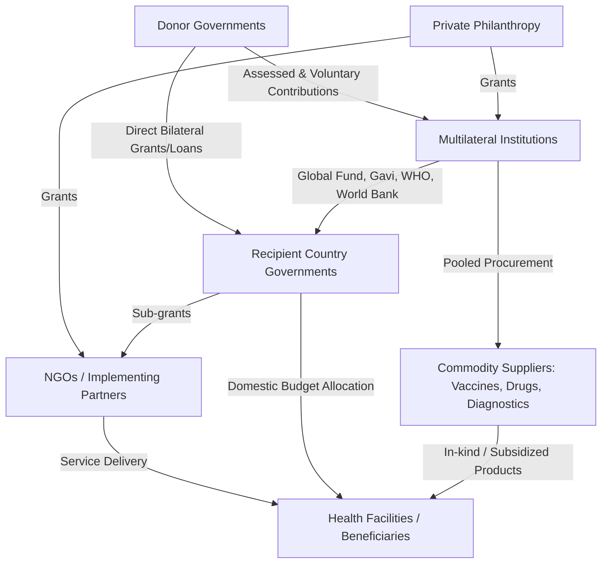

## Foreign Aid Financing for Global Health

### Definition and Scope

Foreign aid financing for global health refers to the cross-border transfer of resources—financial, in-kind, or technical—from donor governments, multilateral institutions, and private philanthropies to recipient countries or implementing agencies to fund health-related activities. This is formally tracked as **Development Assistance for Health (DAH)**, defined as all resources (grants and loans, in cash or in kind) transferred through international channels for the primary purpose of maintaining or improving health in low- and middle-income countries (LMICs).

DAH is distinct from domestic government health expenditure (DGHE) and from out-of-pocket (OOP) spending, and it is one of four major financing sources tracked in national health accounts alongside government, private insurance, and household spending.

### Core Actors and Channel Taxonomy

**Bilateral channels**: Direct government-to-government or government-to-implementer flows. The largest bilateral donor historically is the United States, primarily through USAID and the U.S. State Department (via PEPFAR), followed by the UK (FCDO, formerly DFID), Germany, and others.

**Multilateral channels**: Pooled-fund institutions that aggregate donor contributions and disburse based on their own governance rules.

- **The Global Fund to Fight AIDS, Tuberculosis and Malaria** — a financing mechanism (not an implementer) that channels grants to country-level principal recipients
- **Gavi, the Vaccine Alliance** — a public-private partnership subsidizing vaccine procurement and health system strengthening for immunization
- **WHO** — funded through assessed contributions (mandatory, based on a country's ability to pay) and voluntary contributions (increasingly dominant, now the majority of WHO's budget)
- **World Bank (IDA/IBRD)** — health financing largely through concessional loans and credits rather than grants
- **UNITAID, UNFPA, UNICEF** — specialized mandates (drug/diagnostic market shaping, reproductive health, child health)

**Private philanthropic channels**: The Bill & Melinda Gates Foundation is the largest private funder of global health, operating with an endowment-driven model distinct from taxpayer-funded bilateral/multilateral flows.

**NGO/CSO implementing channels**: International NGOs (e.g., PATH, PSI, MSF) and local civil society organizations often serve as the final disbursement layer, converting donor funds into service delivery.

### Financing Instruments

| Instrument | Mechanism | Typical Use |
| --- | --- | --- |
| Grants | Non-repayable transfers | Majority of DAH; disease-specific programs |
| Concessional loans | Below-market interest, long maturities | World Bank IDA health system loans |
| Debt-for-health swaps | Debt forgiveness conditional on health spending | Debt-burdened LMICs |
| Results-Based Financing (RBF) / Pay-for-Performance | Disbursement tied to verified outputs | Maternal/child health, immunization coverage targets |
| Advance Market Commitments (AMCs) | Guaranteed future purchase volume to de-risk R&D/manufacturing | Pneumococcal vaccine AMC, COVID-19 vaccine AMCs |
| Volume guarantees / pooled procurement | Aggregated demand to lower unit price | Global Fund and Gavi commodity purchasing |
| In-kind transfers | Direct commodity donation (drugs, vaccines, PPE) | Pharma donation programs (e.g., Mectizan for onchocerciasis) |

### Economic Rationale

**Market failure justification**: Global health aid is theoretically justified by the presence of **global public goods** (disease surveillance, pandemic preparedness, R&D for neglected diseases) and **cross-border externalities**—an infectious disease outbreak in one country imposes costs on others, meaning underinvestment by the affected country alone is economically rational from its own narrow perspective but globally suboptimal.

**Neglected disease R&D gap**: Diseases concentrated in poor populations generate limited commercial return, producing a market failure in pharmaceutical R&D investment. This is often termed the "10/90 gap"—historically, only roughly 10% of global health R&D spending targeted diseases responsible for roughly 90% of the global disease burden. [Inference] The magnitude of this gap has narrowed somewhat since the estimate's original popularization but the underlying incentive misalignment persists as a structural feature of pharmaceutical markets.

**Fungibility problem**: A central critique in aid economics. When aid targets a specific sector (e.g., HIV/AIDS), a recipient government may reduce its own domestic budget allocation to that sector by a similar amount and reallocate the freed domestic resources elsewhere—including to non-health spending. Empirical studies of health aid fungibility have found mixed but non-trivial displacement effects, meaning the marginal impact of an aid dollar can be smaller than its face value.

**Dutch disease-like effects on health systems**: Large, disease-specific vertical funding flows can distort local labor markets by drawing health workers away from general government primary care into better-funded, donor-supported vertical programs (sometimes called "brain drain within countries" or internal brain drain).

### Vertical vs. Horizontal (Diagonal) Financing Debate

**Vertical (disease-specific) financing**: Funds are earmarked for a single disease or intervention (e.g., PEPFAR for HIV, the Global Fund's TB grants). Advantages include measurable outcomes, donor accountability, and rapid scale-up. Disadvantages include fragmentation, parallel supply chains/reporting systems, and health system distortion.

**Horizontal (health systems strengthening) financing**: Funds build general system capacity—health workforce, financing systems, supply chain infrastructure—benefiting all disease areas simultaneously. Advantages include sustainability and system resilience; disadvantages include harder attribution of outcomes to specific donor investments, which is politically less attractive to results-oriented legislatures.

**Diagonal approach**: A synthesis strategy (associated with economists including Julio Frenk) using disease-specific funding platforms to simultaneously build cross-cutting system capacity—e.g., using HIV funding to strengthen laboratory networks and supply chains that also serve other conditions.

### Measurement and Tracking Frameworks

**IHME's DAH database**: The Institute for Health Metrics and Evaluation (University of Washington) publishes the most widely cited annual estimate of global DAH flows, disaggregated by source, channel, health focus area (HIV, TB, malaria, MNCH, NCDs, etc.), and recipient region.

**OECD DAC Creditor Reporting System (CRS)**: Tracks Official Development Assistance (ODA) flows reported by OECD Development Assistance Committee members, using purpose codes to classify health-sector spending.

**Health Aid Effectiveness metrics**: Frameworks derived from the Paris Declaration on Aid Effectiveness (2005) and the Busan Partnership (2011) established principles—country ownership, alignment with recipient systems, harmonization across donors, managing for results, and mutual accountability—used to evaluate whether aid modalities strengthen or bypass recipient government systems.

### Key Formulas and Analytical Concepts

**DAH per capita** (basic equity/allocation metric):

$$\text{DAH per capita} = \frac{\text{Total DAH received}}{\text{Population}}$$

**Aid dependency ratio** (fiscal sustainability indicator):

$$\text{Health aid dependency} = \frac{\text{DAH}}{\text{Total Health Expenditure (THE)}} \times 100$$

Countries with a ratio exceeding roughly 20–30% are generally considered highly aid-dependent for health financing, raising sustainability concerns as donor priorities shift.

**Fungibility-adjusted marginal impact** [Inference — stylized illustrative model, not a standardized official formula]:

$$\text{Effective marginal aid} = \text{DAH} \times (1 - \phi)$$

where $\phi$ represents the fungibility displacement coefficient (the fraction of aid offset by reduced domestic allocation), empirically estimated in specific country-sector studies rather than a fixed universal constant.

**Cost-effectiveness threshold applied to aid allocation** (standard health economics tool used by funders like the Global Fund and Gavi to prioritize interventions):

$$\text{ICER} = \frac{C_2 - C_1}{E_2 - E_1}$$

where $C$ is cost and $E$ is effect (often DALYs averted), compared against a willingness-to-pay threshold (historically referenced against GDP-per-capita multiples, though this heuristic—the WHO-CHOICE 1–3× GDP rule—has been substantially critiqued and de-emphasized in current guidance).

### Structural Flow Diagram

### Historical Trajectory and Major Financing Eras

**1990s–2000: Pre-scale-up era.** DAH was relatively low and diffuse, focused on child survival and family planning (post-Alma-Ata primary health care emphasis had waned).

**2000–2010: The scale-up era.** Coincided with Millennium Development Goal 6 (combat HIV/AIDS, malaria, and other diseases), the creation of the Global Fund (2002), Gavi (2000), and PEPFAR (2003). DAH roughly quadrupled over this period, driven heavily by HIV/AIDS financing.

**2010–2019: Plateau era.** Post-2008 financial crisis fiscal constraints in donor countries slowed DAH growth; funding increasingly concentrated on existing vertical programs rather than new system-building investments.

**2020–2022: COVID-19 surge.** Unprecedented mobilization for pandemic response, vaccine development (Operation Warp Speed-adjacent mechanisms), and the COVAX Facility (co-led by Gavi, CEPI, and WHO) for equitable vaccine access.

**2023–present: Contraction and geopolitical realignment.** [Unverified — rapidly evolving policy landscape] Major bilateral donors have signaled or enacted substantial reductions to global health aid budgets, most notably U.S. foreign assistance restructuring in 2025 affecting USAID-administered programs including PEPFAR. This has triggered active debate in the field about "transition financing," domestic resource mobilization, and diversification away from aid dependency. Given the fast-moving nature of these policy changes, current-year figures should be verified against IHME, KFF, or OECD DAC primary sources rather than relied upon from static training data.

### Practical Example: Grant Flow Walkthrough (Global Fund Model)

**Key Points:**

1. Donor countries pledge funds during a multi-year "replenishment" cycle (e.g., 3-year cycles)
2. The Global Fund Secretariat allocates country envelopes using a formula weighting disease burden and country income level
3. Country Coordinating Mechanisms (CCMs)—multi-stakeholder national bodies including government, civil society, and affected communities—submit funding requests
4. A Technical Review Panel assesses requests for technical/economic soundness
5. Approved grants are disbursed to a Principal Recipient (often a Ministry of Health or an international NGO)
6. Funds cascade to Sub-Recipients for service delivery
7. A Local Fund Agent independently verifies financial and programmatic reporting before subsequent disbursement tranches are released

This tranche-based, performance-verified structure is a design response to the principal-agent and moral hazard problems inherent in cross-border aid financing, where the donor (principal) cannot directly observe recipient (agent) effort or fund use.

### Common Critiques and Reform Debates

**Key Points:**

- **Sustainability/transition risk**: Countries graduating from low-income to middle-income status often lose aid eligibility (e.g., Gavi's co-financing and transition policy) before domestic revenue can fully replace donor funding, creating a "funding cliff."
- **Conditionality and policy space**: Aid tied to policy conditions (structural adjustment-era conditionality, procurement restrictions like the historical U.S. Mexico City Policy affecting reproductive health funding) can constrain recipient sovereignty over health priorities.
- **Tied aid**: Some bilateral aid requires procurement of donor-country goods/services, reducing cost-effectiveness compared to untied, competitively procured alternatives.
- **Transaction costs of fragmentation**: Recipient ministries of health often manage dozens of parallel donor reporting requirements, reducing administrative capacity for actual service delivery (documented extensively in aid effectiveness literature).
- **Domestic Resource Mobilization (DRM) as the proposed alternative**: Increasing emphasis on strengthening recipient tax systems, health insurance schemes (e.g., National Health Insurance models), and earmarked "sin taxes" (tobacco/alcohol excise) to reduce long-run aid dependency.

**Next Steps:**

- Development Assistance for Health (DAH) measurement methodology and IHME modeling approach
- Global Fund and Gavi replenishment mechanics and country allocation formulas
- Health system strengthening vs. vertical program financing (diagonal approach in depth)
- Domestic resource mobilization and health insurance scheme design in LMICs
- Aid fungibility empirical literature and public finance displacement effects
- COVAX Facility structure and lessons from pandemic-era pooled procurement
- Debt-for-health swaps and innovative development finance instruments
- Political economy of foreign aid budget cuts and transition financing strategies