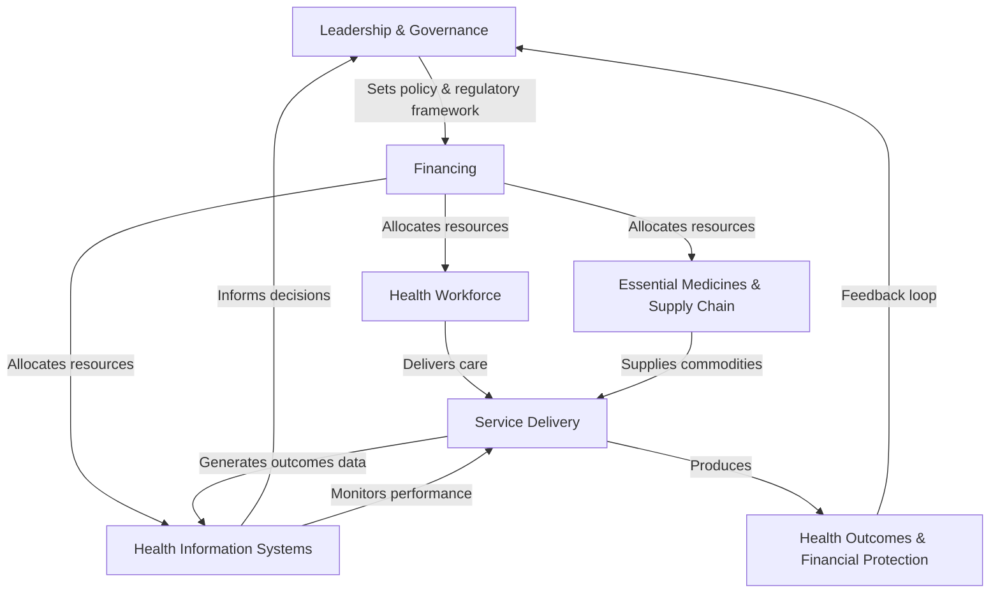

## Health System Strengthening in Low- and Middle-Income Countries

### Definition and Conceptual Foundations

Health System Strengthening (HSS) refers to any array of initiatives and strategies that improve one or more of the functions of a health system, leading to better health outcomes, financial protection, and responsiveness through sustained improvements across financing, workforce, information, governance, service delivery, and access to medicines. The term is distinguished from narrower "health system support," which typically refers to inputs for a single disease program rather than cross-cutting system capacity.

The dominant analytical scaffolding is the **WHO Health System Building Blocks framework** (2007), which decomposes a health system into six interacting components.

### WHO Health System Building Blocks

| Building Block | Core Function | Example Indicators |
| --- | --- | --- |
| Service delivery | Effective, safe, quality personal and non-personal health interventions | Facility density, service availability, quality-of-care scores |
| Health workforce | Sufficient, competent, responsive, productive health workers | Health worker density per 1,000 population, skill mix, attrition rate |
| Health information systems | Production, analysis, dissemination, use of reliable data | DHIS2 coverage, civil registration completeness, timeliness of reporting |
| Access to essential medicines | Equitable access to safe, quality, affordable medical products | Stockout rates, essential medicines list adherence |
| Financing | Adequate funds, financial protection, efficient/equitable pooling | Government health expenditure as % of GDP, out-of-pocket share, catastrophic health expenditure incidence |
| Leadership/governance | Strategic policy frameworks, oversight, accountability, regulation | Existence of national health sector strategy, regulatory body functionality |

**Key Points:**

- The building blocks framework is explicitly relational: strengthening one block in isolation (e.g., training more health workers without financing to employ them) produces limited system-level gains
- The framework has been critiqued for being overly input-focused rather than outcome-focused, prompting complementary frameworks emphasizing system "hardware" (blocks) versus "software" (values, relationships, power, trust among actors)

### Economic Rationale for HSS Investment

**Public goods and positive externalities**: A functioning health information system or a trained epidemiological workforce generates benefits (outbreak detection, disease surveillance) that extend beyond any single patient encounter, exhibiting classic public-good, non-excludable characteristics that justify public/donor financing over pure market provision.

**Economies of scope and shared infrastructure**: A single strengthened supply chain, laboratory network, or health information system serves multiple disease programs simultaneously, lowering marginal cost per program compared to maintaining parallel vertical systems—the central economic argument against fragmented vertical financing (see prior module on foreign aid financing).

**Absorptive capacity constraint**: A recurring finding in development economics is that injecting financial capital into a health system without corresponding investment in workforce, management capacity, and infrastructure yields diminishing or even negative marginal returns—systems have a finite capacity to productively "absorb" additional funding in the short run. [Inference] This absorptive capacity ceiling is context-specific and empirically difficult to estimate precisely for any given country-year, though the qualitative phenomenon is well documented in aid effectiveness literature.

**Human capital theory application**: Investment in health workforce training is modeled analogously to Becker's human capital framework—training expenditure is treated as an investment yielding a future stream of productivity returns (patients treated, services delivered), discounted against training cost and the risk of workforce attrition/emigration.

### Financing Modalities for HSS

**Sector-Wide Approaches (SWAps)**: Donors pool contributions into a single basket fund aligned with a government-led national health sector strategy, using government financial management and procurement systems rather than parallel donor-specific systems. This directly targets the fragmentation critique of vertical aid.

**Program-Based Budget Support / General Budget Support**: Funds flow directly into government treasury accounts without health-sector earmarking, maximizing recipient ownership but reducing donor traceability of health-specific impact—a direct tradeoff against fungibility risk (see foreign aid financing module).

**Global Financing Facility (GFF)**: A World Bank-hosted mechanism specifically designed to catalyze increased domestic financing for reproductive, maternal, newborn, child, and adolescent health, using a relatively small grant as a lever to unlock larger IDA/IBRD financing and domestic budget commitments.

**Results-Based Financing for systems (not just services)**: Disbursement linked to system-level performance indicators (e.g., improvements in health information system data completeness, reductions in stockout rates) rather than only clinical service outputs.

### Analytical Formulas and Metrics

**Health worker density threshold** (WHO benchmark, historically referenced from the 2006 World Health Report and revised under SDG-era universal health coverage targets):

$$\text{Health worker density} = \frac{\text{Physicians} + \text{Nurses} + \text{Midwives}}{\text{Population (in thousands)}}$$

A commonly cited SDG-era threshold is approximately 4.45 skilled health workers per 1,000 population as a minimum associated with adequate coverage of essential health services, though this figure has been revised across different WHO publications and should be verified against current WHO Global Health Workforce Statistics for precise current benchmarks. [Unverified — exact current threshold value]

**Universal Health Coverage (UHC) Service Coverage Index**: A composite index (0–100) built from tracer indicators across four domains—reproductive/maternal/newborn/child health, infectious disease, non-communicable disease, and service capacity/access—used by WHO and the World Bank to monitor UHC progress, a core HSS outcome target under SDG 3.8.

**Catastrophic health expenditure incidence** (financial protection indicator, a core HSS financing-block outcome):

$$\text{Catastrophic incidence} = \frac{\text{Households with OOP health spending} > 10\% \text{ of total consumption}}{\text{Total households}} \times 100$$

(The 10% threshold is a WHO/World Bank standard convention; a stricter 25% threshold is also used in comparative studies.)

**System efficiency ratio** (simplified illustrative construct linking inputs to outputs) [Inference — a general production-function framing, not a single standardized official metric]:

$$\text{Technical efficiency} = \frac{\text{Health outcomes achieved (e.g., DALYs averted)}}{\text{Total health system inputs (financial + workforce + infrastructure)}}$$

In applied health economics, this is typically operationalized through **Data Envelopment Analysis (DEA)** or **Stochastic Frontier Analysis (SFA)**, both of which benchmark a country or facility's observed input-output combination against an empirically estimated efficient frontier constructed from peer comparators.

### System Interaction Diagram

### Common Implementation Strategies

**Key Points:**

- **Task-shifting/task-sharing**: Reassigning specific clinical tasks from higher-cadre to lower-cadre health workers (e.g., nurse-initiated antiretroviral therapy, community health worker-delivered basic diagnostics) to address workforce shortages cost-effectively — extensively used in sub-Saharan African HIV programs
- **Community Health Worker (CHW) programs**: Formalizing lay health workers as a paid or stipended cadre extends service delivery reach into underserved areas at lower marginal cost than facility-based staff, though sustainability depends on integration into formal financing streams rather than donor-project-based stipends
- **Digital health information systems**: Platforms like DHIS2 (District Health Information Software 2) have become a de facto global standard for routine health information system data aggregation across dozens of LMICs, enabling subnational performance monitoring
- **Supply chain integration/"one system" approaches**: Consolidating previously disease-siloed logistics (separate HIV, TB, malaria, and essential medicines supply chains) into unified national logistics management information systems (LMIS) to reduce redundant warehousing, transport, and stockout risk
- **Public Financial Management (PFM) reform**: Strengthening budget execution capacity (the ability of a Ministry of Health to actually spend allocated funds through the fiscal year) is frequently a binding constraint distinct from the nominal budget allocation itself

### Measurement Challenges

**Attribution problem**: Because HSS investments are cross-cutting by design, isolating the causal contribution of a specific systems investment (e.g., a health information system upgrade) to a downstream outcome (e.g., reduced maternal mortality) is methodologically difficult, complicating donor results-reporting relative to vertical, single-disease programs with clearer attribution chains.

**Time-lag problem**: System-level investments (workforce training pipelines, governance reform, information system maturation) often show measurable outcome effects only after multi-year lags, creating tension with typical donor funding cycles of 3–5 years and electoral/budgetary cycles in donor countries favoring shorter-horizon, higher-visibility interventions.

**Composite indicator sensitivity**: Indices like the UHC Service Coverage Index or system efficiency scores are sensitive to the choice of tracer indicators and weighting methodology, meaning cross-country rankings can shift meaningfully under alternative but equally defensible methodological choices. [Inference] This is a general property of composite index construction in the social sciences rather than a criticism unique to any specific HSS index.

### Practical Example: Task-Shifting Cost-Effectiveness Walkthrough

**Example:**

A Ministry of Health is deciding whether to task-shift routine hypertension management from physicians to trained nurses at primary care facilities.

1. **Baseline cost per physician-managed patient-year**: Includes physician salary allocation, facility overhead, and referral costs
2. **Task-shifted cost per nurse-managed patient-year**: Lower wage-bill component, plus one-time training investment amortized over expected nurse tenure
3. **Quality-adjustment check**: Requires clinical evidence (typically from supervised task-shifting trials) confirming non-inferior blood pressure control outcomes under nurse-led management
4. **Incremental Cost-Effectiveness Ratio (ICER)** is calculated comparing the two staffing models against a DALYs-averted or blood-pressure-control outcome, using the standard ICER formula introduced in the foreign aid financing module
5. **Workforce supply constraint check**: Feasibility also depends on nurse workforce density and training pipeline capacity — a "financing solved but workforce constrained" scenario is common in HSS planning, illustrating the building-blocks interdependency principle

### Next Steps

**Related Topics:**

- WHO Health System Building Blocks framework — original 2007 policy documentation and subsequent critiques
- Universal Health Coverage (UHC) financing strategies and the UHC Service Coverage Index methodology
- DHIS2 architecture and digital health information system implementation
- Sector-Wide Approaches (SWAps) versus project-based aid modalities
- Data Envelopment Analysis (DEA) and Stochastic Frontier Analysis (SFA) for health system efficiency measurement
- Community Health Worker program financing and sustainability models
- Public Financial Management (PFM) reform in ministries of health
- Global Financing Facility (GFF) structure and catalytic financing model
- Health workforce migration ("brain drain") economics and bilateral workforce agreements