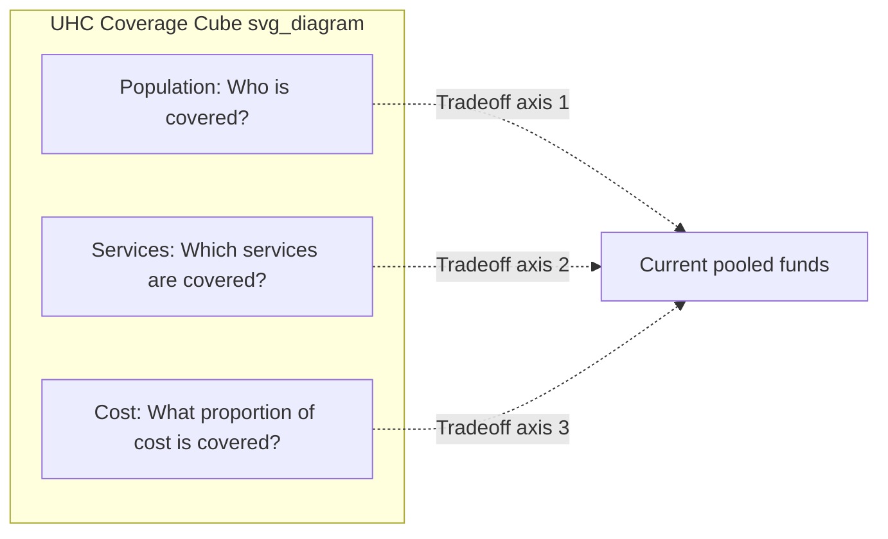
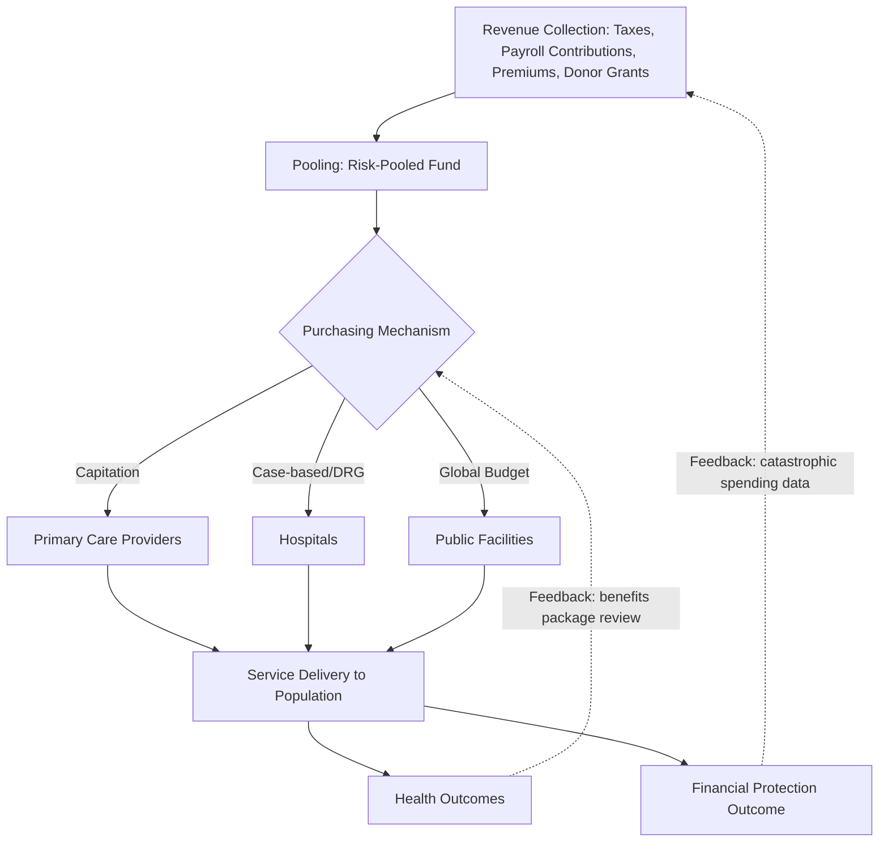

## Universal Health Coverage in Developing Economies

### Definition and Formal Framing

Universal Health Coverage (UHC) is defined by WHO as ensuring that all people have access to the full range of quality health services they need, when and where they need them, without financial hardship. UHC is codified as Sustainable Development Goal target 3.8, tracked through two co-equal official indicators: SDG 3.8.1 (coverage of essential health services) and SDG 3.8.2 (population with catastrophic health spending).

**Key Points:**

- UHC is not a single program or benefit package but a policy goal describing a *direction* of health system reform, applicable across financing, service delivery, and governance simultaneously
- UHC explicitly comprises two intertwined objectives: service coverage (breadth/depth/quality of care available) and financial protection (freedom from impoverishing or catastrophic health spending)
- "Universal" refers to population coverage, not necessarily unlimited service coverage — every UHC scheme in practice defines some bounded benefits package

### The UHC Cube Framework

The canonical analytical device for conceptualizing UHC tradeoffs is the **three-dimensional coverage cube**, introduced in the WHO 2010 World Health Report, representing the core policy tradeoff space governments navigate when expanding coverage under a fixed resource envelope.

The central policy insight is that with a fixed pool of prepaid funds, governments must sequence expansion across three axes — extending population breadth, expanding the service benefits package, or reducing cost-sharing/co-payments — and expanding aggressively along one axis typically requires constraining progress on the other two in the near term. Most successful UHC reform pathways (documented in Thailand, Rwanda, and Mexico's Seguro Popular) expanded population breadth first, using a defined-but-limited benefits package, before progressively deepening the benefits package and reducing cost-sharing as fiscal space grew.

### Financing Architecture Options

| Model | Pooling Mechanism | Revenue Source | LMIC Examples |
| --- | --- | --- | --- |
| Tax-funded National Health Service | Single national pool, general government budget | General taxation | Sri Lanka, Botswana (largely tax-funded) |
| Social Health Insurance (SHI) | Payroll-contribution-linked scheme, often multiple funds | Employer/employee payroll contributions | Ghana's NHIS, Vietnam's SHI |
| Community-Based Health Insurance (CBHI) | Voluntary, localized risk pools | Member premiums, often subsidized | Rwanda's Mutuelles de Santé (transitioning to mandatory) |
| Hybrid/mixed models | Multiple pools merged or coordinated via a purchasing agency | Mixed tax + contributory + donor | Thailand's Universal Coverage Scheme, Indonesia's JKN |

**Key Points:**

- **Pooling** (aggregating financial risk across a population so healthy/sick and rich/poor cross-subsidize each other) is the central economic function distinguishing UHC financing from simple fee-for-service or voluntary private insurance, which fragment risk pools and undermine redistribution
- Voluntary, contributory schemes (like early-stage CBHI) face **adverse selection**: individuals with higher expected health costs disproportionately enroll, driving up average claims cost and premiums, which can trigger a downward enrollment spiral — a core rationale for eventually mandating enrollment or subsidizing premiums for informal-sector/low-income populations
- Fragmented multi-fund systems (separate schemes for formal-sector employees, informal-sector workers, and the poor) tend to replicate inequities across pools unless a **risk-equalization mechanism** redistributes funds from lower-risk to higher-risk pools

### Purchasing Mechanisms and Provider Payment

**Strategic purchasing** — the active, evidence-based allocation of pooled funds to providers based on population health needs and provider performance, as opposed to passive reimbursement of whatever costs are incurred — is considered a critical UHC financing lever, operating through the choice of provider payment mechanism.

| Payment Mechanism | Incentive Direction | Common LMIC Application |
| --- | --- | --- |
| Fee-for-service | Incentivizes service volume (potential overprovision) | Historically dominant in weakly regulated systems |
| Capitation | Fixed payment per enrolled patient, incentivizes cost containment (potential underprovision risk) | Thailand's UCS primary care payment |
| Case-based/DRG payment | Fixed payment per diagnosis-related case, incentivizes efficiency per episode | Increasingly piloted in middle-income countries (e.g., Indonesia's INA-CBG) |
| Global budget | Fixed total budget for a facility/period, incentivizes cost control | Hospital-level budgeting in several tax-funded systems |
| Pay-for-Performance (P4P) | Bonus payments tied to quality/output metrics | Rwanda's P4P scheme for maternal/child health |

### Key Formulas and Metrics

**UHC Service Coverage Index (SDG 3.8.1)**: A composite index constructed as the geometric mean of coverage across four service categories (reproductive/maternal/newborn/child health; infectious disease; non-communicable disease; service capacity/access), each itself an average of multiple tracer indicators:

$$\text{SCI} = \sqrt[4]{I_1 \times I_2 \times I_3 \times I_4}$$

where $I_1$ through $I_4$ represent the four category sub-indices (each scaled 0–100). The geometric mean is deliberately used rather than an arithmetic mean because it penalizes severe imbalance across categories more heavily — a country cannot compensate for near-zero performance in one domain through high performance in another.

**Catastrophic health expenditure** (SDG 3.8.2, financial protection indicator):

$$\text{Catastrophic OOP} = \frac{\text{OOP health spending}}{\text{Total household consumption (or income)}} > \text{threshold} (10\% \text{ or } 25\%)$$

**Impoverishing health expenditure**: A related but distinct financial protection metric measuring households pushed below (or further below) a national or international poverty line specifically due to out-of-pocket health payments, typically assessed against the World Bank's $1.90 or $3.20/day international poverty lines (thresholds periodically revised — current figures should be verified against the latest World Bank poverty line updates). [Unverified — exact current threshold values]

**Fiscal space for health** (a constraint analysis central to UHC financing planning):

$$\text{Fiscal space} = \Delta(\text{Government health budget}) - \Delta(\text{Health system cost pressures})$$

Government health budget growth can derive from (a) economic growth expanding the overall tax base, (b) reprioritization of health within the government budget, (c) sector-specific revenue (e.g., earmarked "sin taxes"), (d) grants/aid, or (e) more efficient/less wasteful spending of existing resources — the standard IMF/WHO five-source fiscal space taxonomy used in UHC costing exercises.

### System-Level Flow Diagram

### Country Case Patterns

**Key Points:**

- **Thailand's Universal Coverage Scheme (2002)**: Achieved near-universal population coverage rapidly using general tax revenue and capitation-based primary care payment; frequently cited as a canonical LMIC UHC success case due to its speed and subsequent financial protection gains
- **Rwanda's Mutuelles de Santé**: Began as voluntary community-based health insurance with donor co-financing, later transitioning toward mandatory enrollment with income-tiered premiums, illustrating the CBHI-to-mandatory-SHI transition pathway
- **Ghana's National Health Insurance Scheme (NHIS)**: A social health insurance model funded substantially through a VAT-linked levy rather than pure payroll contributions, addressing the informal-sector contribution collection challenge common in LMIC payroll-based SHI designs
- **Indonesia's Jaminan Kesehatan Nasional (JKN)**: One of the largest single-payer UHC schemes globally by population, illustrating both the scale-achievability of UHC in a large, diverse middle-income economy and the persistent challenge of achieving full informal-sector enrollment compliance

### Persistent Implementation Challenges in LMICs

**Key Points:**

- **Informal sector enrollment**: The largest structural obstacle to contributory financing models in LMICs, since informal-sector workers (often the majority of the workforce) lack a payroll mechanism for automatic premium deduction, typically requiring either general-tax cross-subsidy or difficult-to-enforce voluntary contribution collection
- **Supply-side readiness gap**: Expanding financial coverage without corresponding health system capacity (workforce, facility density, medicine availability — directly linking to the HSS building blocks) risks generating "coverage without access," where enrolled populations nominally have insurance but cannot obtain timely quality care
- **Benefits package rationing methodology**: Defining what is included in a UHC benefits package requires explicit priority-setting, commonly informed by cost-effectiveness analysis (ICERs against a willingness-to-pay threshold) and increasingly by structured Health Technology Assessment (HTA) processes adapted from high-income country frameworks to LMIC resource constraints
- **Political economy of expansion sequencing**: Politically, population coverage expansion (visible, popularly salient) is often prioritized ahead of the less visible task of deepening the benefits package or reducing residual co-payments, which can produce a persistent gap between nominal and effective coverage — a pattern flagged extensively in UHC monitoring literature

### Practical Example: Benefits Package Prioritization Exercise

**Example:**

A Ministry of Health with a fixed UHC fund must decide whether to add a new intervention to its Essential Health Benefits Package.

1. **Estimate intervention cost** per beneficiary (drug/device cost, delivery cost, administrative overhead)
2. **Estimate health effect** in DALYs averted (a standard universal effectiveness metric enabling cross-intervention comparison)
3. **Calculate ICER**: $\text{ICER} = \frac{\text{Cost}}{\text{DALYs averted}}$
4. **Compare against country-specific cost-effectiveness threshold**: Increasingly derived from empirical opportunity-cost estimation (what health is displaced elsewhere in the system by funding this intervention) rather than the older, now largely discredited 1–3× GDP-per-capita WHO-CHOICE heuristic
5. **Budget impact analysis**: Even a cost-effective intervention (favorable ICER) may be fiscally infeasible if aggregate budget impact (cost × expected population uptake) exceeds available fiscal space — a distinct constraint from cost-effectiveness alone
6. **Equity screen**: Many LMIC HTA processes now incorporate an explicit equity-weighting or distributional-impact check alongside pure cost-effectiveness, reflecting UHC's dual mandate of efficiency and equity

### Next Steps

**Related Topics:**

- WHO UHC Coverage Cube — original 2010 World Health Report framing and subsequent refinements
- Social Health Insurance design: contribution collection mechanisms for informal-sector workers
- Health Technology Assessment (HTA) institutionalization in LMICs (e.g., Thailand's HITAP, India's HTAIn)
- Strategic purchasing and provider payment reform sequencing
- Risk-equalization mechanisms across fragmented multi-fund insurance systems
- Fiscal space analysis methodology for health financing (IMF/WHO five-source taxonomy)
- Catastrophic and impoverishing health expenditure measurement methodology (SDG 3.8.2)
- Political economy of UHC reform sequencing and benefits package expansion
- Sin taxes (tobacco/alcohol/sugar-sweetened beverage excise) as earmarked UHC revenue sources