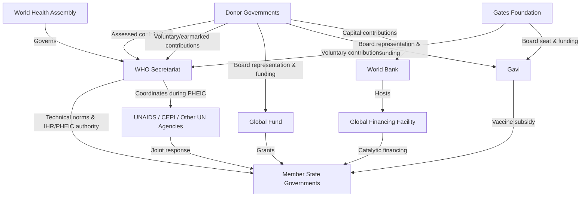

## Global Health Governance and Multilateral Institutions

### Definition and Scope

Global health governance (GHG) refers to the formal and informal institutions, rules, norms, and decision-making processes through which state and non-state actors collectively manage transboundary health risks and coordinate cross-border health action. It encompasses treaty law (e.g., the International Health Regulations), intergovernmental organizations, public-private partnerships, and the increasingly dense network of non-state actors (philanthropies, NGOs, private industry) that now shape global health policy alongside states.

**Key Points:**

- GHG is a subset of the broader field of global governance, distinguished by health's unique status as simultaneously a human right (under international law), a determinant of economic productivity, and a source of transboundary security externalities (pandemic risk)
- The field has shifted from a state-centric "international health" model (bilateral, WHO-centered cooperation) toward a "global health" model characterized by a much larger and more fragmented set of actors — described in the literature as a shift toward "global health governance complexity" or a "crowded landscape"

### Core Legal and Institutional Architecture

**The World Health Organization (WHO)**: The constitutionally mandated directing and coordinating authority on international health work within the UN system, governed by the World Health Assembly (WHA), where each of WHO's 194 member states holds one vote regardless of financial contribution size.

**International Health Regulations (IHR, 2005)**: A legally binding instrument under international law obligating member states to develop core surveillance and response capacities and to report events that may constitute a Public Health Emergency of International Concern (PHEIC). The IHR represents the primary binding legal architecture for global infectious disease governance, though state compliance and enforcement mechanisms have been persistently critiqued as weak, since the IHR contains no meaningful sanction mechanism for non-compliance.

**Public Health Emergency of International Concern (PHEIC)**: The WHO Director-General's formal declaration mechanism, made on the advice of an Emergency Committee, signaling that an event constitutes a serious, unusual/unexpected public health risk requiring a coordinated international response. PHEIC declarations (Ebola, Zika, COVID-19, mpox) function as the primary international legal trigger for coordinated global response, though the declaration itself carries no binding enforcement power over member state actions.

**WHO Pandemic Agreement**: [Unverified — recent and evolving instrument] A negotiated instrument developed in the years following the COVID-19 pandemic intended to strengthen international pandemic prevention, preparedness, and response commitments, including provisions on pathogen access and benefit-sharing. Given the fast-moving negotiation and ratification status of this instrument, current adoption status and specific provisions should be verified against current WHO and news sources rather than relied upon from training data.

### Financing Architecture of WHO

**Key Points:**

- **Assessed contributions**: Mandatory dues from member states, calculated on a formula linked to a country's share of global GNI (via the UN scale of assessments), historically the core of WHO's budget but now a minority share
- **Voluntary contributions**: Discretionary funding from member states, philanthropies (notably the Gates Foundation, historically among WHO's largest single funders), and other partners, now constituting the majority of WHO's operating budget
- This financing structure has been widely analyzed as creating a **structural governance tension**: because voluntary contributions are frequently earmarked for donor-specified priorities/programs, WHO's *de facto* programmatic priorities are shaped disproportionately by its largest voluntary donors rather than by the one-country-one-vote WHA governance structure nominally directing the organization — a core critique in the global health governance literature regarding donor influence and organizational independence

### Multilateral Institution Taxonomy

| Institution | Governance Model | Primary Function | Funding Mechanism |
| --- | --- | --- | --- |
| WHO | UN specialized agency, WHA one-country-one-vote | Norm-setting, technical guidance, IHR/PHEIC authority | Assessed + voluntary contributions |
| World Bank | Weighted voting (shareholding-based) | Concessional lending, GFF hosting, health system financing | Donor capital + IDA/IBRD lending returns |
| Global Fund | Board with donor/implementer/civil-society representation | Grant financing for HIV/TB/malaria | Donor replenishment pledges |
| Gavi | Board with public-private representation (donors, industry, WHO, UNICEF, civil society, Gates Foundation) | Vaccine market shaping and procurement subsidy | Donor pledges + IFFIm bond financing |
| UNAIDS | Joint UN Programme, cosponsor governance model | HIV/AIDS coordination across 11 UN cosponsor agencies | Assessed cosponsor contributions + voluntary |
| CEPI (Coalition for Epidemic Preparedness Innovations) | Independent foundation, donor/scientific board | Vaccine R&D for epidemic preparedness | Donor government + philanthropic contributions |

**Public-private partnership (PPP) governance model**: Institutions like Gavi and the Global Fund are structurally distinct from classical UN agencies in that their governing boards formally include private-sector and civil-society voting representation alongside state donors — a governance innovation designed to bring private-sector efficiency and resource mobilization into public health financing, while raising distinct accountability questions about non-state actor influence over public health priority-setting.

### Institutional Relationship Map

### Economic and Political Economy Analysis of GHG

**Collective action problem framing**: Global health governance is frequently modeled through the lens of international relations collective action theory — because pandemic preparedness and disease surveillance generate benefits that are non-excludable and non-rivalrous across borders (a global public good), individual states face an incentive to under-invest in their own surveillance/response capacity while free-riding on the presumed capacity of others, producing a systemic underinvestment equilibrium relative to the social optimum. This is the core economic rationale for binding international legal instruments like the IHR.

**Principal-agent dynamics in multilateral financing**: Donor states (principals) delegate implementation authority to multilateral institutions and recipient governments (agents), but cannot perfectly monitor agent effort or fund use, creating information asymmetry. This underlies the extensive monitoring, verification, and tranche-based disbursement architecture common across the Global Fund, Gavi, and World Bank operations (detailed in the foreign aid financing module).

**Fragmentation vs. coordination tradeoff**: The proliferation of specialized multilateral institutions (Global Fund, Gavi, CEPI, GFF, UNITAID) alongside WHO has generated documented benefits (specialized technical expertise, disease-specific resource mobilization, competitive innovation in financing instruments) and documented costs (duplicated country-level reporting burdens, coordination overhead, unclear mandate boundaries) — a tension explicitly addressed by coordination mechanisms like Country Coordinating Mechanisms and UN "Delivering as One" initiatives, with mixed empirical success.

**Sovereignty vs. supranational authority tension**: A structural limitation of the entire GHG architecture is that WHO possesses no supranational enforcement authority over member states — it cannot compel a state to share pathogen samples, permit inspection, or implement recommended measures, meaning GHG operates fundamentally through soft-law persuasion, reputational pressure, and negotiated cooperation rather than binding supranational command, a design feature (not oversight) reflecting the Westphalian state-sovereignty foundation of the UN system itself.

### Key Metrics and Frameworks

**Joint External Evaluation (JEE)**: A voluntary, collaborative peer-review process under the IHR Monitoring and Evaluation Framework assessing a country's core capacities (across roughly 19 technical areas including surveillance, laboratory systems, workforce, and points of entry) on a five-level scoring scale, used as the primary comparative benchmark of national pandemic preparedness capacity globally.

**Global Health Security Index**: An independent (non-UN, non-governmental) comparative assessment of country-level health security capacity across categories including prevention, detection, response, health system, compliance with international norms, and risk environment — distinct from but complementary to the official JEE process.

**GHG financing flow as share of total DAH**: [Inference — an applied cross-reference rather than a standardized named metric] Analysts commonly track what proportion of overall Development Assistance for Health (see foreign aid financing module) is channeled through multilateral versus bilateral versus private channels as an indicator of the relative institutional weight of multilateralism within global health financing over time, sourced from IHME DAH database disaggregations.

### Practical Example: PHEIC Declaration Governance Walkthrough

**Example:**

An infectious disease outbreak is detected in a member state.

1. **National reporting obligation**: Under IHR Article 6, the state is legally obligated to notify WHO within 24 hours of assessment if the event may constitute a PHEIC, using the IHR decision instrument (an algorithm assessing severity, unusualness, international spread risk, and trade/travel restriction risk)
2. **WHO risk assessment**: The WHO Secretariat conducts an independent technical risk assessment, which may draw on the Global Outbreak Alert and Response Network (GOARN)
3. **Emergency Committee convening**: The Director-General convenes an Emergency Committee of independent technical experts to advise on PHEIC determination
4. **PHEIC declaration**: If declared, WHO issues Temporary Recommendations (non-binding under international law, though politically and diplomatically significant) regarding travel, trade, and public health measures
5. **Resource mobilization cascade**: A PHEIC declaration typically triggers accelerated donor and multilateral financing mobilization (e.g., World Bank Pandemic Emergency Financing Facility-type mechanisms, Global Fund emergency reallocation, CEPI-accelerated vaccine R&D funding) — illustrating the direct link between the legal/governance layer and the financing layer covered in the foreign aid financing module
6. **Compliance limitation**: Notably, member states have in past PHEICs implemented travel/trade restrictions exceeding WHO's Temporary Recommendations despite this being formally discouraged — illustrating the non-binding, soft-law character of WHO's operational authority even during a declared emergency

### Contemporary Debates and Reform Pressure

**Key Points:**

- **WHO financing reform**: A long-running reform effort (formalized through WHA resolutions in the early 2020s) aims to increase the assessed-contribution share of WHO's budget to reduce dependency on earmarked voluntary funding and the associated donor-priority-distortion critique described above; [Unverified — status and pace of implementation should be verified against current WHO governance reporting]
- **Equity in pandemic countermeasure access**: The COVID-19 pandemic sharply exposed inequities in vaccine/therapeutic access between high-income and LMIC populations, driving the pathogen access and benefit-sharing negotiations embedded in the WHO Pandemic Agreement process
- **Non-state actor accountability**: The growing formal governance role of philanthropic and private-sector actors in institutions like Gavi and the Global Fund raises ongoing debate about democratic legitimacy and accountability relative to the state-based WHA model
- **Geopolitical financing volatility**: Recent major bilateral funding realignments (see foreign aid financing module) have direct downstream effects on multilateral institution budgets, since bilateral donor governments are typically also the largest voluntary/replenishment contributors to WHO, Global Fund, and Gavi simultaneously

### Next Steps

**Related Topics:**

- International Health Regulations (2005) — legal text, core capacity requirements, and compliance mechanisms
- WHO Pandemic Agreement negotiation history and ratification status
- Joint External Evaluation (JEE) methodology and country preparedness scoring
- Public-private partnership governance models: Gavi and Global Fund board structures compared
- WHO financing reform and the assessed-versus-voluntary contribution debate
- Global Outbreak Alert and Response Network (GOARN) operational structure
- Collective action theory applied to global public goods in health security
- Pathogen access and benefit-sharing frameworks (PABS)
- Comparative analysis: Global Health Security Index versus Joint External Evaluation scoring methodologies