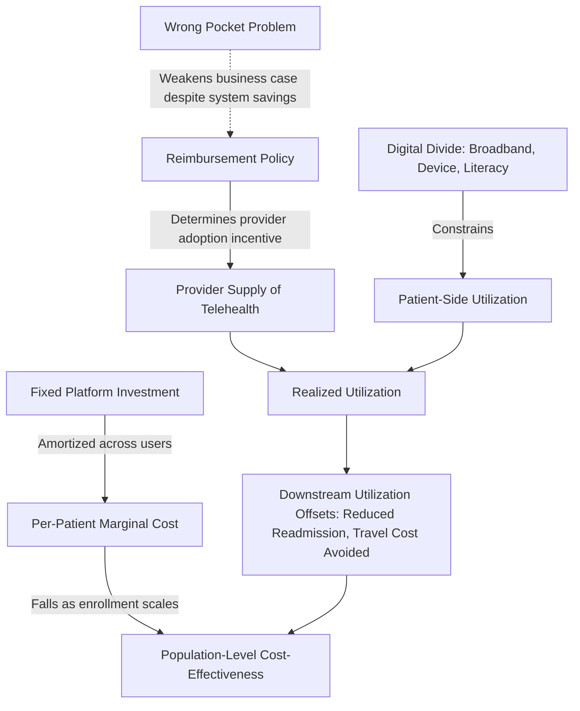

## Economics of Telehealth and Digital Health

### Definition and Scope

Telehealth refers to the delivery of health-related services and information via telecommunications technology, encompassing synchronous (real-time video/audio) and asynchronous ("store-and-forward") clinical encounters, remote patient monitoring, and tele-mentoring between providers. **Digital health** is the broader umbrella category, additionally encompassing mobile health apps (mHealth), wearables, digital therapeutics (software-as-medical-intervention), clinical decision support algorithms, and platform-based care coordination tools.

**Key Points:**

- The economics of telehealth sits at the intersection of health economics, information economics, and platform/network economics — cost structures, demand elasticity, and market failure patterns differ meaningfully from brick-and-mortar care delivery
- A persistent methodological challenge noted across the current health economic evaluation literature is that regulatory frameworks and standard economic-evaluation approaches are not yet fully adapted to the specific characteristics of digital health technologies, complicating direct comparison against conventional care cost-effectiveness studies, since existing approaches and regulatory frameworks for generating economic evidence are not yet adequately adapted to the specific characteristics of digital health technologies [PubMed Central](https://pmc.ncbi.nlm.nih.gov/articles/PMC13372764/)

### Core Cost Structure

| Cost Category | Description | Economic Property |
| --- | --- | --- |
| Platform/infrastructure fixed costs | Software development, EHR integration, cybersecurity compliance | High upfront, near-zero marginal cost of replication (classic digital-good economics) |
| Per-encounter variable costs | Clinician time, bandwidth, technical support | Often lower than in-person per-visit cost once platform is built |
| Patient-side access costs | Device, broadband, digital literacy investment | A distinct, non-monetary barrier not present in in-person care |
| Provider-side transition costs | Workflow redesign, training, licensure compliance across jurisdictions | One-time but often underestimated in adoption cost models |
| Remote monitoring device costs | Wearables, connected diagnostics, data transmission fees | Recurring, tied to device replacement/maintenance cycles |

**Key Points:**

- The fixed-cost/near-zero-marginal-cost structure of the software layer is the central economic feature distinguishing digital health from traditional care delivery, implying **economies of scale** that classical service-delivery economics does not typically exhibit — unit cost falls sharply as enrolled population grows, once the platform is built
- This scale economy is a core argument for digital health's theoretical cost-effectiveness advantage in reaching geographically dispersed or low-density populations, since the marginal cost of extending a platform to an additional remote user is far lower than building physical infrastructure to reach that same user

### Demand-Side Economics

**Reduced time and travel cost (a core welfare-economics argument for telehealth)**: Telehealth substitutes patient/caregiver travel time and lost-wage opportunity cost for a virtual encounter, a benefit particularly salient in economic evaluations focused on time efficiency for populations facing high per-visit travel burden.A scoping review of US-based studies between 2018 and 2024 examined telehealth's impact on cost and time efficiency for patients with disabilities, finding effectiveness in providing accessible and continuous care especially to remote and underserved areas [PubMed Central](https://pmc.ncbi.nlm.nih.gov/articles/PMC13266665/)

**Access expansion vs. induced demand tradeoff**: Lowering the effective "price" of a visit (in time/travel terms) can expand access for previously underserved populations (a welfare gain) but can also induce additional utilization beyond clinically necessary levels (a classic moral-hazard-adjacent effect in health economics), complicating simple cost-savings projections.

**Digital divide as a distributional/equity constraint**: Broadband access, device ownership, and digital literacy are unevenly distributed by age, income, and geography, meaning telehealth expansion can widen rather than narrow access disparities absent complementary digital-inclusion investment — a finding echoed in geriatric-focused evaluations.One systematic review of telehealth in geriatric care found high patient satisfaction alongside usability challenges for older adults aged 80 and above, highlighting the need for digital literacy programs [PubMed Central](https://pmc.ncbi.nlm.nih.gov/articles/PMC12659148/)

### Cost-Effectiveness Evidence Base

**Key Points:**

- Evidence across recent systematic reviews is directionally positive but highly heterogeneous by condition, population, and intervention design rather than uniformly cost-saving
- A 2025 geriatric-care systematic review reported measurable cost reductions concentrated in specific use cases.Telehealth interventions led to a 10 to 15 percent reduction in healthcare costs, particularly for post-surgical rehabilitation and virtual consultations [PubMed Central](https://pmc.ncbi.nlm.nih.gov/articles/PMC12659148/)
- A 2025 meta-analysis focused on COPD home oxygen therapy specifically examined both clinical and cost outcomes together, reflecting a broader methodological pattern in the field of pairing effectiveness and cost-effectiveness analysis within a single study design.The study aimed to evaluate the clinical and cost-effectiveness of telehealth-supported home oxygen therapy interventions on adherence, hospital readmission, and quality of life [nih](https://www.ncbi.nlm.nih.gov/pmc/articles/PMC12262104/)
- A large real-world 2026 difference-in-differences analysis of telehealth-delivered nutrition therapy for type 2 diabetes and obesity found substantial per-member-per-month cost reductions sustained over two years.Program participation was associated with 240 and 256 dollar per-member-per-month reductions in total cost of care at 12 months for T2D and obesity respectively, with reductions of 230 and 189 dollars sustained over 24 months [PubMed](https://pubmed.ncbi.nlm.nih.gov/42579263/)
- Earlier systematic-review evidence on digital health interventions for behavioral change found a majority of full economic evaluations favorable, though geographically concentrated.Of nine studies with full-scale economic evaluations for digital behavioral-change interventions, eight were identified as cost-effective, while all twenty included studies originated from high-income countries [clinicaltrials](https://cdn.clinicaltrials.gov/large-docs/01/NCT05864001/Prot_002.pdf)

**Evidence base limitation**: [Inference] The geographic concentration of rigorous economic evaluation in high-income-country settings noted above suggests that cost-effectiveness conclusions may not generalize directly to LMIC contexts with different labor-cost structures, digital infrastructure baselines, and reimbursement environments — a gap consistent with the broader global-health-evidence asymmetry discussed in prior modules on health system strengthening.

### Provider Payment and Reimbursement Models

| Model | Mechanism | Economic Effect |
| --- | --- | --- |
| Fee-for-service parity | Telehealth visit reimbursed equivalently to in-person visit | Removes provider financial disincentive to offer telehealth; risk of induced-demand volume growth |
| Reduced/differential telehealth rate | Lower reimbursement for virtual vs. in-person encounters | Reflects lower resource cost but can suppress supply-side adoption |
| Capitated/value-based bundles | Telehealth as one delivery channel within a fixed per-patient payment | Aligns provider incentive with total cost containment rather than visit volume |
| Subscription/direct-to-consumer models | Patient or employer pays recurring fee outside traditional insurance billing | Bypasses public/private payer reimbursement policy entirely; growing segment in mHealth/digital therapeutics |

**Key Points:**

- Reimbursement policy is a first-order determinant of telehealth market size independent of underlying clinical cost-effectiveness — the sharp COVID-19-era expansion in telehealth utilization was driven substantially by emergency reimbursement-parity policy changes rather than a discrete change in the underlying technology or evidence base, reflecting how despite telehealth's unprecedented expansion during the pandemic, economic questions remain and uncertainty persists regarding restrictive regulations and technology limitations that had historically kept use low [PubMed](https://pubmed.ncbi.nlm.nih.gov/40354157/)
- The "wrong pocket problem" is a documented structural barrier to telehealth/digital health integration: cost savings from a digital intervention may accrue to a different budget line, payer, or institutional "pocket" than the one bearing the implementation cost, weakening the internal business case for adoption even when system-wide cost-effectiveness is favorable.

### Key Analytical Frameworks and Formulas

**Standard cost-effectiveness framing** (applying the general ICER formula, introduced in the foreign aid financing module, to a digital health comparator):

$$\text{ICER} = \frac{C_{\text{digital}} - C_{\text{usual care}}}{E_{\text{digital}} - E_{\text{usual care}}}$$

where $E$ is typically measured in QALYs gained or a condition-specific clinical outcome, and $C$ includes both direct platform/encounter costs and downstream utilization effects (e.g., reduced hospital readmission).

**Total cost of care (TCOC) framing** (increasingly the preferred applied metric in the recent literature over narrow encounter-cost comparison, since it captures downstream utilization offsets):

$$\Delta \text{TCOC} = (C_{\text{intervention}} + C_{\text{platform}}) - (C_{\text{avoided utilization}})$$

This is the framing used in per-member-per-month (PMPM) cost studies such as the 2026 diabetes/obesity nutrition-therapy analysis cited above, where the relevant economic question is net system cost change rather than the isolated cost of the digital encounter itself.

**Break-even enrollment threshold** (a standard fixed-cost amortization calculation applied to digital health platform investment) [Inference — general capital-budgeting application, not a named standardized health-economics metric]:

$$N_{\text{break-even}} = \frac{\text{Fixed platform cost}}{\text{Per-patient net cost savings}}$$

This threshold framing is central to digital health business-case modeling: given the fixed-cost/low-marginal-cost structure described above, a platform's cost-effectiveness at the population level depends heavily on achieving sufficient enrolled-user scale to amortize the initial fixed investment.

### Market Structure and Platform Economics

**Key Points:**

- **Two-sided market dynamics**: Many digital health platforms function as intermediaries connecting patients and providers, exhibiting network-effect properties where platform value increases with participation on both sides — relevant to understanding market consolidation patterns among commercial telehealth vendors
- **Digital therapeutics as a distinct regulatory-economic category**: Software-based interventions seeking formal regulatory approval (e.g., as a prescribable treatment rather than a wellness tool) face a distinct evidence-generation and reimbursement pathway compared to general telehealth service delivery, with cost-effectiveness evaluation methodology still maturingas digital health technologies continue to offer significant potential to improve healthcare delivery, efficiency and outcomes despite full potential remaining underused [PubMed Central](https://pmc.ncbi.nlm.nih.gov/articles/PMC13372764/)

### Rural and Underserved-Population Applications

**Key Points:**

- Digital health interventions are frequently positioned as a targeted response to geographic access barriers in rural and remote settings, particularly for chronic disease management requiring sustained monitoring rather than episodic acute care, as demonstrated in a 2025 systematic review examining digital health interventions for cardiometabolic outcomes specifically in rural and remote Australia [nih](https://www.ncbi.nlm.nih.gov/pmc/articles/PMC12742273/)
- Economic evaluation of unplanned/urgent telehealth use among older adults remains a comparatively underdeveloped evidence base relative to planned/chronic-condition telehealth, per a 2025 scoping review mapping the current state of the literature.The scoping review aimed to identify, map and provide an overview of the current state of literature on economic evaluations and financial consequences related to telehealth services used by older adults seeking unplanned care [Springer](https://link.springer.com/article/10.1186/s44247-025-00199-9)

### Practical Example: Business Case Walkthrough for a Remote Monitoring Program

**Example:**

A health system is evaluating whether to invest in a remote patient monitoring (RPM) platform for congestive heart failure patients.

1. **Fixed cost estimation**: Platform licensing/development, EHR integration, initial clinician training
2. **Variable cost estimation**: Per-patient device cost, data transmission fees, nurse triage time for monitoring alerts
3. **Expected utilization offset**: Historical readmission rate for the target population, multiplied by expected relative risk reduction from early intervention enabled by continuous monitoring (drawn from the condition-specific RCT/meta-analysis evidence base)
4. **Net cost calculation**: Apply the total-cost-of-care formula above, comparing program cost against avoided-readmission cost savings
5. **Break-even enrollment calculation**: Divide fixed platform cost by per-patient net savings to determine minimum enrolled population required for the program to be cost-neutral
6. **Payer/budget-holder alignment check**: Explicitly verify whether the entity bearing platform cost (e.g., a hospital system) is the same entity capturing the avoided-cost benefit (e.g., a payer under a shared-savings arrangement) — directly addressing the "wrong pocket problem" identified as a structural adoption barrier in the literature

### Persistent Methodological and Policy Challenges

**Key Points:**

- **Immature standardized economic evaluation methodology**: Current literature explicitly identifies a methodological gap between existing health-economic evaluation frameworks (designed originally for pharmaceuticals and conventional care pathways) and the specific characteristics of digital health technologies (rapid iteration cycles, platform effects, data-driven personalization), an active area of applied health-economics methods development
- **Regulatory fragmentation across jurisdictions**: Cross-border/cross-state telehealth licensure requirements create compliance costs distinct from the clinical or platform economics, particularly relevant for scaling multi-region digital health ventures
- **Reimbursement policy volatility**: Because telehealth utilization has proven highly sensitive to reimbursement-parity policy (as observed in the sharp pandemic-era expansion), the durability of current utilization and cost-effectiveness findings is contingent on the stability of reimbursement policy going forward — an ongoing policy uncertainty relevant to long-run investment decisions in the sector
- **Attribution and downstream offset measurement**: Similar to the attribution challenge discussed in the health system strengthening module, isolating a digital intervention's causal contribution to downstream cost/utilization outcomes (versus concurrent care changes) remains methodologically demanding, particularly in real-world (non-RCT) evaluation designs

### Next Steps

**Related Topics:**

- Total cost of care (TCOC) methodology and per-member-per-month (PMPM) evaluation design
- Digital divide and broadband/device access as a distributional health-equity constraint
- Reimbursement policy design: fee-for-service parity versus value-based digital health payment models
- Digital therapeutics regulatory pathways and evidence-generation requirements
- Remote patient monitoring program design and break-even/business-case modeling
- The "wrong pocket problem" and cross-payer/cross-budget alignment mechanisms in digital health financing
- Platform and network-effect economics applied to two-sided digital health markets
- Telehealth applications in LMIC settings and the high-income-country evidence-generalizability gap
- Health economic evaluation methodology adaptation for rapidly-iterating digital health technologies