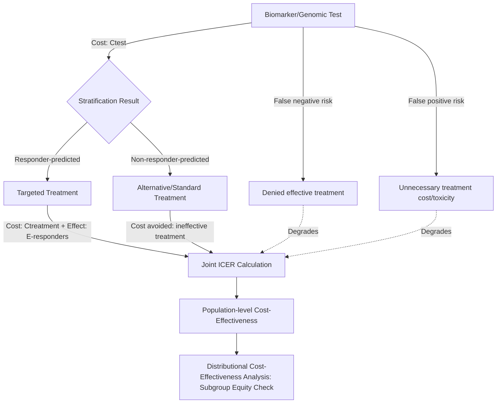

## Precision Medicine and Personalized Care Economics

### Definition and Scope

Precision medicine (also termed personalized medicine) refers to a clinical approach that tailors prevention, diagnosis, and treatment to an individual's genetic makeup, molecular/biomarker profile, environment, and lifestyle rather than applying a uniform "one-size-fits-all" standard of care. Precision medicine, a component of personalised medicine, is changing the face of healthcare by tailoring treatments to each patient based on their unique genetic makeup, environmental factors, and way of life. The economic subfield examines how stratification-driven care changes the cost, value, and financing structure of health interventions relative to conventional undifferentiated treatment pathways.

**Key Points:**

- Precision medicine spans genomics/pharmacogenomics, targeted oncology therapeutics, companion diagnostics, precision nutrition, and increasingly AI-driven risk stratification and treatment-matching algorithms
- The economic evaluation challenge is structurally distinct from conventional pharmaceutical cost-effectiveness analysis because precision medicine bundles a **diagnostic/stratification cost** with a **treatment cost**, requiring joint (not separate) economic evaluation of the test-treatment pairing

### Core Economic Rationale

**Reduced treatment waste through stratification**: The central efficiency argument for precision medicine is that by identifying which patient subpopulation will actually respond to a given therapy, health systems avoid the cost (and adverse-event risk) of administering ineffective treatment to non-responders — reframing the relevant cost-effectiveness unit from "cost per treated patient" to "cost per successfully-treated patient."

**Value-based segmentation**: Precision medicine enables **price discrimination and differentiated value assessment** across patient subgroups for the same nominal therapy, since a drug's ICER can vary substantially depending on which biomarker-defined subpopulation receives it — a single population-average ICER can obscure large within-population heterogeneity that is precisely what precision medicine is designed to exploit.

**High fixed cost, uncertain marginal value tradeoff**: The development and application of precision medicine, including genetic testing and personalized drug development, involves significant upfront investment, and research into the economic costs of precision medicine in pediatric oncology has begun to systematically measure implementation costs across genomic and preclinical testing stages, though the initial outlay remains a barrier, particularly when short-term cost-effectiveness is the primary evaluation lens.

### Companion Diagnostic Economics

**Key Points:**

- A **companion diagnostic** (a biomarker test required to determine treatment eligibility) introduces a joint economic evaluation unit: the test's sensitivity/specificity directly determines the effective cost-effectiveness of the paired treatment, since false negatives deny effective treatment to responders and false positives expose non-responders to cost/toxicity without benefit
- Test cost is typically small relative to the paired therapy cost (especially for high-cost biologics/targeted oncology drugs), meaning **test accuracy improvements often generate outsized ICER improvements** relative to their own cost — a distinct value-driver not present in standalone diagnostic economics
- Reimbursement policy frequently lags regulatory approval for companion diagnostics, creating an access gap distinct from the therapy's own approval and pricing timeline

### Cost-Effectiveness Evidence Base

**Key Points:**

- Evidence remains substantial but methodologically uneven: a scoping review of cost-effectiveness evidence found that the existing body of research remains limited and unevenly distributed across therapeutic areas, making it difficult to draw broad generalizable conclusions across the full precision medicine field
- A 2026 systematic review and regression analysis specifically evaluating AI-empowered precision medicine found predominantly favorable cost-effectiveness, though with a caveat about evidence quality.AI-empowered precision medicine was cost-saving or cost-effective in 89 percent of base-case analyses, with incremental cost-effectiveness ratios ranging from dominant to approximately 129,174 dollars per quality-adjusted life-year, although risk-of-bias assessment indicated potential systematic optimism in the underlying studies
- A cost-utility modeling study using Monte Carlo simulation found substantial variation in cost-effectiveness across precision medicine applications within oncology and cardiology.For high-risk cancer patients, the incremental cost-effectiveness ratio for expanding genetic testing averaged approximately 58,500 dollars per quality-adjusted life-year, while cardiovascular pharmacogenomic testing showed a higher economic benefit with an 88 percent likelihood of cost-effectiveness and an ICER of approximately 42,000 dollars per QALY, whereas personalised cancer immunotherapies showed a lower 40 percent likelihood of cost-effectiveness at an ICER of approximately 115,000 dollars per QALY
- This cross-application variation is itself an important finding: precision medicine's economic value is highly application-specific rather than a uniform property of the "precision medicine" category as a whole, reinforcing why aggregate/summary cost-effectiveness claims about precision medicine broadly should be treated with caution

### Precision Nutrition as an Applied Case

**Key Points:**

- Precision nutrition (integrating genetic, microbiome, and phenotypic data into personalized dietary guidance) has emerged as a specific, evidence-generating application area, motivated by documented inter-individual metabolic response variability.Large pan-European and multinational studies have shown substantial inter-individual variability in metabolic responses to identical foods, providing the biological rationale for precision nutrition strategies that integrate genetic, microbiome, and phenotypic data into personalized dietary recommendations
- A 2025 multi-employer claims analysis using a difference-in-differences design found favorable real-world cost impact from a precision nutrition digital therapeutic among employer-insured populations with diet-responsive conditions such as obesity, gastrointestinal disorders, and depression/anxiety — conditions noted as major drivers of employer healthcare expenditure that are infrequently reimbursed by conventional health insurance despite the nutrition-focused intervention opportunity
- This application illustrates the convergence between precision medicine economics and the digital health economics module: precision nutrition platforms combine the stratification logic of precision medicine with the low-marginal-cost scaling economics of digital delivery

### Analytical Frameworks and Formulas

**Standard joint test-treatment ICER** (extending the general ICER formula, introduced in the foreign aid financing module, to a stratified precision-medicine pathway):

$$\text{ICER}_{\text{PM}} = \frac{(C_{\text{test}} + C_{\text{treatment, responders}}) - C_{\text{usual care}}}{E_{\text{treatment, responders}} - E_{\text{usual care}}}$$

where costs and effects are calculated across the full tested population (including non-responders who incur test cost but not treatment benefit), not just the treated responder subgroup — a common source of methodological error when precision medicine economic evaluations improperly restrict the denominator population.

**Distributional Cost-Effectiveness Analysis (DCEA)**: An extension of standard cost-effectiveness analysis specifically relevant to precision medicine's equity implications, examining how a genomic or precision intervention's costs and benefits distribute across population subgroups (e.g., by ancestry, given documented disparities in genomic reference-database representation) rather than reporting only a population-average ICER — an active methodological development area highlighted in current health economics research programming.

**Value of Information / test accuracy sensitivity** [Inference — a general decision-analytic framing standard in health technology assessment, applied here to companion diagnostics specifically] Precision medicine ICERs are typically highly sensitive to test sensitivity/specificity parameters in probabilistic sensitivity analysis, meaning **Value of Information (VOI) analysis** — quantifying the expected economic benefit of reducing diagnostic uncertainty through further test-validation research — is a commonly applied prioritization tool for allocating further diagnostic R&D investment.

### Structural Cost-Value Flow

### LMIC and Global Health Applicability

**Key Points:**

- A dedicated research agenda has emerged specifically examining precision medicine economics in low- and middle-income country contexts, including recent work on biobank and genomic infrastructure development in resource-constrained settings, reflecting active interest in whether precision medicine's efficiency logic can be adapted to LMIC health system constraints rather than remaining a high-income-country phenomenon exclusively
- [Inference] Given the high fixed infrastructure cost noted above (genomic sequencing capacity, bioinformatics pipelines, biobank development), precision medicine's LMIC applicability faces a similar absorptive-capacity and fixed-cost amortization constraint to the one discussed in the health system strengthening module, though the specific empirical cost-effectiveness evidence for LMIC-context precision medicine deployment remains comparatively sparse relative to high-income-country evidence
- Genomic reference database representation bias (historically skewed toward European-ancestry populations) is a documented equity concern directly motivating the Distributional Cost-Effectiveness Analysis methodology described above, since biomarker/genetic test performance can vary by ancestry group when reference databases are unrepresentative

### Persistent Methodological and Policy Challenges

**Key Points:**

- **Uneven evidence distribution across therapeutic areas**: As with digital health, the precision medicine cost-effectiveness evidence base is concentrated in specific high-visibility applications (oncology, cardiovascular pharmacogenomics) with far sparser evidence in other therapeutic areas, complicating field-wide generalization
- **Systematic optimism risk**: The AI-empowered precision medicine review's explicit risk-of-bias flag (noting potential systematic optimism despite an 89% favorable cost-effectiveness finding) reflects a broader caution relevant across the precision medicine evidence base regarding publication bias and industry-sponsored evaluation designs
- **Long-term vs. immediate cost tradeoff**: Balancing immediate high expenditures (sequencing, companion diagnostics, targeted therapy pricing) against long-term future health improvements is a complex evaluative task, particularly under standard health-technology-assessment time horizons that may not fully capture very long-latency benefit streams (e.g., preventive genomic screening)
- **Data privacy and adoption friction**: Heavy reliance on data analysis raises security concerns that impact adoption, an implementation-economics consideration distinct from clinical cost-effectiveness but directly affecting real-world uptake and therefore realized (versus modeled) value

### Practical Example: Genomic Screening Program Evaluation Walkthrough

**Example:**

A health system is evaluating whether to fund population-wide genomic screening for a hereditary cancer risk variant.

1. **Test cost estimation**: Per-person sequencing/screening cost across the full eligible population (not only those ultimately found positive)
2. **Prevalence-adjusted positive yield**: Expected number of true positives identified, based on population prevalence of the risk variant
3. **Downstream pathway cost**: Cost of confirmatory testing, risk-reducing intervention (e.g., enhanced surveillance or prophylactic treatment) for identified positives
4. **Effect estimation**: DALYs or QALYs gained from earlier detection/intervention relative to standard-of-care detection timing
5. **Joint ICER calculation**: Apply the precision-medicine ICER formula above across the full screened population, explicitly including the cost borne by true negatives and false positives, not solely the identified-positive subgroup
6. **Distributional check**: Assess whether the screening test's performance and the downstream intervention's accessibility vary meaningfully across population subgroups (ancestry, geography, socioeconomic status), applying the DCEA framework to flag any equity-relevant heterogeneity the population-average ICER would otherwise obscure

### Next Steps

**Related Topics:**

- Companion diagnostic reimbursement pathways and test-treatment joint evaluation methodology
- Distributional Cost-Effectiveness Analysis (DCEA) applied to genomic medicine equity
- Value of Information (VOI) analysis for diagnostic test-accuracy R&D prioritization
- Precision nutrition digital therapeutics and employer-sponsored insurance cost outcomes
- Pharmacogenomic testing cost-effectiveness in cardiovascular versus oncology applications
- Genomic reference database representation bias and downstream test-performance equity
- AI-empowered precision medicine value-for-money evidence and systematic optimism risk
- Biobank and genomic infrastructure development economics in low- and middle-income countries
- Monte Carlo simulation methodology in long-term precision medicine cost-utility modeling