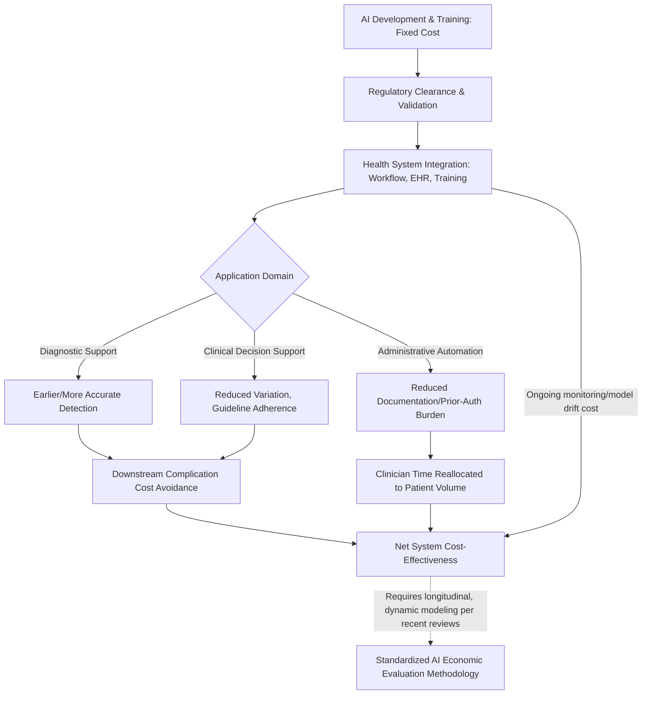

## Artificial Intelligence Applications in Health Care Delivery

### Definition and Scope

Artificial intelligence (AI) in health care delivery refers to software systems designed to mimic human intelligence or cognitive functions applied to clinical, diagnostic, administrative, and operational health system tasks. The economic subfield examines whether and how AI adoption changes the cost, productivity, and value structure of care delivery, distinct from AI's clinical efficacy evaluation alone.

**Key Points:**

- AI applications in health care span diagnostic support (imaging, pathology), clinical decision support, administrative automation (prior authorization, documentation, scheduling), workforce productivity augmentation, and population-level risk stratification
- This domain overlaps substantially with the precision medicine and digital health modules but is analytically distinct: AI's core economic feature is its potential to substitute for or augment clinical *labor and cognitive throughput*, not primarily to change *treatment selection* (precision medicine) or *care delivery channel* (telehealth)
- The evidence base on AI's actual economic impact remains notably immature relative to the scale of investment and adoption enthusiasm — a pattern flagged consistently across recent systematic reviews

### Macroeconomic Context: Why AI Is Positioned as a Cost Lever

Health care spending growth has consistently outpaced general economic growth, creating strong policy interest in productivity-enhancing technology.National health expenditures in the United States reached approximately 4.9 trillion dollars in 2023, equating to roughly 14,570 dollars per person, with health spending projected to grow at an average annual rate of 5.6 percent from 2023 to 2032, consistently outpacing nominal GDP growth of 4.3 percent. This sustained cost-growth trajectory is the macroeconomic backdrop motivating AI's positioning as a potential productivity lever, since the health care industry has a long history of below-average productivity gains, with cautious optimism that artificial intelligence will break this pattern, though misaligned incentives could stymie progress as they have historically.

**Key Points:**

- Widely cited industry estimates project large aggregate savings potential, though these should be treated as projections rather than realized/measured outcomes: one 2024 economic study estimated that existing AI platforms could deliver up to 360 billion dollars in annual cost reductions without harming quality of care, while a separate McKinsey assessment of generative AI estimated annual global value creation of 2.6 to 4.4 trillion dollars, with 60 to 110 billion dollars specifically accruing to the pharmaceutical and medical-product industries
- [Inference] The gap between large top-down macroeconomic projections and the more modest, heterogeneous findings from bottom-up clinical cost-effectiveness studies (detailed below) suggests these two evidence streams are not yet well reconciled, and aggregate savings claims should be treated with more caution than intervention-specific empirical findings

### Cost-Effectiveness Evidence Base

**Key Points:**

- Multiple independent systematic reviews published in 2025–2026 converge on a similar conclusion: AI shows directional promise but the evidence base remains methodologically immature and unevenly distributed
- A comprehensive systematic review of economic evidence found meaningful potential but explicitly cautioned against overstated aggregate claims.The high-quality studies show definite potential for positive cost-effectiveness and economic impact of AI technologies, though the review's authors state they cannot yet support the ambitious claims that AI technologies can translate to hundreds of billions in cost-savings
- A systematic review specifically examining cost-effectiveness and budget impact of AI in healthcare, searching literature through January 2025, concluded that future evaluations require methodological improvement rather than treating current findings as conclusive.The review's authors state that to generate more accurate and policy-relevant insights, future evaluations must adopt dynamic, longitudinal, and fully transparent modeling frameworks that comprehensively account for both direct and indirect costs over time
- A separate 2025 systematic review focused specifically on AI-assisted technologies explicitly flagged a methodological mismatch between AI's characteristics and standard evaluation tools.The review noted that traditional economic evaluation methods may not adequately capture the unique features of AI, including dynamic model evolution, scalability, and broader societal impacts
- Concrete cost-saving examples remain relatively rare in the literature even where AI clinical benefit is demonstrated, with reviewers noting few studies identifying cost savings associated with AI use, citing AI-aided colonoscopy for polyp diagnosis as one of the limited concrete comparative examples available

### Structural Reasons for Evaluation Difficulty

**Dynamic model evolution**: Unlike a fixed pharmaceutical or device intervention, AI models are frequently retrained, updated, or version-changed post-deployment, meaning the "intervention" being economically evaluated is not static over the evaluation time horizon — a fundamental mismatch with conventional health technology assessment methodology designed for fixed interventions.

**Scalability and near-zero marginal cost** (shared structural property with digital health, discussed in the prior module): Once trained and validated, an AI model can typically be deployed to additional sites/patients at low marginal cost, implying that economic evaluations conducted early in deployment (small scale) may understate eventual population-level cost-effectiveness once fixed development/validation costs are amortized across a larger user base.

**Indirect and second-order effects**: AI's economic impact often operates through indirect channels — reduced clinician documentation burden freeing time for additional patient volume, earlier diagnosis avoiding downstream complication costs — that are harder to capture in standard direct-cost accounting than a drug's straightforward acquisition-cost comparison.

**Broader societal impact capture gap**: Standard cost-effectiveness analysis, typically built around a health-system or payer perspective, may not adequately capture broader societal impacts of AI adoption (workforce displacement/augmentation effects, downstream productivity spillovers) that fall outside conventional health-economic evaluation perspective boundaries.

### Financial and Implementation Cost Structure

| Cost Category | Description | Economic Property |
| --- | --- | --- |
| Model development/training | Data acquisition, computation, validation | High fixed cost, often externally borne (vendor) rather than health-system capital cost |
| Integration and interoperability | EHR integration, workflow redesign | Frequently underestimated; a major real-world adoption barrier |
| Ongoing monitoring/revalidation | Model drift detection, periodic retraining oversight | Recurring cost distinct from one-time deployment cost |
| Regulatory/compliance | FDA/regulatory clearance maintenance, algorithmic bias auditing | Growing cost category as AI-specific regulatory frameworks mature |
| Workforce transition cost | Training, workflow adaptation, potential role redesign | Analogous to the provider-side transition costs discussed in the telehealth module |

**Key Points:**

- A dedicated financial-challenges analysis identifies AI's cost-effectiveness as conditional rather than automatic.Over time, AI can contribute to a more cost-effective and resource-efficient healthcare system, provided that its deployment is guided by strategic planning, with the same analysis recommending that policymakers, hospital administrators, providers, and insurers prioritize developing standardized methodologies for evaluating AI cost-effectiveness that incorporate metrics for both financial and clinical outcomes jointly
- This conditionality claim — that favorable economics depend on strategic deployment rather than being an inherent property of the technology — is a recurring theme distinguishing rigorous AI health-economics analysis from more deterministic industry cost-savings projections

### Key Analytical Frameworks and Formulas

**Standard ICER applied to AI decision support** (extending the general formula used throughout this syllabus):

$$\text{ICER}_{\text{AI}} = \frac{(C_{\text{AI development/deployment}} + C_{\text{ongoing operation}}) - C_{\text{usual care}}}{E_{\text{AI-assisted outcome}} - E_{\text{usual care outcome}}}$$

**Total cost of ownership (TCO) framing** — [Inference — standard IT capital-budgeting concept applied to health-AI procurement, not a health-economics-specific named metric] increasingly emphasized as more appropriate than acquisition-price comparison alone, since it captures the full cost structure table above rather than only the initial licensing/development cost:

$$\text{TCO} = C_{\text{development}} + C_{\text{integration}} + \sum_{t=1}^{T} C_{\text{monitoring, revalidation, workforce}, t}$$

**Break-even/amortization framing** (structurally identical to the digital health platform-scaling logic from the prior module, given AI's shared low-marginal-cost property):

$$N_{\text{break-even}} = \frac{C_{\text{fixed development + validation}}}{\text{Per-patient net cost/productivity benefit}}$$

### AI Application-to-Value Flow

### Adoption Barriers Beyond Direct Economics

**Key Points:**

- Trust and public acceptance function as an adoption-rate determinant that indirectly shapes realized (versus theoretical) economic value, since even a cost-effective AI tool generates no economic benefit if clinicians or patients do not adopt it. A 2026 cross-sectional US survey study found that trust emerged as a central determinant of AI adoption willingness, functioning as a critical factor shaping the potential for AI to expand healthcare access, with adoption patterns observed to reflect existing disparities in healthcare access and trust rather than being uniform across the population
- This equity dimension parallels the digital divide discussion in the telehealth module: AI adoption benefits may not distribute evenly across populations, complicating aggregate economic-value claims that implicitly assume uniform uptake
- Workforce and system-level pressures documented in the health-economy literature — clinician workforce shortages, geographic maldistribution of health professionals, and rising administrative burden diverting clinician time from direct patient care — form the demand-side rationale for AI-driven productivity augmentation, positioning AI as a potential partial response to labor-supply constraints rather than purely a cost-reduction technology

### Persistent Methodological and Policy Challenges

**Key Points:**

- **Absence of standardized evaluation methodology**: The most consistent finding across the 2025–2026 systematic review literature is an explicit call for standardized, methodologically rigorous cost-effectiveness evaluation frameworks specifically adapted to AI's dynamic and scalable characteristics — this gap is analogous to, but distinct from, the general digital-health-technology evaluation gap discussed in the telehealth module, since AI introduces additional complexity through model evolution/drift not present in static digital health platforms
- **Risk of premature aggregate claims**: Reviewers explicitly caution against extrapolating from limited high-quality studies to system-wide "hundreds of billions in savings" narratives, a caution directly paralleling the systematic-optimism risk flagged in the precision medicine module's AI-empowered precision medicine review
- **Perspective and boundary-setting ambiguity**: Whether an AI economic evaluation should be conducted from a health-system, payer, or societal perspective materially changes which costs and benefits are counted (echoing the general cost-effectiveness-analysis perspective debate referenced across pharmacoeconomics literature), and current AI-specific studies show inconsistency in perspective selection
- **Regulatory and reimbursement lag**: Similar to the companion diagnostic reimbursement lag noted in the precision medicine module, AI clinical tools frequently achieve regulatory clearance before stable reimbursement pathways exist, creating an adoption-economics gap distinct from underlying clinical/cost-effectiveness merit

### Practical Example: Hospital AI Triage Tool Evaluation Walkthrough

**Example:**

A hospital system is evaluating whether to adopt an AI-based radiology triage tool that flags urgent findings for expedited review.

1. **Fixed cost estimation**: Vendor licensing/development cost, PACS/EHR integration cost, radiologist training time
2. **Ongoing cost estimation**: Subscription/maintenance fees, periodic model revalidation, monitoring for performance drift over time
3. **Productivity effect estimation**: Reduction in time-to-read for urgent findings, measured against baseline radiologist turnaround time
4. **Downstream outcome effect**: Change in time-to-treatment-initiation for flagged urgent conditions, and associated downstream complication-cost avoidance
5. **Total cost of ownership calculation**: Apply the TCO formula above across the deployment horizon rather than comparing only upfront licensing cost against alternatives
6. **Break-even volume calculation**: Divide fixed development/integration cost by per-case net benefit (time saved plus avoided downstream cost) to determine minimum case volume required for cost-neutrality, consistent with the scalability-driven break-even logic shared with the digital health module
7. **Adoption-sensitivity check**: Given the documented link between trust/acceptance and realized value, explicitly model a range of radiologist adoption/override rates rather than assuming full utilization, since actual realized economic value is conditional on actual clinical uptake

### Next Steps

**Related Topics:**

- Standardized economic evaluation methodology development for dynamic, scalable AI health technologies
- Total cost of ownership (TCO) frameworks for health-system AI procurement decisions
- AI-specific regulatory clearance and reimbursement pathway alignment
- Trust, acceptance, and equity in AI adoption patterns across patient populations
- Model drift, revalidation, and ongoing monitoring cost structures for deployed clinical AI
- Comparative economics: AI-driven administrative automation versus clinical decision support value
- Workforce productivity augmentation versus labor substitution effects of health care AI
- Convergence points with precision medicine (AI-empowered stratification) and digital health (platform scaling economics) modules
- Societal-perspective cost-effectiveness analysis boundary-setting for AI health technologies