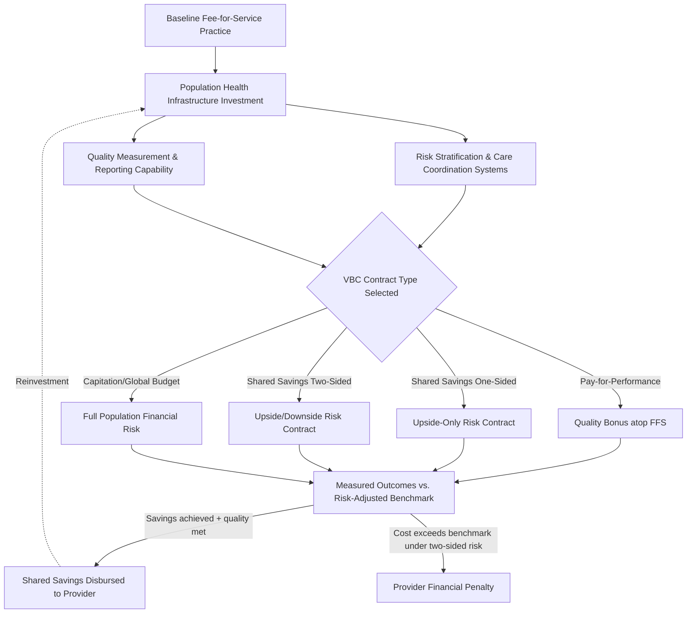

## Value-Based Care Transformation

### Definition and Scope

Value-based care (VBC) refers to a health care delivery and payment model in which provider reimbursement is tied to patient health outcomes and cost efficiency rather than the volume of services delivered, in contrast to traditional fee-for-service (FFS) reimbursement. "Transformation" specifically denotes the organizational, financial, and operational change process health systems undergo when migrating from FFS-dominant to value-based payment arrangements.

**Key Points:**

- VBC is a payment-model umbrella term encompassing a spectrum of arrangements ranging from modest pay-for-performance bonuses layered atop FFS to full capitation with two-sided financial risk
- The core economic logic directly parallels concepts introduced across earlier modules: strategic purchasing (universal health coverage module), results-based financing (foreign aid financing and health system strengthening modules), and capitation-based provider payment — VBC is essentially the domestic-system-level application of the same purchasing-mechanism economics discussed in the global-health context

### Economic Rationale

**Correcting fee-for-service incentive misalignment**: Under pure FFS, providers are paid per unit of service delivered regardless of outcome, creating a structural incentive toward volume maximization that is largely decoupled from patient health improvement — a well-documented principal-agent misalignment where the payer (principal) cannot fully observe or contract on whether delivered services genuinely improved patient outcomes (the agent's true effort/quality).

**Risk-bearing incentive realignment**: By shifting some financial risk for cost and outcomes onto providers, VBC arrangements aim to align provider financial interest with cost-conscious, outcome-focused care delivery — the same underlying strategic-purchasing logic discussed in the universal health coverage module's provider payment mechanism comparison table.

**Addressing quality-cost decoupling**: A foundational premise of the VBC movement is that a meaningful share of health care spending under FFS systems reflects low-value or unnecessary care that does not proportionally improve outcomes, meaning restructured incentives can theoretically reduce spending without harming (and potentially improving) population health — directly extending the "reduced treatment waste" efficiency logic from the precision medicine module to a system-payment-design level rather than a treatment-selection level.

### Payment Model Spectrum

| Model | Risk-Bearing Structure | Provider Incentive |
| --- | --- | --- |
| Fee-for-service (baseline) | No provider risk | Volume maximization |
| Pay-for-performance (P4P) | No downside risk; upside bonus only | Meet quality/outcome benchmarks atop FFS volume |
| Shared savings (one-sided) | Upside-only risk sharing | Reduce cost below benchmark to capture shared savings, no penalty for exceeding benchmark |
| Shared savings/shared risk (two-sided) | Upside and downside risk sharing | Stronger cost-containment incentive; provider bears penalty for exceeding benchmark |
| Bundled/episode-based payment | Fixed payment per clinical episode | Efficient care coordination within a defined episode window |
| Capitation (partial or full) | Fixed per-patient payment regardless of utilization | Strongest cost-containment incentive; risk of underprovision without quality safeguards |
| Global budget | Fixed total budget for a population/system | System-level cost control; requires strong internal resource allocation capability |

**Key Points:**

- This spectrum represents an explicit risk-transfer continuum from payer to provider, directly mirroring the strategic purchasing mechanisms introduced in the universal health coverage module — capitation here is economically identical in structure to the capitation-based primary care payment discussed in that module's Thailand case example
- Each step along the spectrum trades stronger cost-containment incentive against greater provider financial risk exposure and correspondingly greater underprovision/quality-stinting risk, requiring quality safeguards (outcome measurement, quality bonus adjustments) to offset the moral-hazard-in-reverse risk inherent in strong capitation arrangements

### Accountable Care Organizations and Population Health Management

**Accountable Care Organizations (ACOs)**: Provider-led organizational structures that voluntarily accept accountability for the cost and quality of care for an attributed patient population, typically operating under shared-savings or shared-risk arrangements. ACOs represent the dominant organizational vehicle for VBC transformation in several health systems, requiring providers to build population health management infrastructure (risk stratification, care coordination, data analytics) not typically needed under pure FFS practice.

**Key Points:**

- **Attribution methodology** (determining which patients "belong" to which ACO for cost/quality measurement purposes) is a technically consequential and often contested design element, since attribution errors can materially distort measured performance independent of actual care quality
- **Risk adjustment** is essential to VBC benchmark-setting: without adequately adjusting cost/outcome benchmarks for population case-mix severity, providers face a structural incentive to avoid sicker, more complex patients — a direct analog to the adverse-selection risk discussed in the universal health coverage module's insurance-pooling context, but operating at the provider-selection level rather than the patient-enrollment level

### Key Analytical Formulas

**Shared savings calculation** (standard mechanism across most one-sided and two-sided shared-savings VBC arrangements):

$$\text{Shared savings} = (\text{Benchmark cost} - \text{Actual cost}) \times \text{Sharing rate}$$

where the sharing rate is a contractually negotiated percentage (commonly in a 40–75% range across various documented ACO program designs) determining what portion of realized savings the provider retains versus the payer, and where actual disbursement is typically further conditioned on meeting minimum quality performance thresholds to prevent cost reduction achieved through quality stinting.

**Risk-adjusted benchmark** [Inference — general actuarial/risk-adjustment methodology applied to VBC benchmark-setting, not a single universally standardized formula]:

$$\text{Risk-adjusted benchmark} = \text{Base benchmark} \times \text{Risk score}_{\text{population}}$$

where the risk score is derived from a standardized risk-adjustment model (e.g., a hierarchical condition category-type methodology) capturing population case-mix severity relative to a reference population.

**Value equation** (the foundational conceptual formula underlying the entire VBC movement, commonly attributed to the value-based health care literature):

$$\text{Value} = \frac{\text{Health outcomes achieved}}{\text{Cost of achieving those outcomes}}$$

This is structurally the inverse-oriented complement to the ICER framing used throughout this syllabus — where ICER evaluates the *incremental* cost per unit of *incremental* outcome for a specific intervention choice, the value equation is typically applied at the *system or provider* level to benchmark overall performance rather than to compare two discrete treatment alternatives.

### Care Transformation Process Flow

### Implementation Requirements and Organizational Prerequisites

**Key Points:**

- **Data infrastructure and interoperability**: VBC arrangements require robust, often real-time cost and outcome data flow across the care continuum — a direct convergence point with the health information systems building block from the health system strengthening module and the EHR integration cost category from the AI-in-healthcare-delivery module
- **Care coordination capacity**: Managing population-level cost and outcomes requires care management infrastructure (care coordinators, transitional care programs, chronic disease management protocols) that represents a substantial fixed organizational investment prior to realizing shared-savings returns — creating a capital-investment barrier that can be particularly challenging for smaller or under-resourced provider organizations
- **Actuarial and analytics capability**: Providers assuming financial risk under two-sided or capitated arrangements effectively take on an insurance-like risk-bearing function, requiring analytics capability (predictive risk modeling, cost trend forecasting) historically concentrated within payer organizations rather than provider organizations — a notable capability-transfer challenge in VBC transformation
- **Quality measurement standardization**: The credibility of shared-savings and capitation arrangements depends on quality metrics that are resistant to gaming and genuinely reflect patient outcomes rather than easily-manipulated process measures — an ongoing methodological tension in VBC program design analogous to the composite-indicator sensitivity challenge discussed in the health system strengthening module's UHC Service Coverage Index

### Common Critiques and Structural Tensions

**Key Points:**

- **Adverse selection and risk avoidance**: Absent robust risk adjustment, providers under strong risk-bearing VBC arrangements face incentive to avoid enrolling or retaining higher-cost, higher-complexity patients — the provider-side mirror image of the insurance-pooling adverse selection problem discussed in the universal health coverage module
- **Quality stinting risk under capitation**: Strong downside-risk arrangements without adequate quality safeguards create incentive for underprovision of beneficial care to protect margin — the classic moral-hazard-in-reverse concern associated with capitation-based payment, requiring explicit quality-gate mechanisms tying savings disbursement to maintained or improved quality performance
- **Attribution and benchmark-gaming vulnerabilities**: Sophisticated providers can, in principle, optimize measured performance against attribution and benchmark-setting methodology rather than genuinely improving underlying care value — a technical vulnerability requiring ongoing program design refinement
- **Transition cost and small-practice disadvantage**: The fixed infrastructure investment required for VBC readiness (data systems, care coordination staff, actuarial capability) creates a scale threshold that can disadvantage smaller independent practices relative to larger integrated health systems, potentially accelerating health care market consolidation as a side effect of payment reform — a documented concern in VBC transformation policy literature
- **Mixed empirical evidence on aggregate savings**: [Inference] Consistent with the broader pattern observed across the digital health and AI modules in this chapter, the empirical evidence on VBC's aggregate cost-savings impact across large-scale program evaluations has been mixed and program-design-dependent rather than uniformly favorable, underscoring that — as with AI and digital health — value-based payment's economic benefit is conditional on implementation quality rather than an automatic property of the payment model itself

### Practical Example: ACO Contract Design Walkthrough

**Example:**

A multi-specialty provider group is negotiating entry into a two-sided shared-savings ACO arrangement for its Medicare-attributed population.

1. **Baseline benchmark establishment**: Historical risk-adjusted per-capita cost for the attributed population over a defined lookback period
2. **Risk adjustment application**: Adjust the benchmark using a standardized risk-scoring methodology to account for the population's case-mix severity, preventing the provider from being penalized for a sicker-than-average attributed population
3. **Quality gate specification**: Define minimum quality performance thresholds (e.g., preventive screening rates, readmission rates, patient experience scores) that must be met for the provider to receive any shared savings, regardless of cost performance
4. **Sharing rate and risk corridor negotiation**: Set the percentage of savings retained by the provider and the maximum downside risk exposure (a "risk corridor" capping potential losses) under the two-sided arrangement
5. **Infrastructure investment planning**: Budget for the population health management infrastructure (care coordinators, risk-stratification analytics, EHR-based quality reporting) required to actually manage cost and quality performance under the contract — recognizing this as an upfront capital cost against which future shared-savings returns must be evaluated, structurally analogous to the break-even/amortization logic applied to digital health and AI platform investment in the prior two modules
6. **Ongoing performance monitoring**: Track quarterly cost trend and quality metrics against the risk-adjusted benchmark throughout the contract period, enabling mid-course care-management intervention before year-end settlement

### Next Steps

**Related Topics:**

- Accountable Care Organization (ACO) attribution methodology and risk-adjustment model design
- Bundled/episode-based payment design for surgical and chronic condition care pathways
- Capitation risk-corridor and quality-gate mechanism design to prevent underprovision
- Population health management infrastructure investment and organizational readiness assessment
- Convergence with strategic purchasing and provider payment mechanisms (see universal health coverage module)
- Risk adjustment methodology (hierarchical condition category-type models) across VBC and insurance contexts
- Empirical evidence review: aggregate cost and quality outcomes across large-scale shared-savings program evaluations
- Data interoperability and health information system requirements for VBC performance measurement
- Market consolidation effects of VBC transformation and small-practice competitive disadvantage