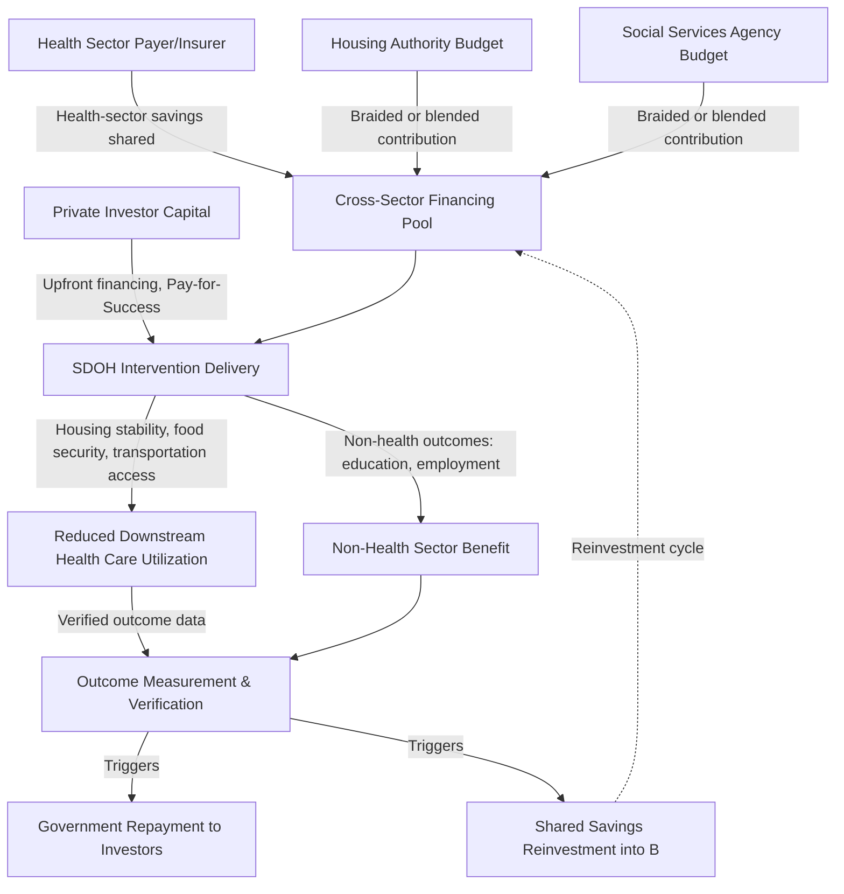

## Financing Social Determinants of Health Interventions

### Definition and Scope

Social determinants of health (SDOH) are the non-medical conditions in which people are born, live, work, and age — housing, food security, transportation, education, income, and social/environmental context — that substantially shape health outcomes independent of clinical care delivery. Financing SDOH interventions refers to the funding mechanisms, budget structures, and cross-sector payment arrangements developed to support investment in these non-clinical determinants as a health-improvement strategy.

**Key Points:**

- The financing challenge is structurally distinct from conventional health care financing because SDOH interventions (housing subsidies, food assistance, transportation vouchers) are typically delivered by non-health-sector agencies and budgets, requiring cross-sector financing coordination absent from most clinical care payment models
- This domain sits at the direct intersection of health economics and public finance/social policy, extending the health system building blocks framework (health system strengthening module) beyond the boundary of the formal health sector itself

### Economic Rationale

**Health production function framing**: A standard economic model treats health as an output produced from multiple inputs — clinical care is only one input alongside nutrition, housing stability, education, and environmental exposure. Under this framing, the marginal health return on an additional dollar of clinical spending may be lower than the marginal return on an additional dollar of SDOH investment for certain populations, particularly where clinical need is driven by unaddressed upstream social conditions — a core efficiency argument for reallocating or supplementing health financing toward SDOH interventions.

**Cross-sector externality and the "wrong pocket" problem**: SDOH investment frequently generates a large share of its return in the health sector (avoided emergency care, reduced hospitalization) while the investment cost is borne by a different sector's budget (housing authority, social services agency) — this is a direct extension of the "wrong pocket problem" introduced in the digital health economics module, here operating across formal government-agency boundaries rather than within a single health system's internal budget lines.

**Preventive investment with delayed and diffuse returns**: Similar to the health system strengthening module's time-lag problem, SDOH interventions often generate health and cost benefits only after a multi-year lag, and those benefits are typically diffuse across a population and across payers rather than concentrated and directly attributable to a single funder — compounding the attribution and time-horizon challenges that already complicate preventive health investment generally.

### Financing Mechanism Taxonomy

| Mechanism | Structure | Key Feature |
| --- | --- | --- |
| Braided/blended funding | Multiple agency budgets pooled or coordinated for a shared initiative | Requires interagency governance agreements; funding streams remain formally separate (braided) or merged (blended) |
| Health plan/payer-funded SDOH benefits | Insurer directly covers non-clinical services (e.g., medically tailored meals, housing navigation) | Increasingly permitted under supplemental benefit flexibilities in several value-based payment environments |
| Social Impact Bonds / Pay-for-Success | Private investors finance upfront intervention cost; government repays with return only if outcomes achieved | Shifts implementation risk to investors; requires rigorous outcome measurement infrastructure |
| Community Reinvestment-linked financing | Financial institutions directed toward community development investment (housing, economic development) with health co-benefits | Originates in banking/financial regulation policy rather than health financing policy |
| Value-based care shared-savings reinvestment | ACOs/providers reinvest a portion of shared savings (see value-based care module) into SDOH-addressing care coordination | Links directly to the VBC financing architecture discussed in the prior module |
| Medicaid Section 1115 waivers | State Medicaid programs granted federal authority to test coverage of specified non-clinical services | A dominant financing pathway for SDOH coverage within US Medicaid specifically |

**Key Points:**

- **Braided vs. blended funding** is a consequential design distinction: braided funding preserves each agency's distinct accountability and reporting requirements (lower interagency trust required, higher administrative burden), while blended funding merges funds into a single pool with unified reporting (lower administrative burden, requires greater interagency governance alignment) — this tradeoff directly parallels the fragmentation-versus-coordination tension discussed in the global health governance module regarding multilateral institution proliferation
- **Social Impact Bonds** apply a fundamentally different risk-transfer logic than most SDOH financing mechanisms: rather than government bearing upfront implementation risk, private investors do, with government repayment contingent on independently verified outcome achievement — structurally analogous to the results-based financing instruments discussed in the foreign aid financing module, but using private capital rather than donor grant funding as the upfront resource

### Key Analytical Frameworks and Formulas

**Cross-sector return on investment (ROI) framing** [Inference — a general applied cost-benefit framing standard in SDOH program evaluation literature, not a single universally standardized formula]:

$$\text{Cross-sector ROI} = \frac{\text{Health-sector cost avoided} + \text{Non-health-sector benefit}}{\text{SDOH intervention cost}}$$

This formula makes explicit the wrong-pocket problem's economic structure: a positive cross-sector ROI can coexist with a negative ROI from the perspective of whichever single sector bears the intervention cost, which is precisely why cross-sector financing coordination mechanisms are necessary rather than relying on each sector's independent investment calculus.

**Standard ICER extended to SDOH interventions** (applying the general formula used throughout this syllabus, now with a non-clinical intervention type):

$$\text{ICER}_{\text{SDOH}} = \frac{C_{\text{SDOH intervention}} - C_{\text{usual care/no intervention}}}{E_{\text{health outcome or QALY}} - E_{\text{usual care outcome}}}$$

[Inference] Applying standard cost-effectiveness thresholds (as discussed in the universal health coverage module) to SDOH interventions is methodologically contested in the literature, since SDOH interventions often generate benefits (educational attainment, housing stability) with intrinsic social value beyond their health effect, which a health-outcome-only ICER denominator does not capture — an active methodological debate rather than a settled convention.

**Pay-for-Success repayment structure** (standard Social Impact Bond financial mechanism):

$$\text{Government repayment} = \text{Principal} + (\text{Verified outcome achievement} \times \text{Return rate})$$

where repayment is contingent and scaled to independently verified outcome metrics rather than being a fixed obligation, transferring implementation and outcome-achievement risk to the investor relative to conventional government grant or contract financing.

### Cross-Sector Financing Flow

### Implementation Requirements and Prerequisites

**Key Points:**

- **Cross-sector data sharing infrastructure**: Effective SDOH financing coordination requires data interoperability across health and non-health agency systems (housing records, social service enrollment, health utilization data) that historically operate on entirely separate information systems — a substantially more complex version of the health information systems challenge discussed in the health system strengthening module, now spanning formal agency and legal boundaries with distinct privacy/data-governance regimes
- **Outcome measurement and attribution infrastructure**: Both shared-savings reinvestment models and Pay-for-Success arrangements require rigorous, independently verifiable outcome measurement — directly inheriting the attribution-problem challenges discussed in the health system strengthening and value-based care modules, now compounded by the need to attribute outcomes across sector boundaries
- **Interagency governance agreements**: Braided and blended funding models require formal governance structures (memoranda of understanding, joint oversight bodies) to manage shared accountability across agencies with historically separate mandates, budgets, and performance metrics — an institutional/political-economy prerequisite distinct from the purely financial-mechanism design
- **Screening and referral infrastructure within clinical settings**: Health-sector-initiated SDOH financing models (e.g., payer-funded SDOH benefits) depend on systematic social-needs screening within clinical encounters and functional referral pathways to community-based SDOH service providers — a care-delivery-workflow prerequisite paralleling the workflow-redesign costs discussed in both the telehealth and AI-in-healthcare-delivery modules

### Common Critiques and Structural Tensions

**Key Points:**

- **Persistent wrong-pocket disincentive**: Despite growing cross-sector financing mechanism development, the underlying misalignment between which sector bears SDOH intervention cost and which sector captures the largest share of return remains a structural barrier that financing-mechanism innovation only partially resolves — the mechanisms discussed above are best understood as institutional workarounds to a persistent underlying incentive problem rather than a complete resolution of it
- **Measurement and evidence base immaturity**: [Inference] Consistent with the pattern observed across the digital health, AI, and value-based care modules in this chapter, the SDOH financing evidence base remains methodologically heterogeneous, with cross-sector ROI estimates varying substantially by intervention type, population, and evaluation design, complicating confident generalizable claims about which SDOH financing mechanisms deliver the most reliable health-sector cost offset
- **Risk of narrow medicalization of social policy**: A recurring critique in the SDOH policy literature is that channeling SDOH investment primarily through health-sector financing and health-outcome-justified ROI framing risks subordinating social policy goals (housing as a right, food security as a social good) to a narrower health-cost-offset justification, potentially underfunding SDOH interventions whose primary value is non-health-sector benefit not well captured in a health-focused ROI calculation
- **Sustainability beyond pilot/demonstration financing**: Many current SDOH financing mechanisms (Medicaid Section 1115 waiver programs, Social Impact Bonds, VBC shared-savings reinvestment) originated as time-limited pilot or demonstration structures, raising a sustainability question analogous to the "funding cliff" transition-financing concern discussed in the universal health coverage and foreign aid financing modules regarding donor/pilot-dependent programs

### Practical Example: Housing-Health ROI Walkthrough

**Example:**

A regional health system and local housing authority are evaluating a braided-funding partnership to provide supportive housing for a population with high rates of housing instability and frequent emergency department utilization.

1. **Baseline utilization estimation**: Historical emergency department and inpatient utilization cost for the target population under current (unstably housed) conditions
2. **Intervention cost estimation**: Housing subsidy, case management, and housing-navigation staffing cost per participant
3. **Health-sector benefit estimation**: Projected reduction in emergency department and inpatient utilization following housing stabilization, drawn from comparable program evaluation literature
4. **Non-health-sector benefit estimation**: Housing authority-relevant outcomes (reduced shelter system utilization, housing stability duration) that constitute value to the housing sector independent of health-sector cost offset
5. **Cross-sector ROI calculation**: Apply the cross-sector ROI formula above, explicitly itemizing which benefits accrue to which sector's budget
6. **Braided funding allocation negotiation**: Structure each agency's financial contribution in rough proportion to the benefit share each sector is projected to capture, directly addressing the wrong-pocket disincentive rather than expecting either agency to fund the full intervention cost unilaterally
7. **Outcome verification design**: Establish a shared measurement framework (jointly tracked utilization and housing-stability metrics) enabling both agencies to verify their respective returns and informing any future shared-savings reinvestment cycle

### Next Steps

**Related Topics:**

- Medicaid Section 1115 waiver design for non-clinical service coverage in the US context
- Social Impact Bond / Pay-for-Success program design and outcome verification methodology
- Braided versus blended interagency funding governance structures
- Health plan supplemental benefit flexibility for SDOH-addressing services
- Cross-sector data interoperability and privacy-governance frameworks spanning health and social service agencies
- Convergence with value-based care shared-savings reinvestment mechanisms (see value-based care module)
- Health production function economic modeling and marginal-return comparison across clinical versus social determinant investment
- Screening and referral infrastructure design for clinical-setting SDOH needs identification
- Comparative program evaluation: cross-sector ROI evidence across housing, food security, and transportation SDOH interventions