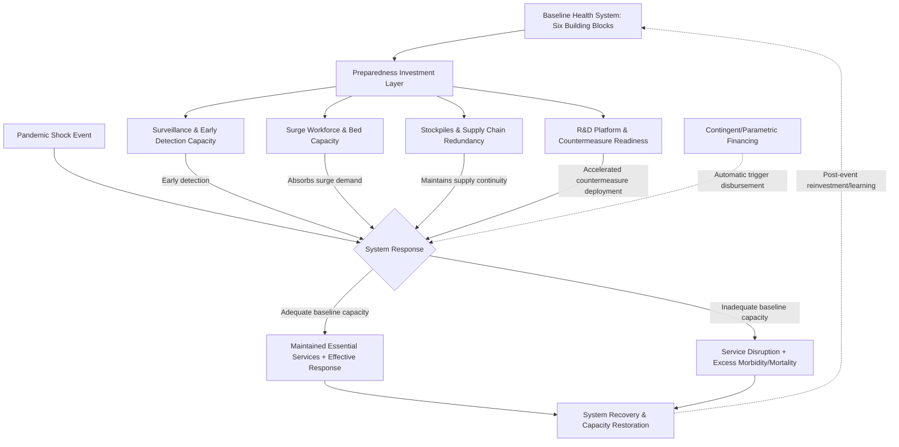

## Pandemic Preparedness and Health System Resilience

### Definition and Scope

Pandemic preparedness refers to the ex-ante investments, institutional capacities, and policy frameworks that reduce the probability and severity of large-scale infectious disease outbreaks. Health system resilience refers to a system's capacity to absorb, adapt to, and recover from acute shocks (pandemics, natural disasters, conflict) while maintaining essential health service delivery — a related but analytically distinct concept, since preparedness focuses on shock prevention/mitigation while resilience focuses on system performance during and after a shock has occurred.

**Key Points:**

- This module directly extends the collective action and global public goods framing introduced in the global health governance module, applying that economic logic specifically to preparedness investment decisions
- Resilience is increasingly treated in the literature as a distinct "seventh" property layered atop the WHO health system building blocks (health system strengthening module) rather than a separate building block itself, since resilience depends on how the six standard building blocks perform under stress rather than being a standalone functional domain

### Economic Rationale for Preparedness Investment

**Global public good and collective action problem**: Pandemic preparedness capacity (surveillance systems, laboratory networks, rapid-response infrastructure) generates benefits that are non-excludable and non-rivalrous across borders — one country's strong surveillance system helps detect threats that would otherwise spread internationally, benefiting all countries regardless of whether they individually invested in equivalent capacity. This is the same collective-action framing introduced in the global health governance module applied specifically to the preparedness-investment decision, and it produces the same systemic underinvestment equilibrium: absent binding international coordination, individual states face incentive to under-invest in preparedness while free-riding on other states' capacity.

**Low-probability, high-severity risk under-provision**: Standard behavioral and public-finance literature on low-probability catastrophic risk suggests that both individual and government decision-makers systematically under-invest in preparedness for rare, high-severity events relative to the risk-adjusted expected-value-optimal investment level, due to salience effects, short political/budgetary time horizons, and difficulty translating probabilistic risk into concrete near-term budget allocation decisions — a behavioral-economics complement to the pure public-goods market-failure argument above.

**Option value framing**: Preparedness investment can be modeled analogously to a financial option — the "premium" paid (surveillance systems, stockpiles, workforce surge capacity) generates value primarily in the tail-risk scenario where a pandemic occurs, meaning conventional average-case cost-effectiveness analysis (built around expected/modal outcomes) can systematically undervalue preparedness investment relative to an evaluation framework that appropriately weights tail-risk scenarios.

### Financing Architecture for Preparedness

| Mechanism | Structure | Example |
| --- | --- | --- |
| Domestic core capacity financing | Government budget allocation to national surveillance, laboratory, workforce | IHR core capacity requirements (see global health governance module) |
| Dedicated pandemic financing facilities | Pooled, pre-committed multilateral financing triggered by defined outbreak criteria | World Bank Pandemic Emergency Financing Facility-type mechanisms |
| Contingent/parametric financing instruments | Pre-arranged financing that disburses automatically upon a defined trigger event, without requiring post-event needs assessment | Catastrophe bonds and parametric insurance applied to pandemic risk |
| R&D push/pull funding for countermeasures | Advance funding for vaccine/therapeutic platform development ahead of a defined pathogen threat | CEPI's 100 Days Mission-type accelerated vaccine platform financing |
| Stockpile financing | Pre-positioned medical countermeasure and PPE inventory maintained during non-outbreak periods | National and regional strategic stockpile programs |

**Key Points:**

- **Parametric/contingent financing** is a distinct financial-engineering innovation directly relevant to the option-value framing above: because these instruments disburse automatically upon a pre-defined trigger (e.g., a WHO PHEIC declaration, discussed in the global health governance module) rather than requiring post-event assessment and appropriation, they substantially reduce response-financing time lag relative to conventional emergency appropriation processes
- **R&D push-and-pull funding** mirrors the Advance Market Commitment financing instrument introduced in the foreign aid financing module, here applied specifically to platform technologies (mRNA vaccine platforms, diagnostic platforms) capable of rapid adaptation to a novel pathogen rather than to a single known-disease product

### Preparedness-to-Resilience Analytical Framework

**Core capacity investment as resilience precondition**: A system's resilience during an acute shock is substantially determined by the baseline strength of its underlying health system building blocks (workforce depth, financing flexibility, information system responsiveness, supply chain robustness) — meaning resilience is not a separate investment category from ordinary health system strengthening (health system strengthening module) so much as a stress-tested property of that same underlying system.

**Surge capacity economics**: Maintaining workforce, bed, and supply surge capacity above routine steady-state utilization levels carries an ongoing opportunity cost during non-crisis periods (idle capacity), creating an explicit tradeoff between preparedness (favoring higher standing surge capacity) and routine operational efficiency (favoring capacity utilization closer to steady-state demand) — a direct extension of the absorptive-capacity and efficiency-frontier concepts introduced in the health system strengthening module, here framed intertemporally across normal and crisis periods rather than cross-sectionally across countries.

**Cross-sectoral resilience dependency**: Health system resilience during a pandemic is substantially dependent on non-health-sector systems (supply chain/logistics, food security, income-support programs enabling isolation compliance) performing adequately under the same shock — directly connecting to the cross-sector coordination challenges discussed in the financing social determinants of health module, here in an acute-shock rather than chronic-condition context.

### Key Analytical Formulas

**Expected value of preparedness investment** (standard expected-utility framing applied to pandemic risk, extending the foreign aid financing module's global public goods discussion to an explicit quantitative form) [Inference — general expected-value decision framework, not a single standardized official metric]:

$$\text{EV}_{\text{preparedness}} = P(\text{pandemic event}) \times (\text{Damage avoided} - \text{Response cost without preparedness}) - C_{\text{preparedness investment}}$$

**Option-value-adjusted evaluation** [Inference — an analytical framing drawn from real-options theory applied to catastrophic risk investment, not a standardized health-economics-specific formula]:

$$\text{Value}_{\text{preparedness}} = \text{EV}_{\text{preparedness}} + \text{Tail-risk premium}$$

where the tail-risk premium captures the additional value of preparedness investment in scenarios with catastrophic (not merely average-case) severity, analogous to how financial options carry value beyond their expected-payoff calculation due to their asymmetric payoff structure in extreme scenarios.

**Standard ICER extended to preparedness interventions** (applying the general formula used throughout this syllabus to ex-ante investment rather than treatment choice):

$$\text{ICER}_{\text{preparedness}} = \frac{C_{\text{preparedness investment}}}{P(\text{event}) \times E_{\text{DALYs averted if event occurs}}}$$

[Inference] This probability-weighted denominator structure is a standard extension of conventional cost-effectiveness methodology to low-probability/high-consequence interventions, though the appropriate discount rate and probability-estimation methodology for rare pandemic-scale events remains an actively debated methodological question in the literature, distinct from settled conventions for higher-frequency clinical interventions.

### Resilience Stress-Response Flow

### Country and Institutional Capacity Assessment

**Key Points:**

- **Joint External Evaluation (JEE)** and the **Global Health Security Index**, both introduced in the global health governance module, function as the primary comparative measurement instruments for pandemic preparedness capacity specifically, extending that module's institutional-governance framing into applied capacity-benchmarking practice
- **International Health Regulations core capacity requirements** create a de facto minimum-preparedness-investment floor under international law (see global health governance module), though — consistent with that module's discussion of IHR compliance limitations — the absence of meaningful enforcement mechanisms means measured core-capacity scores frequently diverge from actual on-the-ground surge-response performance during real events, an implementation gap distinct from the formal legal requirement itself

### Persistent Economic and Policy Challenges

**Key Points:**

- **Preparedness-response funding cliff**: A well-documented pattern in which acute crisis-period funding surges (illustrated by the 2020–2022 COVID-19 DAH surge described in the foreign aid financing module) are followed by sharp preparedness-funding contraction once acute risk perception subsides, undermining the sustained investment that genuine preparedness (as opposed to crisis response) requires — a direct manifestation of the short political time-horizon problem discussed above
- **Difficulty valuing prevented (counterfactual) events**: Because successful preparedness investment often manifests as an outbreak that never became a pandemic, or a pandemic whose severity was substantially blunted, the realized benefit is inherently counterfactual and politically less visible than realized crisis-response spending — creating a structural political-economy bias favoring reactive response financing over proactive preparedness financing, an asymmetry with no direct parallel in standard treatment-based cost-effectiveness analysis
- **Equity in countermeasure access during response**: As referenced in the global health governance module's discussion of the WHO Pandemic Agreement negotiations, resilience and preparedness investment at the global level intersects directly with unresolved equity questions regarding pathogen access and benefit-sharing during an actual pandemic response — meaning technical preparedness capacity and equitable access architecture are distinct but interdependent policy problems
- **Surge capacity opportunity cost under fiscal constraint**: In resource-constrained health systems already operating near capacity for routine care (a common condition in many LMIC contexts discussed across the global and development health economics chapter), maintaining meaningful pandemic surge capacity competes directly against routine health system strengthening investment for the same constrained fiscal space (see the fiscal space formula introduced in the universal health coverage module), rather than being a costless additive investment

### Practical Example: National Preparedness Investment Prioritization Walkthrough

**Example:**

A Ministry of Health is allocating a fixed pandemic-preparedness budget across competing investment options.

1. **Risk assessment**: Estimate probability and plausible severity range for relevant pathogen threat categories, drawing on epidemiological and Joint External Evaluation-type capacity gap assessments
2. **Investment option costing**: Cost each candidate investment (surveillance system upgrade, laboratory network expansion, stockpile establishment, workforce surge-training program)
3. **Expected value and tail-risk-adjusted evaluation**: Apply the expected-value and option-value-adjusted formulas above to each investment option, explicitly weighting catastrophic-scenario value rather than relying solely on average-case cost-effectiveness comparison
4. **Cross-sectoral dependency check**: Assess whether each investment's effectiveness depends on complementary non-health-sector capacity (e.g., surge workforce training is of limited value without complementary supply chain capacity to equip that workforce), applying the cross-sectoral resilience dependency principle above
5. **Financing mechanism selection**: Determine whether each investment is best financed through standing domestic budget allocation, pooled multilateral preparedness financing, or contingent/parametric instruments, based on the investment's activation timing needs (routine standing capacity versus event-triggered surge financing)
6. **Political sustainability design**: Given the documented preparedness-response funding cliff pattern, explicitly consider institutional mechanisms (multi-year budget commitments, dedicated financing facilities insulated from single-year appropriation cycles) to protect preparedness investment from the counterfactual-value political-economy bias described above

### Next Steps

**Related Topics:**

- Parametric and contingent financing instrument design for pandemic risk (catastrophe bonds, trigger-based facilities)
- Joint External Evaluation and Global Health Security Index comparative capacity benchmarking methodology
- Real-options theory application to catastrophic and low-probability health risk investment decisions
- Convergence with global health governance: IHR core capacity requirements and PHEIC-triggered financing
- R&D platform financing for rapid countermeasure development (100 Days Mission-type initiatives)
- Political economy of preparedness-response funding cycles and the counterfactual-value visibility problem
- Surge capacity opportunity cost modeling in fiscally constrained health systems
- Pathogen access and benefit-sharing equity frameworks during pandemic response
- Cross-sectoral resilience dependency: health system performance under non-health-sector systemic stress