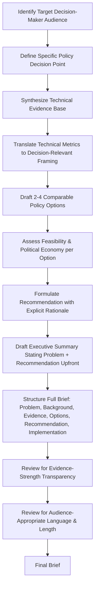

## Writing a Health Policy Brief

### Definition and Purpose

A health policy brief is a concise, evidence-based document designed to inform a specific decision-maker audience (legislators, ministry officials, agency administrators, funders) about a health policy problem and recommend a course of action, distinguished from an academic paper by its audience-driven structure, brevity, and explicit orientation toward actionable decision-making rather than comprehensive literature review.

**Key Points:**

- A policy brief is fundamentally an act of **audience-targeted evidence translation** — converting the technical, methodologically-hedged content typical of academic health economics analysis (as produced throughout this syllabus) into a decision-actionable format for a non-specialist, time-constrained reader
- This is the applied capstone counterpart to every technical module preceding it in this syllabus: a policy brief on any topic in this document (foreign aid financing, UHC design, value-based care transformation, pandemic preparedness) draws directly on the analytical frameworks, formulas, and evidence patterns established in those modules, translated into the structure below

### Core Structural Components

| Section | Function | Typical Length |
| --- | --- | --- |
| Title | States the policy issue and, ideally, the recommended direction | One line |
| Executive summary / key messages | Summarizes problem, evidence, and recommendation upfront | 3–5 bullet points or a short paragraph |
| Problem statement | Defines the policy problem and why it demands attention now | 1–2 paragraphs |
| Background/context | Provides necessary technical and situational context | 1–3 paragraphs |
| Evidence synthesis | Presents the relevant data/research supporting the analysis | Core body, often with visual data presentation |
| Policy options | Lays out 2–4 concrete, comparably-structured alternative courses of action | One paragraph or structured comparison per option |
| Recommendation | States the author's/organization's preferred option and rationale | 1 paragraph |
| Implementation considerations | Addresses feasibility, cost, timeline, and political economy | 1–2 paragraphs |
| References/sources | Documents evidentiary basis | Varies by format convention |

**Key Points:**

- The **executive summary placement at the top** (rather than a conclusion at the end, as in academic writing) reflects the core design principle of policy brief writing: assume the reader may only read the first page, so the most important content must appear first, not last — an inversion of conventional academic paper structure
- Not every policy brief includes all components above with equal weight; a brief for an audience already familiar with the background can compress that section substantially, while a brief addressing sharply contested political terrain may expand the policy options section to visibly demonstrate even-handed consideration of alternatives before the recommendation

### Evidence Synthesis Standards

**Distinguishing evidence strength**: A policy brief should transparently signal the strength and certainty of underlying evidence rather than presenting all claims with uniform confidence — directly applying the same evidentiary-labeling discipline used throughout the technical modules in this syllabus (distinguishing established findings from inference, projection, or contested/unsettled claims), since a decision-maker audience specifically needs to know which recommendations rest on strong versus provisional evidence.

**Quantitative framing for decision-maker accessibility**: Where the underlying technical evidence involves formal metrics (ICERs, fiscal space calculations, cross-sector ROI, as introduced across this syllabus's chapters), a policy brief should translate these into decision-relevant comparative framing — e.g., converting a formal ICER into a plain-language cost-per-outcome comparison against a familiar benchmark — while preserving analytical rigor rather than oversimplifying to the point of distortion.

**Balanced options presentation as a credibility mechanism**: Presenting multiple policy options with their genuine tradeoffs, rather than only the author's preferred option, both serves the decision-maker's actual need (they retain the final choice) and enhances the brief's credibility as an evidence-based rather than purely advocacy document — this mirrors the evenhandedness principle applied throughout the technical content in this syllabus when presenting contested-policy topics (e.g., the vertical-versus-horizontal financing debate in the foreign aid financing module, or the multiple financing architecture options in the universal health coverage module).

### Policy Brief Development Process Flow

### Writing Style and Format Conventions

**Key Points:**

- **Plain, direct language over technical jargon**: Where technical terms from the preceding syllabus modules (ICER, fiscal space, risk pooling, capitation) are necessary, a policy brief should define them briefly in accessible terms on first use rather than assuming reader familiarity — the opposite convention from an academic or technical-reference document
- **Visual data presentation**: Charts, simple tables, and infographics are typically preferred over dense narrative data description, since decision-maker audiences are time-constrained and visual formats convey comparative magnitude more quickly than prose
- **Active voice and concrete recommendation language**: Effective policy briefs avoid excessive hedging in the recommendation section specifically (even while preserving appropriate evidence-strength signaling in the evidence section) — a decision-maker audience needs a clear, actionable recommendation, not a diffusely qualified one
- **Length discipline**: Most policy brief formats target roughly 2–4 pages excluding references, reflecting the format's core design constraint around a time-constrained reader — length substantially beyond this typically indicates the document has drifted toward a technical report or academic paper format rather than remaining a true policy brief
- **Institutional/house style conventions**: Specific funders, agencies, and journals (e.g., Health Affairs policy briefs, WHO policy briefs, World Bank policy notes) maintain their own formatting templates; a policy brief author should confirm and follow the target publication or commissioning institution's specific template requirements before drafting

### Framing the Problem Statement

**Key Points:**

- An effective problem statement establishes **why this issue requires decision-maker attention now** — connecting to a specific trigger (new evidence, a funding decision point, an expiring program, a legislative window) rather than presenting the issue as a timeless, abstract concern
- The problem statement should scope the issue to match the brief's actual analytical coverage — a common structural weakness is a problem statement that implies a broader scope than the evidence synthesis and options sections actually address
- Where the topic connects to material covered in the technical modules of this syllabus (e.g., a brief on Medicaid Section 1115 waiver renewal drawing on the financing social determinants of health module, or a brief on ACO contract terms drawing on the value-based care transformation module), the problem statement should establish the specific policy decision point without requiring the reader to already possess that background technical knowledge

### Policy Options and Recommendation Design

**Key Points:**

- **Comparable structuring across options**: Each policy option should be assessed against the same dimensions (cost, expected impact, implementation timeline, political feasibility) to enable genuine decision-maker comparison — an inconsistent evaluation framework across options undermines the brief's analytical credibility
- **Status quo as an explicit option**: Effective policy briefs typically include "continue current approach" as one of the compared options (even when recommending against it), since this establishes the counterfactual baseline against which the recommended option's incremental value is being claimed — directly analogous to the counterfactual/comparator logic embedded in the ICER formula used throughout this syllabus's technical modules
- **Explicit tradeoff acknowledgment in the recommendation**: A credible recommendation section acknowledges the genuine costs or risks of the preferred option rather than presenting it as costlessly superior — mirroring the balanced-perspective principle applied to contested topics throughout this syllabus's technical content

### Implementation Considerations Section

**Key Points:**

- Should address **feasibility constraints** specific to the target jurisdiction/institution: fiscal space availability (see the fiscal space formula in the universal health coverage module), existing institutional capacity, and legal/regulatory authority to implement the recommended option
- Should address **political economy considerations**: which stakeholders bear cost versus benefit under the recommended option, and what opposition or implementation friction is realistically anticipated — connecting to the political-economy themes raised throughout this syllabus (e.g., the preparedness-response funding cliff pattern in the pandemic preparedness module, or the sequencing debate in the universal health coverage module)
- Should specify a **realistic implementation timeline and sequencing**, particularly where the recommendation involves multi-stage capacity-building (e.g., a recommendation drawing on the health system strengthening module's absorptive-capacity constraint should acknowledge that capacity cannot be built instantaneously)

### Practical Example: Structuring a Brief on Value-Based Care Expansion

**Example:**

A state health agency has commissioned a policy brief on whether to expand two-sided risk ACO participation requirements for Medicaid managed care contracts.

1. **Target audience identification**: State legislature Medicaid oversight committee — time-constrained, not health-economics specialists, deciding on a specific budget/regulatory authorization
2. **Problem statement**: Frame around the specific decision point (e.g., an upcoming Medicaid managed care contract renewal cycle), not value-based care as an abstract topic
3. **Evidence synthesis**: Draw on the value-based care transformation module's payment-model spectrum and shared-savings evidence, translated into plain-language framing (e.g., converting the shared-savings formula into a concrete dollar-impact illustration rather than presenting the formula itself)
4. **Policy options**: Structure 3 comparable options — (a) maintain current one-sided-risk-only requirement, (b) mandate two-sided risk participation on a defined timeline, (c) offer voluntary two-sided risk with enhanced shared-savings rate incentive — each assessed on cost, expected Medicaid spending impact, and provider readiness
5. **Recommendation**: State a clear preferred option with explicit acknowledgment of its primary risk (e.g., smaller-practice disadvantage under mandatory two-sided risk, as discussed in the value-based care transformation module)
6. **Implementation considerations**: Address the population health management infrastructure investment requirement (from the value-based care module) and realistic multi-year transition timeline rather than assuming immediate full-scale readiness

### Common Pitfalls

**Key Points:**

- **Burying the recommendation**: Placing the actual recommendation only at the end of a long document rather than signaling it in the executive summary, defeating the format's core time-constrained-reader design purpose
- **Excessive technical density**: Reproducing academic-paper-level methodological detail (e.g., full formula derivations, extensive citation of competing study designs) rather than translating findings into decision-relevant conclusions with technical support available in an appendix or references rather than the main narrative
- **False balance or advocacy imbalance**: Either presenting a predetermined conclusion without genuine consideration of alternatives (undermining credibility), or over-correcting into such exhaustive both-sidesing that no clear recommendation emerges (defeating the format's decision-support purpose) — the appropriate balance mirrors the evenhandedness-with-a-clear-answer approach modeled throughout this syllabus's own treatment of contested topics
- **Ignoring implementation feasibility**: Presenting a technically sound recommendation without addressing whether the target institution has the fiscal space, legal authority, or administrative capacity to actually implement it — producing a technically correct but practically unusable brief

### Next Steps

**Related Topics:**

- Audience analysis and stakeholder mapping techniques for policy communication
- Data visualization principles for non-specialist decision-maker audiences
- Institutional house-style conventions across major health policy publishers (Health Affairs, WHO, World Bank)
- Political economy analysis frameworks for implementation feasibility assessment
- Translating formal cost-effectiveness metrics (ICER, ROI) into plain-language decision-maker framing
- Comparative policy options analysis and status-quo counterfactual framing
- Applying syllabus technical modules (financing, governance, VBC, preparedness) as evidence bases for capstone policy brief topics
- Peer review and institutional clearance processes for policy brief publication