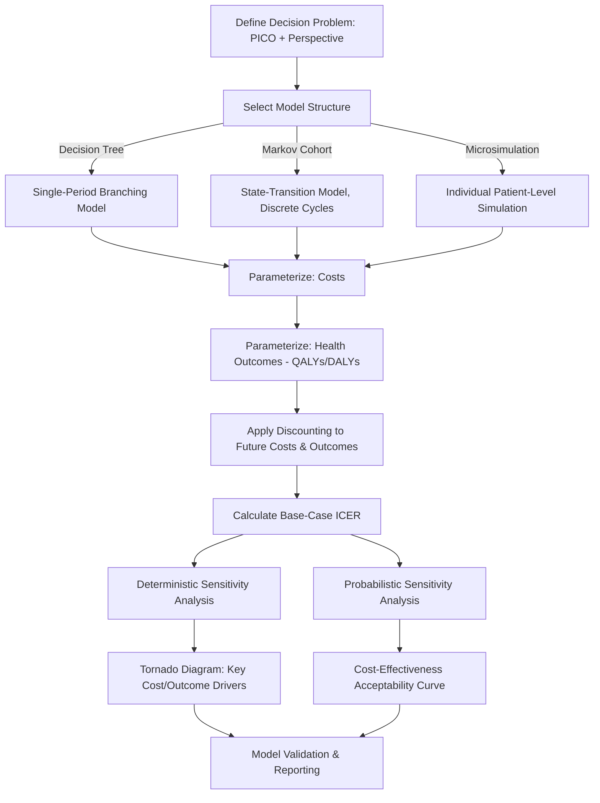

## Building a Cost-Effectiveness Model From Scratch

### Definition and Purpose

A cost-effectiveness model is a structured quantitative framework that simulates the costs and health outcomes of two or more comparator interventions over a defined time horizon, producing an Incremental Cost-Effectiveness Ratio (ICER) or related decision-analytic output to support resource allocation decisions. This module provides the applied, build-it-yourself technical counterpart to the ICER formula referenced conceptually throughout this syllabus's prior modules.

**Key Points:**

- This is a capstone technical skill synthesizing the ICER logic introduced across nearly every prior module in this syllabus — foreign aid financing's intervention prioritization, universal health coverage's benefits package rationing, precision medicine's joint test-treatment evaluation, pandemic preparedness's probability-weighted extension, and value-based care's shared-savings benchmark logic all rest on the same underlying modeling architecture developed here
- Building a model from scratch (versus adapting an existing published model) requires explicit decisions across five structural domains: model type, perspective, time horizon, cost/outcome parameterization, and uncertainty analysis approach — each addressed in turn below

### Step 1: Define the Decision Problem and Perspective

**Key Points:**

- **PICO-style framing**: Specify the Population, Intervention, Comparator(s), and Outcome(s) with precision before any quantitative work begins — an underspecified decision problem is the single most common source of downstream model design errors
- **Analytic perspective selection**: Determine whose costs and benefits the model will count — health system/payer perspective (only direct medical costs), or societal perspective (also including patient time cost, productivity loss, and costs borne outside the formal health sector) — as referenced in the AI applications in healthcare delivery module's discussion of perspective-selection inconsistency as a documented evaluation weakness
- **Comparator selection, including status quo**: At minimum, include the current standard-of-care or "do nothing" option as an explicit comparator, mirroring the status-quo-as-explicit-option principle discussed in the health policy brief module — this comparator defines the counterfactual against which incremental cost and effect are measured

### Step 2: Choose a Model Structure

| Model Type | Structure | Best Suited For |
| --- | --- | --- |
| Decision tree | Branching probability structure over a single time period | Acute conditions with short-term, well-defined outcome pathways |
| Markov (cohort state-transition) model | Population moves between defined health states over discrete cycles, with transition probabilities | Chronic conditions with recurring events over a long time horizon |
| Microsimulation (individual-level) model | Simulates individual patient trajectories rather than population-level state proportions | Conditions with significant patient heterogeneity or where individual history affects future risk (memory-dependent processes) |
| Discrete event simulation | Continuous-time simulation of individual events without fixed cycle length | Complex care pathways with resource constraints or queuing (e.g., hospital capacity modeling) |

**Key Points:**

- **Markov models** are the dominant structure in applied health economics for chronic disease evaluation because most chronic conditions are naturally represented as movement between defined health states (e.g., well, disease progression stages, death) over repeated time cycles
- **The Markov (memoryless) assumption** — that transition probability out of a state depends only on the current state, not on how the patient arrived there — is a simplifying assumption that may not hold for conditions where treatment history affects future risk; microsimulation is the standard remedy when this assumption is materially violated
- Model structure choice should be driven by the clinical/epidemiological nature of the condition and decision problem, not by modeler familiarity or software convenience — an inappropriate structure choice (e.g., a simple decision tree for a lifetime chronic-disease evaluation) is a common source of methodologically weak models

### Step 3: Specify the Time Horizon and Cycle Length

**Key Points:**

- **Time horizon** should generally extend long enough to capture all material cost and outcome differences between comparators — for interventions with long-term/lifetime effects (e.g., a preventive intervention or a chronic-disease treatment), this typically means a lifetime horizon rather than an artificially truncated short-term window that would bias the ICER by excluding downstream benefits or costs
- **Cycle length** (for Markov models) should be short enough to capture clinically meaningful transitions without unnecessary computational complexity — common conventions include monthly, quarterly, or annual cycles depending on how quickly the modeled condition progresses
- **Half-cycle correction**: A standard technical adjustment in cycle-based models correcting for the assumption that state transitions occur at the cycle midpoint rather than instantaneously at cycle start or end, preventing systematic over- or under-counting of accumulated costs and outcomes

### Step 4: Parameterize Costs

**Key Points:**

- **Direct medical costs**: Intervention/drug acquisition cost, administration cost, monitoring cost, and cost of managing adverse events or downstream complications — sourced from costing studies, administrative claims data, or published unit-cost references specific to the target health system
- **Indirect/productivity costs** (societal perspective only): Patient and caregiver time cost, lost productivity — valued using standard methods such as the human capital approach (valuing lost time at market wage) or the friction-cost approach (valuing only the period until a replacement worker is found), a methodological choice with materially different cost estimates
- **Cost data sourcing hierarchy**: Prefer local/target-jurisdiction cost data where available; when unavailable, published costing studies from comparable health systems can be used with explicit transparency about the resulting uncertainty this introduces — directly connecting to the LMIC-context evidence-gap theme raised across multiple prior modules (precision medicine, digital health) in this syllabus
- **Discounting future costs**: Apply a standard discount rate (commonly 3% annually in many health-economics conventions, though this varies by jurisdiction and institutional guideline) to future-year costs to express them in present-value terms, following the same time-value-of-money logic as standard financial analysis

### Step 5: Parameterize Health Outcomes

**Key Points:**

- **Quality-Adjusted Life Years (QALYs)** are the dominant outcome metric in cost-utility analysis (a specific form of cost-effectiveness analysis), calculated as life years lived weighted by a health-state utility value (0 = death, 1 = perfect health, with intermediate values representing states of reduced health-related quality of life)
- **Disability-Adjusted Life Years (DALYs)**, used extensively in global health contexts (referenced throughout the global and development health economics chapter of this syllabus), represent the inverse framing — years of healthy life lost due to disease burden — combining years lived with disability and years of life lost to premature mortality
- **Utility value sourcing**: Health-state utility values are typically drawn from standardized preference-elicitation instruments (e.g., the EQ-5D) applied to the relevant patient population, or from published utility studies for comparable conditions when primary data collection is infeasible
- **Discounting future health outcomes**: Future QALYs/DALYs are discounted using the same principle as future costs (Step 4), typically at the same or a methodologically justified different rate, following applicable institutional guidance

### Model Architecture Flow

### Step 6: Calculate the Base-Case ICER

**Standard ICER formula** (the foundational calculation, applied consistently throughout this syllabus and now formally derived from the modeled cost and outcome streams built in Steps 4–5):

$$\text{ICER} = \frac{C_{\text{intervention}} - C_{\text{comparator}}}{E_{\text{intervention}} - E_{\text{comparator}}}$$

where $C$ represents total discounted cost across the model's full time horizon (Step 3) and $E$ represents total discounted health effect (QALYs or DALYs, Step 5), each summed across all modeled cycles/states for both the intervention and comparator arms.

**Net monetary benefit (NMB)** — an alternative decision-rule formulation avoiding certain ICER interpretation ambiguities (e.g., ICER interpretation becomes unstable when incremental effect is very small or negative):

$$\text{NMB} = (E_{\text{intervention}} - E_{\text{comparator}}) \times \lambda - (C_{\text{intervention}} - C_{\text{comparator}})$$

where $\lambda$ is the decision-maker's willingness-to-pay threshold per unit of health effect (e.g., per QALY) — an intervention is favored under this decision rule whenever NMB is positive, avoiding the need to interpret a ratio directly.

### Step 7: Conduct Sensitivity and Uncertainty Analysis

**Key Points:**

- **Deterministic (one-way) sensitivity analysis**: Vary each input parameter individually across a plausible range while holding all others constant, identifying which parameters most influence the ICER — typically visualized as a **tornado diagram** ranking parameters by their impact magnitude
- **Probabilistic sensitivity analysis (PSA)**: Assign probability distributions (rather than point estimates) to uncertain input parameters and run the model repeatedly (typically thousands of Monte Carlo iterations, as referenced in the precision medicine module's Monte Carlo simulation discussion) to generate a distribution of possible ICER outcomes rather than a single point estimate
- **Cost-Effectiveness Acceptability Curve (CEAC)**: A standard PSA output showing the probability an intervention is cost-effective across a range of willingness-to-pay thresholds, allowing decision-makers to see how the conclusion's robustness varies with the threshold assumption — directly relevant to the threshold-setting debates referenced in the universal health coverage module (the critiqued WHO-CHOICE GDP-multiple heuristic versus opportunity-cost-based thresholds)
- **Scenario analysis**: Testing model outputs under specific alternative structural assumptions (e.g., a different time horizon, an alternative comparator, a different cost-data source) rather than continuous parameter variation, useful for exploring qualitatively distinct "what-if" situations rather than quantifying parameter uncertainty per se

### Model Validation

**Key Points:**

- **Face validity**: Confirm the model's structure and assumptions are clinically and logically sensible to subject-matter experts before relying on its outputs
- **Internal validity**: Verify the model is mathematically correct and free of programming/calculation errors — commonly checked through extreme-value testing (setting an input to a boundary value and confirming the model behaves as logically expected) and independent code/formula review
- **External validity**: Where possible, compare model-projected outcomes (e.g., projected survival or event rates) against independently observed real-world data or published trial/registry results for the modeled population, to confirm the model reproduces known real-world patterns before trusting its projections into new counterfactual scenarios
- **Cross-model validation**: Comparing results against other independently built models addressing the same decision problem (where they exist) can identify structural or parameter assumption differences driving divergent conclusions — directly relevant given this syllabus's repeated observation (digital health, AI, precision medicine modules) that health-economic evaluation results are often heterogeneous and methodology-dependent across studies

### Common Pitfalls in Model Building

**Key Points:**

- **Perspective inconsistency**: Mixing societal-perspective costs (e.g., productivity loss) with a payer-perspective willingness-to-pay threshold, producing an internally inconsistent evaluation — directly echoing the perspective-selection ambiguity flagged as a documented weakness in the AI applications in healthcare delivery module
- **Inappropriate time horizon truncation**: Artificially shortening the time horizon in a way that excludes material downstream costs or benefits, systematically biasing the ICER — particularly relevant for preventive interventions (as discussed in the precision medicine module) where benefit accrual is heavily back-loaded relative to upfront cost
- **Overstating precision given input uncertainty**: Reporting a single-point ICER without accompanying sensitivity/uncertainty analysis overstates the model's actual epistemic confidence — this directly parallels this syllabus's recurring [Inference]/[Unverified] labeling discipline, now operationalized as a formal quantitative requirement (PSA and CEAC) rather than a qualitative caveat
- **Structural model misspecification**: Selecting an inappropriate model type for the underlying clinical process (e.g., a Markov model when treatment history materially affects future risk, violating the memoryless assumption) — see Step 2 above
- **Insufficiently transparent reporting**: Failing to clearly document all structural assumptions, data sources, and parameter values in a way that allows external reviewers to reproduce or critique the model — a transparency standard increasingly formalized through published reporting guidelines (e.g., CHEERS — Consolidated Health Economic Evaluation Reporting Standards)

### Practical Example: Building a Simple Markov Model Walkthrough

**Example:**

Building a cost-utility model comparing a new chronic disease treatment against standard care.

1. **Decision problem**: Population = adults newly diagnosed with the target condition; Intervention = new treatment; Comparator = standard care; Perspective = health system
2. **Model structure**: Three-state Markov model (well-controlled disease, disease progression, death), annual cycles, lifetime horizon
3. **Transition probabilities**: Sourced from clinical trial data or published natural-history studies for each arm
4. **Cost parameterization**: Annual treatment cost, monitoring cost, and progression-state management cost for each health state, sourced from local unit-cost data where available
5. **Outcome parameterization**: EQ-5D-derived utility values assigned to each health state, informing the QALY calculation for each modeled cycle
6. **Discounting**: Apply the institutionally standard discount rate to both cost and QALY streams beyond year one
7. **Base-case ICER calculation**: Sum discounted costs and QALYs across the full lifetime horizon for both arms, apply the standard ICER formula
8. **Sensitivity analysis**: Run one-way sensitivity analysis on the most uncertain parameters (typically transition probabilities and cost estimates), generate a tornado diagram, then run full PSA to generate a CEAC across a plausible willingness-to-pay threshold range
9. **Validation**: Confirm projected survival curves align reasonably with published epidemiological data for the modeled condition before finalizing conclusions
10. **Reporting**: Document the full model per CHEERS-type reporting standards, enabling downstream use in a policy brief (see the health policy brief module) that translates the technical ICER output into decision-relevant recommendation framing for a non-specialist audience

### Next Steps

**Related Topics:**

- CHEERS (Consolidated Health Economic Evaluation Reporting Standards) reporting guideline in full detail
- Markov model transition probability estimation methods (trial-based versus natural-history-based)
- EQ-5D and other standardized health-state utility elicitation instruments
- Probabilistic sensitivity analysis software implementation (e.g., R-based or Excel-based Monte Carlo methods)
- Discount rate selection conventions and controversies across jurisdictions and institutions
- Microsimulation model design for conditions violating the Markov memoryless assumption
- Net monetary benefit versus ICER as alternative decision-rule formulations
- Willingness-to-pay threshold determination methodology: opportunity-cost-based versus GDP-multiple heuristics (see universal health coverage module)
- Translating a completed cost-effectiveness model into a decision-maker-facing policy brief (see prior module)