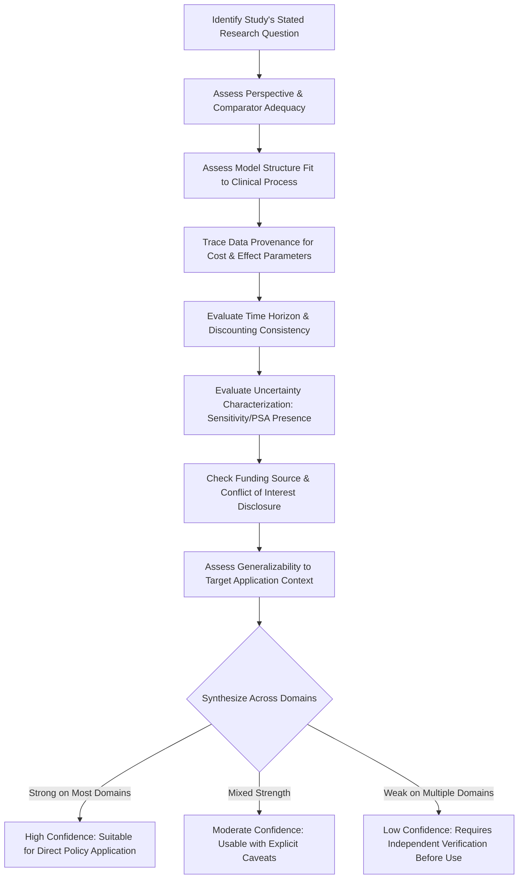

## Critiquing Published Health Economics Studies

### Definition and Purpose

Critiquing a published health economics study is the structured, methodological evaluation of a study's design, evidence quality, and conclusions to determine how much confidence its findings warrant and how appropriately they can inform a specific decision. This capstone skill directly operationalizes the evidence-quality distinctions applied implicitly throughout every technical module in this syllabus — the "[Inference]," "[Unverified]," and evidence-heterogeneity flags used repeatedly in prior modules reflect exactly this critical-appraisal discipline, now made explicit and systematic.

**Key Points:**

- Critique is distinct from summary: summarizing restates what a study found; critiquing assesses whether the study's design and execution justify the confidence with which those findings are presented, and whether/how they generalize beyond the study's specific context
- This skill directly complements the cost-effectiveness model-building module (Step 7's validation discussion) and the policy brief-writing module (evidence-strength transparency discussion) — critical appraisal is the analytical bridge connecting raw published evidence to responsible model-building and policy translation

### Core Appraisal Domains

| Domain | Key Question | Common Red Flags |
| --- | --- | --- |
| Study design and methodology | Is the analytic approach appropriate to the research question? | Mismatched design (e.g., decision tree for a lifetime chronic condition, as flagged in the model-building module) |
| Perspective and scope | Is the stated analytic perspective consistently applied? | Perspective inconsistency (mixing societal costs with payer-perspective thresholds) |
| Data sources and parameter quality | Are cost/effect inputs drawn from credible, appropriately-matched sources? | Reliance on outdated, non-generalizable, or poorly-matched secondary data |
| Time horizon and discounting | Does the horizon capture all material costs/effects? Is discounting applied consistently? | Artificially truncated horizon systematically excluding downstream costs or benefits |
| Uncertainty and sensitivity analysis | Does the study appropriately characterize confidence in its findings? | Single-point ICER reported without sensitivity or probabilistic analysis |
| Funding source and conflict of interest | Could funding source plausibly bias study design or reporting? | Industry-funded evaluation without independent replication, absent explicit disclosure |
| Generalizability | Does the study population/setting match the context where findings will be applied? | Extrapolating a high-income-country finding directly to an LMIC context without adjustment |

**Key Points:**

- These seven domains are not independently weighted checkboxes — a study can be strong on some dimensions and weak on others, and the appropriate critique synthesizes across domains to reach an overall confidence judgment rather than a simple pass/fail determination
- This table's structure directly mirrors the pitfall categories identified in the cost-effectiveness model-building module (Step 7 and the common-pitfalls section), since critiquing a published study and avoiding pitfalls when building one's own model are two applications of the same underlying methodological literacy

### Assessing Study Design Appropriateness

**Model structure fit**: Applying the model-type criteria from the cost-effectiveness modeling module, a critical reader should ask whether the study's chosen structure (decision tree, Markov, microsimulation, discrete event simulation) genuinely fits the clinical process being modeled — a Markov model applied to a condition where treatment history materially affects future risk (violating the memoryless assumption) warrants explicit scrutiny of whether that structural choice biases the reported ICER.

**Comparator adequacy**: Confirm the study includes a genuinely relevant comparator, ideally including current standard-of-care or status-quo as a baseline (as emphasized in both the model-building and policy-brief modules) — a study comparing only against an outdated or already-superseded treatment can produce a misleadingly favorable ICER for the intervention of interest relative to what a genuinely current-practice comparison would show.

**Sample size and statistical power** (for studies incorporating primary trial or observational data): Assess whether the underlying clinical effectiveness data has adequate statistical power to support the precision implied by the reported point estimates, particularly for subgroup analyses (directly relevant to the precision medicine module's stratified-population evaluation context, where subgroup sample sizes are frequently smaller than the overall trial population).

### Assessing Data Quality and Parameter Sourcing

**Key Points:**

- **Source-target population match**: Evaluate whether cost and utility parameters were drawn from a population and health-system context genuinely comparable to the study's stated target application — directly extending the LMIC evidence-generalizability gap theme raised across the digital health, precision medicine, and cost-effectiveness modeling modules in this syllabus
- **Recency of cost data**: Health care costs, drug prices, and care patterns change over time; a critical reader should assess whether cost inputs reflect current practice or rely on outdated sources whose relevance to a present-day decision may have eroded
- **Transparency of data provenance**: A well-reported study specifies exactly where each parameter value originated (a named trial, a published costing study, expert elicitation) rather than presenting parameter values without traceable sourcing — poor traceability is itself a red flag independent of whether the underlying values happen to be reasonable
- **Circularity risk**: Where a study's effectiveness data derives from the same organization or research group commercializing the evaluated intervention, assess whether independent replication or triangulation exists — directly connecting to the systematic-optimism risk flagged explicitly in the precision medicine module's discussion of AI-empowered precision medicine cost-effectiveness evidence

### Assessing Uncertainty Characterization

**Key Points:**

- A rigorously reported study should include, at minimum, one-way deterministic sensitivity analysis (ideally visualized via tornado diagram, per the model-building module) and probabilistic sensitivity analysis generating a Cost-Effectiveness Acceptability Curve — absence of either is a documented weakness rather than a neutral omission
- Assess whether the sensitivity analysis actually varies the parameters most likely to be uncertain or contested, rather than performing sensitivity analysis only on parameters the study's own base case is robust to (a subtle way an evaluation can appear methodologically rigorous while avoiding genuine stress-testing of its most vulnerable assumptions)
- Where a study reports a single favorable ICER without accompanying uncertainty bounds, this should be read with the same caution this syllabus has applied throughout to single-point aggregate claims — for example, the caution urged in the AI applications in healthcare delivery module against extrapolating from limited high-quality studies to sweeping aggregate savings claims

### Critical Appraisal Process Flow

### Assessing Funding Source and Conflict of Interest

**Key Points:**

- Industry or vendor funding does not automatically invalidate a study's findings, but it warrants heightened scrutiny of study design choices (comparator selection, outcome definition, time horizon) that could plausibly favor the funder's product — a critical reader should specifically check whether design choices appear methodologically justified independent of who funded the work
- Assess whether the study was conducted or reviewed by parties independent of the intervention's developer/manufacturer, and whether findings have been independently replicated — directly relevant to the systematic-optimism risk flagged in both the precision medicine and AI applications modules of this syllabus
- Absence of a conflict-of-interest disclosure statement is itself a red flag regarding reporting transparency, independent of whether an actual conflict exists

### Assessing Generalizability

**Key Points:**

- **Population match**: Does the study's patient population (age distribution, disease severity mix, comorbidity profile) match the population to which findings will be applied?
- **Health system context match**: Cost structures, care delivery patterns, and baseline standard-of-care vary substantially across health systems and countries — a favorable ICER established in one health system context does not automatically transfer to a different institutional or national context, a theme raised explicitly across the global and development health economics chapter of this syllabus (e.g., the high-income-country evidence concentration noted in both the digital health and precision medicine modules)
- **Temporal validity**: Findings based on cost or practice patterns from several years prior may not reflect current standard-of-care, particularly in rapidly evolving fields (directly relevant to the AI applications module's dynamic-model-evolution critique, where an AI tool's economic evaluation may already be outdated by the time of publication due to subsequent model updates)

### Reporting Standards as an Appraisal Tool

**Key Points:**

- **CHEERS (Consolidated Health Economic Evaluation Reporting Standards)**, introduced in the cost-effectiveness modeling module, functions dually as a model-building guideline and as a structured checklist for critiquing published studies — a critical reader can systematically assess whether a published study addresses each CHEERS-recommended reporting element (perspective, time horizon, discount rate, uncertainty analysis, funding disclosure) as a practical, reproducible appraisal method
- Studies that transparently follow a recognized reporting standard are generally easier to critique rigorously (since required elements are present and locatable) than studies with idiosyncratic or incomplete reporting — reporting-standard adherence is itself a proxy signal of overall methodological care, though not a guarantee of substantive quality

### Common Critique Pitfalls (Critiquing the Critique)

**Key Points:**

- **Rejecting a study solely for reporting favorable industry-funded results**: Funding source should heighten scrutiny, not serve as an automatic disqualifier — a methodologically sound, industry-funded study can still provide valid evidence, and dismissing it outright without substantive engagement is itself an analytical shortcut rather than genuine critique
- **Overweighting a single study's limitations without triangulating across the broader evidence base**: Consistent with the evidence-heterogeneity pattern observed across the digital health, AI, and precision medicine modules in this syllabus, a single study's weaknesses should be assessed in the context of the broader literature on that topic — a systematic review or meta-analysis's synthesis findings generally warrant more confidence than an individual study's isolated conclusions, though systematic reviews are themselves subject to the same appraisal domains applied to their constituent studies
- **Conflating "uncertain" with "wrong"**: A study reporting wide confidence intervals or an unfavorable Cost-Effectiveness Acceptability Curve result at conventional thresholds is not thereby methodologically weak — appropriately reported uncertainty is a mark of rigor, not a flaw, and should be distinguished from genuine methodological weaknesses (missing sensitivity analysis, poor data provenance, perspective inconsistency)
- **Applying appraisal criteria mechanically without judgment**: The appraisal domains in this module are a structured framework for evaluation, not a rigid checklist where partial non-compliance automatically disqualifies a study — as emphasized above, the appropriate output is a synthesized confidence judgment, not a binary accept/reject determination

### Practical Example: Critiquing a Hypothetical Published Study Walkthrough

**Example:**

Applying this module's framework to a hypothetical published cost-effectiveness study claiming a novel digital therapeutic is cost-saving for a chronic condition.

1. **Design appropriateness check**: Confirm the study uses a model structure appropriate to a chronic, recurring condition (a Markov or microsimulation approach, not a single-period decision tree) — flag if mismatched, per the model-building module's Step 2 criteria
2. **Perspective and comparator check**: Confirm the stated perspective is applied consistently throughout, and that the comparator reflects genuine current standard-of-care rather than an outdated practice pattern
3. **Data provenance trace**: Identify the source of each key cost and utility parameter; flag any parameters sourced from a context (population, health system, time period) that diverges materially from the study's stated target application
4. **Uncertainty characterization check**: Confirm presence of both deterministic sensitivity analysis (tornado diagram) and probabilistic sensitivity analysis (CEAC); flag absence of either as a documented reporting weakness
5. **Funding and conflict-of-interest check**: Identify the funding source; if industry-funded, assess whether design choices (comparator, time horizon, outcome definition) appear independently justifiable rather than favorably constructed
6. **Generalizability assessment**: Compare the study's population and health-system context against the specific context where the reader intends to apply the findings (e.g., a different country's health system, per the global and development health economics chapter's recurring evidence-transferability theme)
7. **Synthesis**: Weigh findings across all six preceding steps to reach an overall confidence judgment — e.g., "moderate confidence, usable to inform but not solely determine a policy decision, pending independent replication" — directly feeding into the evidence-strength transparency the policy brief-writing module requires when this study is subsequently cited in a decision-maker-facing document

### Next Steps

**Related Topics:**

- CHEERS checklist application as a systematic critical-appraisal tool
- Systematic review and meta-analysis methodology as an evidence-synthesis complement to single-study critique
- Risk-of-bias assessment frameworks (e.g., Cochrane Risk of Bias tools) adapted to health economic evaluation
- Conflict-of-interest disclosure norms and industry-funded health economics research
- Generalizability and transferability frameworks for adapting published cost-effectiveness findings across health system contexts
- Connecting critical appraisal to the cost-effectiveness model-building module's validation step
- Connecting critical appraisal to evidence-strength transparency in the health policy brief-writing module
- Peer review processes in health economics journals and their role in pre-publication quality control