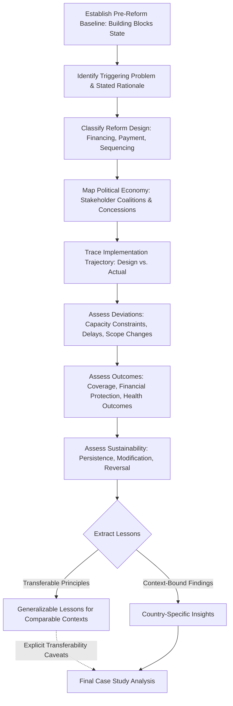

## Health System Reform Case Study Analysis

### Definition and Purpose

Health system reform case study analysis is the structured method for examining a specific country's or jurisdiction's health system reform — its design, implementation, and outcomes — to extract generalizable lessons while appropriately accounting for context-specific factors that limit direct transferability. This capstone skill synthesizes nearly every prior module in this syllabus into a single applied analytical exercise: a rigorous case study draws on financing architecture concepts (foreign aid financing, universal health coverage), governance frameworks (global health governance), building-block interdependency (health system strengthening), and critical appraisal discipline (critiquing published studies) simultaneously.

**Key Points:**

- Case study analysis differs from single-study critique (prior module) in scope and object: rather than appraising one published economic evaluation, it examines an entire reform process — its political origins, design choices, implementation trajectory, and multi-dimensional outcomes — over an extended time period
- The central analytical tension in case study work is **balancing rich contextual specificity against generalizable lesson extraction** — a case study that is purely descriptive of one country's unique circumstances yields limited transferable value, while one that over-generalizes from a single case risks the same overreach this syllabus has repeatedly flagged in aggregate claims (e.g., the AI applications module's caution against extrapolating from limited studies to sweeping conclusions)

### Structuring the Case Study Framework

| Analytical Dimension | Core Questions | Relevant Prior Module |
| --- | --- | --- |
| Pre-reform context | What problem was the reform designed to solve? What was the baseline health system state? | Health system strengthening (building blocks baseline) |
| Reform design | What financing, governance, and delivery-model choices were made? Why? | UHC financing architecture, value-based care payment spectrum |
| Political economy of adoption | What stakeholder coalitions enabled or resisted the reform? | Health policy brief (implementation considerations) |
| Implementation trajectory | How did the reform unfold in practice versus as designed? What deviations occurred? | Health system strengthening (absorptive capacity, time-lag problem) |
| Outcomes assessment | What changed in service coverage, financial protection, and health outcomes? | UHC's SCI and catastrophic expenditure metrics; cost-effectiveness modeling |
| Sustainability and evolution | Has the reform persisted, been modified, or reversed over time? | Foreign aid financing's funding-cliff and transition-financing themes |

**Key Points:**

- This six-dimension structure ensures a case study addresses not only *what happened* but *why*, and not only *initial outcomes* but *durability* — a common weakness in less rigorous case study work is stopping at the implementation-trajectory stage without following through to longer-term sustainability assessment
- Each dimension should draw explicitly on the analytical vocabulary and frameworks established in the corresponding prior module (right column) rather than treating the case study as a purely narrative/journalistic account — this is what distinguishes a health-economics case study analysis from general health policy journalism

### Assessing Pre-Reform Context

**Key Points:**

- Establish the baseline health system state across the WHO building blocks framework (health system strengthening module) — service delivery capacity, workforce density, information system maturity, financing structure, and governance baseline — since reform impact can only be properly assessed relative to a well-characterized starting point
- Identify the specific triggering problem(s) motivating reform: a fiscal crisis, a coverage gap, a quality/outcomes failure, external donor/multilateral pressure (connecting to the foreign aid financing and global health governance modules), or a political mandate — the nature of the trigger often shapes subsequent design choices in identifiable ways
- Distinguish stated/official reform rationale from underlying political economy drivers where these diverge, since publicly stated reform justifications do not always fully capture the actual coalition of interests motivating the specific design choices made

### Assessing Reform Design Choices

**Key Points:**

- **Financing architecture classification**: Situate the reform's financing model within the taxonomy established in the universal health coverage module (tax-funded, social health insurance, community-based insurance, hybrid) and identify which point along the UHC coverage cube's three axes (population, services, cost coverage) the reform prioritized first
- **Provider payment mechanism choice**: Classify the reform's payment approach using the provider payment taxonomy from the universal health coverage and value-based care transformation modules (fee-for-service, capitation, case-based, global budget, shared-savings/risk arrangements) and assess whether the chosen mechanism's incentive structure aligns with the reform's stated goals
- **Sequencing strategy**: Assess whether the reform followed a population-first, benefits-package-first, or simultaneous expansion strategy across the UHC cube's three dimensions, and whether this sequencing reflects the political-economy sequencing pattern discussed in the universal health coverage module (population breadth typically prioritized first due to political visibility)
- **Vertical versus horizontal orientation**: For reforms with a disease-specific or program-specific component, assess where the reform sits on the vertical-horizontal-diagonal spectrum introduced in the foreign aid financing and health system strengthening modules

### Assessing Political Economy of Adoption

**Key Points:**

- Identify which stakeholder groups (provider associations, insurers, labor unions, patient advocacy groups, subnational governments, external donors) supported versus opposed the reform, and what specific design concessions or compromises emerged from that negotiation process
- Assess the role of external actors where relevant — donor conditionality, multilateral technical assistance, or global governance pressure (directly connecting to the foreign aid financing and global health governance modules) — distinguishing externally-driven from domestically-originated reform impetus, since this distinction often predicts differential political durability
- Apply the implementation-feasibility and political-economy assessment principles from the health policy brief module's "implementation considerations" section retrospectively — a well-constructed case study essentially reverse-engineers what a policy brief supporting (or opposing) the reform would have needed to address at the time of adoption

### Case Study Analytical Flow

### Assessing Implementation Trajectory

**Key Points:**

- Compare the reform's actual implementation pathway against its original design and timeline, explicitly documenting deviations — delayed rollout phases, scope reductions, unplanned design modifications made in response to early implementation feedback
- Apply the absorptive-capacity constraint concept from the health system strengthening module to assess whether implementation pace was appropriately calibrated to underlying system capacity, or whether the reform attempted to scale faster than workforce, financing administration, or information-system capacity could support
- Assess whether the time-lag problem (health system strengthening module) is evident — i.e., whether early implementation-period outcome data show limited apparent impact due to the structural lag between systems investment and measurable outcome change, which should caution against premature judgment of reform "failure" based only on short-term post-implementation data

### Assessing Outcomes

**Key Points:**

- **Service coverage outcomes**: Apply the UHC Service Coverage Index framework (universal health coverage module) or condition-specific coverage indicators to assess whether the reform achieved its stated service-coverage goals
- **Financial protection outcomes**: Apply the catastrophic and impoverishing health expenditure metrics (universal health coverage module) to assess whether the reform improved financial protection, independent of whether service coverage expanded
- **Health outcome measures**: Where available, assess downstream population health indicators, applying appropriate caution regarding attribution (the attribution problem discussed in the health system strengthening module) given that health outcomes are influenced by many factors beyond the specific reform under study
- **Efficiency outcomes**: Where data permits, apply technical efficiency concepts (Data Envelopment Analysis or Stochastic Frontier Analysis, introduced in the health system strengthening module) to assess whether the reform improved the health system's input-output efficiency frontier, not merely its absolute spending or coverage levels
- **Counterfactual awareness**: Explicitly acknowledge that observed post-reform outcomes reflect the combined effect of the reform and any concurrent secular trends or other policy changes, distinguishing (where evidence permits) reform-attributable effects from broader contextual trends — directly applying the attribution-and-counterfactual discipline embedded in the ICER formula's comparator logic throughout this syllabus

### Assessing Sustainability and Evolution

**Key Points:**

- Assess whether the reform has persisted in its original form, been substantially modified, or been partially or fully reversed since initial implementation, and identify the drivers of any such change
- Apply the funding-cliff and transition-financing concepts from the foreign aid financing and universal health coverage modules where the reform depended substantially on donor or time-limited financing, assessing whether a credible domestic financing transition occurred
- Assess whether the reform's political coalition (identified in the political-economy assessment above) has remained stable, and whether subsequent political transitions have threatened or reinforced the reform's continuation — reform durability is often as analytically informative as initial reform design quality

### Extracting Transferable Lessons

**Key Points:**

- **Distinguish context-bound from generalizable findings explicitly**: A case study should clearly flag which findings are likely specific to the studied country's institutional, economic, or political context (e.g., a specific administrative capacity level, a specific political coalition structure) versus which findings plausibly generalize to comparable health system contexts
- **Specify the comparability conditions for transferability**: Rather than claiming a lesson "generalizes," specify the conditions under which it would be expected to generalize (e.g., "this sequencing approach likely transfers to other lower-middle-income contexts with comparable baseline health workforce density, but not to contexts with substantially weaker baseline administrative capacity") — this directly extends the generalizability assessment discipline established in the critiquing published studies module to case-study-level analysis
- **Triangulate against comparative case evidence where available**: A single case study's lessons warrant more confidence when consistent with findings from comparative multi-country case study literature on similar reforms (e.g., the Thailand, Rwanda, Ghana, and Indonesia examples referenced in the universal health coverage module) — isolated single-case findings should be held with appropriately calibrated confidence, echoing the single-study-versus-broader-evidence-base caution from the critiquing published studies module

### Common Pitfalls in Case Study Analysis

**Key Points:**

- **Survivorship/success bias in case selection**: Case studies disproportionately document reforms perceived as successful, understating the evidence base on reforms that failed or were reversed — a critical case study analyst should actively seek out and engage with less-publicized unsuccessful or partially-successful reform cases for balanced comparative learning
- **Retrospective coherence narrative**: There is a documented tendency to construct an overly clean, intentional-seeming narrative of reform design and implementation after the fact, understating the actual messiness, improvisation, and course-correction that characterized real-time implementation — a rigorous case study should resist this narrative-smoothing tendency and document genuine implementation complexity
- **Insufficient counterfactual reasoning**: Attributing all observed post-reform change to the reform itself without considering concurrent secular trends, other simultaneous policy changes, or broader economic conditions — the same attribution discipline emphasized in the health system strengthening and cost-effectiveness modeling modules applies with equal force to case-study-level outcome assessment
- **Premature transferability claims**: Generalizing a single case's lessons to a broad range of contexts without explicit attention to comparability conditions, echoing the aggregate-overreach caution raised repeatedly across this syllabus's technology-focused modules (digital health, AI, precision medicine)

### Practical Example: Structuring a UHC Reform Case Study Walkthrough

**Example:**

Analyzing a hypothetical middle-income country's transition from a fragmented, largely out-of-pocket-financed health system to a unified social health insurance scheme over a decade.

1. **Pre-reform baseline**: Document baseline out-of-pocket spending share, service coverage index, and workforce density prior to reform initiation
2. **Reform design classification**: Classify the new scheme within the UHC financing taxonomy (module reference: social health insurance), identify the chosen provider payment mechanism, and assess sequencing strategy across the coverage cube's three axes
3. **Political economy mapping**: Identify which stakeholders (formal-sector labor, informal-sector representatives, private insurers, provider associations) shaped the final scheme design and what compromises were made (e.g., a phased informal-sector enrollment timeline reflecting the informal-sector enrollment challenge discussed in the UHC module)
4. **Implementation trajectory**: Document actual enrollment growth against original targets, noting any capacity-driven delays in claims processing or provider network development
5. **Outcomes assessment**: Apply the SCI and catastrophic expenditure metrics to assess coverage and financial protection change over the study period, with explicit attention to the multi-year lag before full effects would be expected to materialize
6. **Sustainability assessment**: Assess whether the scheme's financing (e.g., a VAT-linked levy, as in the Ghana NHIS example from the UHC module) has proven fiscally sustainable, and whether subsequent political transitions have altered scheme design
7. **Lesson extraction with explicit transferability conditions**: Conclude with specific, conditionally-scoped lessons (e.g., "the VAT-linked financing approach may transfer well to contexts with a similarly large informal-sector workforce share and comparable VAT administrative capacity") rather than unconditional generalizable claims

### Next Steps

**Related Topics:**

- Comparative multi-country case study methodology and cross-case synthesis techniques
- Political economy analysis frameworks for health reform stakeholder mapping
- Applying Distributional Cost-Effectiveness Analysis (see precision medicine module) to assess reform equity impacts across population subgroups
- Difference-in-differences and other quasi-experimental methods for reform impact attribution
- Connecting case study lessons to policy brief writing for prospective reform design (see health policy brief module)
- Survivorship bias and publication bias in health reform case study literature
- Applying critical appraisal discipline (see critiquing published studies module) to case study evidence itself
- Long-run sustainability assessment methodology for donor-initiated versus domestically-originated reforms