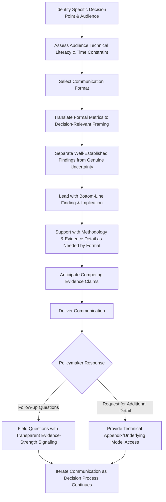

## Communicating Economic Evidence to Policymakers

### Definition and Scope

Communicating economic evidence to policymakers is the applied practice of conveying health-economic findings — cost-effectiveness results, financing analyses, reform outcomes — to decision-makers in a manner that is accurate, appropriately caveated, and genuinely useful for the decision at hand. This capstone module synthesizes the technical content-production skills of the health policy brief module with the broader communication, framing, and stakeholder-engagement dimensions that extend beyond a single written document.

**Key Points:**

- This module is distinct from, though closely related to, the health policy brief-writing module: policy brief writing addresses the structure and content of one specific written artifact, while this module addresses the broader communication practice — oral briefings, iterative stakeholder engagement, framing choices, and the interpersonal/institutional dynamics of evidence uptake — of which a written brief is only one component
- Effective economic evidence communication requires holding two goals in simultaneous tension: **fidelity** (accurately representing what the evidence shows, including its uncertainty and limitations, consistent with the critical-appraisal discipline from the critiquing published studies module) and **utility** (presenting evidence in a form the policymaker can actually act on) — communication that sacrifices either goal for the other produces either an unusable technical document or an irresponsibly oversimplified one

### Understanding the Policymaker Audience

**Key Points:**

- **Time constraint as the dominant design parameter**: Policymakers and their staff typically engage with any single piece of evidence for a very limited window, reinforcing the "assume only the first page is read" principle established in the health policy brief module — this constraint shapes not only document structure but also oral communication: leading with the conclusion, not the methodology
- **Decision-relevance over comprehensiveness**: Policymakers generally need to know what a finding implies for a specific choice in front of them, not a comprehensive account of the evidence base — economic evidence communication should be organized around the decision, not around the academic literature's own internal structure
- **Heterogeneous technical literacy**: Audiences range from specialized health policy staff with substantial technical background to generalist legislators or administrators with none — effective communicators calibrate technical vocabulary and the degree of formula/methodology exposure to the specific audience, applying the plain-language-with-defined-terms principle from the health policy brief module
- **Competing evidence and advocacy pressure**: Policymakers routinely receive economic claims from multiple, sometimes contradictory sources (industry-funded studies, advocacy organizations, competing agencies) — a communicator should anticipate this competitive evidence environment and be prepared to explain why their evidence should be weighted as it should, applying the critical-appraisal domains (funding source, methodology, generalizability) from the critiquing published studies module transparently rather than simply asserting authority

### Framing Economic Evidence for Decision Relevance

**Translating formal metrics into decision-relevant comparisons**: Directly extending the "quantitative framing for decision-maker accessibility" principle from the health policy brief module, formal outputs (ICERs, NMB, fiscal space calculations, cross-sector ROI) should be translated into concrete, decision-relevant comparative framing — for example, converting an ICER into a plain-language "cost per additional year of healthy life compared to what we're currently spending on X" framing, or converting a fiscal space calculation into a concrete "this is equivalent to Y percent of the current health budget" comparison.

**Leading with the bottom line**: Consistent with the executive-summary-first structural principle from the health policy brief module, oral and written communication alike should state the key finding and its implication before walking through supporting methodology — reversing the conventional academic presentation order (methods, then results, then implications).

**Anchoring to the specific decision point**: Effective communication connects evidence directly to the actual choice facing the policymaker (a specific budget line, a specific regulatory decision, a specific program renewal) rather than presenting evidence as general background — directly applying the problem-statement scoping discipline from the health policy brief module to live communication contexts.

### Communicating Uncertainty Without Undermining Utility

**Key Points:**

- **The core communication tension**: Economic evidence virtually always carries uncertainty (parameter uncertainty, structural model uncertainty, generalizability limits, as catalogued across the cost-effectiveness modeling and critiquing published studies modules), but excessive hedging can render a communication unusable for decision-making — effective communicators resolve this tension by clearly separating **what is well-established** from **what remains genuinely uncertain**, rather than applying uniform uncertainty language throughout
- **Visualizing uncertainty rather than only narrating it**: Where a formal Cost-Effectiveness Acceptability Curve (cost-effectiveness modeling module) exists, translating this into a simple visual (e.g., "under low-cost assumptions this is clearly favorable; under high-cost assumptions the case is less clear") often communicates genuine uncertainty more usably to a non-technical audience than reciting confidence intervals numerically
- **Distinguishing "uncertain" from "unfavorable"**: Directly extending the critiquing published studies module's caution against conflating uncertainty with a negative finding, communicators should ensure policymakers understand that wide uncertainty bounds around a positive central estimate is different from genuine evidence of no effect or harm — a distinction easily lost in oversimplified communication
- **Being explicit about what the evidence cannot tell the policymaker**: Directly identifying the boundaries of what the available evidence addresses (e.g., "this evidence tells you the expected cost-effectiveness under X assumptions, but does not address implementation feasibility given your specific administrative capacity") is a mark of communicator credibility, paralleling the "acknowledging genuine costs/risks of the preferred option" principle from the health policy brief module's recommendation-design guidance

### Communication Formats and Channels

| Format | Best Suited For | Key Design Consideration |
| --- | --- | --- |
| Written policy brief | Formal decision documentation, reference material | Structure per the health policy brief module |
| Oral briefing/testimony | Time-limited, interactive engagement with direct Q&A opportunity | Front-load the bottom line even more aggressively than written formats; anticipate likely follow-up questions |
| One-page visual summary/infographic | Extremely time-constrained audiences, legislative settings | Prioritize a single dominant visual conveying the core comparative finding |
| Interactive dashboard/tool | Ongoing monitoring or repeated decision contexts (e.g., budget planning cycles) | Requires sustained data pipeline; risk of over-engineering relative to actual policymaker engagement bandwidth |
| Stakeholder workshop/roundtable | Building shared understanding across a coalition with competing evidence claims | Requires facilitation skill distinct from pure content delivery; opportunity to directly address competing evidence claims |

**Key Points:**

- Format selection should match the actual decision-making context rather than defaulting to whichever format the communicator is most comfortable producing — a rigorously built cost-effectiveness model (cost-effectiveness modeling module) may need to be distilled into a one-page visual summary for a legislative hearing, even though the underlying technical work required far more extensive documentation
- Oral communication carries a distinct risk relative to written communication: without a document the policymaker can review at their own pace, the communicator bears greater responsibility for real-time clarity and must be prepared to field follow-up questions that test the evidence's robustness on the spot

### Evidence-to-Decision Communication Flow

### Navigating Political and Institutional Context

**Key Points:**

- **Distinguishing evidence communication from advocacy**: A communicator's credibility depends on genuinely presenting what the evidence shows, including findings inconvenient to a preferred policy direction, rather than selectively emphasizing favorable findings — directly extending the balanced-options and honest-tradeoff-acknowledgment principles from the health policy brief module to live communication settings, where the temptation toward selective emphasis may be more acute than in careful written drafting
- **Awareness of the political economy context**: Directly connecting to the political-economy assessment themes from the health system reform case study module, effective communicators understand which stakeholders bear cost versus benefit under a given policy option, and can anticipate how this shapes the policymaker's receptivity to specific framings — without allowing this awareness to shade into inappropriately tailoring the evidence itself to political convenience
- **Managing evidence across a multi-stage decision process**: Major policy decisions frequently involve multiple communication touchpoints over an extended period (initial briefing, committee testimony, revised analysis following stakeholder feedback, final decision briefing) rather than a single one-shot communication — consistency of the core evidence-based message across these touchpoints, even as framing and format adapt, is important for sustained credibility
- **Working with, not around, policy analysts and technical staff**: Legislative and agency staff who support policymakers often possess substantial technical capacity — engaging genuinely with technical staff's own critical appraisal of the evidence (applying the critiquing published studies module's domains) generally builds more durable policymaker trust than communication that bypasses technical staff scrutiny

### Common Pitfalls in Evidence Communication

**Key Points:**

- **False precision**: Presenting point estimates (a single ICER, a single cost projection) without appropriate uncertainty framing, creating an impression of confidence the underlying evidence does not support — directly echoing the false-precision pitfall flagged in the cost-effectiveness modeling module
- **Technical overload**: Reproducing full methodological detail (complete model structure, all sensitivity analysis results, extensive citation apparatus) in a format and context where the audience needs decision-relevant conclusions, not comprehensive technical documentation — directly paralleling the "excessive technical density" pitfall from the health policy brief module
- **Burying the actionable finding**: Structuring an oral or written communication in conventional academic order (background, methods, results, discussion) rather than leading with the decision-relevant bottom line — the same structural inversion principle emphasized throughout the health policy brief module applies with even greater force in time-constrained oral communication settings
- **Overclaiming certainty to appear more persuasive**: Yielding to the temptation to suppress genuine uncertainty in service of a more compelling-sounding case — this both risks credibility damage if the uncertainty later proves consequential, and represents a departure from the evidence-fidelity goal this module identifies as equally important to communication utility
- **Failing to update communication as evidence evolves**: Continuing to communicate an earlier finding after updated evidence (a revised model, new published studies per the critiquing published studies module's ongoing-appraisal discipline) has changed the picture, undermining both accuracy and, eventually, communicator credibility once the discrepancy becomes apparent

### Practical Example: Briefing a Legislative Committee Walkthrough

**Example:**

A health economist has been asked to brief a legislative appropriations committee on the projected cost-effectiveness of expanding a state Medicaid program's coverage for a specific intervention, ahead of a budget vote.

1. **Audience and decision-point identification**: Committee members with limited technical background, deciding specifically whether to authorize a defined budget line in the upcoming fiscal year — not a general referendum on the intervention's clinical merit
2. **Format selection**: A short oral testimony (typically several minutes) supported by a one-page visual summary, given the committee's time constraints and hearing format
3. **Bottom-line-first framing**: Open with the core finding and its budget implication (e.g., "this expansion is projected to cost the state approximately $X per year and is estimated to be cost-effective relative to your existing coverage decisions") before any methodological explanation
4. **Translating the ICER**: Convert the formal cost-effectiveness modeling module's ICER output into a plain-language comparison against a benchmark the committee already implicitly uses (e.g., comparison to the cost-effectiveness of an already-covered comparable intervention) rather than presenting the ICER value in isolation
5. **Uncertainty framing**: Clearly state which elements of the projection are well-established (e.g., established clinical effectiveness) versus genuinely uncertain (e.g., actual enrollment/uptake rate), using simple visual framing rather than reciting confidence intervals
6. **Anticipating competing evidence**: Prepare to address any conflicting cost estimates the committee may have received from other sources (e.g., an industry-funded estimate), applying the critiquing published studies module's appraisal domains transparently if asked to compare
7. **Fielding follow-up questions**: Respond to committee questions with the same evidence-strength transparency discipline applied in the initial testimony, avoiding the temptation to overstate certainty under direct questioning pressure
8. **Providing a technical appendix**: Make the full underlying cost-effectiveness model and sensitivity analysis (per the cost-effectiveness modeling module) available to committee technical staff for independent review, supporting the fidelity goal even where the oral testimony itself necessarily simplified

### Next Steps

**Related Topics:**

- Oral testimony and legislative briefing technique beyond written policy brief structure
- Data visualization design specifically for uncertainty communication to non-technical audiences
- Stakeholder workshop facilitation for evidence synthesis across competing claims
- Connecting evidence communication to the political economy analysis developed in the health system reform case study module
- Building sustained policymaker trust across multi-stage, iterative decision processes
- Working effectively with legislative and agency technical staff as evidence intermediaries
- Ethical boundaries between evidence communication and advocacy in applied health economics practice
- Capstone integration: applying the full syllabus (financing, governance, VBC, modeling, critique, case study, communication) to a complete applied health economics practicum project