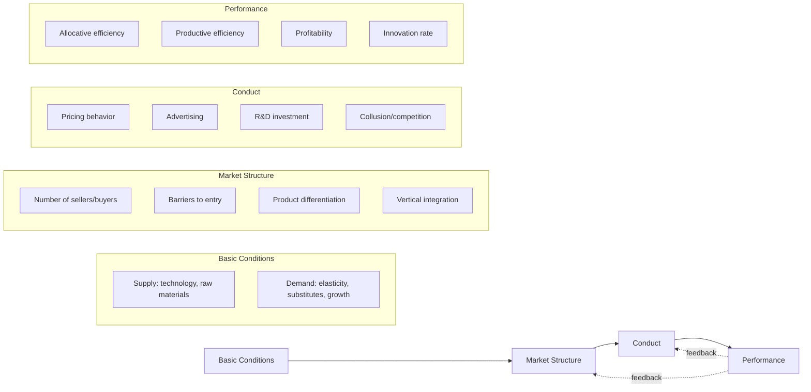

## Definition and Scope of Industrial Economics

### Overview

Industrial economics (also termed industrial organization, or IO) is the branch of microeconomics that studies the structure of firms and markets, the strategic behavior of firms within those markets, and the interaction between market structure, conduct, and performance. It departs from the perfectly competitive model of price theory to examine how real-world markets — characterized by imperfect competition, informational asymmetries, entry barriers, and strategic interdependence — actually function.

### Core Definition

Industrial economics can be formally defined as the study of:

- How firms are organized internally and how they compete externally
- The determinants of market structure (number of firms, concentration, barriers to entry)
- The conduct of firms operating within a given structure (pricing, advertising, R&D, collusion)
- The resulting performance outcomes (efficiency, profitability, innovation, consumer welfare)

**Key Points**

- The field bridges theoretical microeconomics and applied, real-world market analysis
- It is distinct from "industrial policy" (a government intervention framework) though the two are related
- Modern IO relies heavily on game theory to model strategic firm behavior under interdependence

### Historical Development

Industrial economics evolved through several identifiable phases:

1. **Structuralist / Harvard School (1930s–1960s)** — Associated with Edward Mason and Joe Bain, this approach established the Structure-Conduct-Performance (SCP) paradigm, treating market structure as largely exogenous and determining conduct and performance in a linear causal chain.
2. **Chicago School critique (1960s–1980s)** — Scholars such as George Stigler and Harold Demsetz challenged the SCP paradigm, arguing that observed structure-performance correlations often reflect underlying efficiency differences rather than market power, and emphasizing that structure itself is often endogenous.
3. **Game-theoretic / "New IO" (1970s–present)** — Building on work by Jean Tirole, Oliver Williamson, and others, this approach models firm behavior explicitly using non-cooperative game theory, treating strategic interaction, information asymmetry, and dynamic considerations (entry deterrence, repeated games, signaling) as central rather than incidental.

### The Structure-Conduct-Performance (SCP) Paradigm

The SCP framework remains a foundational organizing device, even though its strict causal interpretation has been substantially revised.

**Key Points**

- Structure → Conduct → Performance was originally treated as a one-way causal chain
- Modern IO recognizes bidirectional feedback: performance and conduct can reshape structure (e.g., successful R&D creating entry barriers)
- [Inference] The feedback arrows represent a widely accepted revision to the original Bain-era model rather than a single canonical addition; different textbooks illustrate the feedback loops with varying emphasis

### Scope of the Field

Industrial economics encompasses several interconnected areas of study:

#### Market Structure Analysis

- Concentration measures (e.g., concentration ratios, Herfindahl-Hirschman Index)
- Classification along the competition spectrum: perfect competition, monopolistic competition, oligopoly, monopoly
- Barriers to entry and exit (economies of scale, sunk costs, legal barriers, network effects)

#### Firm Conduct and Strategy

- Pricing strategies (limit pricing, predatory pricing, price discrimination)
- Non-price competition (advertising, product differentiation, R&D)
- Strategic behavior under oligopoly (Cournot, Bertrand, and Stackelberg competition models)
- Collusion, cartels, and tacit coordination

#### Vertical and Horizontal Relationships

- Vertical integration and the boundaries of the firm (transaction cost economics)
- Vertical restraints (exclusive dealing, resale price maintenance, franchising)
- Mergers and acquisitions (horizontal, vertical, conglomerate)

#### Regulation and Antitrust/Competition Policy

- Rationale for regulating natural monopolies
- Antitrust enforcement (merger review, cartel prosecution, abuse of dominance)
- Regulatory design under asymmetric information

#### Innovation and Technological Change

- Market structure and incentives to innovate (Schumpeterian competition)
- Patents, intellectual property, and diffusion of innovation
- Network industries and platform economics

### Relationship to Adjacent Fields

| Field | Relationship to Industrial Economics |
| --- | --- |
| Microeconomics | IO applies and extends core price theory to imperfectly competitive settings |
| Game Theory | Provides the primary analytical toolkit for modeling strategic firm interaction |
| Law and Economics | Antitrust/competition law draws directly on IO models to assess market power and harm |
| Managerial Economics | Applies IO concepts prescriptively to firm-level strategic decision-making |
| Public Economics | Overlaps in the study of natural monopoly regulation and welfare analysis |

### Methodological Approaches

Industrial economics employs three broad methodological traditions:

1. **Theoretical/Game-theoretic modeling** — Formal models of firm interaction, often solved via Nash equilibrium concepts, to derive testable predictions about pricing, entry, and welfare.
2. **Empirical Industrial Organization (Empirical IO)** — Econometric estimation of demand systems, cost functions, and conduct parameters using structural models (e.g., discrete choice demand estimation, the Berry-Levinsohn-Pakes approach) or reduced-form techniques.
3. **Case study / institutional analysis** — Detailed examination of specific industries or antitrust cases to understand context-specific structural and strategic features.

**Example**

A structural empirical study of the airline industry might estimate a discrete-choice demand model for routes, recover marginal costs assuming Bertrand-Nash pricing, and simulate the price effects of a proposed merger — combining all three methodological traditions in practice.

### Basic Formal Framework

A simple illustration of the SCP performance link uses the Lerner Index as a measure of market power, connecting conduct (pricing above marginal cost) to performance (profitability):

$$L = \frac{P - MC}{P}$$

where $P$ is price and $MC$ is marginal cost. Under perfect competition, $P = MC$ and $L = 0$; as market power increases, $L$ approaches 1 (bounded by the inverse of the elasticity of demand under profit-maximizing behavior).

### Conclusion

Industrial economics provides the analytical foundation for understanding how markets deviate from the idealized competitive benchmark, why they deviate, and what consequences follow for efficiency and welfare. Its scope spans theoretical modeling, empirical estimation, and applied policy analysis, making it a foundation for both academic microeconomics and applied fields like competition policy, corporate strategy, and regulatory economics.

**Related Topics / Next Steps**

- Market structure and the competition spectrum (perfect competition to monopoly)
- Concentration measures: concentration ratios and the Herfindahl-Hirschman Index
- The Structure-Conduct-Performance paradigm and its critiques
- Game theory foundations for oligopoly (Cournot, Bertrand, Stackelberg)
- Barriers to entry and contestable markets theory
- Transaction cost economics and the theory of the firm
- Antitrust and competition policy frameworks