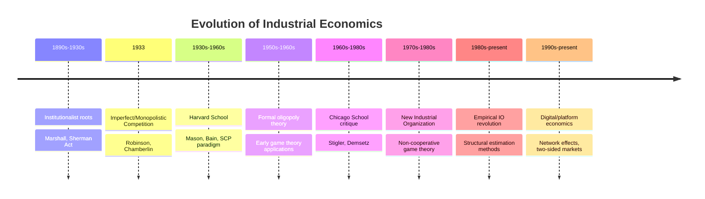

## Historical Evolution of the Field

### Overview

The historical evolution of industrial economics traces a path from descriptive, institutionally-grounded studies of market power in the early twentieth century, through the formalization of the Structure-Conduct-Performance paradigm at Harvard, to the Chicago School's price-theoretic critique, and finally to the game-theoretic "New Industrial Organization" that dominates the field today. Each phase reflects both changes in economic theory (particularly the rise of non-cooperative game theory) and changes in econometric capability.

### Phase 1: Early Institutionalist Roots (1890s–1930s)

- Origins lie in responses to the rise of large corporations and trusts following the Second Industrial Revolution in the United States
- Alfred Marshall's *Principles of Economics* (1890) introduced concepts of increasing/decreasing returns and the representative firm, laying groundwork for later analysis of firm-level cost structures
- The passage of the Sherman Antitrust Act (1890) and Clayton Act (1914) in the US created a practical, legal impetus for economists to study market power and monopolization empirically
- Work in this period was largely descriptive and institutional, cataloguing industry practices rather than building formal predictive models

**Key Points**

- This period is sometimes retrospectively called the "old IO" or institutionalist phase
- Analysis was driven by antitrust litigation needs rather than abstract theory

### Phase 2: Theory of Imperfect and Monopolistic Competition (1930s)

Two landmark works reshaped price theory to accommodate market structures between the polar cases of perfect competition and monopoly:

- **Joan Robinson**, *The Economics of Imperfect Competition* (1933) — formalized downward-sloping demand curves facing individual firms, introducing tools like marginal revenue curves under imperfect competition
- **Edward Chamberlin**, *The Theory of Monopolistic Competition* (1933) — introduced product differentiation as a central feature of many real markets, blending elements of competition and monopoly

**Key Points**

- These works provided the microeconomic toolkit (marginal revenue, differentiated demand) that later structural analysis would build upon
- [Inference] The near-simultaneous publication by Robinson and Chamberlin is often treated by historians of economic thought as a genuine independent convergence rather than one influencing the other, though this is debated in some accounts

### Phase 3: The Harvard School and the SCP Paradigm (1930s–1960s)

- **Edward Mason** at Harvard established the research program linking market structure to conduct and performance, training a generation of industry-study economists
- **Joe S. Bain** formalized and empirically operationalized the Structure-Conduct-Performance (SCP) paradigm in works including *Barriers to New Competition* (1956) and *Industrial Organization* (1959)
- Bain's empirical contribution was the "concentration-profitability" hypothesis: industries with higher seller concentration exhibit higher average profitability, interpreted as evidence of market power
- This period treated structure as largely exogenous (determined by technology and demand conditions) and causally prior to conduct and performance

### Phase 4: The Chicago School Critique (1960s–1980s)

- **George Stigler** reoriented the field toward rigorous price-theoretic reasoning, treating entry barriers more narrowly (as cost asymmetries between incumbents and entrants) and emphasizing the informational role of advertising and search
- **Harold Demsetz** directly challenged Bain's concentration-profitability finding, arguing that the observed correlation could equally reflect efficient firms simultaneously gaining market share and higher profits — an efficiency-based alternative to a market-power interpretation
- The Chicago approach generally favored the view that most observed market structures reflect efficiency-driven outcomes rather than anti-competitive strategic behavior, with corresponding skepticism toward interventionist antitrust policy

**Key Points**

- The Demsetz critique is a canonical illustration of the identification problem in empirical IO: correlation between structure and performance does not establish the direction of causality
- This debate directly shaped antitrust policy shifts in the US during the 1970s–1980s toward a more permissive stance on mergers and vertical restraints

### Phase 5: The New Industrial Organization (1970s–1990s)

The maturation of non-cooperative game theory, particularly Nash equilibrium refinements, gave IO economists formal tools to model strategic interdependence explicitly rather than treating structure as an exogenous input.

- **Oliver Williamson** developed transaction cost economics, explaining the boundaries of the firm (vertical integration decisions) via asset specificity and contracting costs, building on Ronald Coase's 1937 "The Nature of the Firm"
- **Jean Tirole**, synthesized in *The Theory of Industrial Organization* (1988), consolidated game-theoretic IO into a coherent graduate curriculum, covering topics including limit pricing, predatory pricing, product differentiation, R&D races, and vertical restraints under asymmetric information
- Contract theory and information economics (Akerlof, Spence, Stiglitz) were integrated into IO, formalizing adverse selection and signaling in market contexts

**Key Points**

- This phase reversed the SCP causal arrow in many models: conduct (e.g., strategic investment, capacity commitments) is shown to endogenously shape structure
- Structure itself became an object of strategic choice (e.g., entry deterrence via capacity expansion) rather than a purely exogenous "basic condition"

### Phase 6: Empirical IO Revolution (1980s–present)

- Development of structural econometric methods to estimate demand and cost parameters directly from data while remaining consistent with game-theoretic equilibrium assumptions
- The **Berry-Levinsohn-Pakes (BLP)** method (1995) for estimating discrete-choice demand systems using aggregate market-level data became a standard tool, particularly for merger simulation
- Structural estimation allowed counterfactual policy simulation (e.g., predicting price effects of a proposed merger) grounded in estimated primitives rather than reduced-form correlations

### Phase 7: Digital and Platform Economics (1990s–present)

- Rise of network effects and platform/two-sided market theory (Jean-Charles Rochet, Jean Tirole; David Evans) to address markets where firms serve interdependent user groups (e.g., search engines serving both users and advertisers)
- Renewed antitrust attention to digital markets, data as a competitive asset, and algorithmic pricing/collusion
- [Inference] Contemporary IO scholarship increasingly treats data accumulation and algorithmic conduct as extensions of classical entry-barrier and collusion analysis, though formal consensus frameworks are still actively developing

**Example**

A merger simulation exercise typifies the field's current empirical maturity: an economist estimates a BLP-style demand model from market share and price data, recovers implied marginal costs under a Bertrand-Nash conduct assumption, and simulates post-merger prices under a counterfactual ownership structure — a workflow inconceivable under the descriptive methods of the 1930s.

### Summary Table of Major Contributors

| Period | Economist(s) | Core Contribution |
| --- | --- | --- |
| 1930s | Robinson, Chamberlin | Imperfect/monopolistic competition theory |
| 1930s–1960s | Mason, Bain | SCP paradigm, entry barriers |
| 1960s–1980s | Stigler, Demsetz | Price-theoretic/efficiency critique |
| 1970s–1990s | Williamson | Transaction cost economics |
| 1980s | Tirole | Game-theoretic synthesis of IO |
| 1995 | Berry, Levinsohn, Pakes | Structural demand estimation |
| 1990s–present | Rochet, Tirole, Evans | Platform/two-sided market theory |

### Conclusion

The historical evolution of industrial economics reflects a broader disciplinary trajectory: from institutional description, to reduced-form empirical correlation (SCP), to a methodological crisis over causal interpretation (Chicago critique), to formal strategic modeling (game theory), and finally to structural empirical estimation capable of informing real-world merger and antitrust policy. Each phase remains partially embedded in the field's current toolkit rather than being fully superseded.

**Related Topics / Next Steps**

- Structure-Conduct-Performance paradigm in depth
- Chicago School vs. Harvard School debate
- Transaction cost economics and theory of the firm
- Game-theoretic models of oligopoly (Cournot, Bertrand, Stackelberg)
- Structural empirical IO methods (BLP demand estimation)
- Platform economics and two-sided markets
- History of antitrust policy shifts (US and EU)