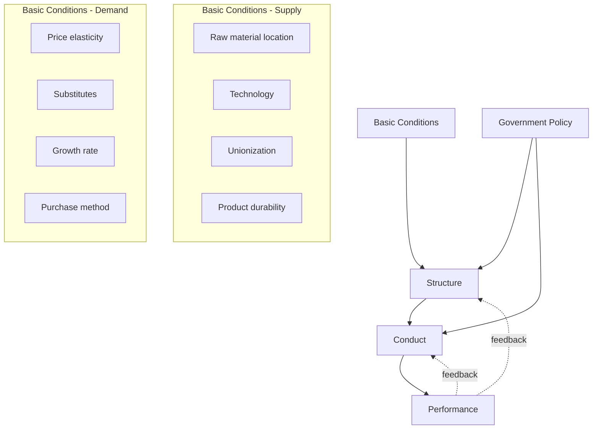

## The Structure-Conduct-Performance Paradigm

### Overview

The Structure-Conduct-Performance (SCP) paradigm is the foundational analytical framework of industrial economics, positing a causal relationship running from the structural characteristics of a market, through the strategic conduct of firms within it, to the resulting economic performance outcomes. Originally developed by Edward Mason and formalized empirically by Joe S. Bain, the paradigm organizes the study of industries into three interlinked categories and remains the standard pedagogical entry point into IO, even as its strict unidirectional causality has been substantially revised.

### The Three Core Components

#### Structure

Market structure refers to the relatively stable organizational and competitive characteristics of an industry. Key structural variables include:

- **Seller concentration** — the number and size distribution of firms in the market
- **Buyer concentration** — the number and size distribution of purchasers
- **Product differentiation** — the degree to which competing products are perceived as substitutes
- **Barriers to entry and exit** — economies of scale, capital requirements, absolute cost advantages, legal restrictions
- **Vertical integration** — the extent to which firms control multiple stages of the supply chain
- **Diversification** — the range of product markets in which firms operate

#### Conduct

Conduct describes the behavioral patterns firms adopt in pursuit of their objectives, typically profit maximization, given the structure they face:

- **Pricing behavior** — including collusive pricing, limit pricing, and predatory pricing
- **Product strategy** — R&D investment, product differentiation, innovation
- **Advertising and marketing** — persuasive vs. informative advertising intensity
- **Legal tactics** — litigation, lobbying, mergers and acquisitions
- **Research and development** — investment in process or product innovation

#### Performance

Performance denotes the economic outcomes resulting from the interaction of structure and conduct, evaluated against welfare benchmarks:

- **Allocative efficiency** — whether output and prices approximate the competitive (welfare-maximizing) benchmark
- **Productive efficiency** — whether production occurs at minimum feasible cost
- **Profitability** — rate of return relative to a competitive benchmark
- **Technical progress** — rate of innovation and technology diffusion
- **Equity** — distributional consequences of market outcomes

### The Causal Chain and Feedback Loops

**Key Points**

- Bain's original 1959 formulation treated the chain as predominantly one-directional: structure determines conduct, which determines performance
- Subsequent scholarship (including Bain's own later work and later Chicago School critiques) recognized that performance and conduct can feed back into structure — for example, successful innovation can raise entry barriers, altering future structure
- Government policy (antitrust enforcement, regulation, trade policy) is typically modeled as an external variable acting on both structure and conduct

### Empirical Operationalization: The Concentration-Profitability Hypothesis

Bain's central empirical contribution was testing whether market concentration correlates with above-normal profitability, interpreted as indirect evidence of market power (since price and marginal cost are not directly observable in most datasets).

The canonical empirical specification takes the form:

$$\pi_i = \alpha + \beta_1 CR_i + \beta_2 BE_i + \beta_3 X_i + \varepsilon_i$$

where $\pi_i$ is a profitability measure (e.g., accounting rate of return) for industry $i$, $CR_i$ is a concentration ratio, $BE_i$ represents barriers-to-entry measures, $X_i$ is a vector of control variables, and $\varepsilon_i$ is the error term. A positive and significant $\beta_1$ was historically interpreted as supporting the structure-performance link.

**Example**

Bain's early studies found that industries with an eight-firm concentration ratio above roughly 70% exhibited persistently higher profit rates than less concentrated industries, which he attributed to entry-deterring structural barriers rather than short-run disequilibrium.

### Common Concentration Measures

| Measure | Formula | Notes |
| --- | --- | --- |
| Concentration Ratio ($CR_n$) | $CR_n = \sum_{i=1}^{n} s_i$ | Sum of market shares of the largest $n$ firms |
| Herfindahl-Hirschman Index (HHI) | $HHI = \sum_{i=1}^{N} s_i^2$ | Sum of squared market shares of all firms; ranges from near 0 (many small firms) to 10,000 (monopoly, if shares expressed as percentages) |

**Key Points**

- $CR_n$ is simple to compute but ignores the distribution of shares among the largest firms and ignores all firms outside the top $n$
- $HHI$ incorporates the full firm-size distribution and is the primary concentration measure used by antitrust authorities (e.g., in US Horizontal Merger Guidelines) for merger screening thresholds

### The Chicago School Critique of SCP

The Demsetz (1973) critique fundamentally challenged the causal interpretation of the concentration-profitability correlation:

- **Efficiency hypothesis**: if some firms are more efficient than others, they simultaneously gain larger market share (raising concentration) and higher profits (via lower costs), producing the same observed correlation without any exercise of market power
- This creates a classic **identification problem**: cross-sectional correlation between structure and performance cannot, by itself, distinguish the market-power hypothesis from the efficiency hypothesis
- The critique shifted empirical IO toward firm-level (rather than industry-level) data and toward structural models that separately identify cost and demand primitives

**Key Points**

- [Inference] This critique is widely regarded as the central methodological turning point that motivated the shift toward the game-theoretic "New IO," since it exposed a fundamental limitation of the reduced-form SCP approach that formal modeling of firm conduct was seen as necessary to resolve

### Modern Reformulation: Endogenous Structure

Contemporary IO treats structure not as exogenously given by "basic conditions" alone, but as partly the outcome of firms' own strategic conduct:

- Capacity investment can serve as a strategic commitment device to deter entry (endogenizing what looks like a structural barrier)
- R&D investment can raise minimum efficient scale, altering structure via conduct
- Reputation and switching costs, built through past conduct, become structural features facing future entrants

**Key Points**

- This reformulation does not discard the SCP framework but nests it within a more general model where the "boxes" interact bidirectionally rather than in a strict linear sequence

### Applications in Competition Policy

- Merger review guidelines (e.g., US DOJ/FTC Horizontal Merger Guidelines, EU Merger Regulation) use HHI thresholds derived from SCP-style reasoning as an initial screening device, though modern reviews supplement this with structural demand estimation and merger simulation
- Industry studies for antitrust litigation frequently still organize evidence along Structure/Conduct/Performance lines as a matter of analytical convention, even when the underlying economic reasoning draws on game-theoretic models

### Limitations of the Paradigm

- Static framework: the original SCP model does not naturally incorporate dynamic considerations like entry deterrence over time, repeated interaction, or learning
- Correlation-causation ambiguity, as highlighted by the Demsetz critique
- Concentration measures are sensitive to market definition, which is itself often the most contested empirical question in antitrust cases
- Does not explicitly model firm heterogeneity in costs or strategic sophistication

### Conclusion

The SCP paradigm remains the organizing vocabulary of industrial economics even though its strict causal claims have been substantially qualified. It provides a durable taxonomy — structure, conduct, performance — for organizing empirical industry studies, while modern IO has layered game-theoretic and structural econometric tools on top of this taxonomy to address the endogeneity and identification problems the original formulation could not resolve.

**Related Topics / Next Steps**

- Concentration measures in depth (CR_n, HHI, entropy indices)
- The Chicago School critique and the efficiency hypothesis
- Endogenous market structure and strategic entry deterrence
- Merger simulation and structural demand estimation (BLP method)
- Barriers to entry: typology and measurement
- Contestable markets theory as an alternative to SCP