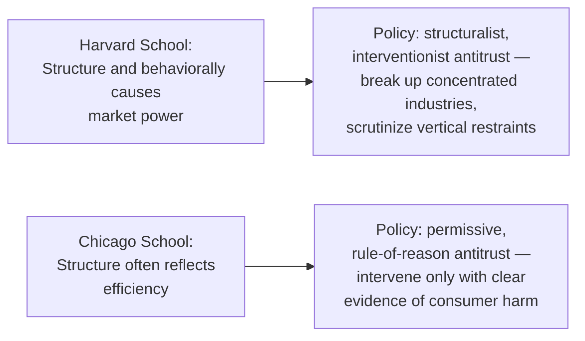

## Harvard School versus Chicago School Perspectives

### Overview

The Harvard School and Chicago School represent the two most influential and contrasting intellectual traditions in the historical development of industrial economics. They diverge fundamentally on the interpretation of market structure, the causal significance of concentration, the reliability of entry barriers as strategic tools, and — consequently — the appropriate scope of antitrust intervention. Understanding this divide is essential to interpreting both the historical SCP literature and the game-theoretic IO that followed.

### Origins and Intellectual Lineage

| Dimension | Harvard School | Chicago School |
| --- | --- | --- |
| Key era | 1930s–1960s | 1950s–1980s |
| Key figures | Edward Mason, Joe S. Bain | George Stigler, Milton Friedman, Aaron Director, Robert Bork, Harold Demsetz |
| Core method | Empirical cross-industry SCP studies | Rigorous price theory, later law-and-economics synthesis |
| Institutional home | Harvard University economics department | University of Chicago economics and law schools |

### Core Theoretical Differences

#### View of Market Structure

- **Harvard School**: Market structure (concentration, entry barriers, product differentiation) is treated as a largely stable, exogenous determinant of firm conduct. High concentration is presumptively associated with market power and reduced competitive discipline.
- **Chicago School**: Market structure is often endogenous, reflecting underlying efficiency differences among firms. High concentration frequently results from — rather than causes — superior efficiency, since more efficient firms grow larger and gain share.

#### Interpretation of the Concentration-Profitability Correlation

- **Harvard School**: A positive correlation between concentration and profitability (as documented empirically by Bain) is evidence that concentrated industries permit tacit or explicit collusion, elevating price above the competitive level.
- **Chicago School**: The same correlation is equally consistent with the **efficiency hypothesis** — Demsetz's (1973) argument that efficient firms simultaneously earn higher profits and higher market share, producing an observationally identical correlation without any exercise of market power.

$$\underbrace{\text{Corr}(CR, \pi) > 0}_{\text{observed}} \;\;\Rightarrow\;\; \begin{cases} \text{Harvard: market power / collusion} \\ \text{Chicago: superior efficiency} \end{cases}$$

**Key Points**

- This is the canonical illustration of an unresolved identification problem: the same reduced-form correlation supports two mutually exclusive causal stories
- Neither school's cross-sectional evidence alone can adjudicate between the two hypotheses without additional structural assumptions or firm-level data

#### View of Entry Barriers

- **Harvard School (via Bain)**: Defined barriers to entry broadly, including economies of scale, absolute cost advantages, and product differentiation advantages held by incumbents — any structural feature that allows incumbents to sustain price above the competitive level without inducing entry.
- **Chicago School (via Stigler)**: Defined barriers to entry more narrowly, as costs that must be borne by an entrant but were not borne by the incumbent (an asymmetric cost concept). Economies of scale alone, under this narrower definition, are not necessarily a "barrier" if entrants face the same technology.

**Key Points**

- Stigler's narrower definition substantially shrinks the set of industries deemed to have meaningful entry barriers relative to Bain's broader definition
- This definitional divergence has direct antitrust consequences: fewer recognized barriers implies fewer industries warranting structural intervention

#### View of Vertical Restraints and Non-Price Practices

- **Harvard School**: Tended to view vertical restraints (exclusive dealing, resale price maintenance, tying) and predatory pricing with suspicion, as potential tools for excluding rivals or extending market power vertically.
- **Chicago School**: Argued that most vertical restraints are efficiency-enhancing (e.g., solving free-rider problems in retail service provision) and that predatory pricing is rarely a rational strategy, since the predator sustains losses with no guarantee of recouping them post-exit — the "recoupment" critique associated with these arguments.

**Example**

Under the Chicago view, a manufacturer imposing resale price maintenance (minimum retail prices) is typically interpreted as incentivizing retailers to provide costly point-of-sale service (e.g., product demonstrations) that would otherwise be undercut by free-riding discount retailers, rather than as a device to facilitate retailer collusion.

### Policy Implications

**Key Points**

- The Chicago School's influence is widely credited with the shift in US antitrust enforcement during the 1970s–1980s toward a more permissive stance on mergers, vertical restraints, and non-horizontal conduct
- Robert Bork's *The Antitrust Paradox* (1978) was particularly influential in reframing US antitrust doctrine around a "consumer welfare" standard rather than a structuralist "protect competitors" standard

### Post-Chicago Developments

The strict Chicago position has itself been qualified by subsequent "Post-Chicago" scholarship, which reintroduces the possibility of anticompetitive conduct using formal game-theoretic tools:

- Game-theoretic models (e.g., of predatory pricing, exclusive dealing, or raising rivals' costs) demonstrate conditions under which such conduct can be a rational, profitable strategy — contrary to the blanket Chicago skepticism
- This reflects the broader methodological shift toward the "New Industrial Organization," which uses formal strategic modeling rather than pure price-theoretic reasoning from either earlier school

**Key Points**

- [Inference] Post-Chicago IO is generally characterized as synthesizing elements of both traditions — retaining Chicago's rigor and skepticism of naive structural inference, while reviving Harvard-style concern about anticompetitive conduct where formal models can demonstrate its rationality

### Comparative Summary Table

| Issue | Harvard School | Chicago School | Post-Chicago |
| --- | --- | --- | --- |
| Structure-performance link | Largely causal | Largely spurious (efficiency-driven) | Context-dependent, model-specific |
| Entry barriers | Broadly defined | Narrowly defined | Formally modeled case-by-case |
| Vertical restraints | Presumptively suspect | Presumptively efficient | Can be anticompetitive under specific conditions |
| Antitrust posture | Interventionist | Permissive | Selectively interventionist, evidence-based |
| Primary method | Empirical cross-industry study | Price theory | Non-cooperative game theory |

### Conclusion

The Harvard-Chicago divide is not merely historical trivia; it represents two competing default priors about the relationship between market structure and competitive harm that continue to shape antitrust doctrine and applied IO research. Contemporary industrial economics generally rejects both schools' blanket priors in favor of case-specific, model-based analysis — but understanding both traditions remains essential, since arguments from each still surface directly in merger review, litigation, and antitrust policy debates today.

**Related Topics / Next Steps**

- The Demsetz efficiency hypothesis in depth
- Bain vs. Stigler definitions of entry barriers
- Predatory pricing theory and the recoupment requirement
- Vertical restraints: economic rationales and antitrust treatment
- Post-Chicago game-theoretic models of exclusionary conduct
- Consumer welfare standard in US antitrust law
- Contestable markets theory (Baumol, Panzar, Willig) as a third perspective