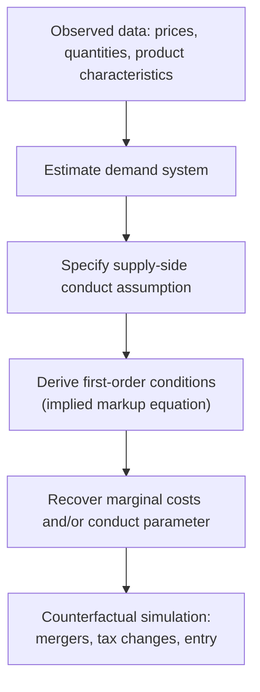

## The New Empirical Industrial Organization Approach

### Overview

The New Empirical Industrial Organization (NEIO) is the empirical methodology that emerged from roughly the late 1970s onward to address the identification problems exposed by the Chicago School's critique of the Structure-Conduct-Performance paradigm. Rather than relying on cross-industry reduced-form regressions of profitability on concentration, NEIO estimates structural models — internally consistent with game-theoretic equilibrium behavior — that recover firm-level conduct and cost parameters directly from market data. This allows researchers to distinguish market power from efficiency effects and to conduct rigorous counterfactual policy simulation, such as predicting the price effects of a proposed merger.

### Motivation: Why NEIO Emerged

- The traditional SCP approach regressed industry profitability on concentration measures using cross-sectional, industry-level accounting data
- The Demsetz efficiency critique demonstrated that this reduced-form correlation is fundamentally non-identifying: it cannot distinguish market power from underlying efficiency differences
- Accounting profit measures are also poor proxies for economic profit, subject to well-documented biases (depreciation accounting, R&D and advertising capitalization treatment)
- NEIO responds by modeling firm conduct explicitly as the solution to an optimization problem under a specified game-theoretic equilibrium concept, then estimating the model's structural parameters from observed prices and quantities

**Key Points**

- The shift from SCP to NEIO parallels a broader shift across applied microeconomics from reduced-form to structural estimation
- NEIO is sometimes dated to Rosse and Panzar's late-1970s work on conduct parameter estimation, predating the later demand-estimation innovations of the 1990s

### Core Methodological Strategy

The general NEIO strategy involves three components:

1. **Specify a demand system** describing how quantity demanded responds to price (and product characteristics, for differentiated products)
2. **Specify a supply-side conduct assumption** — an equilibrium concept describing how firms set prices or quantities (e.g., Bertrand-Nash, Cournot-Nash, perfect collusion, or a continuum "conduct parameter")
3. **Recover marginal costs and/or a conduct parameter** by combining the estimated demand system with the first-order conditions implied by the assumed conduct, given observed equilibrium prices and quantities

### The Conduct Parameter Approach (Early NEIO)

Early NEIO work (Iwata, Bresnahan, Rosse and Panzar) estimated a single **conduct parameter** $\theta$ nesting a continuum of competitive intensity between perfect competition and perfect collusion, using the following generalized first-order condition:

$$P = MC - \theta \cdot Q \cdot \frac{\partial P}{\partial Q}$$

where $\theta = 0$ corresponds to price-taking (perfect competition), $\theta = 1$ corresponds to Cournot-Nash behavior (for a single-product symmetric case), and $\theta$ between firms' shares up to 1 nests joint profit maximization (perfect collusion).

**Key Points**

- $\theta$ is estimated jointly with demand parameters using instrumental variables techniques, exploiting cost-shifters as instruments to trace out the demand curve
- [Inference] This single-parameter approach was influential but is now regarded by many practitioners as having limited power to distinguish between competing conduct models using aggregate data alone, motivating the shift toward richer, product-differentiated demand systems in later NEIO work

### The Discrete-Choice Demand Revolution: BLP

The most significant advance in NEIO is the **Berry-Levinsohn-Pakes (BLP)** method (1995), which estimates demand for differentiated products using aggregate (market-level) data by modeling consumer choice as a discrete-choice problem with random utility.

#### The Random Utility Framework

Each consumer $i$ in market $t$ derives utility from product $j$:

$$u_{ijt} = x_{jt}\beta_i - \alpha_i p_{jt} + \xi_{jt} + \varepsilon_{ijt}$$

where $x_{jt}$ are observed product characteristics, $p_{jt}$ is price, $\xi_{jt}$ is an unobserved (to the econometrician) product quality shock, and $\varepsilon_{ijt}$ is an idiosyncratic taste shock. Consumer- and market-specific taste parameters $\beta_i$ and $\alpha_i$ allow for realistic substitution patterns (unlike simple logit demand, which imposes restrictive proportional substitution).

**Key Points**

- BLP addresses the **endogeneity of price**: price is typically correlated with the unobserved quality shock $\xi_{jt}$ (firms price higher-quality products at a premium), biasing naive demand estimates
- BLP resolves this using instrumental variables — commonly cost shifters or "BLP instruments" based on the characteristics of competing products (Hausman-style or characteristic-based instruments)
- The random coefficients $\beta_i, \alpha_i$ allow substitution patterns to depend on product characteristic proximity rather than assuming uniform cross-price elasticities across all product pairs, addressing the "independence of irrelevant alternatives" limitation of standard logit models

#### Supply-Side Integration

Once demand is estimated, the supply side is closed by assuming a conduct model (typically Bertrand-Nash pricing in differentiated products) and inverting the resulting system of first-order conditions to recover implied marginal costs:

$$p_{jt} - mc_{jt} = -\left[\frac{\partial s_t(p_t)}{\partial p_t}\right]^{-1} s_t(p_t)$$

where $s_t(p_t)$ is the vector of market shares as a function of the price vector, derived from the estimated demand system, under an assumed ownership/conduct matrix.

**Example**

In a merger simulation, an analyst estimates the BLP demand system for a differentiated product market (e.g., breakfast cereals or automobiles), recovers marginal costs under pre-merger Bertrand-Nash competition, then re-solves the pricing equilibrium under a counterfactual post-merger ownership structure (where the merging firms jointly maximize profit) to predict the resulting price changes.

### Applications of NEIO

| Application | Description |
| --- | --- |
| Merger simulation | Predicting post-merger price effects without needing to observe an actual completed merger |
| Market power measurement | Estimating markups and comparing across industries or over time without reduced-form profitability data |
| Tax incidence analysis | Predicting pass-through of taxes or tariffs into consumer prices under estimated demand and conduct |
| Welfare analysis | Computing consumer surplus changes from new product introductions, quality changes, or policy interventions |
| Auction and procurement analysis | Estimating bidder valuations and strategic bidding behavior in structural auction models (a parallel NEIO branch) |

### Advantages Over Traditional SCP Regressions

- Grounded in explicit, testable game-theoretic equilibrium assumptions rather than atheoretic reduced-form correlations
- Capable of counterfactual policy simulation (e.g., "what would prices be after this merger"), which reduced-form SCP regressions cannot credibly deliver
- Directly addresses the price endogeneity problem that biases naive demand estimation
- Distinguishes market power (markup over marginal cost) from efficiency (the level of marginal cost itself), resolving the core Demsetz identification problem

### Limitations and Ongoing Debates

- Results are sensitive to the assumed conduct model (Bertrand-Nash vs. Cournot vs. other); misspecification of conduct biases recovered marginal costs
- Instrument validity for price endogeneity remains a persistent empirical challenge and source of methodological debate
- Computational complexity of estimating random-coefficient discrete-choice models is substantial, requiring numerical integration and iterative fixed-point algorithms
- [Inference] There is active, ongoing methodological debate regarding "testing" versus "assuming" conduct — some recent literature proposes using cost and demand shifters to formally test between competing conduct models rather than imposing one a priori, though this remains a developing area rather than settled practice

### Conclusion

The New Empirical Industrial Organization represents the field's maturation from atheoretic cross-sectional regression toward internally consistent structural estimation grounded in game-theoretic equilibrium. By explicitly modeling both the demand and supply sides of a market, NEIO methods — particularly the BLP demand estimation framework — allow economists to resolve the identification problems that undermined the traditional SCP paradigm and to conduct credible, quantitative counterfactual policy analysis, most notably in modern antitrust merger review.

**Related Topics / Next Steps**

- BLP discrete-choice demand estimation in technical depth
- Conduct parameter estimation and its limitations
- Merger simulation methodology in antitrust practice
- Instrumental variable strategies for price endogeneity (Hausman instruments, cost shifters)
- Structural estimation in auction markets
- Testing versus assuming conduct in empirical IO
- Welfare computation from discrete-choice demand estimates