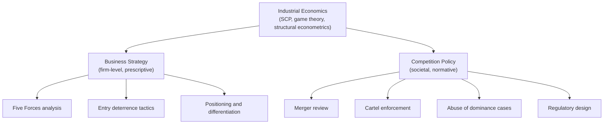

## Links Between Industrial Economics, Strategy, and Policy

### Overview

Industrial economics occupies a unique position as a theoretical discipline with two major, directly applied downstream fields: business strategy (particularly competitive strategy) and public competition policy (antitrust and regulation). The same underlying models — market structure, entry barriers, strategic interaction — are used prescriptively by strategists advising firms on how to compete, and normatively by regulators assessing whether competition is being harmed. This shared theoretical foundation, applied to opposite objectives (private profit maximization versus public welfare maximization), creates both productive cross-fertilization and genuine tension.

### The Shared Theoretical Core

**Key Points**

- Both fields draw on identical core constructs: concentration, entry barriers, product differentiation, strategic interdependence
- The critical divergence is objective function: strategy asks "how can this firm capture more value," while policy asks "how do we ensure markets remain competitive for consumer welfare"

### Industrial Economics and Business Strategy

#### Michael Porter's Five Forces Framework

The most direct and widely taught bridge between IO and strategy is Michael Porter's Five Forces framework (1979, 1980), which explicitly repackages SCP-derived structural variables into a firm-level strategic diagnostic tool:

1. **Threat of new entrants** — derived directly from IO's barriers-to-entry literature (Bain, Stigler)
2. **Bargaining power of suppliers** — related to vertical market structure and buyer/seller concentration asymmetries
3. **Bargaining power of buyers** — the mirror image of supplier power, again rooted in concentration and switching-cost analysis
4. **Threat of substitute products** — related to cross-price elasticity of demand and product differentiation
5. **Rivalry among existing competitors** — directly maps to oligopoly conduct models (Cournot, Bertrand) and concentration measures

**Key Points**

- Porter's framework operationalizes academic SCP concepts for practitioner use, trading formal rigor for accessibility and actionability
- Where SCP treats structure as largely exogenous and asks "what performance results," Five Forces inverts the question to ask "given this structure, how should a specific firm position itself"

#### Strategic Conduct as Structural Choice

Game-theoretic IO models directly inform prescriptive strategy regarding how firms can shape structure through their own conduct:

- **Capacity commitment** — building excess capacity as a credible entry-deterrence signal (Dixit-style commitment models)
- **Predatory and limit pricing** — setting prices below monopoly levels to discourage entry, subject to the Chicago School's recoupment critique regarding its rationality
- **Product proliferation** — filling the product-characteristic space to leave no profitable niche for entrants
- **R&D races and patent strategy** — using innovation investment to raise minimum efficient scale or lock in technological standards

**Example**

A strategy consultant advising an incumbent facing entry threat might draw directly on entry-deterrence game theory: modeling whether a capacity expansion functions as a credible commitment (sunk, observable, and costly to reverse) versus a non-credible threat that a rational entrant would correctly ignore.

#### Resource-Based View as a Complement/Alternative

- The Resource-Based View (RBV) of strategy (Wernerfelt, Barney) emphasizes firm-specific, difficult-to-imitate resources and capabilities as the source of sustained competitive advantage, in contrast to IO's traditional emphasis on industry structure as the primary determinant of profitability
- [Inference] This RBV-versus-IO tension in strategy scholarship parallels, and is often explicitly compared to, the earlier Harvard-Chicago IO debate about whether structure (Harvard) or firm-specific efficiency (Chicago/Demsetz) drives performance differences — both debates ultimately concern the relative explanatory power of industry-level versus firm-level factors

### Industrial Economics and Competition Policy

#### Merger Review

- Antitrust authorities (e.g., US DOJ/FTC, European Commission) use IO's structural tools directly: HHI thresholds for initial screening, followed increasingly by NEIO-style structural merger simulation to predict post-merger price effects
- Modern merger guidelines explicitly incorporate insights from both the SCP tradition (concentration as a screening heuristic) and game-theoretic NEIO (unilateral effects modeling, coordinated effects analysis)

#### Cartel and Collusion Enforcement

- Oligopoly theory (particularly repeated-game models of tacit collusion, following Friedman's 1971 folk theorem application) informs how authorities assess conditions conducive to coordination: market transparency, symmetry among firms, frequency of interaction, and the presence of credible punishment mechanisms
- Structural conditions identified by IO theory (high concentration, homogeneous products, stable demand, multi-market contact) are used as screening factors ("plus factors") in cartel investigations lacking direct evidence of explicit agreement

#### Regulation of Natural Monopoly

- IO's treatment of scale economies and cost subadditivity directly informs the regulatory design of natural monopoly industries (historically telecommunications, electricity transmission, water utilities)
- Regulatory mechanisms — rate-of-return regulation, price caps, yardstick competition — are designed using IO and information-economics tools to address the tension between allowing cost recovery and preventing monopoly rents

#### Abuse of Dominance / Monopolization Cases

- Predatory pricing doctrine in antitrust law (e.g., the *Brooke Group* recoupment standard in US law) was directly shaped by the Chicago School's theoretical skepticism regarding the rationality of predation absent a plausible recoupment mechanism
- Essential facilities doctrine and refusal-to-deal analysis draw on vertical foreclosure theory from IO

### Points of Tension Between Strategy and Policy Applications

| Dimension | Strategy Perspective | Policy Perspective |
| --- | --- | --- |
| Objective | Maximize firm profit/value capture | Maximize consumer/total welfare |
| View of entry barriers | Barriers are assets to build and defend | Barriers are potential competitive harms to scrutinize |
| View of concentration | Higher concentration often desirable (market power) | Higher concentration often concerning (reduced competition) |
| View of collusion-adjacent conduct | Tacit coordination may be strategically rational | Tacit coordination may warrant enforcement scrutiny |

**Key Points**

- The same strategic action (e.g., aggressive capacity expansion, or acquiring a nascent competitor) can be simultaneously rational firm strategy and a subject of antitrust concern — this dual read is a persistent theme in both fields
- Economists frequently move between academic IO, corporate strategy consulting, and government/regulatory economic advisory roles, reflecting the shared technical toolkit across all three domains

### Contemporary Convergence: Digital Markets

- Platform economics (two-sided markets, network effects) has become a case study where strategy and policy applications are especially tightly linked: the same network-effect models that inform a platform's strategic pricing (e.g., subsidizing one side of the market) are used by regulators to assess whether that same pricing constitutes anticompetitive conduct
- [Inference] The ongoing regulatory scrutiny of large digital platforms is widely viewed within the field as a live test case for whether existing IO-derived antitrust frameworks (developed primarily around single-sided, tangible-goods markets) adequately capture competitive dynamics in multi-sided digital markets, though this remains an actively contested and evolving area rather than a resolved question

### Conclusion

Industrial economics functions as the shared theoretical substrate underlying both prescriptive business strategy and normative competition policy. The same structural and game-theoretic constructs — entry barriers, concentration, strategic commitment, coordination conditions — are deployed toward opposite ends: helping firms build and defend competitive advantage, and helping regulators ensure that such advantage does not come at the expense of consumer welfare. Recognizing this shared foundation clarifies why the same economic argument can appear, essentially unchanged, in a corporate strategy memo and in an antitrust complaint.

**Related Topics / Next Steps**

- Porter's Five Forces framework in depth
- Entry deterrence and strategic commitment models
- Resource-Based View versus industry-structure explanations of firm performance
- Merger guidelines and structural screening thresholds
- Repeated-game models of tacit collusion
- Natural monopoly regulation design
- Platform economics and digital market antitrust