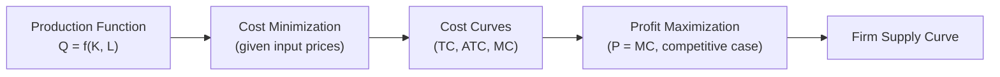

## Neoclassical Theory of the Firm

### Overview

The neoclassical theory of the firm treats the firm as a "black box" production function: an abstract entity that transforms inputs into outputs to maximize profit, subject to technological constraints, with no internal organizational structure, contracting frictions, or agency considerations modeled explicitly. It is the foundational, simplest theory of the firm underlying introductory microeconomics and provides the essential baseline against which later, richer theories of the firm (transaction cost economics, principal-agent theory, incomplete contracts) are contrasted.

### The Firm as a Production Function

In the neoclassical framework, the firm is fully characterized by its production technology, represented as a production function:

$$Q = f(K, L)$$

where $Q$ is output, $K$ is capital input, and $L$ is labor input. The firm's objective is to choose input quantities to maximize profit $\pi$:

$$\pi = P \cdot Q - (r \cdot K + w \cdot L)$$

where $P$ is the output price, $r$ is the rental price of capital, and $w$ is the wage rate.

**Key Points**

- The firm is modeled as a single decision-making unit with no internal hierarchy, no distinct owners and managers, and no employees with independent objectives
- All production decisions reduce to a constrained optimization problem, solvable using standard calculus-based marginal analysis

### Core Assumptions

- **Profit maximization**: the firm's sole objective is maximizing profit, with no consideration of alternative objectives (growth, market share, managerial utility)
- **Perfect information**: the firm has complete knowledge of its production technology, input prices, and (in the competitive benchmark) output prices
- **No internal organization**: the firm has no hierarchy, no distinct departments, and no principal-agent separation between owners and managers
- **Costless contracting**: all input purchases (labor, capital) are transacted via frictionless, complete contracts at prevailing market prices
- **Exogenous technology**: the production function is given and fixed in the short run, with no explicit theory of how firms acquire or develop technological capability

### The Marginal Conditions for Profit Maximization

Given the production function and factor prices, profit maximization yields first-order conditions equating the value of each input's marginal product to its price:

$$P \cdot \frac{\partial Q}{\partial L} = w \qquad P \cdot \frac{\partial Q}{\partial K} = r$$

These conditions state that the firm hires each input up to the point where the value of marginal product (VMP) equals the input's price — the standard neoclassical factor demand condition.

**Key Points**

- Under perfect competition in both output and input markets, these conditions fully determine the firm's optimal input choices and, consequently, its optimal output level
- The resulting theory generates the firm's supply curve as the upward-sloping segment of its marginal cost curve above average variable cost

### Cost Curves and Short-Run/Long-Run Distinction

The neoclassical theory develops a standard apparatus of cost curves derived from the production function:

| Concept | Definition |
| --- | --- |
| Total Cost (TC) | $TC = FC + VC$ (fixed cost plus variable cost) |
| Average Total Cost (ATC) | $ATC = TC / Q$ |
| Marginal Cost (MC) | $MC = \frac{\partial TC}{\partial Q}$ |
| Short run | At least one input (typically capital) is fixed |
| Long run | All inputs are variable, including plant scale |

**Key Points**

- The shape of short-run cost curves (initially declining, then rising marginal cost) derives from the assumption of diminishing marginal returns to the variable input, holding the fixed input constant
- Long-run cost curves derive from returns to scale properties of the production function and allow analysis of the firm's optimal scale of operation, including the minimum efficient scale relevant to entry-barrier analysis in industrial economics

### The Firm's Supply Decision Under Perfect Competition

Under the standard competitive benchmark, the firm is a price-taker facing a horizontal demand curve at the market price $P$. The profit-maximizing output quantity satisfies:

$$P = MC(Q)$$

subject to the shutdown condition that the firm produces only if price covers average variable cost in the short run ($P \geq AVC$), or average total cost in the long run ($P \geq ATC$).

**Example**

A price-taking firm facing market price $P = 50$ with marginal cost function $MC(Q) = 10 + 2Q$ sets $50 = 10 + 2Q$, yielding profit-maximizing output $Q = 20$ — a direct application of the neoclassical marginal-cost-pricing rule.

### Role Within Industrial Economics

The neoclassical theory of the firm serves as the essential competitive benchmark against which industrial economics measures the welfare costs of market power:

- The competitive outcome ($P = MC$) is the allocative efficiency benchmark used throughout SCP-derived performance analysis
- Deviations from this benchmark (market power, represented by the Lerner Index $L = (P-MC)/P > 0$) are interpreted as welfare losses relative to the neoclassical ideal
- Cost curve concepts (economies of scale, minimum efficient scale) derived from neoclassical production theory directly underpin the analysis of structural entry barriers in Bain's and Stigler's frameworks

### Critiques and Limitations

The neoclassical "black box" theory of the firm faces several well-documented limitations that motivated the development of alternative theories of the firm:

- **No explanation for firm boundaries**: the theory provides no account of why economic activity is organized within firms versus coordinated through markets — a question first raised by Ronald Coase (1937) and addressed by transaction cost economics
- **No internal organization or agency problems**: the assumption of a unified profit-maximizing decision-maker ignores the separation of ownership and control and the resulting principal-agent conflicts (addressed by managerial theories of the firm and agency theory)
- **No treatment of contracting frictions**: the assumption of costless, complete contracting ignores real-world contractual incompleteness, asset specificity, and hold-up problems (addressed by incomplete contract theory, Grossman-Hart-Moore)
- **No strategic interdependence**: as a competitive-market model, it has no natural extension to oligopolistic strategic interaction, which industrial economics addresses via game-theoretic models layered on top of (or replacing) the neoclassical cost/production apparatus

**Key Points**

- [Inference] These limitations are generally presented in IO curricula as the direct motivation for the field's subsequent theoretical development — Coase's question about firm boundaries, in particular, is widely treated as the founding question of the modern theory of the firm literature that industrial economics builds upon

### Conclusion

The neoclassical theory of the firm provides the indispensable baseline apparatus — production functions, cost curves, marginal-condition optimization — that underlies the competitive benchmark against which industrial economics measures market power and welfare loss. Its simplifying "black box" assumptions, while analytically powerful for competitive market analysis, are precisely what later theories of the firm (transaction cost economics, agency theory, incomplete contracts) were developed to relax, in order to explain firm boundaries, internal organization, and strategic conduct that the neoclassical model is silent on.

**Related Topics / Next Steps**

- Coase's theory of the firm and the make-or-buy decision
- Transaction cost economics (Williamson)
- Principal-agent theory and the separation of ownership and control
- Incomplete contracts and the property-rights theory of the firm (Grossman-Hart-Moore)
- Economies of scale and minimum efficient scale
- The Lerner Index and measurement of market power
- Cost function estimation in empirical IO