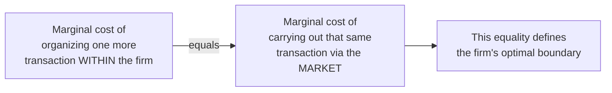

## Coase and the Transaction Cost Origins of the Firm

### Overview

Ronald Coase's 1937 article "The Nature of the Firm" poses and answers a question the neoclassical theory of the firm never asks: why do firms exist at all, and what determines the boundary between activity coordinated within a firm (via managerial authority) and activity coordinated through the market (via the price mechanism)? Coase's answer — that firms exist because using the market is costly, and firms expand until the cost of organizing an additional transaction internally equals the cost of transacting that same activity externally — founded the transaction cost tradition that underlies the modern economic theory of the firm.

### The Foundational Question

Coase observed a puzzle inherent in the neoclassical model: if the price mechanism is, per standard theory, the efficient means of allocating resources, why does so much economic activity occur within firms, coordinated by managerial fiat rather than by prices?

**Key Points**

- Prior to Coase, mainstream economics had no theory explaining firm boundaries — the firm was simply assumed to exist as a production function
- Coase reframed the firm not as a technological unit (a production function) but as an alternative *governance structure* to the market for organizing transactions

### The Core Argument: Costs of Using the Price Mechanism

Coase identified that using the market is not costless, as implicitly assumed by neoclassical theory. Discovering relevant prices, negotiating and concluding separate contracts for each transaction, and the general costs of engaging in market exchange all impose real resource costs — later termed **transaction costs**.

- **Search and information costs** — discovering appropriate trading partners and relevant prices
- **Bargaining and decision costs** — negotiating terms and reaching agreement
- **Contracting and enforcement costs** — drafting, monitoring, and enforcing agreements

**Key Points**

- Firms emerge because, for certain transactions, internalizing the transaction (bringing it inside the firm, coordinated by managerial direction) is cheaper than repeatedly negotiating and enforcing separate market contracts
- Within the firm, the price mechanism is superseded by the entrepreneur-coordinator, who directs resources by authority (an employment relationship) rather than by a sequence of individually negotiated contracts

### The Theory of the Firm's Boundary

Coase's central contribution is not merely explaining *why* firms exist, but providing a marginal condition determining *how large* a firm should become — its optimal boundary.

The firm expands — bringing additional transactions inside its boundary — up to the point where:

$$MC_{\text{internal organization}} = MC_{\text{market transaction}}$$

Beyond this point, the costs of internal coordination (managerial diseconomies, bureaucratic inefficiency, loss of high-powered market incentives) exceed the transaction costs that would be incurred by using the market instead, so further expansion becomes inefficient.

**Key Points**

- This marginal framework directly parallels standard neoclassical marginal analysis, but applied to a governance-choice decision (make vs. buy) rather than a production-input decision
- The firm's size is therefore not determined by technology alone (as in the neoclassical production function view) but by the relative *comparative costs* of two alternative governance mechanisms: market contracting versus internal organization

### Costs of Expanding the Firm (Diseconomies of Internal Organization)

Coase also identified why firms do not simply expand indefinitely to absorb the entire economy — a natural question given that internal organization eliminates recurring market transaction costs:

- Diminishing returns to management: as a firm grows, the entrepreneur-coordinator may fail to place factors of production in their most productive uses, since internal allocation lacks the direct informational discipline of price signals
- Increasing organizational and coordination costs as the firm's scale and complexity grow
- Potential loss of high-powered market incentives that motivate independent contractors more strongly than employees

**Key Points**

- This insight anticipates later formalizations in agency theory and property-rights theory, which model precisely how and why internal incentive provision differs from market-based incentive provision

### The Employment Relationship as a Distinguishing Feature

Coase specifically characterized the firm as defined by the **employment relationship**: a contract in which an employee agrees, within limits, to accept the direction of an employer in exchange for compensation, rather than negotiating a separate contract for each specific task.

- This is contrasted with a market transaction, where each exchange would otherwise require a distinct, fully-specified contract
- The employment relationship substitutes a single, relatively open-ended contract (governing a *range* of future directives) for what would otherwise be many separate market contracts, economizing on the contracting costs Coase identified

**Example**

Rather than a manufacturing firm negotiating a separate market contract each time it needs a worker to perform a specific task on the factory floor, it hires the worker under a general employment contract granting the firm authority (within contractually and legally bounded limits) to direct the worker's tasks day-to-day — avoiding the transaction costs of continuous re-contracting.

### Coase's Legacy Within Industrial Economics

Coase's 1937 insight lay relatively dormant for several decades before becoming the direct foundation for the modern theory of the firm literature within industrial economics, most notably:

- **Transaction cost economics** (Oliver Williamson, from the 1970s onward) — formalized and extended Coase's framework by identifying specific transaction attributes (asset specificity, uncertainty, frequency) that determine when internal organization dominates market contracting
- **Property-rights / incomplete contracts theory** (Grossman, Hart, Moore, from the 1980s onward) — provided a more formal, contract-theoretic microfoundation for why ownership (and the associated residual control rights) matters when contracts are necessarily incomplete
- **Vertical integration analysis in IO** — Coase's framework directly underlies modern IO's treatment of vertical integration decisions as a governance-cost tradeoff rather than a purely technological or market-power-driven choice

**Key Points**

- [Inference] Coase's 1937 paper is widely regarded within the field as under-cited and under-utilized for several decades relative to its later influence, only becoming central to mainstream IO and organizational economics following Williamson's systematic elaboration beginning in the 1970s — this delayed influence is a commonly noted point in histories of the theory of the firm literature
- Coase was awarded the Nobel Memorial Prize in Economic Sciences in 1991, with the transaction cost theory of the firm cited as a central contribution

### Relationship to the Coase Theorem

Coase's later, separately influential 1960 paper "The Problem of Social Cost" introduced what became known as the Coase Theorem — the proposition that, absent transaction costs, private bargaining will achieve an efficient allocation of resources regardless of the initial assignment of property rights (relevant to externality analysis). While distinct from the 1937 theory of the firm, both papers share the same core insight: transaction costs, not their absence, determine real-world economic organization and outcomes.

**Key Points**

- The two papers are often taught together as complementary illustrations of Coase's broader methodological contribution: making transaction costs, rather than assuming them away, the central object of economic analysis
- This general insight — that the presence and magnitude of transaction costs shapes observed economic institutions — is often referred to as the foundation of the broader "New Institutional Economics" tradition, of which transaction cost economics is one branch

### Conclusion

Coase's transaction cost theory of the firm answers the question the neoclassical black-box model cannot: why firms exist and what determines their boundaries. By identifying the firm as an alternative governance mechanism to the market — chosen precisely because using the price mechanism itself entails real costs — Coase established the conceptual foundation for the entire subsequent literature on vertical integration, transaction cost economics, and incomplete contracts that constitutes the modern theory of the firm within industrial economics.

**Related Topics / Next Steps**

- Williamson's transaction cost economics: asset specificity, uncertainty, frequency
- The make-or-buy decision and vertical integration analysis
- Property-rights / incomplete contracts theory (Grossman-Hart-Moore)
- The employment relationship versus independent contracting
- New Institutional Economics as a broader research program
- The Coase Theorem and externality analysis
- Empirical tests of transaction cost predictions in vertical integration