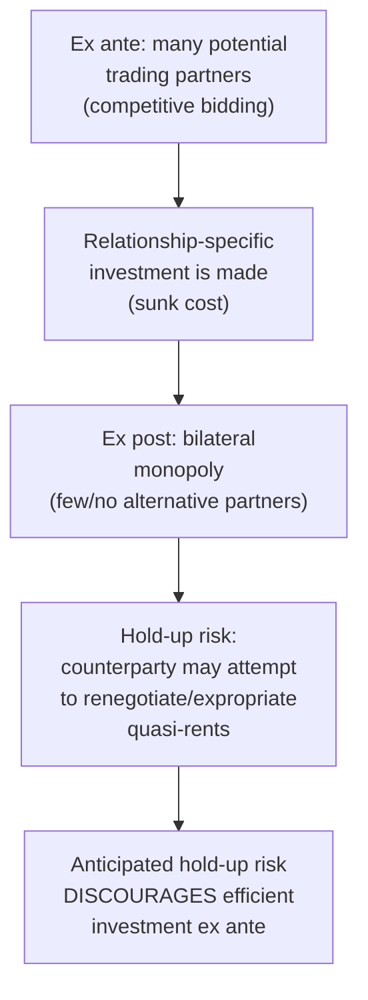

## Williamson's Transaction Cost Economics and Asset Specificity

### Overview

Oliver Williamson, building directly on Coase's 1937 insight, developed transaction cost economics (TCE) into a fully operational analytical framework from the 1970s onward, culminating in works including *Markets and Hierarchies* (1975) and *The Economic Institutions of Capitalism* (1985). Williamson's central contribution was identifying the specific dimensions along which transactions differ — most importantly **asset specificity** — that determine whether a given transaction is more efficiently governed through market contracting, internal organization (the firm), or intermediate hybrid arrangements. This work earned Williamson the Nobel Memorial Prize in Economic Sciences in 2009.

### Behavioral Assumptions Underlying TCE

Williamson's framework rests on two behavioral assumptions that depart from standard neoclassical rationality:

- **Bounded rationality**: economic actors intend to behave rationally but are limited in their capacity to process information and anticipate all future contingencies, making complete contracts impossible to write
- **Opportunism**: economic actors will behave self-interestedly, including with guile — exploiting contractual gaps or ambiguities to their own advantage when it is profitable to do so

**Key Points**

- These two assumptions jointly imply that contracts are necessarily *incomplete* (bounded rationality prevents specifying every contingency) and that this incompleteness creates genuine risk (opportunism means counterparties may exploit gaps), which is precisely the combination that gives governance structure choice its economic significance
- Without both assumptions simultaneously, the problem TCE addresses would not arise: unbounded rationality would allow complete contracting, and the absence of opportunism would make contractual gaps costless

### The Central Concept: Asset Specificity

Asset specificity refers to the degree to which an investment made to support a particular transaction has significantly lower value in its next-best alternative use. Williamson identified this as the single most important transaction attribute driving governance choice.

#### Types of Asset Specificity

| Type | Description |
| --- | --- |
| Site specificity | Successive production stages located in close physical proximity to economize on transport/inventory costs (e.g., an ore refinery built adjacent to a mine) |
| Physical asset specificity | Specialized equipment or machinery designed for a particular transaction, with limited value outside it (e.g., custom-built dies or molds for a specific customer's part) |
| Human asset specificity | Specialized knowledge, skills, or relationship-specific know-how developed through learning-by-doing within a particular trading relationship |
| Dedicated asset specificity | Investment in general-purpose plant that would not have been undertaken but for the prospect of a sale to a particular buyer |
| Brand-name capital specificity | Reputational investment tied to a specific relationship or franchise arrangement |
| Temporal specificity | Value of an asset highly dependent on the transaction occurring within a specific, often narrow, time window (e.g., perishable goods processing) |

### The Fundamental Transformation and the Hold-Up Problem

Williamson's key insight is that asset specificity transforms what begins as a competitive, large-numbers bargaining situation (many potential trading partners ex ante) into a bilateral monopoly situation ex post, once the relationship-specific investment has been sunk.

This dynamic is termed the **fundamental transformation**: once a specific investment is sunk, the investing party becomes locked into the relationship, since exiting means sacrificing the specialized value of the investment. This creates **appropriable quasi-rents** — the difference between the asset's value in the current relationship and its value in its next-best alternative use — which the counterparty may attempt to expropriate through opportunistic renegotiation, a phenomenon known as the **hold-up problem**.

**Key Points**

- Anticipation of hold-up, even if it never actually occurs, is sufficient to distort behavior: rational parties will underinvest in relationship-specific assets ex ante if they cannot be assured of capturing the returns to that investment
- This underinvestment is a real efficiency loss, providing the core economic rationale for choosing a governance structure (such as vertical integration) that mitigates hold-up risk

### The Discriminating Alignment Hypothesis

Williamson's central predictive hypothesis is that transactions, which differ in their attributes, should be matched with governance structures, which differ in their costs and competencies, so as to economize on transaction costs — an alignment he termed the **discriminating alignment hypothesis**.

#### The Three Primary Transaction Dimensions

1. **Asset specificity** — the degree of relationship-specific investment, as detailed above (the primary driver)
2. **Uncertainty** — the extent to which future contingencies are difficult to anticipate or verify, exacerbating the contractual incompleteness problem
3. **Frequency** — how often the transaction recurs; frequently recurring transactions can justify the fixed costs of specialized governance structures more easily than one-off transactions

#### The Governance Structure Continuum

$$\text{Market} \;\longleftrightarrow\; \text{Hybrid (long-term contracts, franchising, joint ventures)} \;\longleftrightarrow\; \text{Hierarchy (vertical integration)}$$

**Key Points**

- At low asset specificity, market governance is generally efficient: competitive bidding disciplines pricing, and switching suppliers is low-cost since investments are redeployable
- At high asset specificity, hierarchical governance (vertical integration) becomes efficient: bringing the transaction inside the firm replaces market-based bargaining (vulnerable to hold-up) with administrative fiat and unified ownership, aligning incentives and eliminating the scope for opportunistic renegotiation between separately owned parties
- At intermediate asset specificity, hybrid governance forms (long-term contracts with safeguards, franchising, joint ventures, relational contracting) often dominate, balancing the incentive benefits of market ownership against some protection from hold-up risk

### Governance as a Response to Contractual Hazards

Williamson emphasized that specific *contractual safeguards* can substitute for full vertical integration in mitigating hold-up risk, including:

- **Hostages**: reciprocal investments or collateral that create mutual dependence, deterring opportunism by making defection costly for both parties
- **Credible commitments**: contractual penalty clauses or reputational bonding that raise the cost of reneging
- **Vertical restraints**: exclusive dealing, franchising terms, and other contract provisions that align incentives without requiring full ownership integration

**Example**

An automobile manufacturer requiring highly customized, dedicated stamping dies from a supplier faces significant hold-up risk if the supplier could threaten to withhold delivery for a price increase after the manufacturer has designed its production line around that specific part. Williamson's framework predicts the manufacturer will either vertically integrate the stamping operation, or negotiate a long-term contract with specific safeguards (e.g., the manufacturer owning the dies itself) to mitigate this risk — precisely the kind of arrangement commonly observed in the automotive supply chain.

### Empirical Testing of TCE Predictions

TCE generated a substantial empirical literature testing the discriminating alignment hypothesis, predominantly using survey and case-based measures of asset specificity to predict observed governance choices (make vs. buy, contract length, vertical integration decisions):

- Studies in industries including automobiles, natural gas, and various manufacturing sectors have generally found support for the predicted positive relationship between asset specificity and the likelihood of vertical integration or contractual safeguards
- [Inference] While broadly considered one of the more empirically well-supported theories in organizational economics, some scholars have noted persistent measurement challenges in operationalizing asset specificity, since it is often assessed via subjective survey instruments rather than directly observable data, which is a recognized methodological limitation of this literature rather than a settled non-issue

### Relationship to Later Theories

- Williamson's TCE is often contrasted with the later **incomplete contracts / property-rights theory** (Grossman, Hart, Moore), which formalizes similar intuitions using explicit contract-theoretic modeling of residual control rights rather than Williamson's more empirically-driven, comparative-institutional approach
- Both traditions share the core insight that contractual incompleteness (whether from bounded rationality or unverifiability) combined with relationship-specific investment creates hold-up risk that shapes optimal governance structure, but they differ substantially in formal modeling technique and precise predictions

### Conclusion

Williamson's transaction cost economics operationalized Coase's original insight into a rigorous, testable framework by identifying asset specificity as the key transaction attribute that, combined with bounded rationality and opportunism, generates hold-up risk and determines the efficient boundary of the firm. The discriminating alignment hypothesis — matching transactions to governance structures along the market-hybrid-hierarchy continuum based on asset specificity, uncertainty, and frequency — remains the central organizing framework for empirical and theoretical analysis of vertical integration decisions within industrial economics.

**Related Topics / Next Steps**

- The hold-up problem and appropriable quasi-rents in depth
- Hybrid governance forms: franchising, joint ventures, relational contracts
- Property-rights / incomplete contracts theory (Grossman-Hart-Moore)
- Empirical measurement of asset specificity
- Vertical integration case studies in automotive and energy industries
- Vertical restraints as contractual safeguards against opportunism
- New Institutional Economics as a broader research program