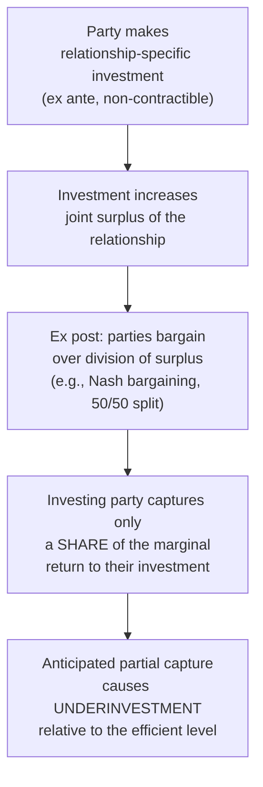

## Property Rights Theory of Firm Boundaries

### Overview

The property rights theory of the firm — developed by Sanford Grossman and Oliver Hart (1986) and extended by Hart and John Moore (1990), collectively known as the **GHM framework** — provides a formal contract-theoretic microfoundation for Coase's and Williamson's earlier, more informal transaction cost intuitions. Where Williamson's transaction cost economics is comparative-institutional and largely non-mathematical, GHM formalizes firm boundaries as an *incomplete contracting* problem, defining ownership precisely as the allocation of **residual control rights** — the right to decide how an asset is used in circumstances not explicitly specified by contract. This reformulation is often described as providing TCE's intuitions with rigorous microfoundations while also generating some distinct, testable predictions.

### The Starting Point: Contracts Are Necessarily Incomplete

Unlike Williamson, who grounds incomplete contracting in bounded rationality, GHM take contractual incompleteness as an assumption motivated by a different (though related) friction: even if parties could in principle foresee all future contingencies, many relevant aspects of performance may be **observable but not verifiable** by a third party (a court), making it impossible to write an enforceable complete contract.

**Key Points**

- "Observable but not verifiable" is the crucial distinction: both parties may clearly see how a relationship is unfolding, but if a court cannot confirm this information at low cost, the parties cannot write a contract enforceable on that information
- Because contracts cannot specify every contingent action, there necessarily exist gaps — situations not covered by the contract — that must be filled by *ex post bargaining* rather than *ex ante* contractual specification

### Ownership as Residual Control Rights

The defining innovation of the property rights approach is its precise definition of what ownership actually *means* in economic terms:

$$\text{Ownership of an asset} \equiv \text{the right to decide all uses of the asset not explicitly specified (or contractually assigned) elsewhere}$$

Ownership therefore does not confer control over every possible use of an asset — many uses are specified by contract, custom, or law — but confers **residual control**: the right to decide on the uses that contracts, by virtue of their necessary incompleteness, fail to specify.

**Key Points**

- This reframes "who owns the firm" (or a specific asset) as equivalent to "who holds the residual rights of control over that asset when the contract is silent"
- Vertical integration, in this framework, is precisely the act of transferring residual control rights over an asset from one party to another (e.g., one firm acquiring another means the acquirer now holds residual control over the acquired firm's assets)

### The Hold-Up Problem, Formalized

GHM formalize the same hold-up intuition present in Williamson's work, but derive it from the ex post bargaining that fills contractual gaps:

Because the investment itself cannot be contracted upon directly (it is often non-verifiable, e.g., effort or relationship-specific human capital), and the ex post division of surplus is instead determined by bargaining (commonly modeled as a Nash bargaining solution splitting the surplus, often 50/50 under symmetric bargaining power), each party anticipates capturing only a fraction of the return to their own investment. This leads to a systematic **underinvestment problem** relative to the first-best, fully-contractible benchmark.

**Key Points**

- The severity of underinvestment for a given party depends on their **bargaining power** and, crucially, on their **outside option** — what they could obtain if the relationship broke down
- This is where ownership becomes economically consequential: owning an asset improves a party's outside option (since non-owners can be excluded from the asset's use), which increases their bargaining power ex post, which in turn increases their incentive to invest ex ante

### The Core Result: Ownership Should Go to the More Important Investor

The central normative implication of GHM is that residual control rights (ownership) should be allocated to the party whose investment is relatively more important to the total surplus generated by the relationship — because ownership strengthens that party's ex post bargaining position and therefore their ex ante investment incentive.

**Key Points**

- If both parties make relationship-specific investments (a "double moral hazard" setting), some underinvestment on at least one side is generally unavoidable under any ownership structure, since only one party can hold residual control at a time — this is a key distinction from a first-best world with no such tradeoff
- Optimal ownership allocation therefore involves a tradeoff: strengthening one party's incentives via ownership necessarily weakens the other party's incentives, since the non-owner's outside option and bargaining position are correspondingly reduced

### Comparison with Williamson's Transaction Cost Economics

| Dimension | Williamson (TCE) | Grossman-Hart-Moore (Property Rights) |
| --- | --- | --- |
| Source of incompleteness | Bounded rationality | Non-verifiability (observable but not verifiable) |
| Core mechanism | Hold-up risk under bilateral dependency | Ex post bargaining over non-contractible surplus |
| Definition of firm boundary | Comparative governance cost minimization | Allocation of residual control rights over assets |
| Methodology | Largely comparative-institutional, empirical | Formal contract-theoretic modeling |
| Role of asset specificity | Central explanatory variable | Related, but reframed via investment importance and outside options |

**Key Points**

- [Inference] The property rights approach is often characterized in the literature as providing rigorous "microfoundations" for many of TCE's core predictions, though the two frameworks are not fully equivalent and can generate divergent predictions in specific settings — this relationship is more accurately described as substantial overlap with some genuine theoretical distinctions, rather than the property-rights theory being a strict formal restatement of TCE

### Predictions and Applications

- **Vertical integration is predicted when** one party's investment is substantially more important to total surplus than the other's, since concentrating ownership (and thus bargaining power) with the more important investor maximizes joint investment incentives
- **Non-integration (market contracting) is predicted when** both parties make investments of comparable importance, since integration would excessively weaken one party's incentives relative to the efficiency gain from strengthening the other's
- The theory has been applied to explain vertical integration patterns in industries including automobile manufacturing (supplier relationships), publishing, and franchising arrangements

**Example**

In a supplier relationship where the buyer's design and marketing investment is far more critical to the product's ultimate value than the supplier's routine manufacturing investment, GHM predicts the buyer should own the relationship (vertical integration, acquiring the supplier), since this ownership structure best protects the buyer's more important investment incentive, even though it weakens the supplier's incentives.

### Critiques and Limitations

- The theory has been criticized for its stylized treatment of ex post bargaining (commonly Nash bargaining with fixed, symmetric weights), which some argue does not fully capture the richness of real-world renegotiation
- Empirical testing is comparatively more difficult than for Williamson's asset-specificity-based predictions, since "investment importance" and "outside options" are harder to directly measure than transaction attributes like physical asset specificity
- Some scholars have noted the theory's predictions can be sensitive to specific modeling assumptions regarding the bargaining protocol and the precise specification of what is and is not verifiable
- [Inference] The relative empirical support for GHM versus TCE predictions remains a genuinely debated question in the literature rather than one with a clearly established consensus favoring either framework

### Conclusion

The property rights theory of the firm formalizes Coase's and Williamson's transaction cost intuitions using explicit contract theory, defining firm boundaries precisely as the allocation of residual control rights over non-contractible asset uses. Its central insight — that ownership should be allocated to strengthen the investment incentives of the party whose contribution is relatively more important to joint surplus — provides a rigorous, if more abstract, complement to Williamson's comparative-institutional analysis of asset specificity and hold-up, and remains a core pillar of the modern theory of the firm within industrial economics.

**Related Topics / Next Steps**

- Formal contract theory: verifiability versus observability
- Nash bargaining solutions and surplus division in incomplete contracts
- Double moral hazard and joint investment problems
- Empirical tests of GHM predictions in vertical integration
- Extensions: multi-asset ownership and firm scope (Hart and Moore, 1990)
- Comparison of GHM predictions with Williamson's asset-specificity framework
- Franchising as an intermediate ownership structure