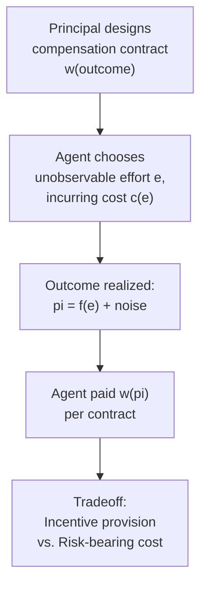

## Principal-Agent Problems and Managerial Incentives

### Overview

Principal-agent theory addresses a friction the neoclassical theory of the firm assumes away entirely: the separation of ownership and control. Once a firm's owners (principals) delegate decision-making to managers (agents), and once managerial effort or actions cannot be perfectly observed or verified, a fundamental incentive alignment problem arises. Agency theory formalizes this problem and derives the properties of optimal incentive contracts designed to align the agent's self-interested behavior with the principal's objectives, subject to the costs such contracts necessarily impose.

### The Separation of Ownership and Control

The theoretical starting point, traced to Adolf Berle and Gardiner Means's *The Modern Corporation and Private Property* (1932), observes that in large, publicly held corporations, dispersed shareholders (owners) delegate operational control to professional managers, who may pursue objectives other than pure shareholder value maximization.

**Key Points**

- This separation directly violates the neoclassical assumption of a unified, profit-maximizing decision-maker, motivating a distinct branch of the theory of the firm literature
- Potential divergent managerial objectives include empire-building (growth or scale maximization for its own sake, prestige, or job security), effort minimization ("shirking"), and excessive risk aversion (protecting managerial job security rather than maximizing shareholder-optimal risk-return tradeoffs)

### The Core Agency Problem: Information Asymmetry

Agency problems arise specifically because the principal cannot costlessly observe or verify the agent's actions or private information. Two canonical categories are distinguished:

#### Moral Hazard (Hidden Action)

The agent takes an action (e.g., effort level) that is not directly observable or verifiable by the principal, after the contract is signed.

$$\pi = f(e) + \varepsilon, \quad e \text{ not observed by principal}$$

where output $\pi$ depends on unobserved effort $e$ and a random noise term $\varepsilon$, so the principal cannot infer effort directly from the observed outcome.

#### Adverse Selection (Hidden Information)

The agent possesses private information (e.g., about their own ability or the true state of the firm) that is unknown to the principal *before* the contract is signed, potentially distorting the terms under which contracting occurs.

**Key Points**

- Moral hazard concerns hidden actions taken *after* contracting; adverse selection concerns hidden information that exists *before* contracting
- Real managerial relationships typically feature both problems simultaneously, though most introductory agency models isolate one or the other for tractability

### The Standard Principal-Agent Model

The canonical formalization considers a risk-neutral principal (shareholders) contracting with a risk-averse agent (a manager) whose effort $e$ is costly and unobservable, but which stochastically affects a verifiable outcome (e.g., profit or stock price).

#### The Optimal Contract Problem

The principal's problem is to choose a compensation schedule $w(\pi)$ to maximize expected profit net of compensation, subject to two constraints:

$$\max_{w(\pi)} \; E[\pi - w(\pi)]$$

subject to:

- **Individual Rationality (IR) / Participation constraint**: $E[U(w(\pi)) - c(e)] \geq \bar{U}$ (the agent must receive at least their reservation utility to accept the contract)
- **Incentive Compatibility (IC) constraint**: the agent chooses the effort level $e$ that maximizes their own expected utility given the contract $w(\pi)$, i.e., $e \in \arg\max_e E[U(w(\pi)) - c(e)]$

**Key Points**

- If effort were directly observable and verifiable (the first-best benchmark), the principal could simply pay a fixed wage contingent on the *observed effort level itself*, fully insuring the risk-averse agent while still inducing efficient effort — the agency problem would disappear entirely
- Because effort is unobservable, the principal must instead condition pay on the *outcome* (a noisy signal of effort), which necessarily exposes the risk-averse agent to income risk they would not bear under a first-best contract

### The Fundamental Tradeoff: Risk-Sharing versus Incentives

The central result of the standard agency model is a tradeoff between two objectives that a compensation contract cannot simultaneously achieve perfectly:

| Contract Type | Risk-Bearing Efficiency | Incentive Provision |
| --- | --- | --- |
| Fixed wage (no pay-performance link) | Efficient (risk-neutral principal bears all risk) | Poor (agent has no incentive to exert effort) |
| Full residual claimant (agent bears all profit risk) | Inefficient (risk-averse agent bears risk unnecessarily) | Strong (agent fully internalizes effort returns) |
| Optimal second-best contract | Intermediate | Intermediate |

**Key Points**

- Because the risk-neutral principal is better positioned to bear risk than the risk-averse agent, a first-best contract (in a world without moral hazard) would place all risk on the principal via a fixed wage
- Under moral hazard, however, a fixed wage provides no incentive for costly effort, so the optimal *second-best* contract necessarily makes agent pay sensitive to the noisy outcome, imposing some inefficient risk-bearing cost on the agent as the unavoidable price of incentive provision
- This tradeoff explains why observed executive compensation packages combine base salary (risk protection) with performance-contingent elements such as bonuses, stock, and stock options (incentive provision) rather than relying on either extreme alone

### Managerial Theories of the Firm

A related strand of literature, predating the formal agency-theoretic apparatus, modeled managerial objectives directly as alternatives to shareholder profit maximization:

- **Baumol's sales/revenue maximization model** (1959) — proposed that managers, subject to a minimum profit constraint sufficient to satisfy shareholders, maximize sales revenue rather than profit, reflecting managerial preferences tied to firm size, salary, and prestige
- **Williamson's managerial discretion model** (1963, distinct from his later transaction cost work) — modeled managers as maximizing a utility function over staff expenditures, managerial emoluments ("perks"), and discretionary investment, subject to a minimum profit constraint
- **Marris's growth maximization model** (1964) — modeled managers as maximizing the firm's balanced growth rate, subject to constraints preventing the firm from becoming a takeover target

**Key Points**

- These managerial models predate and are less formally rigorous than modern agency theory, but they anticipate its core insight: that separating ownership from control creates systematic divergence between managerial and shareholder objectives, with real consequences for observed firm behavior (excess staff, excess growth, or excess perquisite consumption relative to the profit-maximizing benchmark)

### Corporate Governance Mechanisms as Responses to Agency Costs

Real-world institutions have evolved specifically to mitigate the managerial agency problem, effectively substituting or complementing formal incentive contracts:

- **Performance-based compensation**: stock options, restricted stock, and bonus schemes tying manager pay to firm performance, directly implementing the second-best contract logic above
- **Board of directors monitoring**: an internal governance mechanism tasked with monitoring management on behalf of dispersed shareholders
- **Market for corporate control**: the threat of hostile takeover disciplines underperforming management, since poorly-run firms trading below their potential value become acquisition targets
- **Debt as a disciplining device**: contractual obligations to service debt reduce the "free cash flow" available for managerial discretionary (potentially self-serving) spending, per Michael Jensen's free cash flow theory
- **Product market competition**: competitive pressure independently disciplines managerial slack, since firms that fail to minimize costs or maximize value risk being outcompeted

**Example**

Executive stock option compensation is a direct application of the incentive-provision logic above: by tying a portion of managerial pay to the firm's stock price, the contract induces the manager to internalize a share of the returns to their own effort and decisions, at the cost of exposing the (typically more risk-averse than shareholders, who can diversify) manager to firm-specific risk they cannot fully diversify away.

### Agency Theory Within Industrial Economics

- Agency costs feed directly into transaction cost and property-rights theories of the firm: internal organization is not costless, and the diseconomies of expanding firm boundaries (per Coase and Williamson) are substantially explained by the rising agency costs of monitoring an increasingly complex managerial hierarchy
- Agency theory also underlies the analysis of vertical relationships between firms (e.g., manufacturer-retailer relationships), where similar moral hazard problems (e.g., retailer effort in promoting a product) motivate specific vertical restraints (resale price maintenance, exclusive territories) as second-best incentive-alignment devices, connecting directly to the IO literature on vertical restraints

**Key Points**

- [Inference] The integration of agency theory into the broader theory-of-the-firm literature is generally presented as complementary to, rather than competing with, transaction cost and property-rights approaches — agency costs are commonly treated as one specific component contributing to the broader diseconomies-of-scale-in-organization logic that determines optimal firm boundaries in Coase's and Williamson's frameworks

### Conclusion

Principal-agent theory formalizes the consequences of separating ownership from control, a friction entirely absent from the neoclassical theory of the firm. By modeling the fundamental tradeoff between risk-sharing and incentive provision under unobservable managerial effort, agency theory explains both the structure of observed executive compensation contracts and the broader array of corporate governance mechanisms — board monitoring, the market for corporate control, and debt discipline — that have evolved to mitigate the resulting agency costs, forming an essential complement to the transaction cost and property-rights theories of firm boundaries.

**Related Topics / Next Steps**

- Moral hazard versus adverse selection in depth
- Optimal incentive contract design (linear contracts, tournaments)
- Baumol, Williamson, and Marris managerial theories of the firm
- The market for corporate control and hostile takeovers
- Jensen's free cash flow theory of debt
- Executive compensation design and stock option incentives
- Agency costs and their relationship to firm boundary determination