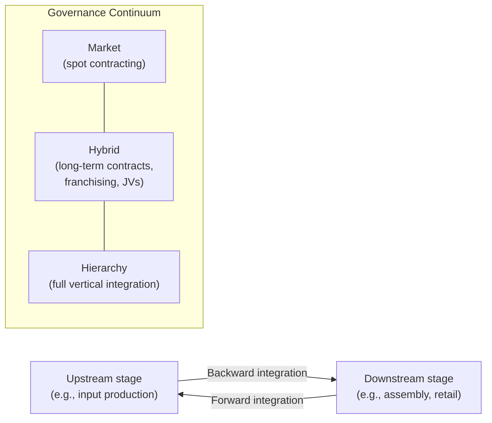

## Make-or-Buy Decisions and Vertical Integration Choices

### Overview

The make-or-buy decision is the applied, firm-level manifestation of the theory-of-the-firm frameworks developed by Coase, Williamson, and Grossman-Hart-Moore: given a specific input, activity, or production stage, should a firm produce it internally (make, i.e., vertical integration) or procure it externally through market contracting (buy)? This decision synthesizes the transaction cost and property-rights logic into an actionable analytical framework, while also drawing on complementary industrial-economics rationales — market power extension, price discrimination facilitation, and double marginalization elimination — that extend beyond pure governance-cost minimization.

### Defining Vertical Integration

Vertical integration refers to a firm's ownership and control of successive stages of a production or distribution chain that could, in principle, be coordinated instead through independent market transactions between separately owned firms.

- **Backward (upstream) integration**: acquiring or internally developing a supplier of inputs (e.g., a manufacturer acquiring a raw materials producer)
- **Forward (downstream) integration**: acquiring or internally developing a distribution or retail channel (e.g., a manufacturer acquiring its retail outlets)
- **Degree of integration**: a continuum from full integration (complete ownership of both stages) through partial/quasi-integration (minority equity stakes, long-term contracts with specific safeguards) to pure market transaction (arm's-length spot contracting)

### Transaction Cost Framework Applied to Make-or-Buy

Williamson's discriminating alignment hypothesis provides the primary operational decision rule: transactions should be governed by the structure that most efficiently economizes on transaction costs, given the transaction's attributes.

**Key Points**

- **High asset specificity** (site, physical, human, or dedicated) → favors "make" (integration), since market contracting exposes the specific investment to hold-up risk
- **High uncertainty** → favors integration when combined with meaningful asset specificity, since it is harder to write complete contracts covering unanticipated contingencies
- **High frequency** → favors integration (or at least specialized governance) over one-off market transactions, since the fixed costs of establishing specialized governance are more easily justified when amortized over repeated transactions
- **Low asset specificity, low uncertainty, infrequent transactions** → favors "buy" (market procurement), since competitive market contracting is typically lower-cost than the bureaucratic and incentive-distorting costs of internal organization

### The Property Rights Perspective on Make-or-Buy

The GHM framework reframes the same decision as a question of optimal residual control allocation: integration should occur when doing so best protects the incentives of whichever party's investment is relatively more important to the joint value of the relationship, as detailed in the property-rights theory of firm boundaries.

**Key Points**

- This perspective adds a distinct dimension beyond pure asset specificity: even absent classic physical asset specificity, if one party's *investment* is disproportionately important to surplus creation, ownership allocation still matters for incentive purposes
- In practice, transaction cost and property-rights predictions frequently point toward the same governance conclusion for a given transaction, though the underlying formal mechanism differs

### Additional Industrial-Economics Rationales for Vertical Integration

Beyond pure transaction-cost minimization, IO identifies several additional motives for vertical integration, some of which raise distinct competitive/welfare concerns:

#### Eliminating Double Marginalization

When both an upstream monopolist and a downstream monopolist independently mark up price above marginal cost, the resulting final price is *higher*, and joint profit *lower*, than if a single vertically integrated firm set price to maximize total channel profit — a classic result known as double marginalization.

$$P_{\text{integrated}} < P_{\text{separated}}, \quad \pi_{\text{integrated}} > \pi_{\text{upstream}} + \pi_{\text{downstream}}$$

**Key Points**

- Vertical integration internalizes the externality that each independent monopolist's markup imposes on the other, restoring a single-markup outcome that benefits both consumers (lower price) and the integrated firm (higher joint profit) relative to double marginalization
- This is generally regarded as an efficiency-enhancing (welfare-improving) rationale for vertical integration, distinguishing it from anticompetitively-motivated integration

#### Foreclosure and Market Power Extension

Vertical integration can also serve strategic, competitively-concerning purposes:

- **Input foreclosure**: an integrated upstream firm may refuse to supply, or charge disadvantageous terms to, downstream rivals of its own integrated downstream division
- **Customer foreclosure**: an integrated downstream firm may refuse to purchase from upstream rivals of its own integrated upstream division
- Both forms can raise rivals' costs and potentially extend market power from one stage of the supply chain to another, motivating antitrust scrutiny of vertical mergers

#### Facilitating Price Discrimination and Quality Control

- Vertical integration can enable more effective price discrimination by controlling the terms under which a product ultimately reaches different consumer segments
- Integration can also address quality-control externalities where independent downstream retailers might under-invest in service quality that benefits the upstream brand collectively (a free-rider problem, related to the Chicago School's efficiency rationale for vertical restraints)

**Example**

A smartphone manufacturer integrating forward into retail (company-owned stores) may be motivated simultaneously by transaction-cost logic (protecting brand-specific human capital investments in sales staff training) and by quality-control logic (ensuring a consistent customer experience that independent retailers might under-provide if they could free-ride on the brand's reputation).

### The Antitrust Perspective on Vertical Integration

Vertical mergers occupy a distinctive position in competition policy, reflecting the tension between the efficiency rationales above and the foreclosure concerns:

| Perspective | View of Vertical Integration |
| --- | --- |
| Chicago School | Generally efficiency-enhancing; foreclosure theories viewed skeptically absent clear evidence of harm |
| Harvard/structuralist tradition | More concerned with potential foreclosure and market power extension |
| Post-Chicago / modern antitrust | Case-specific analysis using formal foreclosure models (e.g., raising rivals' costs frameworks), assessing efficiency justifications against foreclosure risk on a fact-specific basis |

**Key Points**

- Modern merger guidelines for vertical mergers (e.g., US Vertical Merger Guidelines, EU non-horizontal merger guidelines) explicitly balance double-marginalization elimination (a recognized efficiency) against input/customer foreclosure risk (a recognized competitive harm), rather than adopting either the pure Chicago or pure Harvard position wholesale

### A Decision Framework for Make-or-Buy Analysis

Synthesizing the above, a practical make-or-buy analysis proceeds through the following considerations:

1. **Assess asset specificity**: does the transaction require relationship-specific investment (physical, human, site, or dedicated) exposed to hold-up risk?
2. **Assess relative investment importance**: whose investment is more critical to the transaction's total value creation?
3. **Assess uncertainty and contractibility**: can the relevant contingencies be reasonably specified and verified in a contract, or is significant ex post renegotiation likely?
4. **Assess frequency**: is this a recurring transaction justifying specialized governance investment, or a one-off exchange better handled via spot market contracting?
5. **Assess double marginalization potential**: are there successive, independently-priced markups in the supply chain that integration could eliminate?
6. **Assess competitive/foreclosure implications**: could integration foreclose rivals' access to critical inputs or customers, inviting antitrust scrutiny?

**Key Points**

- No single framework mechanically determines the "correct" answer in all cases; real-world make-or-buy decisions typically weigh several of these considerations simultaneously, with asset specificity and hold-up risk generally treated as the primary drivers in both academic and applied analysis

### Empirical Patterns

- Empirical studies across automotive, natural gas, aerospace, and other manufacturing-intensive industries have generally found vertical integration more prevalent for inputs characterized by high measured asset specificity, consistent with transaction cost predictions
- Franchising is commonly observed as an intermediate ("hybrid") governance form precisely in settings combining moderate asset specificity (brand-name capital) with strong incentive requirements at the local outlet level (motivating independent, residual-claimant local ownership rather than salaried management)

### Conclusion

The make-or-buy decision operationalizes the theoretical apparatus of Coase, Williamson, and Grossman-Hart-Moore into a practical governance choice, while industrial economics further enriches the analysis with efficiency rationales (double marginalization elimination) and competitive concerns (foreclosure) specific to vertical relationships between firms possessing market power. The resulting synthesis — balancing transaction cost minimization, investment incentive alignment, and welfare/competitive considerations — remains the standard analytical toolkit for evaluating vertical integration decisions in both applied business strategy and antitrust merger review.

**Related Topics / Next Steps**

- Double marginalization: formal derivation and welfare analysis
- Input and customer foreclosure theories in vertical merger analysis
- Franchising as hybrid governance: theory and empirical patterns
- Vertical merger guidelines and antitrust enforcement practice
- Raising rivals' costs frameworks in vertical foreclosure analysis
- Empirical measurement strategies for asset specificity in make-or-buy studies
- Vertical restraints as alternatives to full integration