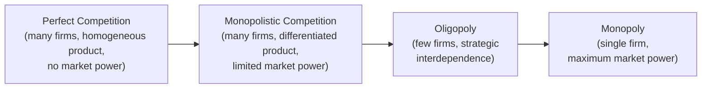

## The Spectrum of Market Structures

### Overview

Market structure describes the organizational and competitive characteristics of an industry that shape how firms interact and how prices, output, and welfare outcomes are determined. Industrial economics organizes real-world markets along a spectrum bounded by two theoretical polar cases — perfect competition and pure monopoly — with monopolistic competition and oligopoly occupying the intermediate territory where most real markets actually reside. Each structure is distinguished by the number of firms, the nature of the product, barriers to entry, and the degree of control any individual firm exercises over price.

### The Spectrum: An Overview

**Key Points**

- Movement along the spectrum, left to right, generally corresponds to declining firm numbers, rising barriers to entry, and increasing individual firm control over price
- Real-world industries rarely fit any polar case perfectly; the spectrum is best understood as an analytical continuum for classifying observed markets by their closest theoretical approximation

### Perfect Competition

#### Defining Characteristics

- **Many buyers and sellers**, each too small individually to influence the market price
- **Homogeneous (undifferentiated) product**: consumers view all firms' output as perfect substitutes
- **Free entry and exit**: no barriers prevent firms from entering or leaving the industry
- **Perfect information**: all market participants have complete knowledge of prices and product characteristics
- **Price-taking behavior**: each firm faces a perfectly elastic (horizontal) demand curve at the market price

#### Equilibrium Conditions

Each firm sets output where price equals marginal cost:

$$P = MC(Q)$$

In long-run equilibrium, free entry drives economic profit to zero, so price also equals minimum average total cost:

$$P = MC = \min(ATC)$$

**Key Points**

- Perfect competition serves as the welfare benchmark throughout industrial economics: it achieves both allocative efficiency ($P = MC$) and productive efficiency (production at minimum ATC)
- No real-world market perfectly satisfies all defining assumptions; certain agricultural commodity markets and some financial markets are commonly cited as close approximations

### Monopoly

#### Defining Characteristics

- **Single seller** controlling the entire market supply of a product with no close substitutes
- **Significant barriers to entry** prevent competitive erosion of the incumbent's position
- **Price-maker behavior**: the monopolist faces the entire market (downward-sloping) demand curve directly

#### Equilibrium Condition

The profit-maximizing monopolist sets output where marginal revenue equals marginal cost, resulting in a price above marginal cost:

$$MR(Q) = MC(Q), \quad P > MC$$

The gap between price and marginal cost is measured by the **Lerner Index**:

$$L = \frac{P - MC}{P} = -\frac{1}{\epsilon_d}$$

where $\epsilon_d$ is the price elasticity of demand faced by the firm (negative by convention), showing that market power is inversely related to the elasticity of demand the firm faces.

**Key Points**

- Monopoly generates a deadweight welfare loss relative to the competitive benchmark, since output is restricted below the allocatively efficient level ($P = MC$)
- Sources of monopoly typically include: legal barriers (patents, licenses), control of essential inputs, network effects, or natural monopoly cost conditions (large economies of scale relative to market demand)

### Monopolistic Competition

#### Defining Characteristics

- **Many firms**, but each selling a **differentiated product** (via branding, quality, features, or location), giving each firm some limited pricing power despite the presence of many competitors
- **Free entry and exit** in the long run, similar to perfect competition
- **Downward-sloping firm-level demand curve**, but relatively elastic due to the presence of close (though not perfect) substitutes offered by competitors

#### Equilibrium Conditions

In the short run, firms maximize profit at $MR = MC$, potentially earning positive economic profit. In the long run, free entry (attracted by positive profits) shifts each firm's demand curve inward until profit is driven to zero — but this occurs where demand is tangent to (rather than intersecting) the average total cost curve, at a point where price still exceeds marginal cost:

$$P > MC, \quad P = ATC \text{ (zero long-run profit, but not minimum } ATC\text{)}$$

**Key Points**

- Unlike perfect competition, long-run equilibrium under monopolistic competition does *not* occur at minimum average total cost — firms operate with some excess capacity, reflecting the tradeoff between product variety (a consumer benefit) and productive efficiency (a cost)
- Chamberlin's and Robinson's 1933 formalizations of this structure (see historical evolution of the field) provided the theoretical tools — differentiated demand, marginal revenue under downward-sloping demand — that remain standard throughout IO
- Retail, restaurants, and many consumer branded-goods industries are commonly cited as approximating monopolistic competition

### Oligopoly

#### Defining Characteristics

- **Few firms** dominate the market, such that each firm's decisions materially affect, and are affected by, its rivals' decisions — the defining feature of **strategic interdependence**
- Products may be homogeneous (e.g., commodity oligopoly) or differentiated (e.g., automobile or smartphone oligopoly)
- **Significant barriers to entry** typically sustain the small-numbers structure over time
- No single equilibrium concept applies universally; outcomes depend critically on the specific strategic variable (price or quantity) and the timing/information structure of competition

#### Core Oligopoly Models

| Model | Strategic Variable | Key Prediction |
| --- | --- | --- |
| Cournot | Quantity (simultaneous) | Price above competitive level, below monopoly; converges toward competitive outcome as firm number increases |
| Bertrand | Price (simultaneous) | With homogeneous products and constant marginal cost, price collapses to marginal cost even with just two firms ("Bertrand paradox") |
| Stackelberg | Quantity (sequential, first-mover advantage) | First-mover produces more, earns higher profit, than in simultaneous Cournot equilibrium |
| Kinked demand curve | Price (informal, non-equilibrium model) | Explains price rigidity via asymmetric conjectures about rival responses to price changes |

**Key Points**

- The stark divergence between Cournot and Bertrand predictions under seemingly similar assumptions (homogeneous product, simultaneous choice) is a foundational puzzle in oligopoly theory, generally resolved by recognizing that the two models implicitly differ in short-run capacity constraints and the realism of instantaneous price-matching
- Oligopoly is the structure most directly connected to modern game-theoretic IO, since strategic interdependence — absent in both perfect competition (individually negligible firms) and monopoly (no rivals) — is oligopoly's defining analytical feature

### Comparative Summary Table

| Structure | Number of Firms | Product Type | Entry Barriers | Firm's Price Control | Long-Run Profit |
| --- | --- | --- | --- | --- | --- |
| Perfect Competition | Many | Homogeneous | None | None (price-taker) | Zero |
| Monopolistic Competition | Many | Differentiated | Low | Limited | Zero |
| Oligopoly | Few | Homogeneous or differentiated | Significant | Substantial, interdependent | Can be positive |
| Monopoly | One | Unique | Very high/prohibitive | Full (subject to demand) | Can be positive |

### Classifying Real-World Markets

- No real industry matches a polar theoretical case exactly; classification is a matter of degree, typically informed by empirical concentration measures (concentration ratios, HHI — covered separately in this chapter)
- The same broad industry can straddle categories depending on how the relevant market is defined (e.g., "soft drinks" might appear oligopolistic at the national brand level but more monopolistically competitive when including local and store-brand substitutes) — market definition is consequently one of the most consequential and contested steps in applied IO and antitrust analysis
- [Inference] Contestable markets theory (covered separately) offers a partial qualification to this classification exercise, arguing that even markets with few incumbent firms can behave competitively if entry and exit are sufficiently costless (contestable), suggesting that firm count alone can be a misleading indicator of competitive intensity absent consideration of entry conditions

### Conclusion

The spectrum of market structures — perfect competition, monopolistic competition, oligopoly, and monopoly — provides the foundational taxonomy for classifying real-world industries and selecting the appropriate analytical toolkit for each. While perfect competition and monopoly furnish the tractable polar benchmarks used to measure welfare loss, oligopoly and monopolistic competition better describe the strategic and differentiated character of most actual markets, motivating the game-theoretic and empirical methods that constitute the core of modern industrial economics.

**Related Topics / Next Steps**

- Concentration ratios and the Herfindahl-Hirschman Index
- Cournot, Bertrand, and Stackelberg models in depth
- The Bertrand paradox and its resolutions (capacity constraints, product differentiation)
- Contestable markets theory
- Market definition methodology in antitrust analysis
- Product differentiation and monopolistic competition equilibrium
- Barriers to entry: typology and measurement