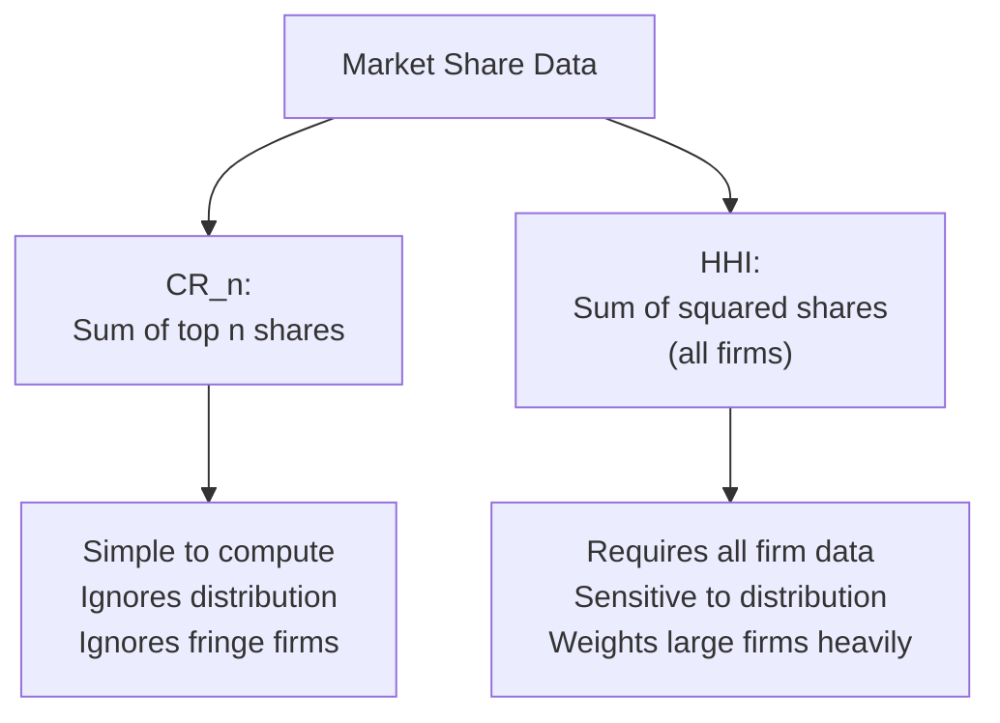

## Concentration Ratios and the Herfindahl-Hirschman Index

### Overview

Concentration measures are the primary empirical tools used to quantify market structure, translating the qualitative spectrum from perfect competition to monopoly into a single numerical summary statistic. The two dominant measures in both academic industrial economics and applied antitrust practice are the **concentration ratio** ($CR_n$) and the **Herfindahl-Hirschman Index** (HHI), each with distinct properties, computational requirements, and regulatory applications.

### The Concentration Ratio ($CR_n$)

#### Definition

The $n$-firm concentration ratio sums the market shares of the largest $n$ firms in an industry:

$$CR_n = \sum_{i=1}^{n} s_i$$

where $s_i$ is the market share of the $i$-th largest firm (typically expressed as a percentage), and firms are ranked in descending order of market share.

**Key Points**

- Common variants include $CR_4$ (four-firm concentration ratio, the most widely reported in historical US Census industry statistics) and $CR_8$ (eight-firm ratio, used in some of Bain's original empirical work)
- $CR_n$ ranges from a value approaching $0$ (many small, equally-sized firms) to $100\%$ (the top $n$ firms constitute the entire market, as in monopoly when $n=1$)

#### Example Calculation

**Example**

Consider an industry with market shares of 30%, 25%, 15%, 10%, and the remainder split among many small firms. The four-firm concentration ratio is:

$$CR_4 = 30\% + 25\% + 15\% + 10\% = 80\%$$

This would generally be classified as a highly concentrated, oligopolistic market structure.

#### Limitations of $CR_n$

- **Ignores firms outside the top $n$**: two industries with identical $CR_4$ values can have very different competitive dynamics if one has a fringe of many small competitors and the other has none
- **Ignores the distribution of shares among the top $n$ firms**: an industry where the top four firms hold shares of $(77\%, 1\%, 1\%, 1\%)$ has the same $CR_4 = 80\%$ as one with shares of $(20\%, 20\%, 20\%, 20\%)$, despite the former being far closer to a monopoly
- **Arbitrary choice of $n$**: the choice of 4, 8, or any other cutoff is a convention rather than a theoretically derived threshold

**Key Points**

- These limitations — particularly insensitivity to the within-top-$n$ distribution — are the primary motivation for the Herfindahl-Hirschman Index as an alternative measure

### The Herfindahl-Hirschman Index (HHI)

#### Definition

The HHI sums the squared market shares of **all** firms in the industry:

$$HHI = \sum_{i=1}^{N} s_i^2$$

where $s_i$ is typically expressed as a percentage (e.g., 25 for a 25% share), and $N$ is the total number of firms in the market.

**Key Points**

- Squaring market shares gives disproportionately greater weight to larger firms, so the HHI is sensitive to the *distribution* of shares among firms, not merely the count above a fixed cutoff
- With shares expressed as percentages (0–100), HHI ranges from near $0$ (many infinitesimally small, equally-sized firms) to $10{,}000$ (pure monopoly, a single firm with 100% share: $100^2 = 10{,}000$)

#### Special Case: Symmetric Firms

If a market consists of $N$ firms each holding an equal share ($s_i = 100/N$ for all $i$), the HHI simplifies to:

$$HHI = N \times \left(\frac{100}{N}\right)^2 = \frac{10{,}000}{N}$$

This yields a useful interpretive shortcut: the HHI can be read as implying an "equivalent number of equal-sized firms" via $N_{\text{equiv}} = 10{,}000 / HHI$.

**Example**

An industry with an HHI of 2,500 is equivalent, in this specific symmetric-firm sense, to a market of $10{,}000/2{,}500 = 4$ equally-sized firms — providing an intuitive way to communicate an otherwise abstract index value.

#### Example Calculation

**Example**

Using the same market share distribution as above — 30%, 25%, 15%, 10%, and remaining share split among, say, ten firms at 2% each — the HHI is calculated as:

$$HHI = 30^2 + 25^2 + 15^2 + 10^2 + 10 \times (2^2) = 900 + 625 + 225 + 100 + 40 = 1{,}890$$

Note this differs substantially from the $CR_4 = 80\%$ figure calculated earlier for the same industry, illustrating that the two measures can suggest different degrees of concentration even for identical underlying data.

### Comparison of the Two Measures

| Property | $CR_n$ | HHI |
| --- | --- | --- |
| Data requirement | Only top $n$ firms' shares | All firms' shares |
| Sensitivity to share distribution among leaders | None | High (squared weighting) |
| Sensitivity to fringe competitors | None (ignored entirely) | Some (small firms contribute small squared terms) |
| Regulatory standard usage | Historical US Census reporting | Primary modern antitrust merger-screening tool |
| Computational simplicity | Very simple | Requires complete market share data |

**Key Points**

- The HHI's requirement for complete market share data (not just the top few firms) is both its analytical strength and its practical limitation — comprehensive share data is not always readily available, particularly for markets with many small fringe participants

### Regulatory Application: Merger Screening Thresholds

The HHI is the primary concentration measure used by antitrust authorities to screen proposed mergers, most notably in the US Department of Justice / Federal Trade Commission Horizontal Merger Guidelines, which classify markets using threshold bands:

| Post-merger HHI | Classification |
| --- | --- |
| Below 1,500 | Unconcentrated market |
| 1,500 to 2,500 | Moderately concentrated market |
| Above 2,500 | Highly concentrated market |

The guidelines further consider the **change in HHI** ($\Delta HHI$) resulting directly from the merger, calculated as:

$$\Delta HHI = 2 \cdot s_A \cdot s_B$$

where $s_A$ and $s_B$ are the pre-merger market shares of the two merging firms — this formula follows directly from expanding $(s_A + s_B)^2 - s_A^2 - s_B^2 = 2 s_A s_B$.

**Key Points**

- Mergers producing a highly concentrated post-merger market (HHI above 2,500) combined with a $\Delta HHI$ increase above 200 points are presumed by the guidelines to warrant closer scrutiny, though this is a screening heuristic that triggers further investigation rather than an automatic prohibition
- [Inference] These specific numerical thresholds are a matter of current regulatory guidance rather than settled economic theory, and have been revised over time as merger enforcement guidelines have been periodically updated — the precise figures should be verified against the currently applicable guideline document for any authoritative or time-sensitive application
- Modern merger review increasingly supplements this initial HHI-based screening with more sophisticated structural tools, including NEIO-style merger simulation using estimated demand systems (e.g., the BLP approach)

### Alternative and Supplementary Concentration Measures

- **Entropy index**: $E = -\sum_i s_i \ln(s_i)$, which is inversely related to concentration (higher entropy corresponds to lower concentration) and has certain decomposability properties useful for analyzing changes in concentration across sub-markets or over time
- **Gini coefficient**: adapted from income inequality measurement to describe the dispersion of firm sizes within an industry
- **Numbers-equivalent measures**: transformations (such as the $10{,}000/HHI$ shortcut above) that translate abstract index values into an intuitively interpretable "equivalent number of equal-sized firms"

**Key Points**

- [Inference] While these alternative measures appear in the academic literature and are sometimes used in specific empirical applications, the HHI remains the dominant standard in both mainstream applied IO research and regulatory practice, so familiarity with alternatives is generally treated as supplementary rather than essential

### Market Definition: The Prerequisite Problem

Both $CR_n$ and HHI calculations depend critically on how the relevant market is defined — the set of products and geographic area considered to be in competition with one another. This is frequently the single most consequential and contested step in any concentration analysis.

**Key Points**

- A narrowly defined market (e.g., "premium athletic footwear") will generally show higher concentration than a broadly defined one (e.g., "footwear"), for the same underlying firms and sales data
- Antitrust practice typically employs the **hypothetical monopolist test** (asking whether a hypothetical monopolist controlling the candidate market could profitably impose a "small but significant and non-transitory increase in price," commonly abbreviated SSNIP) to formally delineate the relevant market before concentration measures are computed
- Because concentration measures are only as meaningful as the market definition underlying them, sensitivity analysis across plausible alternative market definitions is standard practice in rigorous applied work

### Conclusion

Concentration ratios and the Herfindahl-Hirschman Index provide the standard quantitative toolkit for translating qualitative market structure into measurable, comparable statistics. While $CR_n$ offers computational simplicity at the cost of ignoring both the fringe of smaller competitors and the distribution among leading firms, the HHI's squared-share weighting captures both dimensions more completely, explaining its status as the primary tool for modern antitrust merger screening — subject always to the prior, and often more consequential, challenge of correctly defining the relevant market.

**Related Topics / Next Steps**

- The hypothetical monopolist test and SSNIP methodology for market definition
- HHI-based merger screening thresholds and their application in case practice
- Entropy and Gini-based alternative concentration measures
- The relationship between concentration and the SCP paradigm's profitability hypothesis
- Merger simulation using structural demand estimation (BLP)
- Concentration trends over time and industry-level empirical studies
- Geographic versus product market definition challenges