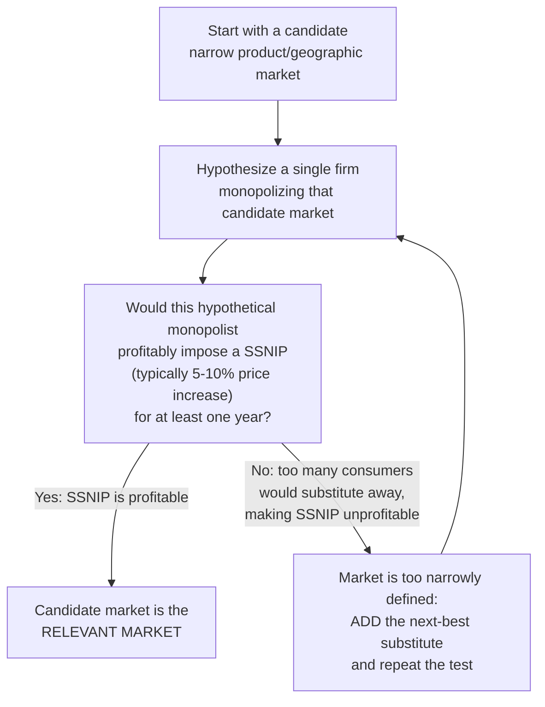

## Defining Relevant Product and Geographic Markets

### Overview

Market definition is the analytical process of identifying the set of products and the geographic area within which meaningful competitive constraints operate — establishing the boundaries within which concentration measures, market shares, and competitive effects analysis are meaningfully calculated. It is frequently the single most consequential and most contested step in applied industrial economics and antitrust practice, since virtually every downstream conclusion (market shares, concentration levels, assessment of market power) depends directly on where these boundaries are drawn.

### Why Market Definition Matters

- Concentration measures ($CR_n$, HHI) are only meaningful relative to a specified market; the same firm can appear dominant in a narrowly defined market and negligible in a broadly defined one
- Antitrust liability frequently turns directly on market definition: a merger or conduct that appears anticompetitive within a narrow market definition may appear competitively immaterial within a broader one
- Market definition is not a purely mechanical exercise — it requires economic judgment about the degree of substitutability that constitutes meaningful competitive constraint, and different reasonable analysts can reach different conclusions from the same underlying data

**Key Points**

- Because so much rides on this determination, market definition is typically among the most heavily litigated and empirically scrutinized issues in antitrust cases

### The Product Market Dimension

#### Core Concept: Demand-Side and Supply-Side Substitutability

The relevant product market comprises all products that are reasonably interchangeable by consumers for the same purposes, based on:

- **Demand-side substitutability**: the degree to which consumers would switch to alternative products in response to a price increase, reflecting cross-price elasticity of demand
- **Supply-side substitutability**: the degree to which producers of *other* products could readily and quickly switch their production capacity to supply the product in question in response to a price increase, without requiring significant sunk investment or delay

**Key Points**

- Demand-side substitution is typically the primary consideration in most market definition exercises, but supply-side substitution can be equally important — particularly for flexible manufacturing processes where switching production lines between similar products is fast and low-cost

#### Cross-Price Elasticity as the Formal Criterion

The formal economic criterion for whether two products belong in the same market is the cross-price elasticity of demand between them:

$$\epsilon_{XY} = \frac{\% \Delta Q_X}{\% \Delta P_Y}$$

A high positive cross-price elasticity (a price increase in $Y$ causes a substantial increase in quantity demanded of $X$) indicates the two products are close substitutes and likely belong within the same relevant market.

**Key Points**

- In practice, cross-price elasticities are difficult to estimate precisely with available data, motivating the more operational hypothetical monopolist test described below as the standard practical methodology

### The Hypothetical Monopolist Test (SSNIP Test)

The dominant practical methodology for defining relevant product (and geographic) markets in modern antitrust analysis is the **hypothetical monopolist test**, commonly implemented via the **SSNIP** framework — a Small but Significant and Non-transitory Increase in Price.

#### The Test Logic

The test proceeds iteratively: begin with the narrowest plausible candidate market, and ask whether a hypothetical monopolist controlling that entire candidate market could profitably sustain a SSNIP. If the answer is no — because sufficient consumers would substitute to products outside the candidate market, making the price increase unprofitable — the candidate market is expanded to include the next-closest substitute, and the test is repeated until a market is identified where the SSNIP would indeed be profitable.

**Key Points**

- The typical SSNIP magnitude used in practice is a 5% price increase (sometimes 5–10%), sustained for at least one year, though the exact figures are a matter of prevailing regulatory guideline convention rather than fixed economic law
- This iterative "smallest market in which a SSNIP is profitable" logic ensures the resulting market definition is neither arbitrarily narrow nor arbitrarily broad
- [Inference] A well-known technical concern with this test is the "cellophane fallacy" (discussed below), which practitioners are generally expected to account for when a firm is already suspected of exercising market power at the time the test is conducted

### The Cellophane Fallacy

- Named after *United States v. E.I. du Pont de Nemours & Co.* (1956), the "Cellophane case," where the court found that DuPont's cellophane faced substantial demand-side substitution from other flexible packaging materials, and therefore did not constitute a relevant market by itself, allowing the finding that DuPont lacked monopoly power
- The **fallacy** identified in retrospective economic analysis is that if a firm is *already* pricing at or near the monopoly (profit-maximizing) level, further price increases will naturally appear unprofitable due to elastic demand — but this elasticity is observed precisely *because* the price is already supracompetitive, not because the product genuinely lacks a distinct relevant market at the competitive price level
- This creates a risk of defining markets too broadly whenever the SSNIP test is applied naively starting from an already-elevated observed price, since the correct benchmark for the test is the *competitive* price level, not necessarily the observed (potentially already market-power-inflated) price

**Key Points**

- Practitioners address this concern by attempting to identify or approximate the competitive benchmark price before applying the SSNIP logic, rather than mechanically applying the test to whatever price is currently observed in the market

### The Geographic Market Dimension

The relevant geographic market applies the same hypothetical monopolist / SSNIP logic to spatial rather than product boundaries: the smallest geographic area within which a hypothetical monopolist could profitably impose a SSNIP, considering whether consumers would travel elsewhere or whether suppliers from outside the area could readily serve customers within it in response to a price increase.

#### Factors Affecting Geographic Market Scope

- **Transportation costs relative to product value**: high-value, low-weight goods (e.g., semiconductors) tend to support broad (often national or international) geographic markets, while low-value, high-weight or perishable goods (e.g., ready-mix concrete, certain groceries) tend to support narrow (often local) geographic markets
- **Regulatory and trade barriers**: tariffs, import restrictions, and differing national regulatory standards can constrain geographic market breadth even for otherwise easily transportable goods
- **Consumer travel patterns and search behavior**: for many retail and service markets, geographic markets are defined by realistic consumer travel distances or drive times

**Example**

A ready-mix concrete supplier's relevant geographic market is typically defined narrowly (often a radius of a few dozen miles from a batching plant) because the product must be delivered and used within a short window after mixing, making transportation costs and time constraints prohibitive for supply from more distant plants — in contrast to a market for a durable, easily shippable industrial component, where the relevant geographic market might reasonably be defined nationally or even internationally.

### Practical Evidence Used in Market Definition Analysis

Beyond formal SSNIP-style reasoning, practitioners draw on a range of empirical evidence to support market definition conclusions:

- **Own-price and cross-price elasticity estimation**, where sufficient price and quantity data exist
- **Natural experiments**: episodes of historical price changes, entry, or exit that reveal actual consumer or supplier switching behavior
- **Industry documents and business practice**: internal company documents that reference how the firm itself defines its competitive set, pricing strategy, and perceived rivals
- **Consumer and customer surveys**: direct evidence of stated substitution preferences and switching intentions
- **Shipment and trade flow data**: for geographic market definition, evidence of actual patterns of product movement across candidate geographic boundaries

**Key Points**

- No single piece of evidence is typically considered dispositive; contemporary market definition analysis in litigation and merger review generally synthesizes multiple evidentiary sources rather than relying exclusively on any one method

### Market Definition's Relationship to Concentration Measures

Once the relevant product and geographic market boundaries are established, concentration measures (concentration ratios, HHI) can be meaningfully calculated using the market shares of firms operating within those defined boundaries.

**Key Points**

- Because market definition precedes and directly determines concentration calculation, disputes over market definition frequently function as proxy disputes over the ultimate competitive conclusion — a party arguing a merger is procompetitive will often favor a broader market definition (diluting apparent concentration), while a party arguing competitive harm will typically favor a narrower one

### Conclusion

Defining the relevant product and geographic market is the essential analytical prerequisite for meaningful concentration measurement and competitive effects analysis in industrial economics. The hypothetical monopolist / SSNIP test provides the dominant practical methodology, iteratively expanding a candidate market until a profitable price increase is identified, while remaining alert to known technical pitfalls such as the cellophane fallacy. Because market definition conclusions directly shape downstream findings regarding market power and competitive harm, this stage of analysis typically receives the most rigorous scrutiny and the most contested economic argument in applied antitrust and industrial organization practice.

**Related Topics / Next Steps**

- The hypothetical monopolist test in formal detail
- The cellophane fallacy and benchmark price selection
- Cross-price elasticity estimation methods
- Concentration ratios and the Herfindahl-Hirschman Index
- Geographic market definition case studies (retail, manufacturing, digital markets)
- Market definition challenges in digital/platform markets
- Critical loss analysis as a SSNIP implementation technique