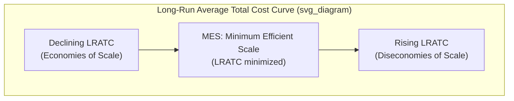

## Economies of Scale, Scope, and Minimum Efficient Scale

### Overview

Economies of scale and scope describe how a firm's average costs change as it expands the volume of a single product or the range of products it produces, respectively. These cost relationships are among the most fundamental structural determinants in industrial economics: they explain why industries settle into particular market structures, why entry barriers arise even absent any strategic behavior, and why the minimum efficient scale of production relative to total market demand is often the single most important predictor of how concentrated an industry will naturally become.

### Economies of Scale

#### Definition

Economies of scale exist when a firm's long-run average total cost (LRATC) declines as output increases, meaning proportional increases in all inputs generate more-than-proportional increases in output.

$$LRATC(Q) = \frac{TC(Q)}{Q}$$

Economies of scale are present over the range of output where $\frac{d(LRATC)}{dQ} < 0$.

**Key Points**

- Economies of scale are distinct from, though related to, **increasing returns to scale** in production theory: increasing returns to scale (a doubling of all inputs more than doubles output) is a sufficient condition for economies of scale when input prices are constant, but economies of scale can also arise from other sources unrelated to the physical production function

#### Sources of Economies of Scale

- **Technical/engineering economies**: specialized machinery and equipment that become efficient only at large production volumes (e.g., the "cube-square rule," where the capacity of a container like a storage tank scales with volume, roughly the cube of its dimension, while material and construction costs scale more closely with surface area, roughly the square)
- **Specialization and division of labor**: larger scale allows finer division of labor into more specialized tasks, increasing labor productivity
- **Bulk purchasing / input-price economies**: larger firms can negotiate lower per-unit prices for inputs due to volume discounts
- **Spreading of fixed costs**: fixed costs (R&D, advertising, headquarters overhead) are spread over a larger output base, reducing average fixed cost per unit
- **Financial economies**: larger firms often access capital at lower cost due to reduced perceived lending risk and greater collateral

#### Diseconomies of Scale

At sufficiently large output, LRATC may begin rising due to:

- **Managerial/coordination diseconomies**: increasing organizational complexity raises the cost of monitoring and coordinating activity, directly related to the Coase/Williamson theory of the firm's diseconomies of internal organization
- **Communication and bureaucratic costs**: larger organizations face slower information flow and increased bureaucratic friction
- **Input price effects at extreme scale**: sufficiently large firms may face rising input prices if their purchasing volume itself begins to affect input markets (pecuniary diseconomies)

### The Long-Run Average Cost Curve

The **minimum efficient scale (MES)** is the smallest output level at which a firm exhausts all available economies of scale — the point at which LRATC reaches its minimum (or, if LRATC is flat over a wide range, the smallest output at which it first reaches that minimum).

**Key Points**

- MES is typically measured relative to total market size (e.g., "MES represents 20% of total industry demand") rather than in absolute output units, since this relative measure is what determines the number of firms the market can efficiently sustain

### Minimum Efficient Scale and Market Structure

The relationship between MES and total market size is one of the most important structural determinants of natural market concentration:

$$\text{Number of efficiently-sized firms the market can sustain} \approx \frac{\text{Total Market Demand}}{\text{MES}}$$

**Key Points**

- If MES is **large relative to total market demand**, only a small number of firms can operate at efficient scale simultaneously — the market naturally tends toward oligopoly or even natural monopoly, since any firm operating below MES faces a cost disadvantage relative to larger rivals
- If MES is **small relative to total market demand**, many firms can operate at efficient scale simultaneously — the market can sustain a structure closer to perfect or monopolistic competition
- This provides a purely cost-based, non-strategic explanation for concentrated market structures, distinct from (though often complementary to) the strategic entry-deterrence explanations covered elsewhere in industrial economics — Bain explicitly included scale economies as one of his three primary categories of structural entry barriers, alongside absolute cost advantages and product differentiation advantages

### Natural Monopoly

A special case arises when the LRATC curve declines continuously over the entire relevant range of market demand — a situation termed **natural monopoly**, where a single firm can supply the entire market at lower average cost than could two or more firms each producing a smaller share.

$$C(Q_1) + C(Q_2) > C(Q_1 + Q_2) \quad \text{for relevant output levels}$$

This condition, more precisely termed **subadditivity** of the cost function, is the formal definition of natural monopoly and does not strictly require continuously declining average cost throughout, though that is the most common textbook illustration.

**Key Points**

- Natural monopoly is the classic economic justification for regulating (rather than attempting to competitively structure) certain industries — historically telecommunications local loops, electricity transmission and distribution, and water/sewer utility networks
- The regulatory challenge in natural monopoly settings is achieving cost recovery for the firm while preventing the exercise of unconstrained monopoly pricing power, addressed via mechanisms such as rate-of-return regulation and price-cap regulation

### Economies of Scope

#### Definition

Economies of scope exist when it is cheaper for a single firm to produce two (or more) products jointly than for separate firms to produce each product independently:

$$TC(Q_1, Q_2) < TC(Q_1, 0) + TC(0, Q_2)$$

where $TC(Q_1, Q_2)$ is the joint cost of producing quantities $Q_1$ and $Q_2$ together, and $TC(Q_1, 0)$, $TC(0, Q_2)$ are the costs of producing each separately.

**Key Points**

- Economies of scope are conceptually distinct from economies of scale: scale economies concern cost savings from producing *more of the same product*, while scope economies concern cost savings from producing *multiple different products together*
- A firm can exhibit economies of scale without economies of scope, and vice versa; the two concepts are logically independent, though they frequently co-occur in practice

#### Sources of Economies of Scope

- **Shared inputs**: common use of specialized equipment, facilities, or distribution networks across multiple products (e.g., a dairy processing plant producing both milk and cheese from shared refrigeration and transport infrastructure)
- **Shared knowledge and R&D spillovers**: research findings or technical know-how developed for one product line benefiting the development or production of related products
- **Shared brand and reputation capital**: a firm's established brand can be leveraged across multiple product lines at lower marketing cost than building separate brand recognition for each

**Example**

An airline exhibits significant economies of scope by operating multiple routes through a hub-and-spoke network: aircraft, ground crew, gate infrastructure, and the reservation system are shared across many routes, making the joint cost of serving multiple destinations from a shared hub lower than the sum of costs if each route were served by an entirely independent, standalone operation.

### Economies of Scope and Diversification/Conglomerate Strategy

- Economies of scope provide an efficiency-based (rather than purely market-power-based) rationale for corporate diversification and conglomerate structure, directly relevant to the theory-of-the-firm literature on firm boundaries
- The presence or absence of genuine economies of scope is a frequently contested empirical question in evaluating conglomerate mergers, where critics often argue that claimed "synergies" fail to reflect genuine cost-based economies of scope

**Key Points**

- [Inference] Empirical measurement of economies of scope is generally regarded as more methodologically challenging than measuring economies of scale, since it requires estimating a full multi-product cost function (including cross-product cost interactions) rather than a single-product cost curve, and this measurement difficulty is a recognized limitation in applied empirical work on this topic

### Empirical Estimation Approaches

- **Engineering cost studies**: direct analysis of production technology and capital requirements to estimate the theoretical minimum efficient scale, historically a common approach (e.g., early studies of steel, cement, and automobile manufacturing)
- **Survivor technique** (associated with Stigler): infers efficient scale empirically by observing which firm size classes grow (gain market share) versus shrink over time within an industry, on the logic that more efficient size classes should survive and grow relative to less efficient ones
- **Statistical cost function estimation**: econometric estimation of cost functions (e.g., translog cost functions, which can flexibly accommodate multi-product and scope-economy specifications) directly from firm-level cost and output data

**Key Points**

- [Inference] Each of these methods carries distinct methodological tradeoffs — engineering studies can be precise but require detailed technical/industry expertise and may not reflect realized organizational efficiency, while the survivor technique is more broadly applicable but assumes that market share dynamics reliably reflect underlying cost efficiency rather than other confounding factors such as marketing effectiveness or historical accident, a debated assumption in the literature

### Conclusion

Economies of scale and scope provide the fundamental cost-based explanation for observed market structure, entry barriers, and firm diversification patterns in industrial economics, complementing the strategic and transaction-cost explanations developed elsewhere in the field. The relationship between minimum efficient scale and total market demand is a primary determinant of whether a market naturally sustains many small competitors, a concentrated oligopoly, or a regulated natural monopoly — making careful empirical measurement of these cost relationships essential to both applied market structure analysis and regulatory policy design.

**Related Topics / Next Steps**

- Natural monopoly regulation: rate-of-return and price-cap mechanisms
- Bain's typology of structural entry barriers
- Cost function estimation methods (translog, survivor technique)
- Economies of scope and conglomerate merger evaluation
- Contestable markets theory as a qualification to MES-based structure predictions
- Network effects as a distinct (demand-side) source of scale advantage
- Subadditivity and the formal definition of natural monopoly