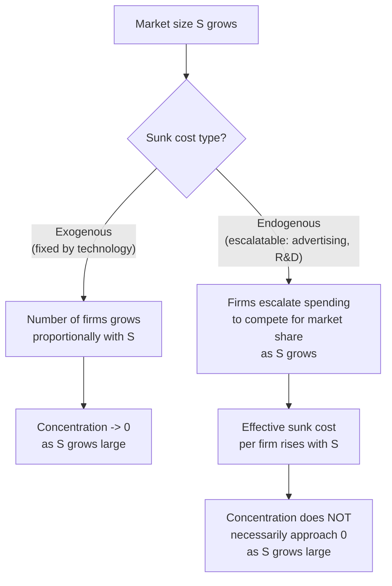

## Sutton's Endogenous Sunk Costs and the Bounds Approach

### Overview

John Sutton's theory of endogenous sunk costs, developed primarily in *Sunk Costs and Market Structure* (1991) and extended in *Technology and Market Structure* (1998), provides a fundamentally different explanation for observed market concentration than the traditional minimum-efficient-scale framework. Rather than treating entry barriers and firm scale as determined by exogenous technological cost conditions, Sutton demonstrates that firms' own strategic investment decisions — in advertising or R&D — can endogenously determine the level of sunk costs required to compete, and that this endogeneity produces a distinctive prediction: in some industries, concentration does not decline toward zero as market size grows without bound, a departure from the standard exogenous-sunk-cost prediction.

### The Puzzle Sutton Addresses

Standard exogenous-scale-economy models (as in traditional MES-based analysis) predict that as market size grows, the number of firms that can profitably operate at minimum efficient scale increases proportionally, so concentration should decline toward zero for a sufficiently large market — since MES is fixed and represents a shrinking fraction of an ever-growing market.

**Key Points**

- Empirically, this prediction fails for certain industries: even in very large national or global markets, industries such as breakfast cereals, cosmetics, or certain branded packaged goods remain persistently concentrated among a handful of major players, contrary to the exogenous-MES prediction that market growth alone should erode concentration
- Sutton's theory explains this empirical pattern by making the relevant "fixed cost" (and therefore effective minimum efficient scale) itself a function of firms' strategic choices rather than pure technology

### Exogenous versus Endogenous Sunk Costs

#### The Traditional (Exogenous) View

In the traditional framework, sunk costs (plant and equipment reflecting production technology) are fixed by the available technology and independent of market size or firms' strategic decisions. As market size $S$ grows, the number of viable firms $N \approx S / MES$ grows proportionally, and concentration (e.g., HHI) approaches zero as $S \to \infty$.

#### Sutton's Endogenous Sunk Cost Innovation

Sutton distinguishes industries by whether the relevant sunk outlays are exogenously fixed by technology (**exogenous sunk cost industries**) or can be escalated by firms as a strategic choice variable (**endogenous sunk cost industries**), such as advertising expenditure or R&D investment aimed at enhancing perceived product quality.

**Key Points**

- The critical mechanism is that in endogenous sunk cost industries, firms have the *option* to escalate outlays on advertising or R&D as market size grows, and doing so can be a profitable strategic response precisely because it deters entry or raises rivals' effective costs of competing for share
- This escalation is not merely a passive technological requirement but an active strategic choice, made because it is individually profitable given how rivals will respond — a genuinely game-theoretic, rather than purely engineering-cost, explanation for persistent concentration

### The "Escalation Mechanism"

Sutton formalizes why firms in endogenous sunk cost industries are driven to escalate outlays as market size increases:

- As the market grows, the potential payoff to capturing a larger share via superior advertising or R&D-driven quality also grows
- Because rivals face the same incentive, an "arms race" dynamic emerges: each firm's optimal outlay depends on (and tends to escalate with) its rivals' outlays, and this competitive escalation process scales with overall market size rather than remaining fixed
- The resulting equilibrium outlay levels rise with market size, which continually raises the effective minimum outlay required to compete, preventing the erosion of concentration that would occur under fixed (exogenous) sunk costs

**Example**

In the global breakfast cereal industry, as the overall market has grown, dominant firms have correspondingly escalated advertising and new-product development spending to defend market share, rather than that spending remaining fixed — this endogenous escalation is precisely what sustains persistent global concentration among a small number of major cereal producers despite substantial overall market growth, in contrast to the declining-concentration prediction of a purely exogenous-MES model.

### The Bounds Approach

Because escalation dynamics depend on parameters (the intensity of price competition, the effectiveness of advertising/R&D in building market share, and the toughness of strategic interaction) that are difficult to observe or estimate precisely across many industries simultaneously, Sutton proposed the **bounds approach**: rather than attempting to derive a single precise point prediction for equilibrium concentration in each industry, the theory derives a **lower bound** on the level of concentration that should be observed in equilibrium, robust to the specific and unobservable parameters governing competitive intensity.

**Key Points**

- The bounds approach is explicitly designed as a response to the difficulty of fully specifying and estimating a complete game-theoretic model industry-by-industry; instead, it derives qualitative, testable, cross-industry predictions that hold across the range of plausible parameter values
- The central testable prediction is a lower bound on concentration in endogenous sunk cost industries that does **not** decline to zero as market size grows — in contrast to the exogenous sunk cost benchmark, where the theoretical lower bound on concentration does approach zero as market size increases indefinitely

### Empirical Testing Strategy

Sutton's empirical program (across food and drink industries in multiple countries) tests the theory by:

1. Classifying industries as advertising/R&D-intensive (candidate endogenous sunk cost industries) versus not
2. Examining whether concentration levels (typically measured via a variant of the $C_4$ concentration ratio) in advertising/R&D-intensive industries remain bounded away from zero even in the largest markets studied, while concentration in industries without significant escalation potential does decline with market size as the traditional exogenous model predicts
3. Comparing patterns across multiple countries with differently sized markets for structurally similar industries, exploiting cross-national market-size variation as a natural test of the theory's core prediction

**Key Points**

- [Inference] This comparative, cross-country empirical strategy is a distinctive methodological feature of Sutton's research program, differing from the more single-country, cross-industry regression approach characteristic of the traditional Bain-style SCP empirical tradition — Sutton's approach is generally regarded as providing more convincing identification specifically because it holds the underlying strategic mechanism roughly constant while varying market size across countries

### Comparison with the Traditional MES Framework

| Dimension | Traditional (Exogenous MES) | Sutton (Endogenous Sunk Costs) |
| --- | --- | --- |
| Source of sunk cost | Fixed technology (plant, equipment) | Strategic choice (advertising, R&D escalation) |
| Prediction as market grows | Concentration → 0 | Concentration bounded away from 0 in escalation-prone industries |
| Underlying mechanism | Cost-minimizing scale of production | Game-theoretic strategic investment competition |
| Empirical approach | Cross-industry regression (Bain tradition) | Cross-country comparison at fixed industry, bounds testing |
| Theoretical output | Point predictions from specific cost functions | Robust qualitative bounds across parameter uncertainty |

### Theoretical Significance Within Industrial Economics

- Sutton's work represents a methodologically distinctive contribution to the "New Industrial Organization" tradition: rather than building a single fully-specified game-theoretic model and deriving precise numerical predictions (vulnerable to misspecification of hard-to-observe parameters), the bounds approach derives robust, qualitative, cross-industry testable predictions
- The theory reconciles the SCP tradition's empirical concern with cross-industry structural patterns and the game-theoretic tradition's insistence on modeling strategic interaction explicitly, offering a synthesis of sorts between the two methodological traditions
- The endogenous sunk cost framework has been particularly influential in explaining persistent concentration patterns in consumer goods, pharmaceuticals, and other advertising- or R&D-intensive sectors that resist erosion despite substantial market growth

**Key Points**

- [Inference] Sutton's bounds approach is generally regarded within the field as a significant methodological innovation precisely because it sidesteps the fragility of point predictions from fully-specified game-theoretic models — this robustness-focused framing is commonly highlighted in graduate IO treatments as a distinguishing feature relative to more conventional single-model game-theoretic approaches, though the theory itself has also faced its own empirical and theoretical scrutiny and refinement in subsequent literature

### Conclusion

Sutton's theory of endogenous sunk costs provides a compelling resolution to the empirical puzzle of persistent industry concentration despite substantial market growth, by recognizing that in industries where advertising or R&D outlays function as strategic, escalatable investments rather than fixed technological requirements, firms' competitive responses to market growth can sustain — rather than erode — concentration. The accompanying bounds approach offers a methodologically distinctive way of generating robust, testable predictions without requiring precise specification of the many hard-to-observe parameters that would otherwise be needed for a fully specified point-prediction game-theoretic model.

**Related Topics / Next Steps**

- Advertising as a strategic entry barrier
- R&D competition and innovation races in oligopoly
- Cross-country empirical tests of the bounds approach
- Minimum efficient scale and the traditional exogenous cost framework
- Escalation/arms-race dynamics in strategic investment games
- Sutton's extensions to R&D-intensive and high-technology industries
- Persistent concentration patterns in consumer packaged goods industries