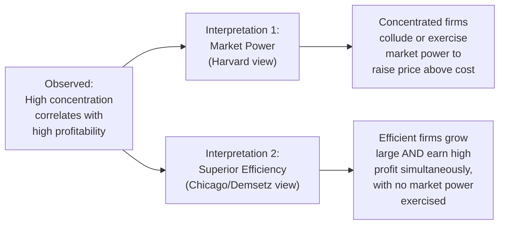

## Limitations of Structural Measures as Performance Predictors

### Overview

Structural measures — concentration ratios, the HHI, and related indices of market structure — have long served as the primary empirical tools for inferring market power and predicting competitive performance outcomes. Yet decades of theoretical critique and empirical research have exposed substantial limitations in treating these measures as reliable, stand-alone predictors of performance. This entry synthesizes the major critiques developed throughout industrial economics — the Chicago School's identification critique, the endogeneity of structure itself, market-definition sensitivity, and the theoretical contestable-markets challenge — into a unified assessment of why structural concentration measures require careful, contextualized interpretation rather than mechanical application.

### The Core Identification Problem: Structure-Performance Correlation Is Not Causation

The most fundamental limitation, established by the Demsetz efficiency critique of the traditional SCP paradigm, is that a positive empirical correlation between concentration and profitability is consistent with at least two distinct causal stories that structural data alone cannot distinguish:

**Key Points**

- Concentration is an observable outcome of the competitive process, not solely an exogenous cause of performance — a market can become concentrated precisely *because* competition worked well and selected the most efficient firms, which is the opposite of the market-power interpretation
- This ambiguity cannot be resolved using cross-industry structural data alone; distinguishing the two hypotheses generally requires firm-level cost data, direct price-cost margin estimation, or structural demand-and-supply modeling (as in NEIO) rather than reliance on concentration measures in isolation

### Endogeneity of Market Structure

A closely related limitation is that market structure itself is frequently an *outcome* of firm conduct and strategic investment, not a purely exogenous "basic condition" as originally assumed in the strict SCP causal chain.

- Sutton's endogenous sunk cost theory demonstrates that firms' own advertising and R&D investment choices can determine the level of concentration a market sustains, meaning concentration reflects strategic choices already made, rather than a pre-existing structural constraint independently shaping those choices
- Successful innovation, aggressive capacity investment, or effective entry-deterrence strategy can raise concentration as a *consequence* of conduct, reversing the traditional SCP causal arrow
- This endogeneity means that using concentration to predict future performance risks a form of reverse causality or simultaneity bias: current structure may itself be shaped by anticipated or realized past performance and conduct

**Key Points**

- Rigorous empirical work addressing this concern generally requires instrumental variable strategies or structural modeling that explicitly accounts for the joint, simultaneous determination of structure, conduct, and performance, rather than treating structure as a valid independent (exogenous) regressor

### Sensitivity to Market Definition

Because concentration measures are calculated relative to a specified relevant market, and market definition is itself frequently contested and judgment-dependent, structural measures inherit substantial sensitivity to this prior, often uncertain determination.

**Key Points**

- The same underlying competitive reality can be characterized as highly concentrated or relatively unconcentrated depending on how narrowly or broadly the relevant product or geographic market is drawn
- The cellophane fallacy illustrates a specific, well-documented failure mode: applying market definition tests naively at an already-supracompetitive observed price can lead to markets being defined too broadly, understating true concentration and market power
- This sensitivity means structural measures cannot be meaningfully interpreted, or compared across studies, without close attention to the underlying market definition methodology employed — differences in reported concentration across studies of the "same" industry often reflect differing market definitions rather than differing underlying competitive conditions

### The Contestable Markets Critique

Contestable markets theory (Baumol, Panzar, and Willig, developed primarily in the early 1980s) provides a distinct theoretical challenge: it argues that the *number of incumbent firms* — the very basis of concentration measures — can be a poor and even misleading indicator of competitive performance if entry and exit are sufficiently costless (perfectly contestable).

- In a perfectly contestable market, even a single incumbent firm (structurally a monopoly by conventional concentration measures) may be forced to price at or near the competitive level, deterred from exploiting apparent market power by the threat of instantaneous "hit-and-run" entry should it attempt to raise price above cost
- The key theoretical requirement is the absence of sunk costs: entrants must be able to enter, capture available profit, and exit again without loss, should the incumbent retaliate or should conditions change
- Under this theory, a highly concentrated market structure (by any conventional CR/HHI measure) could nonetheless exhibit fully competitive performance outcomes, directly severing the presumed structure-performance link that traditional concentration measures are used to infer

**Key Points**

- [Inference] While the strict theoretical requirements for perfect contestability (zero sunk costs, instantaneous entry/exit) are rarely fully satisfied in real-world markets, the theory's core insight — that entry conditions, not merely incumbent firm counts, are what ultimately discipline pricing behavior — is widely regarded as an important qualification to naive concentration-based inference, even where the polar theoretical case itself is considered a limiting benchmark rather than a literal description of most actual markets

### Accounting Profit Measurement Problems

A distinct, more measurement-oriented limitation concerns the profitability data frequently paired with concentration measures in traditional SCP-style empirical work:

- **Depreciation accounting distortions**: accounting profit rates are sensitive to depreciation conventions that may not accurately reflect true economic depreciation, particularly for capital-intensive, long-lived assets
- **Treatment of intangible investment**: R&D and advertising expenditures are typically expensed immediately in standard accounting rather than capitalized and amortized as an investment, which can substantially distort measured accounting profit rates for R&D- or advertising-intensive firms relative to their true economic returns
- **Risk-adjusted returns**: raw accounting profit rates do not adjust for differences in systematic risk across industries, so higher observed returns in some industries may simply reflect compensation for bearing greater risk rather than the exercise of market power

**Key Points**

- These accounting measurement problems compound the identification challenges above: even setting aside the causal ambiguity, the profitability data itself used to test structure-performance relationships is frequently an imperfect proxy for the underlying economic profit concept the theory actually concerns

### Structural Measures Ignore Dynamic and Potential Competition

- Static concentration snapshots do not capture the *threat* of entry, which can discipline incumbent pricing even without actual entry occurring — a dynamic consideration closely related to, but broader than, the specific contestable-markets framework
- Concentration measures also do not directly capture the intensity of *non-price* competition (innovation races, quality competition, advertising rivalry) that may substitute for price competition in disciplining firm behavior
- Rapidly evolving industries (particularly technology-intensive sectors) can exhibit high measured concentration at any given snapshot while nonetheless experiencing intense dynamic (Schumpeterian) competition through sequential waves of disruptive entry and incumbent displacement

**Example**

A snapshot HHI calculation for the global smartphone operating system market at any given point might indicate high concentration, yet this static measure alone would not capture the intensity of dynamic competitive pressure the incumbent(s) face from potential entrants developing alternative platforms, nor the innovation-driven competition occurring on dimensions (features, ecosystem quality) not directly reflected in market-share-based concentration statistics.

### Toward More Reliable Performance Assessment

Given these limitations, modern applied industrial economics generally supplements or replaces pure structural concentration analysis with more direct approaches:

| Approach | How It Addresses Structural Measure Limitations |
| --- | --- |
| Direct price-cost margin / markup estimation | Measures market power directly rather than inferring it from a structural proxy |
| NEIO structural demand-and-supply estimation | Explicitly models and tests conduct rather than assuming it from structure |
| Merger simulation | Predicts performance effects from underlying demand/cost primitives rather than concentration thresholds alone |
| Entry and exit pattern analysis | Directly assesses the dynamic contestability of the market rather than relying on a static firm count |
| Case-specific qualitative evidence | Incorporates industry documents, business practice, and institutional detail that structural indices cannot capture |

**Key Points**

- This does not render concentration measures useless — they remain valuable, low-cost initial screening tools, particularly in merger review — but the consensus across the field is that they function best as a starting point for further investigation rather than a definitive, stand-alone conclusion about competitive performance

### Conclusion

Structural measures of market concentration, while foundational and practically indispensable as initial screening tools, face substantial and well-documented limitations as reliable stand-alone predictors of competitive performance: the fundamental structure-performance identification problem, the endogeneity of structure itself, sensitivity to contested market definitions, the theoretical contestable-markets challenge to firm-count-based inference, and accounting profit measurement distortions collectively caution against mechanical reliance on concentration data alone. Contemporary industrial economics addresses these limitations by supplementing structural analysis with direct markup estimation, structural demand modeling, dynamic entry analysis, and case-specific qualitative evidence — reflecting the field's broader historical evolution from the reduced-form SCP tradition toward the more rigorously identified methods of the New Empirical Industrial Organization.

**Related Topics / Next Steps**

- The Demsetz efficiency critique in depth
- Sutton's endogenous sunk costs and structural endogeneity
- Contestable markets theory: assumptions and critiques
- NEIO structural estimation as an alternative to reduced-form SCP analysis
- Accounting versus economic profit measurement issues
- Entry and exit dynamics as indicators of competitive discipline
- Merger guideline evolution beyond pure HHI screening