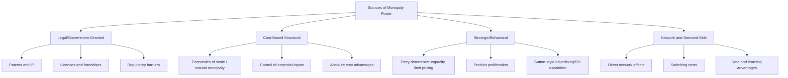

## Sources and Persistence of Monopoly Power

### Overview

Monopoly power — the ability of a firm to profitably set price above marginal cost — does not arise arbitrarily; it requires a specific structural, legal, or strategic source that both creates the initial market position and, critically, sustains it against the erosive pressure of potential entry. This entry surveys the principal sources of monopoly power identified in industrial economics and examines the distinct mechanisms by which each source can persist over time, distinguishing genuinely durable barriers from more transitory advantages that competitive forces tend to erode.

### Taxonomy of Sources of Monopoly Power

### Legal and Government-Granted Sources

#### Patents and Intellectual Property

- Patents grant temporary, legally enforced exclusivity over an invention, explicitly designed as a policy tradeoff: the deadweight loss from temporary monopoly pricing is accepted as the price of incentivizing costly, risky innovation investment that would otherwise be under-provided due to the public-good, non-excludable nature of knowledge
- Patent duration is a deliberate policy parameter (commonly 20 years from filing in many jurisdictions) balancing innovation incentives against the welfare cost of monopoly pricing during the patent term

**Key Points**

- Unlike most other sources of monopoly power, patent-derived monopoly is intentionally time-limited by design, distinguishing it analytically from durable structural barriers
- The persistence of patent-derived monopoly power depends heavily on the ease of "inventing around" the patent and the pace of follow-on innovation by rivals, not merely the formal legal expiration date

#### Licenses, Franchises, and Regulatory Barriers

- Government-granted exclusive licenses (e.g., broadcast spectrum, certain utility franchises, taxi medallions in some historical regulatory regimes) directly restrict entry by legal fiat
- Regulatory compliance costs, even when not explicitly designed to restrict competition, can function as a de facto barrier by imposing fixed costs that disproportionately burden smaller entrants relative to established incumbents

**Key Points**

- Legal barriers are generally the most durable source of monopoly power precisely because they do not rely on any underlying cost or demand advantage that competitive market forces could otherwise erode — persistence depends on the political and regulatory process rather than market dynamics

### Cost-Based Structural Sources

#### Natural Monopoly and Economies of Scale

- As detailed under minimum efficient scale, when the long-run average cost curve declines over the entire relevant range of market demand (cost subadditivity), a single firm can supply the market at lower cost than could multiple competing firms
- This source of monopoly power is grounded directly in underlying production technology rather than legal protection or strategic behavior

#### Control of Essential Inputs

- A firm controlling a scarce or unique input necessary for production (a specific mineral deposit, a unique geographic location, specialized know-how) can leverage this control into downstream market power
- **Example**: historically, aluminum producer Alcoa's control of bauxite reserves and hydroelectric power sources has been cited in the economics literature as a classic illustration of essential-input-based monopoly persistence

#### Absolute Cost Advantages

- Distinct from economies of scale, an absolute cost advantage means the incumbent produces at lower cost *at every output level*, not merely at large scale, often due to superior technology, accumulated experience (learning-curve effects), or preferential access to inputs unrelated to firm size

**Key Points**

- Cost-based sources of monopoly power tend to be more durable when grounded in genuinely scarce, non-replicable resources (unique geology, patented process technology) and less durable when grounded in advantages that rivals can eventually replicate through their own investment or technological catch-up

### Strategic and Behavioral Sources

#### Entry Deterrence Through Strategic Investment

- Incumbents can strategically invest in excess capacity, aggressive limit pricing, or product proliferation specifically to make entry unprofitable for potential rivals, as covered extensively in the game-theoretic oligopoly literature
- Persistence in this case depends critically on the *credibility* of the deterrence strategy — an incumbent's threat or commitment must be genuinely costly to reverse (sunk) to credibly deter a rational potential entrant, per the logic developed in transaction cost and game-theoretic entry-deterrence models

#### Sutton-Style Endogenous Escalation

- As detailed in Sutton's endogenous sunk cost framework, incumbents in advertising- or R&D-intensive industries can sustain concentration and market power by continually escalating outlays as the market grows, preventing the erosion of concentration that would otherwise occur under a purely exogenous cost structure

**Key Points**

- Strategic sources of monopoly power are generally regarded as less inherently durable than legal or fundamental cost-based sources, since their persistence depends on the incumbent continuing to find deterrent investment profitable — a condition that can change with shifts in technology, demand, or the emergence of well-capitalized potential entrants able to match escalating outlays

### Network Effects and Demand-Side Sources

#### Direct and Indirect Network Effects

- **Direct network effects**: a product or service becomes more valuable to each user as more users adopt it (e.g., communication platforms, where value derives directly from the size of the connected user base)
- **Indirect network effects**: value to one user group depends on the participation of a *different* user group, characteristic of platform/two-sided markets (e.g., a marketplace becomes more valuable to buyers as more sellers join, and vice versa)

$$U_i = f(N) \quad \text{where } \frac{\partial U_i}{\partial N} > 0$$

Individual user utility $U_i$ increases in the total number of network participants $N$, creating a self-reinforcing dynamic favoring the platform or network that first achieves critical mass.

#### Switching Costs and Lock-In

- Once consumers have made relationship-specific investments (learning a particular software interface, accumulating loyalty program benefits, integrating a product into an existing workflow), switching to a rival becomes costly, creating a form of demand-side lock-in analogous to the asset-specificity-driven hold-up problem in the theory of the firm
- Data accumulation can function as a related, increasingly significant source of persistent advantage: platforms accumulating large volumes of user data may improve their product (e.g., via algorithmic learning) in ways that are difficult for smaller rivals lacking comparable data volume to replicate

**Key Points**

- Network-effect-driven monopoly power is often considered particularly persistent (sometimes described as exhibiting "tipping" toward a single dominant platform) precisely because the self-reinforcing dynamic makes it increasingly difficult for challengers to attract the critical mass of users needed to compete effectively, even absent any explicit strategic entry deterrence by the incumbent
- [Inference] The precise durability and competitive significance of data-driven advantages specifically is an area of active and still-developing economic and regulatory analysis, particularly in the context of contemporary digital platform antitrust scrutiny, rather than a settled question with well-established quantitative benchmarks

### Distinguishing Persistence Mechanisms

| Source Category | Typical Persistence | Primary Erosion Mechanism |
| --- | --- | --- |
| Patents | Time-limited by design | Expiration; inventing-around; follow-on innovation |
| Government licenses/regulation | Durable while regulatory regime persists | Regulatory or political change; deregulation |
| Natural monopoly (scale economies) | Durable while cost subadditivity holds | Technological change altering the cost structure |
| Essential input control | Durable while input remains scarce/unique | Discovery of substitutes; new sources of the input |
| Strategic entry deterrence | Conditional on continued credibility | Entrant developing comparable resources or resolve |
| Network effects | Potentially very durable ("tipping") | Disruptive technology enabling multi-homing or platform switching |

### The Role of Potential Competition in Eroding Persistence

- Even durable-seeming sources of monopoly power remain subject to the dynamic, Schumpeterian process of "creative destruction," whereby sufficiently disruptive innovation can displace an incumbent regardless of the specific source of its prior market position
- Contestable markets theory offers a further qualification: even where incumbency itself appears entrenched, if entry and exit costs are genuinely low, the *threat* of entry can discipline pricing without requiring actual displacement of the incumbent

**Key Points**

- [Inference] The historical record generally shows that monopoly positions grounded purely in strategic deterrence or transitory cost advantages tend to prove less durable over sufficiently long time horizons than those grounded in legal protection, genuine natural monopoly cost conditions, or strong network effects — though the specific duration of any individual monopoly position remains highly case-specific and is influenced by the pace of technological change in the relevant sector

### Conclusion

Monopoly power arises from a diverse set of sources — legal grants, cost-based structural conditions, strategic behavior, and network/demand-side effects — each with distinct implications for how durable that power is likely to prove against the ordinarily erosive pressure of competition and potential entry. Understanding which specific source underlies an observed instance of market power is essential not only for accurate positive economic analysis but for appropriate policy design, since legal remedies, regulatory intervention, and antitrust enforcement each address fundamentally different persistence mechanisms and are correspondingly more or less well-suited to any given source of monopoly power.

**Related Topics / Next Steps**

- Deadweight loss and the welfare cost of monopoly
- Patent policy design and the innovation-monopoly tradeoff
- Natural monopoly regulation mechanisms
- Network effects and platform tipping dynamics
- Entry deterrence credibility and strategic commitment
- Data as a competitive asset in digital antitrust analysis
- Schumpeterian creative destruction and dynamic competition