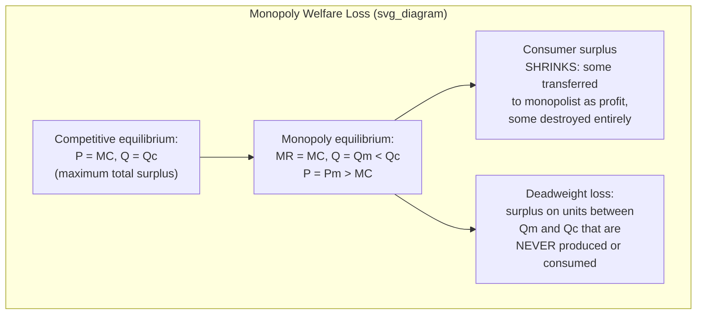

## Deadweight Loss and the Welfare Cost of Monopoly

### Overview

The welfare cost of monopoly is the formal economic measure of the efficiency loss that results when a firm with market power restricts output and raises price above the competitive (marginal cost) benchmark. This deadweight loss represents surplus that is neither captured by the monopolist as profit nor retained by consumers — it simply disappears from the economy, making it the central quantitative justification for antitrust policy and regulatory intervention against the exercise of monopoly power.

### The Competitive Benchmark

Under perfect competition, price equals marginal cost ($P = MC$), and output occurs at the allocatively efficient level, where the marginal value consumers place on the last unit produced exactly equals the marginal cost of producing it. This condition maximizes total surplus (the sum of consumer and producer surplus).

**Key Points**

- Allocative efficiency, in this specific sense, is a property of the *output level*, not of the distribution of surplus between consumers and producers — the competitive benchmark maximizes the total size of the surplus "pie," regardless of how it happens to be divided

### The Monopoly Outcome

A profit-maximizing monopolist sets marginal revenue equal to marginal cost ($MR = MC$), rather than price equal to marginal cost, because the monopolist internalizes the fact that increasing output lowers the price received on all units sold (since it faces the full downward-sloping market demand curve).

$$MR(Q) = P(Q) + Q \cdot \frac{dP}{dQ} = MC(Q)$$

Since demand is downward-sloping ($dP/dQ < 0$), marginal revenue lies below price at every output level, so the monopoly output level $Q_m$ is strictly less than the competitive output level $Q_c$, and the monopoly price $P_m$ is strictly greater than marginal cost.

### Graphical and Formal Derivation of Deadweight Loss

The deadweight loss (DWL) is formally the area of the triangle bounded by the demand curve, the marginal cost curve, between the monopoly output $Q_m$ and the competitive output $Q_c$:

$$DWL = \int_{Q_m}^{Q_c} \left[ P(Q) - MC(Q) \right] dQ$$

This represents the total surplus (the excess of consumers' willingness to pay over the cost of production) that would have been generated by producing and consuming units between $Q_m$ and $Q_c$, but which is instead simply lost because the monopolist restricts output below the competitive level.

**Key Points**

- Deadweight loss is fundamentally different from the *transfer* of surplus from consumers to the monopolist via the elevated price on units that are still produced ($Q_m$) — that transfer, sometimes debated on distributional grounds, does not itself represent an efficiency loss to society as a whole, since it merely redistributes existing surplus from one party (consumers) to another (the monopolist's shareholders)
- The deadweight loss triangle represents surplus that literally vanishes: no party captures it, because the transactions that would have generated it (units between $Q_m$ and $Q_c$) simply never occur

### The Harberger Triangle: Standard Empirical Approximation

Arnold Harberger's classic 1954 study introduced the standard simplified approximation for estimating the welfare loss triangle, treating it as a right triangle:

$$DWL \approx \frac{1}{2} \times \Delta P \times \Delta Q = \frac{1}{2} (P_m - MC) (Q_c - Q_m)$$

Using the price elasticity of demand $\epsilon$ and the Lerner Index $L = (P_m - MC)/P_m$, this can be rewritten in a form amenable to empirical estimation across many industries:

$$DWL \approx \frac{1}{2} \cdot L^2 \cdot \epsilon \cdot P_m \cdot Q_m$$

**Key Points**

- Harberger's original empirical estimates, applied across US manufacturing industries, famously found the aggregate welfare loss from monopoly power to be surprisingly small — often cited as under 1% of GNP — a result that generated substantial subsequent debate regarding whether the true welfare cost of monopoly might be considerably understated by this simple triangle-based methodology
- [Inference] The relatively small magnitude of Harberger's original estimate is widely regarded within the field as a genuinely surprising and influential finding, motivating extensive subsequent literature examining whether additional, non-triangle welfare costs (detailed below) might substantially exceed the basic Harberger triangle in practice

### Beyond the Basic Triangle: Additional Welfare Costs

Subsequent literature has identified several categories of welfare loss beyond the basic Harberger triangle that may substantially exceed it in magnitude:

#### X-Inefficiency

- Harvey Leibenstein's concept of **X-inefficiency** (1966) argues that firms shielded from competitive pressure by monopoly power may fail to minimize costs internally — operating above their true minimum feasible cost curve due to reduced managerial discipline, organizational slack, or diminished pressure to adopt best available production techniques
- This represents a form of *productive* inefficiency (failure to produce at minimum feasible cost) distinct from the *allocative* inefficiency captured by the basic deadweight loss triangle

**Key Points**

- [Inference] X-inefficiency is a more empirically contested concept than the basic allocative deadweight loss triangle, since it requires establishing that a monopolist's realized cost curve is genuinely higher than what would be technically achievable under greater competitive pressure — a claim that is more difficult to verify directly than observable price-cost margins, and remains a debated rather than universally accepted component of monopoly welfare cost

#### Rent-Seeking and Wasteful Competition for Monopoly Rights

- Gordon Tullock's influential critique (1967), extended by Anne Krueger's work on rent-seeking (1974), argues that the *pursuit* of monopoly rights itself consumes real economic resources — lobbying expenditure, legal costs, and other unproductive activity aimed at securing or defending a monopoly position (e.g., a government-granted license or favorable regulation)
- In competitive rent-seeking, firms may collectively expend resources approaching the *full value* of the monopoly rents being contested, since each competitor for the monopoly right has an incentive to invest up to (but not exceeding) their expected share of the prize
- This transforms what the basic Harberger triangle treats as a pure transfer (monopoly profit captured by the firm) into an additional, potentially much larger, social welfare loss (resources consumed in the contest for that profit, which the basic triangle calculation does not capture at all)

**Key Points**

- The Tullock/Krueger rent-seeking critique is widely regarded as a significant extension of the basic welfare-loss framework precisely because it reclassifies monopoly *profit* itself (treated as a mere transfer in the basic Harberger calculation) as a potential source of additional real resource waste, substantially raising plausible estimates of the total welfare cost of monopoly beyond the basic triangle alone

#### Dynamic/Innovation Costs

- A further category of potential welfare cost concerns the dynamic effects of persistent monopoly power on innovation incentives, discussed extensively in Schumpeterian competition theory: monopoly may either dampen innovation incentives (reduced competitive pressure to innovate) or, alternatively, provide the necessary rents to fund costly R&D — the theoretical relationship between market structure and innovation intensity remains genuinely ambiguous and is treated as a distinct, separately debated topic within industrial economics

### Comparative Summary of Welfare Cost Components

| Component | Nature of Loss | Relative Magnitude (per literature) |
| --- | --- | --- |
| Harberger triangle (allocative DWL) | Surplus on unproduced units | Traditionally estimated as relatively small (often cited under 1% of GNP in original studies) |
| X-inefficiency | Productive inefficiency from reduced competitive pressure | Contested; potentially significant but difficult to measure directly |
| Rent-seeking costs | Resources consumed pursuing/defending monopoly rights | Potentially large, up to the full value of monopoly rents in competitive rent-seeking models |
| Dynamic/innovation effects | Ambiguous impact on R&D and technological progress | Theoretically ambiguous; direction depends on specific market and technology characteristics |

### Empirical and Policy Significance

- The identification of these additional welfare cost categories has substantially shaped the case for active antitrust enforcement: if the true social cost of monopoly power extends meaningfully beyond the relatively modest Harberger triangle, the economic justification for vigorous competition policy is correspondingly strengthened
- Regulatory cost-benefit analysis of proposed mergers or interventions increasingly attempts to account for these broader welfare considerations, though the basic Harberger-style deadweight loss triangle, calculable from directly estimable markup and elasticity data, remains the standard quantitative starting point in most applied welfare analysis

**Example**

A merger simulation exercise assessing a proposed horizontal merger will typically compute the predicted post-merger deadweight loss using the Harberger triangle framework applied to the simulated post-merger markup and output changes, while a fuller policy assessment might separately note (though rarely formally quantify) the potential for additional X-inefficiency or dynamic innovation effects not captured by the basic triangle calculation.

### Conclusion

The welfare cost of monopoly, formalized as the deadweight loss triangle bounded by the gap between monopoly and competitive output levels, provides the core quantitative justification for antitrust and competition policy within industrial economics. While Harberger's classic triangle-based estimates suggested a surprisingly modest aggregate welfare cost, subsequent literature on X-inefficiency and, especially, Tullock/Krueger rent-seeking has substantially expanded the recognized scope of monopoly's true social cost, reclassifying monopoly profit itself as a potential source of additional resource waste rather than a mere costless transfer — a reframing that continues to inform contemporary debate over the appropriate intensity of competition policy enforcement.

**Related Topics / Next Steps**

- The Lerner Index and price-cost margin measurement
- Harberger's original empirical methodology and subsequent critiques
- X-inefficiency: theory and measurement challenges
- Tullock and Krueger's rent-seeking framework
- Schumpeterian competition and the innovation-market structure relationship
- Merger simulation welfare analysis in practice
- Price discrimination as a partial mitigant of monopoly deadweight loss