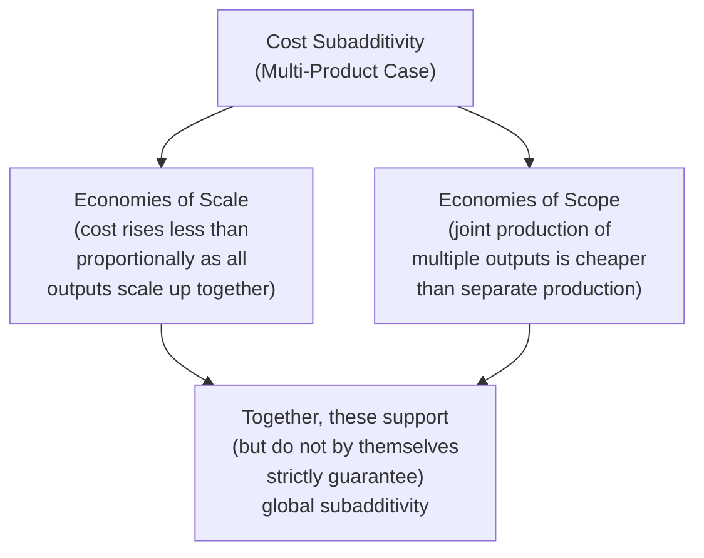

## Natural Monopoly Conditions and Cost Subadditivity

### Overview

Natural monopoly describes a market condition in which a single firm can supply the entire relevant market demand at a lower total cost than could be achieved by any combination of two or more separate firms — a condition formally defined by the mathematical property of **cost subadditivity**. This concept, refined substantially beyond the older, less precise "declining average cost" textbook characterization by the contributions of Baumol, Panzar, and Willig, provides the rigorous economic foundation for regulatory intervention in industries such as utility transmission networks, where competitive market structure would be genuinely inefficient rather than merely undesirable.

### The Formal Definition: Cost Subadditivity

A cost function $C(Q)$ is **subadditive** at output level $Q$ if, for any decomposition of $Q$ into $n$ positive quantities $Q_1, Q_2, \ldots, Q_n$ that sum to $Q$:

$$C(Q) < \sum_{i=1}^{n} C(Q_i) \quad \text{for all decompositions where } \sum_{i=1}^{n} Q_i = Q, \; n \geq 2$$

In words: it is cheaper for a single firm to produce the entire output $Q$ than for that same total output to be split among any number of separate firms, each producing a portion of it.

**Key Points**

- This is the *precise* and *general* definition of natural monopoly used in modern industrial economics, and it is importantly broader than, and not equivalent to, the simpler and more commonly taught condition of globally declining average cost
- Cost subadditivity can hold even when average cost is *not* declining over the entire relevant range, and — in the multi-product case especially — declining average cost is neither strictly necessary nor strictly sufficient for subadditivity in general

### Why Declining Average Cost Is Not the Full Story

#### The Single-Product Case

For a single-product firm, declining average cost throughout the relevant range of output ($AC'(Q) < 0$ for all relevant $Q$) is **sufficient** (though not strictly necessary in every conceivable case) for subadditivity, because a firm producing the entire market output at the lowest point on a still-declining average cost curve will have lower average — and hence lower total — cost than any smaller firm operating further up the same declining curve.

**Key Points**

- The traditional single-product textbook treatment (natural monopoly = continuously declining LRATC) is a reasonably good approximation in the single-product case, which is why it remains the standard simplified teaching device
- However, subadditivity can technically hold even over a range where average cost has begun to rise slightly, provided it has not risen enough to make a two-firm split cheaper than single-firm production — the precise boundary requires the full subadditivity condition, not merely the sign of the AC slope

#### The Multi-Product Case: Where Simple Declining AC Breaks Down

Most real-world natural monopoly candidates (utilities, telecommunications networks) are genuinely multi-product firms, producing bundles of related services (e.g., electricity transmission at different times of day, or landline and data services over the same network). In the multi-product setting, the simple declining-average-cost intuition is insufficient, and subadditivity depends critically on two additional, distinct cost properties:

**Key Points**

- **Economies of scale** (in the multi-product ray sense: cost rises less than proportionally when all outputs are scaled up together along a fixed product mix) addresses whether a single firm should serve the *entire* market rather than a smaller firm serving only part of it at the same product mix
- **Economies of scope** addresses whether that single firm should produce the *full range of different products* together rather than separate specialized firms each producing one product
- Both properties jointly support (though do not automatically guarantee, since subadditivity is a genuinely distinct and more general mathematical condition) the conclusion that a single multi-product firm is the cost-minimizing industry structure

### Sustainability of Natural Monopoly

A related, distinct concept developed by Baumol, Panzar, and Willig is **sustainability**: whether a natural monopolist, pricing to just break even (zero economic profit), can maintain its position without inviting profitable entry by a rival offering a subset of the natural monopolist's product line at a lower price for that subset.

**Key Points**

- It is theoretically possible for a genuine natural monopoly (in the cost-subadditivity sense) to be *unsustainable*: even though total industry cost is minimized by a single firm, a specific break-even pricing structure chosen by that firm might still be vulnerable to a rival "cream-skimming" the most profitable subset of customers or products at a lower price, without needing to replicate the incumbent's full multi-product cost structure
- This distinction between subadditivity (an efficiency condition about total cost) and sustainability (a pricing/entry-vulnerability condition) is a genuinely separate analytical concept, and its identification was a significant refinement over earlier, less precise treatments of natural monopoly that tended to conflate the two

### Regulatory Rationale and Design

Given a genuine natural monopoly, unregulated single-firm supply would exercise standard monopoly pricing power (setting $MR = MC$, generating deadweight loss), while forcing competitive multi-firm entry would be genuinely cost-inefficient (violating subadditivity, raising total industry cost above the achievable minimum). This creates the specific regulatory challenge natural monopoly theory addresses: achieving the cost efficiency of single-firm supply while constraining the pricing power that unregulated single-firm supply would otherwise generate.

#### Regulatory Mechanisms

| Mechanism | Description |
| --- | --- |
| Rate-of-return regulation | Regulator sets prices to allow the firm to recover costs plus a specified allowed rate of return on invested capital |
| Price-cap regulation | Regulator sets a cap on price (or an index of prices) that can adjust over time (e.g., via an RPI-X formula), providing stronger incentives for internal cost efficiency than rate-of-return regulation |
| Marginal cost pricing with subsidy | Regulator sets price equal to marginal cost (the allocatively efficient benchmark) and covers the resulting revenue shortfall (since $P = MC$ generates losses when average cost is declining) via a government subsidy or alternative funding mechanism |
| Yardstick competition | Regulator benchmarks a firm's allowed costs/prices against comparable firms operating in other, non-competing geographic markets, substituting comparative performance evaluation for direct market competition |

**Key Points**

- Rate-of-return regulation has been widely criticized for generating the **Averch-Johnson effect**: an incentive for the regulated firm to over-invest in capital relative to the cost-minimizing input mix, since a higher allowed capital base directly increases the firm's permitted total return under this specific regulatory formula
- Price-cap regulation was developed substantially in response to this criticism, aiming to decouple the firm's profitability from its capital base and thereby restore stronger incentives for genuine cost minimization

### Contested Boundaries: Where Natural Monopoly Applies Today

- The classical natural monopoly justification for regulation has historically applied most clearly to network infrastructure exhibiting strong physical scale economies: electricity and gas transmission/distribution grids, local telecommunications loops, and water/sewer networks
- A significant regulatory and technological development in many of these sectors has been **unbundling**: separating genuinely subadditive network infrastructure components (which remain regulated as natural monopolies) from potentially competitive components layered on top of that infrastructure (e.g., electricity generation and retail supply, which can be opened to competition even while the transmission grid itself remains a regulated natural monopoly)

**Example**

Many electricity market restructurings separate the transmission and distribution grid (retained as a regulated natural monopoly, since duplicating physical wires to every customer would violate cost subadditivity) from electricity generation and retail supply (opened to competitive markets, since generation plants and retail billing/customer service do not exhibit the same subadditivity properties as the physical grid itself) — illustrating how natural monopoly analysis can apply to specific components of a vertically-structured industry rather than necessarily the industry as a whole.

**Key Points**

- [Inference] Whether a specific component of a given industry genuinely satisfies the formal subadditivity condition, as opposed to exhibiting merely large but not strictly subadditive scale economies, is frequently a matter of detailed empirical cost function estimation specific to that industry and component, rather than something determinable from general theory alone — this empirical specificity is a recognized practical challenge in applying the natural monopoly framework to real regulatory decisions

### Conclusion

Cost subadditivity provides the rigorous formal definition of natural monopoly, correctly generalizing the simpler and more limited single-product declining-average-cost intuition to the genuinely multi-product character of most real-world natural monopoly candidates, via the joint consideration of scale and scope economies. This precise definition, together with the related and analytically distinct concept of sustainability, underlies the modern regulatory design of natural monopoly industries — balancing the genuine cost-efficiency case for single-firm supply against the pricing-power concerns that unregulated single-firm supply would otherwise generate, an approach increasingly applied selectively to specific subadditive network components rather than entire vertically-integrated industries.

**Related Topics / Next Steps**

- Rate-of-return versus price-cap regulation in depth
- The Averch-Johnson effect and capital-bias distortions
- Sustainability theory and cream-skimming entry
- Economies of scale and scope in the multi-product firm
- Vertical unbundling of network industries
- Yardstick competition as a regulatory benchmarking tool
- Deadweight loss and the welfare cost of unregulated monopoly