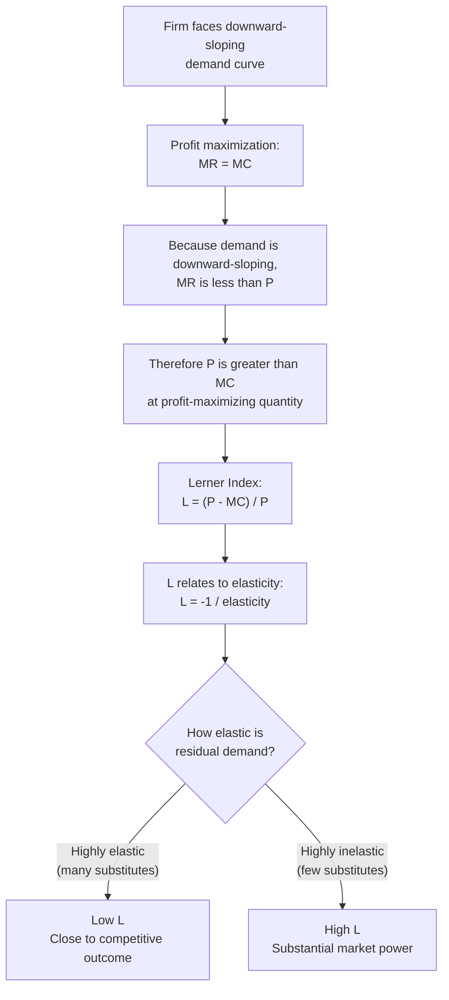

## The Lerner Index as a Measure of Market Power

### Definition and Formula

The Lerner Index (also called the Lerner Index of Monopoly Power) quantifies the degree of market power a firm holds by measuring the extent to which price exceeds marginal cost, expressed as a proportion of price. Developed by Abba Lerner in 1934, it remains one of the most widely used static measures of market power in industrial economics.

The standard formula is:

$$L = \frac{P - MC}{P}$$

Where:

- $L$ = Lerner Index
- $P$ = price charged by the firm
- $MC$ = marginal cost of production

The index ranges from 0 to 1:

- $L = 0$ indicates perfect competition, where $P = MC$
- $L \to 1$ indicates increasing market power, approaching the theoretical case of a firm facing a perfectly inelastic residual demand curve
- Higher values of $L$ indicate greater divergence between price and marginal cost, and thus greater market power

### Theoretical Foundation

**Key Points**

- The Lerner Index is derived directly from the profit-maximizing condition for a firm facing a downward-sloping demand curve.
- A firm with market power sets marginal revenue equal to marginal cost ($MR = MC$), but because $MR < P$ for a downward-sloping demand curve, the firm's price exceeds marginal cost at the profit-maximizing quantity.
- The size of this markup is systematically related to the elasticity of the demand curve the firm faces.

For a profit-maximizing firm, marginal revenue can be written as:

$$MR = P\left(1 + \frac{1}{\varepsilon}\right)$$

Where $\varepsilon$ is the price elasticity of demand faced by the firm (negative under normal demand conditions). Setting $MR = MC$ at the profit-maximizing output level:

$$MC = P\left(1 + \frac{1}{\varepsilon}\right)$$

Rearranging:

$$\frac{P - MC}{P} = -\frac{1}{\varepsilon}$$

This yields the elasticity form of the Lerner Index:

$$L = -\frac{1}{\varepsilon}$$

This is a foundational result: **the Lerner Index equals the inverse of the absolute value of the elasticity of demand facing the firm**. A firm facing highly elastic demand (many close substitutes, easy entry) has a low Lerner Index even if it is technically a "monopolist" in a narrowly defined market, because any price increase drives customers away rapidly. A firm facing inelastic demand can sustain a large markup and a high Lerner Index.

### Interpreting the Elasticity Relationship

**Example**

Suppose a firm faces a demand elasticity of $\varepsilon = -2$. Then:

$$L = -\frac{1}{-2} = 0.5$$

This means the firm's optimal price is set so that $(P - MC)/P = 0.5$, i.e., marginal cost is 50% of price, or equivalently, price is double marginal cost.

If instead the firm faces highly elastic demand, $\varepsilon = -10$:

$$L = -\frac{1}{-10} = 0.1$$

Here price exceeds marginal cost by only 10%, reflecting a much more competitive-like outcome despite potentially few competitors, because consumers are highly responsive to price changes (substitutes are readily available).

This relationship explains why market definition matters enormously in competition policy: the elasticity of demand facing a "firm" depends heavily on how broadly or narrowly the relevant market is drawn. A firm producing "cola" faces different elasticity than a firm producing "Coca-Cola brand cola specifically."

### Relationship to Market Structure

**Key Points**

- **Perfect competition**: Each firm faces a perfectly (or near-perfectly) elastic demand curve ($\varepsilon \to -\infty$), so $L \to 0$. Price equals marginal cost.
- **Monopoly**: The monopolist faces the market demand curve, typically with elasticity closer to unit-elastic near the profit-maximizing point (a monopolist never operates on the inelastic portion of demand, since revenue could be increased by raising price and reducing quantity there). $L$ is positive and can be substantial depending on demand conditions.
- **Monopolistic competition**: Firms face downward-sloping but relatively elastic demand due to product differentiation combined with free entry; $L$ is positive but typically smaller than under monopoly.
- **Oligopoly**: $L$ depends on the specific model of strategic interaction (Cournot, Bertrand, collusive), each of which generates a different implied elasticity of residual demand for each firm.

### Cournot Oligopoly Extension

In a Cournot oligopoly with $n$ symmetric firms, the Lerner Index for an individual firm can be shown to relate to market elasticity and market share:

$$L_i = \frac{P - MC_i}{P} = \frac{s_i}{|\varepsilon_D|}$$

Where:

- $s_i$ = firm $i$'s market share
- $\varepsilon_D$ = market elasticity of demand (not firm-level elasticity)

This is a particularly useful formulation for applied industrial organization because it links an individual firm's markup to two observable-ish quantities: its market share and the overall market elasticity of demand. It also formally shows why market concentration (captured by shares, and in aggregate by the Herfindahl-Hirschman Index) correlates with market power under Cournot competition — see Related Topics.

**[Inference]** The precise mapping from concentration to markups depends on the specific conduct assumed (Cournot, Bertrand, collusive parameter), so the Cournot formula above should not be treated as a universal law; it is model-dependent.

### Aggregate/Industry-Level Lerner Index

At the market level, a weighted average Lerner Index can be constructed by weighting each firm's index by its market share:

$$L_{industry} = \sum_{i=1}^{n} s_i L_i = \sum_{i=1}^{n} s_i \frac{P - MC_i}{P}$$

Under Cournot competition with the firm-level formula above, this aggregates neatly to:

$$L_{industry} = \frac{HHI}{|\varepsilon_D|}$$

Where $HHI = \sum_i s_i^2$ is the Herfindahl-Hirschman Index (sum of squared market shares, typically expressed in index points where shares are on a 0–1 or 0–10,000 scale depending on convention). This result is a well-known bridge between structural measures of concentration (HHI) and conduct-based measures of market power (the Lerner Index), and is a staple of the Structure-Conduct-Performance paradigm in industrial economics.

### Diagrammatic Illustration

<svg xmlns="http://www.w3.org/2000/svg" viewBox="0 0 720 460">
<text x="360" y="28" text-anchor="middle" font-size="17" font-weight="bold" fill="#1a1a1a">Lerner Index Under Monopoly (svg_diagram)</text>

<line x1="80" y1="400" x2="680" y2="400" stroke="#333" stroke-width="1.5" />
<line x1="80" y1="400" x2="80" y2="60" stroke="#333" stroke-width="1.5" />
<text x="690" y="405" font-size="13" fill="#333">Q</text>
<text x="65" y="55" font-size="13" fill="#333">Price / Cost</text>

<line x1="120" y1="90" x2="620" y2="370" stroke="#2563eb" stroke-width="2" />
<text x="630" y="374" font-size="13" fill="#2563eb" font-weight="bold">D</text>

<line x1="120" y1="90" x2="370" y2="380" stroke="#dc2626" stroke-width="2" />
<text x="378" y="384" font-size="13" fill="#dc2626" font-weight="bold">MR</text>

<line x1="80" y1="300" x2="680" y2="300" stroke="#16a34a" stroke-width="2" />
<text x="630" y="295" font-size="13" fill="#16a34a" font-weight="bold">MC</text>

<line x1="330" y1="300" x2="330" y2="400" stroke="#666" stroke-width="1" stroke-dasharray="4,3" />
<text x="322" y="418" font-size="12" fill="#333">Qm</text>

<circle cx="330" cy="300" r="4" fill="#dc2626" />

<line x1="330" y1="300" x2="330" y2="207" stroke="#666" stroke-width="1" stroke-dasharray="4,3" />
<circle cx="330" cy="207" r="4" fill="#2563eb" />
<line x1="80" y1="207" x2="330" y2="207" stroke="#666" stroke-width="1" stroke-dasharray="4,3" />
<text x="55" y="211" font-size="12" fill="#333">Pm</text>
<line x1="80" y1="300" x2="330" y2="300" stroke="#666" stroke-width="1" stroke-dasharray="4,3" />
<text x="55" y="304" font-size="12" fill="#333">MC</text>

<rect x="80" y="207" width="250" height="93" fill="#f59e0b" fill-opacity="0.25" />
<text x="150" y="255" font-size="13" fill="#92400e" font-weight="bold">Markup = P − MC</text>
<text x="150" y="272" font-size="12" fill="#92400e">Lerner Index = shaded area ÷ Pm</text>

<text x="480" y="60" font-size="12" fill="#333">L = (Pm − MC) / Pm = −1/ε</text>

</svg>

### Measurement Challenges

**Key Points**

- **Marginal cost is unobservable directly.** Firms report accounting costs, not economic marginal cost, so empirical implementation typically substitutes average variable cost or estimates marginal cost econometrically (e.g., via production function or cost function estimation).
- **Accounting profit margins are not the same as the Lerner Index.** Reported profit margins (e.g., operating margin) mix in fixed costs, sunk costs, and often reflect accounting depreciation conventions rather than true economic marginal cost, which can bias naive markup estimates.
- **Price and marginal cost may both be endogenous** to demand shocks, cost shocks, and strategic interaction, complicating causal identification of "true" market power from observed markups in reduced-form regressions.
- **Modern estimation approaches**, notably those building on De Loecker and Warzynski's production-function-based markup estimation (2012), infer markups from the wedge between output elasticity of a variable input and that input's revenue share, sidestepping the need for a market-level demand system. **[Unverified]** The precise robustness of these estimates across industries and specifications is an active area of empirical debate in the literature.

### Relationship to the Structure-Conduct-Performance Paradigm

**Key Points**

- The Lerner Index is a "performance" measure in the classic Structure-Conduct-Performance (SCP) framework: market structure (concentration, entry barriers) influences conduct (pricing, collusion), which in turn determines performance (markups, profitability, welfare loss).
- Because $L_{industry} = HHI / |\varepsilon_D|$ under Cournot conduct, the Lerner Index provides a theoretical bridge connecting structural concentration measures to welfare-relevant markup outcomes, subject to the caveat that this specific link is conduct-dependent (it does not hold identically under Bertrand competition with homogeneous goods, where price equals marginal cost regardless of concentration in the absence of capacity constraints or product differentiation).

### Welfare Implications

**Key Points**

- A positive Lerner Index signals allocative inefficiency: because $P > MC$, the market produces less than the socially optimal quantity, generating deadweight loss.
- The deadweight loss from monopoly pricing is often approximated in applied welfare analysis using the Lerner Index together with an estimate of demand elasticity and the size of the market, though the DWL triangle's exact size also depends on the curvature of demand and marginal cost functions, not the markup alone.
- A high Lerner Index does not necessarily imply the firm is earning economic profit in the long run — if fixed or sunk costs are large (e.g., R&D-intensive or network industries), a substantial price-cost markup on marginal cost may simply be recovering fixed costs rather than reflecting supernormal long-run profit. This is a standard point of caution when interpreting the Lerner Index in industries with significant fixed costs (e.g., pharmaceuticals, software, network industries).

### Applications in Antitrust and Regulation

**Key Points**

- Competition authorities use markup estimates derived from Lerner Index logic as one input (among several) when assessing whether a merger or conduct is likely to substantially lessen competition, though the index itself is rarely used as a sole legal test given its data demands.
- The Lerner Index framework underlies critical loss analysis and the hypothetical monopolist test used in market definition exercises (e.g., the SSNIP test — "Small but Significant Non-transitory Increase in Price"), since both rely on the relationship between markup, elasticity, and profitability of a price increase.
- Regulatory rate-setting in some contexts (e.g., utility regulation) implicitly targets a Lerner Index close to zero by requiring price to approximate marginal or average cost.

### Limitations of the Lerner Index

**Key Points**

- **Static measure**: it captures market power at a point in time and does not directly capture dynamic considerations such as innovation incentives, potential competition, or contestability.
- **Single-price assumption**: the basic formula assumes uniform pricing; it requires modification under price discrimination, where a single firm charges multiple prices to different segments, each with a Lerner Index tied to the elasticity of that specific segment.
- **Ignores fixed and sunk costs** in its basic form, as discussed above, which can lead to overstating the welfare significance of an observed markup in industries with high fixed costs.
- **Data intensity**: reliable estimation requires reasonably good marginal cost data or econometric estimation, which is often difficult to obtain, especially for multi-product firms.

### Worked Numerical Example

**Example**

A firm sells a product at $P = \$50$ per unit. Its marginal cost of production is $MC = \$30$ per unit.

$$L = \frac{50 - 30}{50} = \frac{20}{50} = 0.4$$

This firm's Lerner Index is 0.4, meaning marginal cost is only 60% of price, and the firm has meaningful market power. Using the elasticity relationship, this implies the firm's optimal pricing is consistent with facing a demand elasticity of:

$$\varepsilon = -\frac{1}{L} = -\frac{1}{0.4} = -2.5$$

If a competition authority observed a market elasticity close to $-2.5$ but market shares suggesting the firm should, under competitive Bertrand pricing, have $L$ close to zero, the gap between observed and predicted markup could be flagged as evidence warranting further investigation into potential coordinated conduct or unilateral market power — subject to the data and identification caveats discussed above.

**Next Steps**

- **Related Topics**
  - Herfindahl-Hirschman Index (HHI) and market concentration measures
  - Structure-Conduct-Performance (SCP) paradigm
  - Cournot and Bertrand oligopoly models
  - Deadweight loss from monopoly and welfare triangles
  - Price discrimination (first, second, third degree) and segment-specific Lerner Indices
  - Production-function-based markup estimation (De Loecker–Warzynski approach)
  - SSNIP test and hypothetical monopolist market definition
  - Contestable markets theory and the limits of static market power measures
  - Rate-of-return and price-cap regulation in natural monopolies