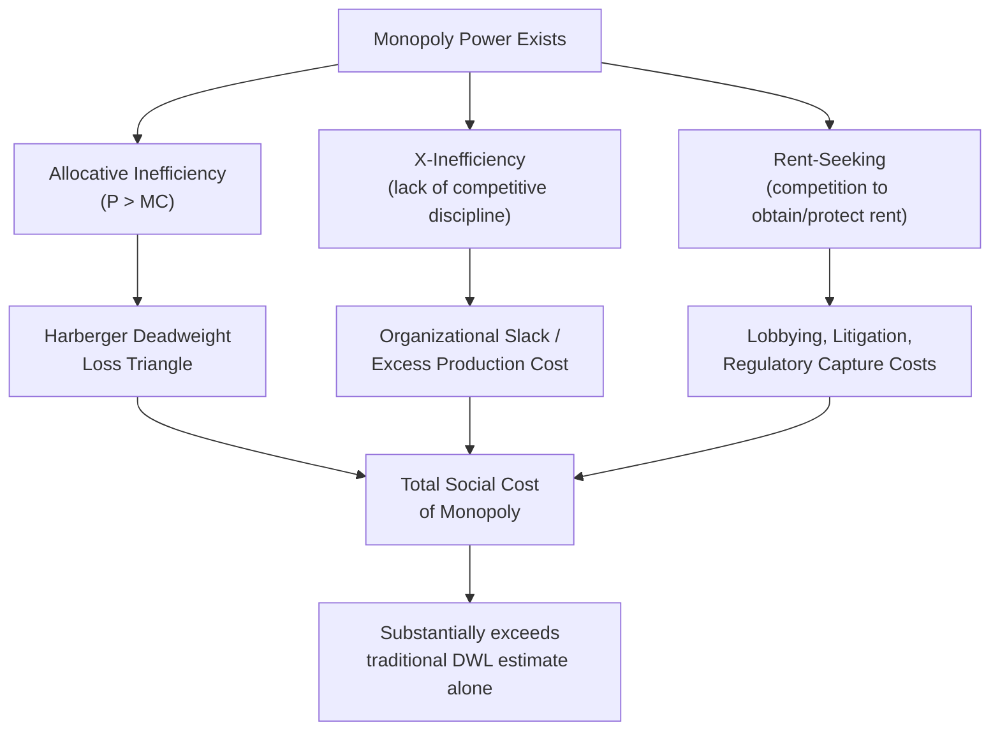

## X-Inefficiency and Rent-Seeking Under Monopoly

### Overview

While the standard neoclassical analysis of monopoly focuses on allocative inefficiency (the deadweight loss triangle from pricing above marginal cost), two additional sources of inefficiency arise once the assumption of automatic cost-minimization is relaxed: **X-inefficiency**, where the monopolist fails to produce at minimum feasible cost, and **rent-seeking**, where resources are expended competing for or defending monopoly rents rather than producing value. Together, these concepts substantially raise the estimated welfare cost of monopoly power beyond the traditional Harberger triangle.

### X-Inefficiency

#### Origin and Definition

The concept of X-inefficiency was introduced by Harvey Leibenstein in his 1966 paper "Allocative Efficiency vs. X-Efficiency." Leibenstein argued that standard microeconomic theory assumes firms always operate on their production possibility frontier (technically efficient, minimizing cost for a given output), but in practice, firms — especially those insulated from competitive pressure — often operate inside the frontier, producing at higher cost than technically necessary.

**Key Points**

- X-inefficiency refers to the gap between actual production cost and the minimum cost theoretically achievable given the firm's technology and input prices.
- The "X" in X-inefficiency denotes an unspecified, residual source of inefficiency not captured by standard allocative analysis — Leibenstein used it precisely because the causes are diffuse and organizational rather than purely technical.
- It is fundamentally a *managerial and organizational* phenomenon rather than a technological one: two firms with identical technology and identical input prices can have different actual costs due to differences in effort, motivation, and organizational slack.

#### Formal Representation

Where standard theory assumes a firm produces at cost $C^* = C(Q, w)$, the minimum-cost function given input prices $w$ and output $Q$, X-inefficiency implies actual cost $C^A$ satisfies:

$$C^A = C^* + X$$

Where $X > 0$ represents the excess cost due to X-inefficiency. The degree of X-inefficiency can be expressed as:

$$X\text{-inefficiency ratio} = \frac{C^A - C^*}{C^*}$$

**[Inference]** Because $C^*$ (true minimum feasible cost) is not directly observable in most real-world settings, empirical measurement of X-inefficiency typically relies on frontier estimation techniques (e.g., stochastic frontier analysis, data envelopment analysis) that infer the "best practice" cost frontier from a cross-section of comparable firms, and treat any given firm's deviation from that frontier as an estimate of X-inefficiency. This is a methodological convention rather than a direct measurement of the underlying managerial slack itself.

#### Why Monopolies Are Prone to X-Inefficiency

**Key Points**

- **Absence of competitive discipline**: in competitive markets, firms that fail to minimize cost are driven out by rivals who do; a monopolist facing no substitutes does not face this survival constraint.
- **Principal-agent problems are magnified**: managers of a monopoly may pursue their own objectives (a quiet life, prestige, larger empire/staff, avoiding difficult cost-cutting decisions) rather than profit or cost-minimization, since shareholders/owners have weaker signals (no comparable competitor performance) to judge managerial performance against.
- **Slack absorption of rents**: rather than monopoly rents accruing purely as measurable profit, part of the rent can be dissipated internally as organizational slack — for example, above-market wages, excess staffing, underutilized capital, or lower work intensity — a phenomenon sometimes called "the quiet life" hypothesis.
- **Weaker informational feedback**: absent rival benchmarks, it is harder for owners, regulators, or capital markets to know what "efficient cost" should look like for that firm, softening the pressure to eliminate slack.

#### Diagrammatic Illustration of X-Inefficiency

<svg xmlns="http://www.w3.org/2000/svg" viewBox="0 0 700 420">
<text x="350" y="28" text-anchor="middle" font-size="17" font-weight="bold" fill="#1a1a1a">X-Inefficiency: Actual vs. Minimum Cost (svg_diagram)</text>

<line x1="90" y1="370" x2="650" y2="370" stroke="#333" stroke-width="1.5" />
<line x1="90" y1="370" x2="90" y2="50" stroke="#333" stroke-width="1.5" />
<text x="660" y="375" font-size="13" fill="#333">Output Q</text>
<text x="45" y="45" font-size="13" fill="#333">Cost</text>

<line x1="120" y1="330" x2="600" y2="150" stroke="#16a34a" stroke-width="2.5" />
<text x="605" y="148" font-size="13" fill="#16a34a" font-weight="bold">C* (minimum feasible cost)</text>

<line x1="120" y1="270" x2="600" y2="90" stroke="#dc2626" stroke-width="2.5" stroke-dasharray="6,3" />
<text x="605" y="88" font-size="13" fill="#dc2626" font-weight="bold">C^A (actual cost, X-inefficient)</text>

<line x1="350" y1="230" x2="350" y2="180" stroke="#666" stroke-width="1" />
<line x1="340" y1="180" x2="360" y2="180" stroke="#666" stroke-width="1" />
<line x1="340" y1="230" x2="360" y2="230" stroke="#666" stroke-width="1" />
<text x="370" y="210" font-size="13" fill="#92400e" font-weight="bold">X (excess cost /</text>
<text x="370" y="226" font-size="13" fill="#92400e" font-weight="bold">organizational slack)</text>

<text x="150" y="395" font-size="12" fill="#333">Gap between C^A and C* represents resources</text>

<text x="150" y="410" font-size="12" fill="#333">wasted due to lack of competitive pressure</text>

</svg>

#### Welfare Consequence

Unlike allocative inefficiency, which redistributes surplus from consumers to the monopolist (with a residual deadweight loss triangle), X-inefficiency is a **pure resource waste**: the excess cost $X$ produces no offsetting benefit to anyone — it is not transferred to consumers or captured as profit, but simply dissipated. This means the total welfare loss from a monopoly exhibiting X-inefficiency can substantially exceed the traditional Harberger deadweight-loss estimate, which by design only captures allocative inefficiency and typically assumes cost-minimizing behavior.

**[Inference]** Leibenstein's original conjecture — and a recurring theme in the subsequent applied literature — is that in many real-world industries, welfare losses from X-inefficiency are likely to be considerably larger in magnitude than losses from pure allocative inefficiency, though the size of this gap is inherently difficult to pin down empirically and varies by industry and regulatory context.

#### Criticisms of the X-Inefficiency Concept

**Key Points**

- Some economists (notably in the Chicago tradition, e.g., George Stigler) have argued that "X-inefficiency" is not a coherent, independent category, but rather reflects either (a) principal-agent costs that are themselves the rational, cost-minimizing response to costly monitoring/information, or (b) mismeasurement of the true production function or true minimum-cost frontier.
- Under this view, what looks like "slack" may actually be an efficient organizational response to incentive constraints (e.g., paying efficiency wages, tolerating some shirking because monitoring is more costly than the shirking itself) — in which case it is not inefficiency in the welfare-relevant sense at all.
- **[Unverified]** The empirical debate over whether X-inefficiency represents genuine, correctable waste versus efficient adaptation to information and agency constraints remains unsettled in the literature, and reasonable economists disagree on its interpretation.

### Rent-Seeking

#### Definition and Origin

Rent-seeking refers to the expenditure of real resources by individuals or firms in an effort to obtain, maintain, or increase economic rents (returns above the competitive/opportunity-cost level) through non-productive means — most commonly by influencing government policy, regulation, or legal protections — rather than by creating new value through production or innovation. The term was coined by Anne Krueger (1974) building on the theoretical foundation laid by Gordon Tullock (1967).

**Key Points**

- Rent-seeking activities include lobbying for tariff protection, licensing restrictions, patents used defensively rather than to protect genuine innovation, regulatory capture, and litigation aimed at excluding competitors.
- The defining feature is that rent-seeking expenditure is **socially wasteful**: unlike ordinary competitive investment (e.g., R&D, advertising that conveys real information, quality improvement), it does not expand the total pie — it only affects how an existing rent is divided, while consuming real resources (lawyers, lobbyists, executive time) in the process.

#### The Tullock Insight: Rent-Seeking as Dissipation of Monopoly Rents

Gordon Tullock's key theoretical contribution was to show that the traditional Harberger deadweight-loss triangle dramatically *understates* the true welfare cost of monopoly, because it ignores the resources firms rationally spend competing to *become* the monopolist in the first place.

**Key Points**

- If a monopoly position (e.g., a government-granted license, patent, or import quota) generates rent $R = (P - MC) \times Q$ (the monopoly profit rectangle), then in a competitive contest for that rent, potential rent-seekers will be willing to spend up to the full expected value of $R$ trying to win it.
- In the limiting case of risk-neutral, free entry into rent-seeking competition, the resources dissipated in the contest can, in expectation, approach the entire value of the monopoly rent itself, meaning the whole rectangle previously counted as a *transfer* from consumers to the monopolist (and hence excluded from deadweight loss in the standard Harberger analysis) is effectively *also* converted into social waste.

This can be represented conceptually as an expansion of the welfare loss:

$$DWL_{total} \approx DWL_{Harberger} + R_{dissipated}$$

Where $DWL_{Harberger}$ is the standard triangle, and $R_{dissipated}$ is some fraction (up to the full amount, under strong assumptions) of the monopoly rent rectangle $R$, consumed by competing claimants in the process of contesting the rent.

**[Inference]** Full dissipation of the entire rent ($R_{dissipated} = R$) is a theoretical limiting case that depends on assumptions such as risk neutrality, free entry into the contest, and constant returns in the "rent-seeking production function." In many real-world settings, only partial dissipation occurs, and the exact fraction is an empirical question rather than a general law.

#### Diagrammatic Illustration: Traditional DWL vs. Tullock Rectangle

<svg xmlns="http://www.w3.org/2000/svg" viewBox="0 0 700 460">
<text x="350" y="26" text-anchor="middle" font-size="16" font-weight="bold" fill="#1a1a1a">Harberger Triangle vs. Tullock Rent-Seeking Rectangle (svg_diagram)</text>

<line x1="90" y1="400" x2="640" y2="400" stroke="#333" stroke-width="1.5" />
<line x1="90" y1="400" x2="90" y2="60" stroke="#333" stroke-width="1.5" />
<text x="650" y="405" font-size="13" fill="#333">Q</text>
<text x="65" y="55" font-size="13" fill="#333">Price</text>

<line x1="130" y1="90" x2="600" y2="360" stroke="#2563eb" stroke-width="2" />
<text x="605" y="364" font-size="13" fill="#2563eb" font-weight="bold">D</text>

<line x1="90" y1="320" x2="640" y2="320" stroke="#16a34a" stroke-width="2" />
<text x="590" y="315" font-size="13" fill="#16a34a" font-weight="bold">MC = ATC</text>

<line x1="300" y1="320" x2="300" y2="185" stroke="#666" stroke-width="1" stroke-dasharray="4,3" />
<line x1="90" y1="185" x2="300" y2="185" stroke="#666" stroke-width="1" stroke-dasharray="4,3" />
<text x="55" y="189" font-size="12" fill="#333">Pm</text>
<text x="292" y="418" font-size="12" fill="#333">Qm</text>

<line x1="450" y1="320" x2="450" y2="400" stroke="#666" stroke-width="1" stroke-dasharray="4,3" />
<text x="442" y="418" font-size="12" fill="#333">Qc</text>

<rect x="90" y="185" width="210" height="135" fill="#f59e0b" fill-opacity="0.3" />
<text x="105" y="255" font-size="12" fill="#92400e" font-weight="bold">Monopoly Rent</text>
<text x="105" y="270" font-size="12" fill="#92400e" font-weight="bold">(Tullock: potentially</text>
<text x="105" y="285" font-size="12" fill="#92400e" font-weight="bold">fully dissipated by</text>
<text x="105" y="300" font-size="12" fill="#92400e" font-weight="bold">rent-seeking cost)</text>

<path d="M 300 185 L 300 320 L 450 320 Z" fill="#dc2626" fill-opacity="0.3" />
<text x="330" y="300" font-size="12" fill="#7f1d1d" font-weight="bold">Harberger</text>
<text x="330" y="314" font-size="12" fill="#7f1d1d" font-weight="bold">DWL triangle</text>
</svg>

#### Forms of Rent-Seeking Behavior

**Key Points**

- **Lobbying and political rent-seeking**: firms lobby for tariffs, quotas, subsidies, or licensing barriers that create or protect monopoly positions.
- **Litigation-based rent-seeking**: strategic use of patent litigation, trademark disputes, or regulatory challenges to raise rivals' costs or delay entry rather than to protect genuine innovation.
- **Regulatory capture**: incumbent firms invest resources influencing the regulatory agencies meant to constrain them, so that regulation is designed or enforced in ways that entrench incumbents (associated with George Stigler's "economic theory of regulation," 1971).
- **Bureaucratic/queuing rent-seeking**: in the presence of artificially restricted licenses (e.g., import licenses, taxi medallions before deregulation), resources are spent by many applicants competing for a limited number of awards, and — even among the "winners" — resources may have been spent maintaining or defending eligibility.
- **Defensive rent-seeking**: incumbents also spend resources not to *acquire* new rents but simply to *protect existing* rents from erosion by challengers, entrants, or policy change.

#### Rent-Seeking and Contest Theory

Formal models of rent-seeking often use "contest success functions," where an agent's probability of winning the rent depends on their relative rent-seeking expenditure. A common functional form (Tullock contest function) for two competing agents is:

$$p_i = \frac{e_i^r}{e_i^r + e_j^r}$$

Where:

- $p_i$ = probability that agent $i$ wins the rent
- $e_i, e_j$ = rent-seeking expenditures of agents $i$ and $j$
- $r$ = a parameter governing the "decisiveness" of expenditure (higher $r$ means expenditure differences translate more sharply into winning probability)

**[Inference]** The degree of rent dissipation in equilibrium is sensitive to the value of $r$, the number of contestants, and their risk attitudes; this is a modeling result from contest theory rather than a directly observed empirical constant, and different specifications yield different dissipation predictions (ranging from partial to full, and in some model variants, theoretically more than full dissipation under risk-loving behavior).

### Combined Welfare Framework: Total Cost of Monopoly

**Key Points**

Bringing the three sources of monopoly-related welfare loss together, the *total* social cost of monopoly power can be conceptually decomposed as:

$$\text{Total Social Cost} = \underbrace{DWL_{Harberger}}_{\text{allocative inefficiency}} + \underbrace{X}_{\text{X-inefficiency (cost waste)}} + \underbrace{R_{dissipated}}_{\text{rent-seeking waste}}$$

This decomposition, associated with the broader "Tullock–Posner" line of argument (Richard Posner extended similar rent-dissipation logic to regulated industries in 1975), suggests early empirical estimates of the welfare cost of monopoly (e.g., Arnold Harberger's famous 1954 estimate that monopoly welfare losses in the U.S. economy amounted to a very small fraction of GNP) likely substantially understated the true social cost, because Harberger's methodology captured only the allocative inefficiency triangle and implicitly assumed cost-minimizing, non-strategic firm behavior.

### Policy Implications

**Key Points**

- Because X-inefficiency stems from lack of competitive pressure rather than pricing behavior per se, policies that merely regulate price (e.g., price caps) without introducing competitive or benchmarking discipline may fail to eliminate X-inefficiency, and in some cases (e.g., poorly designed cost-plus regulation) may worsen it by removing incentives to control costs.
- Yardstick competition and benchmarking regulation (comparing a regulated firm's costs against similar firms elsewhere) is a regulatory response specifically designed to counteract X-inefficiency by reintroducing indirect competitive pressure where direct market competition is infeasible (e.g., natural monopoly utility regulation).
- Reducing rent-seeking losses generally requires addressing the *source* of artificially created rents — e.g., trade liberalization to reduce tariff-seeking, transparent and competitive licensing/auction mechanisms instead of discretionary allocation, and stronger institutional constraints on regulatory capture — rather than addressing rent-seeking behavior directly, since the behavior is a rational response to the existence of a capturable rent.
- **[Inference]** Some policy prescriptions (e.g., auctioning off monopoly licenses/rents to the highest bidder, as suggested by Harold Demsetz's "competition for the field" approach) attempt to convert potential rent dissipation into a lump-sum transfer captured by the public sector instead, though implementation challenges (accurate valuation, collusion among bidders, incomplete contracts) mean this does not fully eliminate the underlying welfare concern in practice.

### Distinguishing X-Inefficiency from Rent-Seeking

**Key Points**

- **X-inefficiency** is *internal* to the firm: it reflects wasted resources within the production process itself (excess cost for a given output).
- **Rent-seeking** is typically *external*, or at least directed outward: it reflects resources spent influencing the external environment (government, courts, regulators) to create, capture, or protect a rent, rather than resources wasted in the production process per se.
- Both differ from ordinary allocative inefficiency in that allocative inefficiency is a *static pricing distortion* given existing costs and technology, whereas X-inefficiency and rent-seeking represent *additional, dynamic behavioral responses* to the existence of market power and its associated rents.

**Next Steps**

- **Related Topics**
  - The Lerner Index and price-cost markups (prerequisite/companion concept)
  - Harberger's deadweight loss triangle and early welfare-cost-of-monopoly estimates
  - Principal-agent theory and managerial slack
  - Stigler's economic theory of regulation and regulatory capture
  - Contest theory and Tullock contest success functions
  - Yardstick competition and incentive regulation (price caps vs. cost-plus regulation)
  - Demsetz's "competition for the field" and franchise bidding for natural monopolies
  - Patent thickets and strategic (defensive) patenting as a form of rent-seeking
  - Trade protection, tariff-seeking, and quota rents