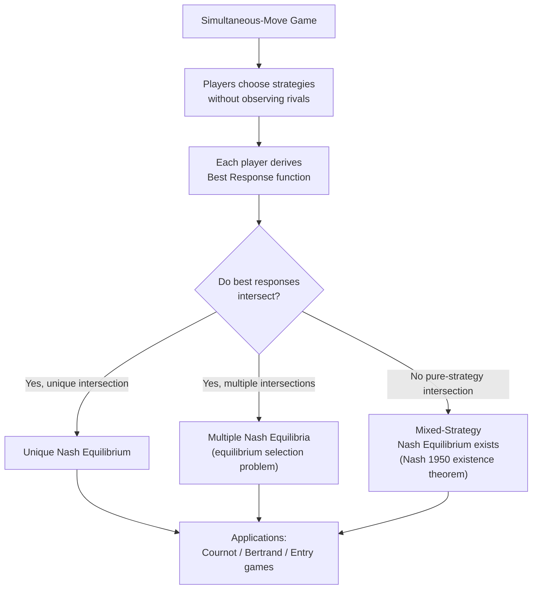

## Simultaneous-Move Games and Nash Equilibrium

### Overview

Simultaneous-move games form the foundational strategic environment in the industrial organization game theory toolkit. In these games, players choose actions without observing the choices of others (either literally at the same instant, or informationally equivalent — each player commits without knowledge of rivals' choices). The equilibrium concept most commonly applied to such games is the Nash equilibrium, developed by John Nash (1950, 1951), which describes a mutually consistent set of strategies from which no player has a unilateral incentive to deviate. This toolkit underlies virtually all static oligopoly models in industrial economics, including Cournot quantity competition and Bertrand price competition.

### Formal Definition of a Simultaneous-Move Game

**Key Points**

A simultaneous-move game (also called a "strategic form" or "normal form" game) is formally defined by three elements:

$$G = \{N, (S_i)_{i \in N}, (u_i)_{i \in N}\}$$

Where:

- $N = \{1, 2, \dots, n\}$ is the finite set of players
- $S_i$ is the strategy space (set of feasible actions) available to player $i$
- $u_i: S_1 \times S_2 \times \dots \times S_n \to \mathbb{R}$ is player $i$'s payoff (utility) function, mapping the full strategy profile chosen by all players to a real-valued payoff for player $i$

A **strategy profile** is a vector $s = (s_1, s_2, \dots, s_n)$ specifying one strategy for each player. The notation $s_{-i}$ denotes the strategies of all players other than $i$, so that a full profile can be written $s = (s_i, s_{-i})$.

**Key Points**

- "Simultaneous" does not require literal clock-time simultaneity; it requires that no player observes any other player's action before choosing their own — this is the defining informational structure, not the calendar timing.
- This class of games is contrasted with **sequential-move (extensive-form) games**, where later movers observe and can condition on earlier moves — see Related Topics for the Stackelberg model, a canonical sequential-move counterpart to Cournot.

### Representing Simultaneous Games: The Normal Form / Payoff Matrix

For games with a small number of players and discrete strategies, the normal form is typically displayed as a payoff matrix. For two players each choosing between two strategies, a canonical structure is:

|  | Player 2: Left | Player 2: Right |
| --- | --- | --- |
| **Player 1: Up** | $(u_1^{UL}, u_2^{UL})$ | $(u_1^{UR}, u_2^{UR})$ |
| **Player 1: Down** | $(u_1^{DL}, u_2^{DL})$ | $(u_1^{DR}, u_2^{DR})$ |

Each cell lists the payoff pair $(u_1, u_2)$ resulting from the corresponding strategy combination. This representation directly encodes the interdependence central to strategic settings: player 1's payoff depends not only on their own choice but on player 2's simultaneous choice, and vice versa.

### Nash Equilibrium: Formal Definition

**Key Points**

A strategy profile $s^* = (s_1^*, s_2^*, \dots, s_n^*)$ is a **Nash equilibrium** if, for every player $i$:

$$u_i(s_i^*, s_{-i}^*) \geq u_i(s_i, s_{-i}^*) \quad \text{for all } s_i \in S_i$$

In words: given the equilibrium strategies of all other players, no player can obtain a strictly higher payoff by unilaterally deviating to a different strategy. Each player's strategy is a **best response** to the strategies of all other players.

Formally, defining player $i$'s best response correspondence as:

$$BR_i(s_{-i}) = \arg\max_{s_i \in S_i} u_i(s_i, s_{-i})$$

A Nash equilibrium is a strategy profile $s^*$ such that $s_i^* \in BR_i(s_{-i}^*)$ for every player $i$ simultaneously — i.e., a **mutual best response**, or a fixed point of the joint best-response mapping.

**Key Points**

- Nash equilibrium is a *consistency* concept, not necessarily an *efficiency* concept: an equilibrium can be, and often is, Pareto-inferior to other feasible outcomes (the Prisoner's Dilemma being the canonical illustration).
- Nash equilibrium does not require that players' strategies be "correct" in any normative sense — only that no single player, holding others' strategies fixed, wants to change their own choice.
- A game may have zero, one, or multiple Nash equilibria in pure strategies; when no pure-strategy Nash equilibrium exists, a mixed-strategy Nash equilibrium (a probability distribution over strategies) always exists for finite games, per Nash's existence theorem (1950).

### Nash's Existence Theorem

**[Fact]** Nash proved that every finite game (finite number of players, each with a finite strategy set) has at least one Nash equilibrium, possibly in mixed strategies. The proof relies on Kakutani's fixed-point theorem, showing that the best-response correspondence (suitably defined over the space of mixed strategies) satisfies the conditions required for a fixed point to exist (a non-empty, compact, convex-valued, upper hemicontinuous correspondence on a compact, convex set).

**Key Points**

- For games with continuous strategy spaces and continuous, quasi-concave payoff functions (a common setting in IO, e.g., Cournot quantity competition over a continuous quantity space), existence of a pure-strategy Nash equilibrium can typically be established via related fixed-point arguments (e.g., using Brouwer's or Kakutani's fixed-point theorem directly on the continuous best-response functions), without needing to invoke mixed strategies.

### Illustrative Example: The Prisoner's Dilemma

**Example**

|  | Player 2: Cooperate | Player 2: Defect |
| --- | --- | --- |
| **Player 1: Cooperate** | $(3, 3)$ | $(0, 5)$ |
| **Player 1: Defect** | $(5, 0)$ | $(1, 1)$ |

Checking best responses:

- If Player 2 cooperates, Player 1's best response is to defect (5 > 3).
- If Player 2 defects, Player 1's best response is to defect (1 > 0).
- Defect is thus a **dominant strategy** for Player 1 (best response regardless of the other player's action). By symmetry, Defect is also dominant for Player 2.

The unique Nash equilibrium is $(Defect, Defect)$, yielding payoffs $(1, 1)$ — despite $(Cooperate, Cooperate)$ yielding a Pareto-superior outcome of $(3, 3)$ for both players. This illustrates the central lesson that Nash equilibrium describes strategic stability, not social or joint efficiency.

**Key Points**

- A **dominant strategy** is one that is a best response regardless of what the other player does; if every player has a dominant strategy, the resulting profile is automatically a Nash equilibrium (a "dominant strategy equilibrium"), though not all Nash equilibria involve dominant strategies.
- The Prisoner's Dilemma structure directly maps onto classic IO applications: tacit collusion between oligopolists is unstable in a one-shot simultaneous game for exactly this reason (each firm has an incentive to unilaterally deviate from a collusive output/price), which motivates the study of repeated games and folk theorems for sustaining collusion (see Related Topics).

### Illustrative Example: Coordination Game (Multiple Equilibria)

**Example**

|  | Player 2: Left | Player 2: Right |
| --- | --- | --- |
| **Player 1: Left** | $(2, 2)$ | $(0, 0)$ |
| **Player 1: Right** | $(0, 0)$ | $(1, 1)$ |

Here, both $(Left, Left)$ and $(Right, Right)$ are Nash equilibria — each is a mutual best response — but they are not equally desirable (both players strictly prefer $(Left, Left)$). This demonstrates that Nash equilibrium alone does not always pin down a unique prediction; additional refinements (e.g., payoff dominance, risk dominance, focal points/Schelling points, or evolutionary/learning dynamics) are sometimes invoked in applied work to select among multiple equilibria. **[Unverified]** Which refinement is "correct" in any given applied context is itself a matter of ongoing theoretical and empirical debate; no single universally accepted selection criterion exists.

### Mixed-Strategy Nash Equilibrium

**Key Points**

When no pure-strategy Nash equilibrium exists (common in games with a "matching" or purely adversarial structure), players may randomize over their pure strategies. A **mixed strategy** for player $i$ is a probability distribution $\sigma_i$ over $S_i$. A mixed-strategy Nash equilibrium requires that each player's mixed strategy is a best response to the others' mixed strategies, which — for any strategy played with positive probability in equilibrium — requires that strategy to yield an expected payoff exactly equal to any other strategy also played with positive probability (the **indifference condition**).

**Example**

Matching Pennies:

|  | Player 2: Heads | Player 2: Tails |
| --- | --- | --- |
| **Player 1: Heads** | $(1, -1)$ | $(-1, 1)$ |
| **Player 1: Tails** | $(-1, 1)$ | $(1, -1)$ |

No pure-strategy Nash equilibrium exists (each player always wants to switch given the other's choice). The unique Nash equilibrium is in mixed strategies: each player randomizes 50/50 between Heads and Tails. At this profile, each player is indifferent between their two pure strategies given the other's mixing probability, so neither has an incentive to deviate — satisfying the Nash equilibrium condition in expected-payoff terms.

### Nash Equilibrium in Continuous Strategy Spaces: Best-Response Functions

Many core IO models (Cournot, Bertrand, product differentiation models) involve continuous strategy spaces (quantities or prices chosen from a continuum). In this setting, Nash equilibrium is typically found by deriving each player's **best-response function** $s_i = BR_i(s_{-i})$ (often via first-order conditions from profit maximization) and solving the resulting system of equations simultaneously.

**Example: Cournot Duopoly Nash Equilibrium**

Consider two firms choosing quantities $q_1, q_2$ facing linear inverse demand $P = a - b(q_1 + q_2)$ and constant marginal cost $c$ for both firms. Firm 1's profit is:

$$\pi_1 = [a - b(q_1 + q_2) - c] q_1$$

Taking the first-order condition with respect to $q_1$:

$$\frac{\partial \pi_1}{\partial q_1} = a - 2bq_1 - bq_2 - c = 0 \implies q_1 = BR_1(q_2) = \frac{a - c - bq_2}{2b}$$

By symmetry, Firm 2's best response is $q_2 = BR_2(q_1) = \frac{a - c - bq_1}{2b}$.

Solving these two best-response functions simultaneously (imposing $q_1 = q_2 = q^*$ by symmetry):

$$q^* = \frac{a - c}{3b}$$

This mutual best-response solution — where each firm's chosen quantity is optimal *given* the other firm's equilibrium quantity — is precisely the Cournot-Nash equilibrium, illustrating that the Cournot model is simply a specific application of Nash equilibrium to a simultaneous quantity-setting game. **[Inference]** This closed-form solution depends on the linear demand and constant marginal cost assumptions used here; more general demand/cost specifications require solving the best-response system numerically or under different functional-form assumptions, without necessarily yielding a clean closed form.

### Graphical Representation: Best-Response Function Intersection

<svg xmlns="http://www.w3.org/2000/svg" viewBox="0 0 640 480">
<text x="320" y="26" text-anchor="middle" font-size="16" font-weight="bold" fill="#1a1a1a">Nash Equilibrium as Intersection of Best-Response Functions (svg_diagram)</text>

<line x1="80" y1="420" x2="580" y2="420" stroke="#333" stroke-width="1.5" />
<line x1="80" y1="420" x2="80" y2="60" stroke="#333" stroke-width="1.5" />
<text x="590" y="425" font-size="13" fill="#333">q1</text>
<text x="55" y="55" font-size="13" fill="#333">q2</text>

<line x1="500" y1="90" x2="80" y2="330" stroke="#2563eb" stroke-width="2.5" />
<text x="410" y="105" font-size="13" fill="#2563eb" font-weight="bold">BR1(q2)</text>

<line x1="120" y1="90" x2="380" y2="420" stroke="#dc2626" stroke-width="2.5" />
<text x="140" y="110" font-size="13" fill="#dc2626" font-weight="bold">BR2(q1)</text>

<circle cx="290" cy="260" r="6" fill="#16a34a" />
<text x="300" y="250" font-size="13" fill="#16a34a" font-weight="bold">Nash Equilibrium (q1*, q2*)</text>
<line x1="290" y1="260" x2="290" y2="420" stroke="#666" stroke-width="1" stroke-dasharray="4,3" />
<line x1="80" y1="260" x2="290" y2="260" stroke="#666" stroke-width="1" stroke-dasharray="4,3" />
<text x="270" y="435" font-size="12" fill="#333">q1*</text>
<text x="55" y="264" font-size="12" fill="#333">q2*</text>
</svg>

### Best-Response Structure and Reaction Curves in IO Models

**Key Points**

- The **slope of best-response functions** carries important economic meaning: in Cournot (quantity) competition, best-response functions are typically downward-sloping — quantities are **strategic substitutes** (an increase in a rival's output makes it optimal to reduce one's own output, since aggregate quantity drives down the common market price).
- In Bertrand (price) competition with differentiated products, best-response functions are typically upward-sloping — prices are **strategic complements** (an increase in a rival's price makes it optimal to raise one's own price, since a rival's higher price makes one's own differentiated product relatively more attractive at any given price).
- This strategic substitutes/complements distinction (formalized by Bulow, Geanakoplos, and Klemperer, 1985) is central to industrial organization because it determines the qualitative effect of an exogenous shock (e.g., a cost shock or entry) on rivals' equilibrium responses, and it explains why Cournot and Bertrand competition can generate qualitatively different comparative-static predictions even in otherwise similar market settings.

### Dominant and Dominated Strategies

**Key Points**

- A strategy $s_i$ **strictly dominates** another strategy $s_i'$ if $u_i(s_i, s_{-i}) > u_i(s_i', s_{-i})$ for *every* possible $s_{-i}$ — i.e., $s_i$ is always strictly better regardless of rivals' actions.
- **Iterated elimination of strictly dominated strategies (IESDS)** is a solution technique in which strategies that are never a best response (strictly dominated) are removed successively; any Nash equilibrium of the original game survives this process, and in games solvable via IESDS down to a single strategy profile, that profile is the unique Nash equilibrium.
- **[Inference]** Iterated elimination of *weakly* (as opposed to strictly) dominated strategies can, in some games, eliminate legitimate Nash equilibria and is order-dependent (different elimination orders can yield different surviving profiles), so it is generally treated with more caution as a solution technique than IESDS on strictly dominated strategies.

### Nash Equilibrium and Rationality Assumptions

**Key Points**

- Standard Nash equilibrium analysis assumes **common knowledge of rationality**: each player is rational, each player knows all players are rational, each player knows that each player knows this, and so on.
- It also generally presumes **common knowledge of the game structure itself** (payoffs, strategy sets, and the number of players are known to all players) — settings that relax this assumption fall under games of incomplete information, analyzed using the Bayesian Nash equilibrium concept (see Related Topics).
- Nash equilibrium is a solution concept for a **one-shot** (or, if repeated, a single-stage analyzed in isolation) simultaneous game; it does not by itself incorporate reputational or repeated-interaction effects, which require the separate toolkit of repeated games.

### Applications in Industrial Organization

**Key Points**

- **Cournot competition**: firms simultaneously choose output quantities; Nash equilibrium in quantities yields the standard Cournot outcome, with equilibrium price above marginal cost but below the monopoly price (see Lerner Index discussion in prior material for the associated markup).
- **Bertrand competition**: firms simultaneously choose prices; with homogeneous products and constant marginal cost, the unique Nash equilibrium is $P = MC$ for both firms (the "Bertrand paradox"), illustrating how the *strategic variable* (price vs. quantity) can produce starkly different market outcomes even holding the underlying market structure (duopoly) fixed.
- **Entry games**: potential entrants and incumbents simultaneously (or sequentially, depending on model) choose whether to enter/deter entry, with Nash equilibrium used to characterize entry-deterrence and entry-accommodation outcomes.
- **Location/product-differentiation games** (e.g., Hotelling-type models): firms simultaneously choose location or product characteristics, with Nash equilibrium determining the resulting degree of differentiation.

### Limitations and Extensions

**Key Points**

- Nash equilibrium in its basic (static, complete-information) form cannot address settings where players move in sequence and can observe prior actions — this requires the notion of **subgame perfect Nash equilibrium**, which refines Nash equilibrium to rule out non-credible threats in sequential settings (relevant for the Stackelberg model, entry-deterrence games with observable investment, etc.).
- It also cannot directly address settings of incomplete information (where players are uncertain about rivals' payoffs/types) — this requires **Bayesian Nash equilibrium**.
- Repeated interaction among the same players (e.g., firms competing over many periods) requires the separate apparatus of repeated games and the associated **Folk Theorems**, which show that cooperative (e.g., tacitly collusive) outcomes unsustainable in a one-shot Nash equilibrium can become sustainable as Nash (or subgame perfect Nash) equilibria of the repeated game under sufficient patience (discount factor close to 1).
- **[Unverified]** The empirical relevance of any particular equilibrium refinement or selection criterion in explaining observed real-world market outcomes is context-dependent and remains an active area of applied research rather than a settled matter.

**Next Steps**

- **Related Topics**
  - Cournot model of quantity competition (detailed treatment)
  - Bertrand model of price competition and the Bertrand paradox
  - Strategic substitutes vs. strategic complements (Bulow-Geanakoplos-Klemperer)
  - Sequential-move games and subgame perfect Nash equilibrium
  - The Stackelberg leader-follower model
  - Repeated games, discount factors, and Folk Theorems (sustaining tacit collusion)
  - Bayesian Nash equilibrium and games of incomplete information
  - Entry deterrence and entry accommodation games
  - Mixed-strategy equilibria in capacity-constrained pricing games (Edgeworth cycles)