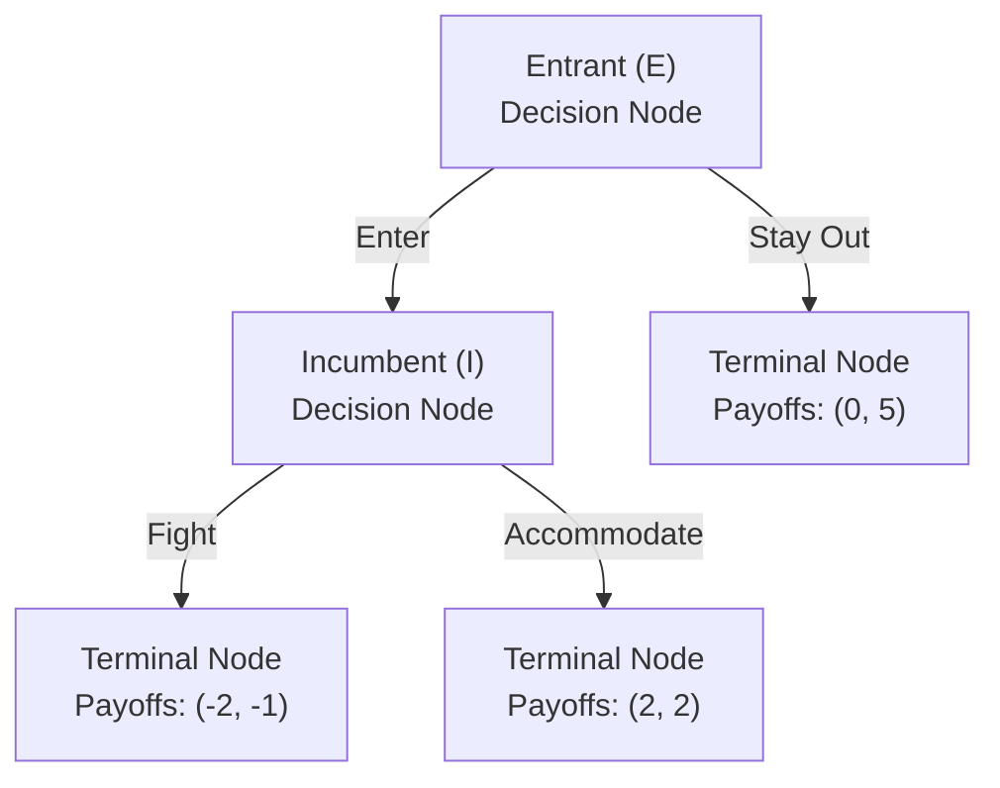

## Sequential Games and Subgame Perfection

### Overview

Sequential-move games extend the strategic toolkit to settings where players move in a defined order and later movers can observe (some or all of) the actions taken by earlier movers before choosing their own action. This informational structure — the ability to condition on observed history — introduces the possibility of **non-credible threats and promises**: strategies that would constitute a Nash equilibrium of the game's normal form but that no rational player would actually carry out if the relevant decision point were reached. **Subgame perfect Nash equilibrium (SPNE)**, developed by Reinhard Selten (1965), is the standard refinement used to eliminate such non-credible strategies and is a central tool for analyzing dynamic competition, entry deterrence, and commitment in industrial organization.

### Extensive-Form Representation

**Key Points**

Sequential games are formally represented in **extensive form**, consisting of:

- A **game tree**: a set of decision nodes connected by branches (actions), beginning at a single initial (root) node and ending at terminal nodes where payoffs are realized.
- **Information sets**: groupings of decision nodes indicating what a player knows at the point of choosing an action. A singleton information set (a single node) means the player, upon reaching that point, knows exactly which node they are at (i.e., knows the full history of play so far) — this is the defining feature of a game of **perfect information**.
- **Payoffs**: assigned to each terminal node, specifying the outcome for every player once a complete path through the tree has been played out.

A game of **perfect information** is one in which every information set is a singleton — every player, at every decision point, knows the complete history of moves made so far. A game of **imperfect information** contains at least one non-singleton information set, meaning a player must choose without knowing exactly which prior actions were taken (this includes simultaneous-move subgames, which are typically represented as non-singleton information sets within an otherwise sequential tree).

### Strategies in Extensive-Form Games

**Key Points**

- A **strategy** in an extensive-form game is a *complete contingent plan*: it specifies an action for every information set at which the player might be called upon to move, including information sets that will never actually be reached given the strategies chosen by other players.
- This "complete plan" requirement is essential and is precisely what makes subgame perfection possible to check: without specifying what a player *would* do at off-path nodes, there is no way to assess whether those hypothetical choices are credible.

### Example: A Simple Entry-Deterrence Game Tree

Consider a two-stage game: an entrant (Player 1, "E") decides whether to Enter or Stay Out of a market; if Entry occurs, the incumbent (Player 2, "I") decides whether to Fight (start a price war) or Accommodate (share the market peacefully).

Payoffs are listed as (Entrant, Incumbent). This tree has perfect information: the Incumbent, upon reaching its decision node, knows with certainty that Entry has occurred.

### Solving Sequential Games: Backward Induction

**Key Points**

**Backward induction** is the primary solution procedure for finite games of perfect information. It proceeds by starting at the final decision nodes of the tree and working backward toward the root:

1. At each "last" decision node (immediately preceding only terminal nodes), determine the acting player's optimal choice given the payoffs at each terminal node reachable from it.
2. Replace that decision node with the payoff vector resulting from the player's optimal choice at that node, effectively "pruning" the tree.
3. Move to the next-to-last decision nodes and repeat, now treating the previously computed payoffs as the relevant terminal payoffs.
4. Continue until the root node is reached, yielding a complete optimal strategy for every player at every node.

**Example (continuing the entry-deterrence tree above)**

Step 1 — solve the Incumbent's decision node: comparing Fight ($-1$) versus Accommodate ($2$) for the Incumbent, Accommodate is optimal. Prune the Fight branch; the Incumbent's node is replaced by payoffs $(2, 2)$.

Step 2 — solve the Entrant's decision node: comparing Stay Out (payoff $0$) versus Enter, which now leads to the pruned payoff of $2$ (since the Incumbent will Accommodate), Enter is optimal for the Entrant.

**Backward induction outcome**: Entrant enters, Incumbent accommodates, yielding payoffs $(2, 2)$.

**Key Points**

- Backward induction guarantees, for finite games of perfect information with no ties at any decision node, a unique subgame perfect equilibrium outcome (Zermelo's theorem, extended by Kuhn, 1953, establishes existence of a subgame perfect equilibrium in pure strategies for any finite extensive-form game of perfect information).
- The procedure inherently builds in **sequential rationality**: at every node, including nodes that are never reached along the equilibrium path, the specified action is optimal given what is assumed to happen afterward.

### Formal Definition of Subgame Perfect Nash Equilibrium

**Key Points**

A **subgame** is a portion of the game tree that begins at a single decision node (which forms a singleton information set on its own), includes all nodes and branches following it, and does not cut through any information set connecting it to the rest of the tree — i.e., it must be a "self-contained" piece of the tree that could itself be analyzed as a stand-alone game.

A strategy profile $s^*$ is a **Subgame Perfect Nash Equilibrium** if it induces a Nash equilibrium in *every* subgame of the original game — including the whole game itself (the game is trivially a subgame of itself) and every proper subgame nested within it.

$$s^* \text{ is SPNE} \iff s^*|_{\Gamma} \text{ is a Nash equilibrium of } \Gamma \text{, for every subgame } \Gamma \text{ of the original game}$$

**Key Points**

- Every SPNE is a Nash equilibrium of the full (normal-form) game, but not every Nash equilibrium of the full game is subgame perfect — SPNE is a strict *refinement* of Nash equilibrium: the set of SPNE is a (weakly smaller) subset of the set of Nash equilibria.
- For finite games of perfect information, backward induction and SPNE are essentially equivalent solution procedures — backward induction is the constructive algorithm that produces (all) subgame perfect equilibria in such games.
- For games with imperfect information (including simultaneous-move subgames embedded within a larger sequential structure), subgames can only be defined at points where the information set is a singleton, so backward induction in its simple node-by-node form does not directly apply; instead, each simultaneous-move subgame is solved for *its own* Nash equilibrium (using the toolkit from the simultaneous-move games material), and that solution is substituted back into the larger tree, working backward from the final subgames to the root.

### Non-Credible Threats: Why Nash Equilibrium Alone Is Insufficient

**Example**

Consider the same entry-deterrence structure, but suppose the Incumbent, before the Entrant moves, makes an announcement: "If you enter, I will fight." Represented in the normal (strategic) form, the game has two strategy profiles that could appear to be Nash equilibria:

| Incumbent's strategy | Entrant's best response | Resulting outcome |
| --- | --- | --- |
| "Accommodate if Enter" | Enter | $(2, 2)$ |
| "Fight if Enter" | Stay Out | $(0, 5)$ |

At first glance, (Stay Out, Fight-if-Enter) looks like a Nash equilibrium of the normal-form game: given the threat to fight, the Entrant's best response is to Stay Out, and given that the Entrant stays out, the Incumbent's stated strategy of "Fight if Enter" is never actually tested, so it appears costless to maintain.

**Key Points**

- This "threat equilibrium" is **not subgame perfect**, because if the subgame following Entry were actually reached, the Incumbent's specified action (Fight, yielding $-1$) is *not* a best response compared to Accommodate (yielding $2$) within that subgame.
- The threat is **not credible**: a rational Incumbent, if actually confronted with Entry, would not follow through on Fighting, because doing so is not in its own interest at that point. SPNE eliminates precisely this kind of equilibrium by requiring optimality at every subgame, including subgames that are off the equilibrium path.
- This example is the canonical illustration of why Selten introduced subgame perfection: ordinary Nash equilibrium in the normal form can support outcomes sustained only by threats that a rational player would never actually execute, and SPNE restores consistency by requiring the threatened action itself to be optimal if called upon.

### Diagrammatic Illustration: Credible vs. Non-Credible Equilibrium Paths

<svg xmlns="http://www.w3.org/2000/svg" viewBox="0 0 700 460">
<text x="350" y="26" text-anchor="middle" font-size="16" font-weight="bold" fill="#1a1a1a">Backward Induction: Pruning Non-Credible Branches (svg_diagram)</text>

<circle cx="150" cy="90" r="8" fill="#1a1a1a" />
<text x="130" y="70" font-size="13" fill="#333" font-weight="bold">Entrant</text>

<line x1="150" y1="90" x2="400" y2="220" stroke="#16a34a" stroke-width="3" />
<text x="260" y="150" font-size="13" fill="#16a34a" font-weight="bold">Enter</text>

<line x1="150" y1="90" x2="150" y2="400" stroke="#999" stroke-width="1.5" stroke-dasharray="5,4" />
<text x="90" y="240" font-size="13" fill="#999">Stay Out</text>
<text x="60" y="410" font-size="12" fill="#999">Payoffs (0, 5)</text>
<circle cx="150" cy="400" r="5" fill="#999" />

<circle cx="400" cy="220" r="8" fill="#1a1a1a" />
<text x="410" y="215" font-size="13" fill="#333" font-weight="bold">Incumbent</text>

<line x1="400" y1="220" x2="600" y2="340" stroke="#dc2626" stroke-width="1.5" stroke-dasharray="5,4" />
<text x="480" y="270" font-size="13" fill="#dc2626">Fight (non-credible)</text>
<circle cx="600" cy="340" r="5" fill="#dc2626" />
<text x="540" y="365" font-size="12" fill="#dc2626">Payoffs (-2, -1)</text>

<line x1="400" y1="220" x2="600" y2="130" stroke="#16a34a" stroke-width="3" />
<text x="470" y="150" font-size="13" fill="#16a34a" font-weight="bold">Accommodate (credible)</text>
<circle cx="600" cy="130" r="6" fill="#16a34a" />
<text x="540" y="105" font-size="12" fill="#16a34a" font-weight="bold">Payoffs (2, 2) — SPNE outcome</text>
</svg>

### Application: The Stackelberg Model of Sequential Quantity Competition

**Key Points**

The **Stackelberg duopoly model** applies the sequential-game/SPNE framework to quantity competition: a "leader" firm chooses its output first, and a "follower" firm observes the leader's quantity and then chooses its own output. This contrasts directly with the simultaneous-move Cournot model, and the difference in *timing/information structure* alone changes the equilibrium outcome.

**Solving via backward induction**, with linear inverse demand $P = a - b(q_1 + q_2)$ and constant marginal cost $c$ for both firms:

**Step 1 (last mover — Follower, Firm 2)**: Given the leader's already-chosen $q_1$, Firm 2 solves the standard Cournot-style best-response problem:

$$q_2 = BR_2(q_1) = \frac{a - c - bq_1}{2b}$$

**Step 2 (first mover — Leader, Firm 1)**: The Leader anticipates the Follower's reaction function and substitutes it directly into its own profit function before optimizing:

$$\pi_1 = \left[a - b\left(q_1 + \frac{a - c - bq_1}{2b}\right) - c\right] q_1$$

Simplifying and maximizing with respect to $q_1$ yields:

$$q_1^{Stackelberg} = \frac{a - c}{2b}$$

Substituting back into the Follower's reaction function:

$$q_2^{Stackelberg} = \frac{a - c}{4b}$$

**Key Points**

- The Leader produces *more* than the symmetric Cournot quantity $\left(\frac{a-c}{3b}\right)$, and the Follower produces *less* — this is the **"first-mover advantage"** in quantity competition, arising because the Leader can strategically commit to a larger output, forcing the Follower's optimal best-response quantity downward (since quantities are strategic substitutes, per the simultaneous-move-games material).
- This outcome is only sustainable because the Leader's choice is genuinely observed and irreversible before the Follower moves — the model formally requires *commitment*: if the Leader could secretly revise its quantity after "announcing," the sequential structure (and the resulting first-mover advantage) would unravel back toward the simultaneous Cournot outcome.
- **[Inference]** The specific first-mover advantage result is a feature of the linear-demand, constant-marginal-cost Stackelberg setup and of quantities being strategic substitutes; under different demand/cost structures, or in price-setting (Bertrand-type) sequential games where prices are strategic complements, the direction and magnitude of any first- or second-mover advantage can differ and should not be assumed to generalize automatically.

### Commitment, Credibility, and Strategic Investment

**Key Points**

- The Stackelberg result illustrates a broader principle central to IO: **the value of commitment**. A firm that can make an observable, costly-to-reverse move before a rival decides can shift the rival's best response in its own favor — but only if the commitment is genuinely irreversible/observable; a "commitment" that can be secretly undone has no strategic value (it's a non-credible threat/promise problem in reverse).
- This principle underlies the broader IO literature on **strategic entry deterrence and accommodation** through capacity investment, R&D commitments, and long-term contracts (formalized in taxonomies such as Fudenberg and Tirole's 1984 "puppy dog / top dog / lean and hungry / fat cat" framework for strategic investment), where an incumbent's ability to commit to capacity, cost structure, or product positioning *before* a potential entrant decides whether to enter can be used either to deter entry or to accommodate it, depending on whether investments are strategic substitutes or complements with the entrant's response.
- **[Unverified]** The empirical prevalence and effectiveness of deliberate strategic commitment devices (e.g., publicly announced capacity expansions specifically intended to deter entry) versus ordinary capacity investment driven by demand growth is difficult to disentangle in real-world data and remains debated in empirical IO.

### Subgame Perfection with Imperfect-Information Subgames

**Key Points**

- Not every sequential structure has perfect information at every stage; a common IO setting involves a sequential *stage* structure (e.g., an entry stage, then a pricing/quantity stage) where the *later* stage is itself a simultaneous-move game among multiple active firms.
- In such cases, SPNE requires solving the *last* stage's simultaneous subgame for its Nash equilibrium (as a function of the outcomes carried over from the earlier stage, e.g., which firms have entered), and then substituting the resulting equilibrium payoffs back into the earlier stage's decision problem — exactly analogous to backward induction, but with a Nash-equilibrium-solving step replacing simple payoff comparison at each "node."
- This two-stage entry-then-competition structure (entry decision followed by simultaneous Cournot or Bertrand competition among all entrants) is one of the most common building blocks in applied theoretical IO for analyzing endogenous market structure.

### Multiplicity, Ties, and Limits of Backward Induction

**Key Points**

- Backward induction produces a unique subgame perfect outcome only when there are no ties in payoffs at any decision node during the procedure; when a player is indifferent between two actions at some node, multiple subgame perfect equilibria (potentially supporting different overall outcomes) can arise.
- In games of *infinite* horizon or with infinitely many possible actions at some stage, backward induction in its literal "start from the end" form may not be directly applicable (there is no final node to start from), and equilibrium characterization instead often relies on other techniques, such as one-shot deviation principles or recursive/dynamic-programming methods — this is especially relevant for repeated games (see Related Topics).
- **[Inference]** The famous experimental and behavioral finding that real-world play in finitely repeated games (e.g., finitely repeated Prisoner's Dilemmas) often deviates from the pure backward-induction/SPNE prediction (which typically prescribes defection throughout) is a well-documented empirical regularity, though the precise behavioral explanations (bounded rationality, social preferences, reputation-building, uncertainty about rivals' rationality) remain an area of ongoing research rather than a single settled account.

### Relationship to the Nash Equilibrium Toolkit

**Key Points**

- Subgame perfection is best understood as an *additional consistency requirement layered on top of* Nash equilibrium, not a wholly separate solution concept: every SPNE strategy profile, when translated into the normal (strategic) form, is a Nash equilibrium of that normal form.
- The practical value of SPNE in IO is that it allows analysts to build multi-stage models (entry → investment → pricing, or leader-quantity → follower-quantity, etc.) with confidence that the solved equilibrium reflects genuinely optimal behavior at every decision point, rather than being an artifact of an implicit, potentially non-credible commitment baked into a single-stage normal-form analysis.

**Next Steps**

- **Related Topics**
  - Simultaneous-move games and Nash equilibrium (prerequisite concept)
  - The Stackelberg leader-follower model (detailed treatment, welfare comparison to Cournot)
  - Strategic substitutes and strategic complements
  - Fudenberg and Tirole's taxonomy of strategic investment (top dog / puppy dog / fat cat / lean and hungry)
  - Repeated games, one-shot deviation principle, and Folk Theorems
  - Bayesian games and Perfect Bayesian Equilibrium (extending SPNE to imperfect/incomplete information)
  - Entry deterrence via capacity commitment and limit pricing
  - The finitely repeated Prisoner's Dilemma paradox and bounded rationality in game play
  - Signaling games and sequential rationality off the equilibrium path